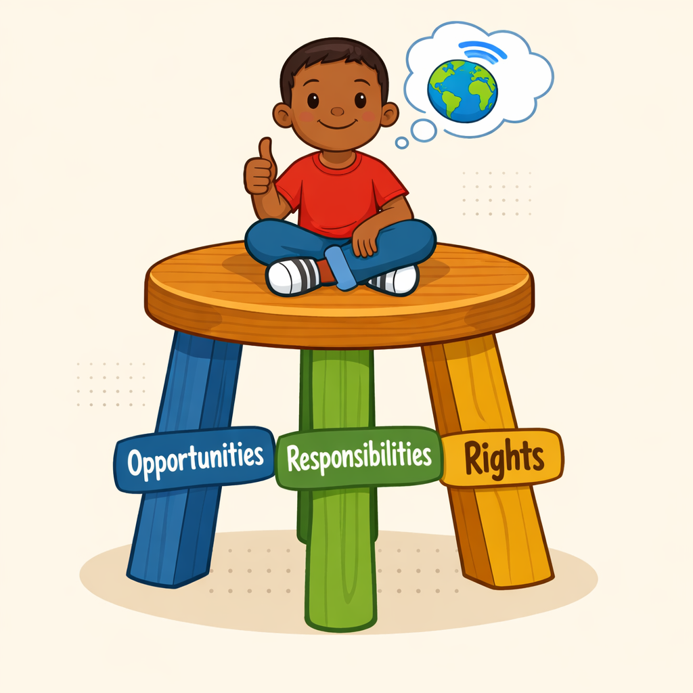
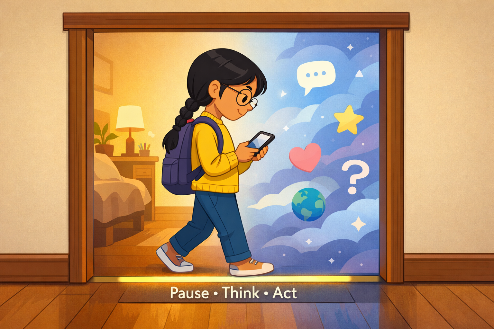

<!-- TODO - add a chapter image to the metadata --->
# Chapter 2: What Is a Digital Citizen?

## Summary

Learn what it means to be a citizen of the digital world — not just a user — and meet Maka's central habit: pause, think, act.

This chapter is part of the Grade 5 *Digital Citizenship* learning progression. After completing it, students will be able to use the vocabulary, recognize the situations, and apply the habits introduced in the concepts listed below.

## Concepts Covered

This chapter covers the following 15 concepts from the learning graph, listed in dependency order:

1. Online Community
2. Trusted Adult
3. Digital World
4. Digital Citizenship
5. Digital Citizen
6. ISTE Standards
7. Digital Opportunities
8. Digital Responsibilities
9. Digital Rights
10. Digital Threshold
11. Pause Think Act
12. Digital Etiquette
13. Ethical Online Behavior
14. Legal Online Behavior
15. Safe Online Behavior

## Prerequisites

This chapter builds on concepts from:

- [Chapter 1: Welcome to the Digital World](../01-welcome-to-digital-world/index.md)

---

## Beyond the Words

!!! mascot-welcome "Welcome Back, Friends!"
    
    Hi again, friends! I'm so glad you're back. Last chapter we learned about devices and the internet. This chapter is one of my favorites — it's where you find out who you are in the digital world. Pause, think, act!

In Chapter 1 you learned the *words* of the digital world — devices, the internet, browsers, and apps. In this chapter, you'll learn what it means to *be* somebody in that world. Not just a user. A *citizen*.

The biggest ideas in this chapter come to life in a story. Meet **Jordan** — a student who has one tough second to choose who he wants to be. Read the mini graphic novel below before you keep going, or save it for after. Either order works.

[Read Jordan's Story](../../stories/jordan-one-second-choice/index.md){ .md-button .md-button--primary }

## A New Kind of Place

The internet is not just cables and screens. It is a *place* full of people. When your device goes online, you are stepping into that place with millions of other people, all over the world.

The **digital world** is all the places, people, and information you can reach through digital devices and the internet. When you watch a science video made by a teacher in another state, you have stepped into the digital world. When you look up a recipe with your dad, you are there too.

The digital world is huge. Most of it is made up of smaller groups of people who meet, share, and talk to each other. We call those groups online communities.

An **online community** is a group of people who meet, share, or talk through digital devices instead of in person. A class chat where you and your classmates ask each other homework questions is a small online community. A reading group where kids from different schools share book reviews is another one.

Online communities can be tiny or enormous. Some have just two people — like you and your cousin sharing drawings. Some have millions of strangers all in one place. Either way, the same rules apply: be kind, be safe, and pause before you act.

When something in the digital world feels confusing or wrong, you do not have to figure it out alone. There is always somebody you can go to for help.

A **trusted adult** is a grown-up in your life who listens to you, keeps you safe, and helps you make good choices. A parent, a guardian, a teacher, a school counselor, a librarian, or an older family member you already know can all be trusted adults.

Tell a trusted adult any time something online confuses you, scares you, or makes you feel weird. You will not be in trouble for telling. That rule works for every screen, every app, and every year of your life.

## What Is a Digital Citizen?

You already know what it means to be a citizen of a country. A citizen lives in a place, follows its rules, helps neighbors, and has things nobody can take away. The digital world has citizens too.

A **digital citizen** is a person who uses digital devices and the internet in a way that is safe, kind, smart, and fair to everyone. When you stop to ask whether sharing something is kind *before* you tap, you are already acting like a digital citizen.

The way digital citizens act has its own name.

**Digital citizenship** is the set of habits, choices, and skills that help you act as a kind and safe member of the digital world. Pausing before you click, being kind in a class chat, and asking a grown-up for help when something feels wrong are all parts of digital citizenship.

You are not the only person learning these habits. Teachers and experts around the world have written down what makes a good digital citizen. Their list has a name.

The **ISTE Standards** are a list of skills and habits, written by teachers and technology experts, that help students learn to use technology well. The letters ISTE stand for the International Society for Technology in Education, but you do not have to remember those words. One of the ISTE Standards says students should be safe and ethical when they use digital tools. That is the fancy way of saying "be a good digital citizen."

You don't have to memorize the ISTE Standards. Your teachers know them. The important thing is this: grown-ups all over the world agree on what a great digital citizen looks like, and you are learning those exact same things, right now, in this book.

!!! mascot-thinking "A Big Idea"
    
    A *user* is anyone who taps a screen. A *citizen* is somebody who cares about the place they're in and the people who share it. You can be a user without being a citizen — but you can't be a citizen without choosing to be one. That choice is yours, every single day.

## Three Things Every Digital Citizen Has

Being a digital citizen is a lot like being a citizen of a country. You get cool things to do. You have some jobs that come with the place. And you have certain things nobody is allowed to take from you.

Let's look at all three.

**Digital opportunities** are the cool things you get to do in the digital world that you could never do before. Learning a new language from a video made on the other side of the world, video-calling a grandparent who lives far away, or sharing a story you wrote with your whole class are all digital opportunities.

**Digital responsibilities** are the jobs you have when you use the digital world. Telling the truth, being kind in your messages, not sharing somebody else's picture without asking, and tapping pause when you are not sure are all digital responsibilities.

**Digital rights** are the things every person in the digital world deserves to have. The right to be treated kindly, the right to keep your private information safe, and the right to ask a grown-up for help any time you feel unsure are all digital rights.

These three things travel together. You can think of them like the three legs of a stool. If any one of them is missing, the stool tips over.

| Word | What it is | One example |
|---|---|---|
| Digital opportunities | Cool things you get to do online | Video-calling family who live far away |
| Digital responsibilities | Jobs you have when you go online | Being kind in a group chat |
| Digital rights | Things every person deserves online | Being treated with respect |

#### Diagram: The Three-Legged Stool

The three-legged stool of digital citizenship — concept illustration

Type: diagram
**sim-id:** three-legged-stool 
**Library:** AI Image Generator 
**Status:** Specified

**Purpose:** Make the chapter's stool metaphor visual and memorable, so students remember that opportunities, responsibilities, and rights always travel together.

**Image prompt:**

A simple, friendly wooden three-legged stool, drawn in a flat cartoon style and shown from a slight three-quarter angle so all three legs are clearly visible. The stool's seat is a warm honey-brown wood with a soft grain texture. Each of the three legs is painted a different color and clearly labeled in large, kid-readable text near the bottom of the leg:

- Left leg, painted river-blue (#2e6f8e), labeled **Opportunities**
- Center leg, painted soft green (#4a9c5b), labeled **Responsibilities**
- Right leg, painted warm gold (#e0a93b), labeled **Rights**

On top of the seat, sitting cross-legged in a relaxed and proud pose, is a small cartoon Grade 5 student (gender-neutral, brown skin, short hair, friendly smile, casual t-shirt and jeans) giving a thumbs-up. A small thought bubble above their head shows a tiny globe with a wifi arc, suggesting "the digital world."

Behind the stool, a soft pale-cream background with a few light dot-grid markings keeps the focus on the stool itself.

**Style notes:**

- Modern flat cartoon vector style, no heavy shading.
- Bold, clean labels in a friendly sans-serif font that a Grade 5 reader can read at a glance.
- The three legs must look exactly the same length — the visual point is balance.
- No text other than the three leg labels.
- Image dimensions: 4:3 or square, suitable for inline placement at content width.

A great way to test whether you understand a new idea is to ask: which leg is this? When you think "everyone in our class chat deserves to be treated kindly," you are thinking about the *rights* leg. When you think "I have a job to be kind in this chat," you are thinking about the *responsibilities* leg.

## The Digital Threshold 🚪

Picture the front door of your house. The little space right at the edge of the door, where you step from outside to inside, has a name. It is called a *threshold*. Most people cross thresholds without thinking about them.

The digital world has thresholds too.

The **digital threshold** is the moment right before you tap, click, share, or post something online. When your finger is hovering over a share button — but you haven't pressed yet — you are standing on the digital threshold.

The digital threshold is the most powerful spot in the whole digital world. It is the one second when you can still change your mind. After you tap, the message is sent. After you share, the picture is out there. But before you tap, you are still in charge. That one second belongs to you.

#### Diagram: Standing at the Digital Threshold

The digital threshold — doorway concept illustration

Type: diagram
**sim-id:** digital-threshold-doorway 
**Library:** AI Image Generator 
**Status:** Specified

**Purpose:** Turn the abstract idea of "the moment right before you tap" into a vivid spatial image that ties the word *threshold* to the everyday experience of standing in a doorway.

**Image prompt:**

A side-view illustration of a fifth-grade girl standing in a doorway, with the doorway frame as the centerpiece of the image. The doorframe is drawn in warm wood tones. The girl has long black hair in a single braid, light tan skin, round glasses, a yellow sweater, and a backpack on her shoulders. She is mid-step: her front foot just touches the threshold strip and her back foot is still inside the room behind her. Her head is tilted slightly down — she is looking at a phone in her hands, with her thumb hovering just above the screen but not quite touching it.

The room behind her (left side of the image) is cozy and ordinary: a child's bedroom with a desk, a houseplant, and warm yellow lamplight. The space ahead of her (right side, beyond the doorway) is drawn as a stylized "digital world" — a soft-edged blue-and-purple cloudscape with floating gentle icons like a chat bubble, a star, a heart, a question mark, and a tiny globe. The two halves use contrasting palettes — warm indoors, cool digital outdoors — but neither side looks scary.

A small, glowing strip on the threshold itself is highlighted in soft yellow. Three short words float just above it in clean lettering: **Pause   Think   Act**.

**Style notes:**

- Modern flat cartoon vector style, consistent with Maka and the rest of the chapter art.
- The phone screen is blank or shows only an abstract glow — no app interface, no icons, no platform names.
- The girl's posture reads as thoughtful, not afraid. This is about choosing, not warning.
- Image dimensions: 16:9 horizontal, full content width.

Standing on the threshold for an extra second is the single most important habit a digital citizen can build. We have a name for what to do during that second.

**Pause, think, act** ⏸️ is a three-step habit for making good choices online. Before you tap a link, you pause (stop your finger), think (ask yourself a few quick questions), and then act (make your choice on purpose).

Here is what each step looks like.

1. **Pause** — Stop your finger before it taps the screen. Take one slow breath.
2. **Think** — Ask three quick questions: Is this safe? Is this kind? Is this true?
3. **Act** — Now make your choice. You might tap. You might close the screen. You might walk away. Either way, you choose on purpose.

You will see "pause, think, act" all over this book. It is the central habit of every chapter. The more you practice it, the more natural it feels — like brushing your teeth or buckling your seat belt.

!!! mascot-tip "Maka's Tip"
    
    Try this at home tonight. Before you open *any* app, pause for one slow breath and ask yourself, "Is this what I really want to do right now?" That tiny pause is a digital-citizen superpower. You'll be amazed at what you notice.

#### MicroSim: The Pause, Think, Act Decision Tool

Pause, Think, Act — interactive p5.js MicroSim

Type: microsim
**sim-id:** pause-think-act 
**Library:** p5.js 
**Status:** Specified

**Learning objective (Bloom: Apply):** Given a short, age-appropriate online scenario, the student can walk through the three steps of pause, think, and act, and choose the response that a kind, safe digital citizen would choose.

**Visual elements:**

- A responsive canvas (default 700 × 450, resizes with container width via `updateCanvasSize()` called first in `setup()`).
- A scenario card at the top that displays one of six pre-written, platform-agnostic situations (for example, "A friend sends you a video that makes fun of a classmate" or "A message says click here to win a free prize").
- Three large buttons labeled **Pause**, **Think**, and **Act**, arranged left to right and connected by a soft arrow path drawn between them.
- A reflection box at the bottom that updates as the student moves through the three steps. After "Pause" it shows "Take one slow breath." After "Think" it shows three questions: "Is it safe? Is it kind? Is it true?" After "Act" it shows two choice buttons that fit the scenario.
- A small score area that shows how many scenarios the student has worked through.

**Controls (built-in p5.js controls per project rules):**

- `createButton('Next scenario')` to load a new pre-written scenario from the bank of six.
- `createButton('Pause')`, `createButton('Think')`, `createButton('Act')` for the three steps.
- `createButton('Reset')` to clear the screen and start a fresh scenario.

**Behavior:**

- The three step buttons must be pressed in order. If the student presses Think before Pause, the sim gently reminds them to start with Pause.
- When the student picks the kind, safe choice, a soft green check appears with a one-sentence reason. When the student picks the other choice, a friendly message asks them to try again with the same scenario.
- All scenarios are platform-agnostic and never name a real app or website. None of them include scary or graphic language.

**Implementation notes:**

- File location: `docs/sims/pause-think-act/` with `main.html`, `main.js`, and `index.md`.
- `main.html` uses a plain `<main></main>` tag with no `id` attribute, so teachers can copy `main.js` directly into the p5.js editor.
- In `setup()`, call `updateCanvasSize()` first, then `canvas.parent(document.querySelector('main'))`.
- Embedded into the chapter via an iframe in the chapter page once the sim files are built. The actual sim files are not part of this chapter task — only the spec lives here.

Implementation: p5.js sketch deployed at `docs/sims/pause-think-act/`.

## Four Habits That Build a Great Digital Citizen

Pause, think, act is the *first* habit. There are four more big habits that grow out of it. You will meet each of these in its own chapter later in the book. For now, here is a quick tour, so the names feel familiar when you see them again.

**Digital etiquette** is the set of polite, respectful ways to act in the digital world. Saying "please" and "thank you" in a class chat, not typing in ALL CAPITAL LETTERS (which feels like yelling), and waiting your turn to talk in a video call are all parts of digital etiquette.

**Ethical online behavior** is doing the right thing online, even when nobody is watching. Telling the truth in a group chat, giving credit when you use somebody else's drawing, and not pretending to be somebody you are not are all parts of ethical online behavior.

**Legal online behavior** is following the rules and laws that grown-ups have made for the internet. Not copying a whole song or movie that somebody else owns, and not signing up for an account that requires you to be older than you are, are both parts of legal online behavior.

**Safe online behavior** is the set of choices that keep you and the people around you from getting hurt online. Keeping your home address private, locking your accounts with a strong password, and never agreeing to meet a stranger from the internet are all parts of safe online behavior.

The four habits work together like the four wheels of a wagon. You need all four to roll smoothly. If one wheel is missing, the wagon tips. A great digital citizen checks all four before they tap.

#### Diagram: The Four-Wheeled Wagon

The four habits of a digital citizen — wagon illustration

Type: diagram
**sim-id:** four-habits-wagon 
**Library:** AI Image Generator 
**Status:** Specified

**Purpose:** Visually reinforce the wagon metaphor used in the chapter prose and help students remember all four habits as a single connected idea.

**Image prompt:**

A side-view illustration of a small, friendly red pull wagon (like a child's toy wagon) rolling smoothly along a grassy path. The wagon has four clearly visible wheels, each painted a different color and labeled in large, kid-readable text on the wheel face:

- Front wheel: river-blue (#2e6f8e), labeled **Etiquette**
- Second wheel: soft green (#4a9c5b), labeled **Ethics**
- Third wheel: warm gold (#e0a93b), labeled **Law**
- Back wheel: coral (#e07a5f), labeled **Safety**

The wagon's body is a cheerful red with a small wooden handle tilted upward. Inside the wagon sit a few simple symbols of digital life — a small cartoon laptop, a tablet, and a friendly book — to suggest that the wagon is "carrying" the things a digital citizen does online.

A cartoon Grade 5 student walks beside the wagon, pulling the handle with one hand and smiling. The student has dark skin, short braided hair, a purple t-shirt, jeans, and sneakers.

The background is a soft sunny landscape with rolling green hills, a few maple trees, and a wide pale-blue sky.

**Style notes:**

- Modern flat cartoon vector style.
- All four wheel labels must be the same size and equally readable — the metaphor is that all four are needed.
- The wagon should look balanced and rolling smoothly. No tipping, no missing wheels.
- No text other than the four wheel labels.
- Image dimensions: 16:9 horizontal, full content width.

!!! mascot-warning "Watch Out!"
    
    Just because something is *legal* doesn't mean it is *kind*. And just because something is *kind* doesn't always mean it is *safe*. Check all four — etiquette, ethics, the law, and safety — before you tap. Slow is smooth, and smooth is safe.

## You Can Do This Too

Being a digital citizen does not mean being perfect. It does not mean never feeling the pull to tap, click, or share. It means pausing for one second and choosing on purpose.

You can do that, every single day.

If you haven't read Jordan's story yet, now is a perfect time. It puts every idea from this chapter into one short scene.

[Read Jordan's Story](../../stories/jordan-one-second-choice/index.md){ .md-button .md-button--primary }

## Quick Recap

Here are the 15 new words you just learned in this chapter.

1. **Online community** — a group of people who meet through digital devices
2. **Trusted adult** — a grown-up who listens and keeps you safe
3. **Digital world** — all the places and people you reach online
4. **Digital citizenship** — the habits of a kind, safe online member
5. **Digital citizen** — a person who acts safely and kindly online
6. **ISTE Standards** — a worldwide list of good tech habits for students
7. **Digital opportunities** — cool new things you can do online
8. **Digital responsibilities** — the jobs that come with being online
9. **Digital rights** — things every online person deserves
10. **Digital threshold** — the second right before you tap or share
11. **Pause, think, act** — the three-step habit for online choices
12. **Digital etiquette** — being polite and respectful online
13. **Ethical online behavior** — doing right when nobody is watching
14. **Legal online behavior** — following the rules and laws online
15. **Safe online behavior** — keeping yourself and others from harm online

!!! mascot-celebration "High-Five, Friends!"
    
    Look at you! You just learned 15 brand-new words about being a digital citizen. The biggest one is *pause, think, act* — and you can use it right now, today. I'll see you in Chapter 3, where we'll learn how online activities can be good for your heart, your brain, and your body. Until then — high-five!
