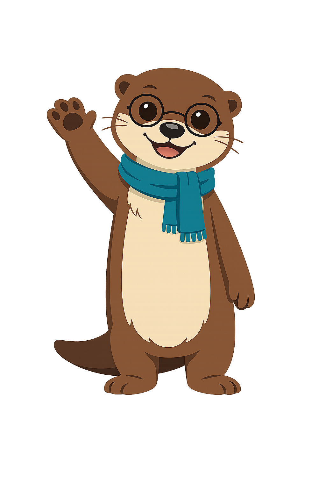

# Chapter 17: Your Digital Citizenship Toolkit

## Summary

Bring everything together in your personal Digital Citizenship Toolkit — a capstone project that turns what you've learned into something you can share with your family and friends.

This chapter is part of the Grade 5 *Digital Citizenship* learning progression. After completing it, students will be able to use the vocabulary, recognize the situations, and apply the habits introduced in the concepts listed below.

## Concepts Covered

This chapter covers the following 25 concepts from the learning graph, listed in dependency order:

1. Antibullying Poster
2. Critical Thinker Toolkit
3. Digital Citizenship Toolkit
4. Fact Check Card
5. Footprint Plan
6. Habit Tracker Project
7. Media Balance Plan
8. Password Plan
9. Personal Pledge
10. Safe Talk Plan
11. Upstander Script
12. Classroom Pledge
13. Family Tech Plan
14. Mini Lesson
15. Reflection Journal
16. Screen Time Goal
17. Continuous Improvement
18. Public Service Message
19. Self Assessment
20. Buddy Class Sharing
21. Goal Setting
22. Lifelong Learner
23. Habit Formation
24. Knowledge Sharing
25. Peer Teaching

## Prerequisites

This chapter builds on concepts from:

- [Chapter 2: What Is a Digital Citizen?](../02-what-is-a-digital-citizen/index.md)
- [Chapter 3: Media Balance and Spotting Imbalance](../03-media-balance/index.md)
- [Chapter 4: Building Healthy Tech Habits](../04-healthy-tech-habits/index.md)
- [Chapter 6: Passwords, Clickbait, and Staying Safe Online](../06-passwords-and-online-safety/index.md)
- [Chapter 8: Reputation, Sharing, and Giving Credit](../08-reputation-and-credit/index.md)
- [Chapter 10: Safe Talk and Setting Boundaries](../10-safe-talk-and-boundaries/index.md)
- [Chapter 11: When Conflict Becomes Cyberbullying](../11-conflict-vs-cyberbullying/index.md)
- [Chapter 12: Standing Up Safely as an Upstander](../12-standing-up-safely/index.md)
- [Chapter 14: Becoming a Fact Checker](../14-becoming-a-fact-checker/index.md)
- [Chapter 15: The Four Critical Questions](../15-four-critical-questions/index.md)
- [Chapter 16: Healthy Doubt and Open Minds](../16-healthy-doubt-open-minds/index.md)

---

## The Last Day in Room 12

It is the last week of fifth grade. Maya, the kid you met way back in Chapter 1, is sitting at her desk with her silver laptop. She is not nervous anymore. She is *proud*.

Around her, the rest of the class is working on the same project. Jordan is finishing a poster. Aisha is updating her habit tracker. Marcus is writing a family tech plan with crayon notes in the margins. Priya is making a tiny picture book about private vs personal information. Diego is taping together a paper card about how to spot a scam. Lily is drawing her digital footprint as a path of glowing footprints across the page. Theo, Imani, Noah, Layla, Sofia, Kai, Aanya, Owen, and Zara are all working on something too.

They are building their Digital Citizenship Toolkits. Their teacher walks around the room, smiling. Today is the day everybody puts every habit they learned this year into one place — and starts sharing it with the people they love.

That is what this chapter is about. By the end of it, you will know exactly what goes into *your* toolkit, who you can share it with, and how to make all of this last for the rest of your life.

!!! mascot-welcome "Welcome to the Last Chapter, Friends!"
    
    Hi friends, it's Maka. I can't believe we made it to Chapter 17. You have learned so much. This whole chapter is about what to do *next* — how to take everything in your head and turn it into something real. I am so proud of you. Pause, think, act!

## What Is a Digital Citizenship Toolkit?

Let's start with the big idea.

A **digital citizenship toolkit** is a personal collection of plans, habits, cards, scripts, posters, and projects that help you act like a kind, safe, and smart digital citizen in real life. Your toolkit is yours. It can live in a folder, a notebook, a slide deck, a poster on your bedroom wall, a video, or a mix of all of those. The point is that the things you learned this year are *out of your head and into your life*, where you can use them.

A toolkit has three big jobs:

1. **Remind you** what to do in tricky moments.
2. **Help your family and friends** by sharing what you know.
3. **Grow with you** as you get older and find new tricky moments.

A great toolkit has small pieces. Let's meet them.

## Personal Pieces — Plans Just for You

These are the parts of your toolkit that protect *you*. Pick the ones that matter most for your life. You don't have to make all of them at once.

A **personal pledge** is a short promise you write to yourself about how you will act online. A pledge can be three sentences or three paragraphs. It might say something like, *"I promise to pause before I click. I promise to be kind in chats. I promise to tell a trusted adult when something feels wrong."* Sign your pledge. Tape it somewhere you will see it.

A **media balance plan** is a written plan, made with a trusted adult, for how you will keep heart, brain, and body activities balanced through the week. It includes how much screen time you are aiming for, what offline activities you love, and how you will know when something feels off.

A **screen time goal** is a single number you and a trusted adult pick for how many minutes a day you want to spend on screens for fun. The goal is not a rule. It is a *target* — something to aim for. Some days you will hit it. Some days you won't. Both are okay, as long as you keep aiming.

A **habit tracker project** is your version of the digital habit tracker from Chapter 4 — a checklist you fill in each day to keep your healthy habits visible. You can draw it on paper or build a tiny version in a slide deck. The point is to *see* the habits stack up over time.

A **password plan** is a written plan for the strong passwords and passphrases you use, where they live (with a trusted adult, in a safe place — *never* on a sticky note on the laptop), and which accounts have two-factor authentication turned on. A password plan protects your account security from Chapter 6.

A **footprint plan** is a written plan for how you will treat your digital footprint going forward — what kinds of things you will and won't post in public, how often you will do a footprint audit with a trusted adult, and which accounts you want to keep private.

A **safe talk plan** is your personal version of the Safe Talk Rule from Chapter 10. It might be three lines: *Notice. Stop. Tell.* It might be a card you keep in your backpack with the names and phone numbers of the trusted adults you would call if something felt wrong online.

An **upstander script** is two or three short sentences you write down for the moments when you see somebody being treated badly online, so you don't have to come up with the words from scratch in the moment. An upstander script might say: *"Hey, that comment isn't cool. [To the target:] I'm sorry that happened. I'm here for you."*

An **antibullying poster** is a kid-made poster (paper or digital) about kindness, the four roles, the upstander toolkit, or any other idea from Chapters 11 and 12. Posters are a great way to take big ideas out of your head and turn them into something other people can see and think about.

A **fact check card** is a small reference card you keep on your desk or in your binder that lists the four critical questions from Chapter 15 and the four fact-check steps from Chapter 14. When a wild story crosses your screen, the card is right there to remind you what to do.

A **critical thinker toolkit** is a slightly bigger version of the fact check card — a folder or slide deck that holds the critical-thinking vocabulary, the four questions, the bias warning list, and a few examples of things you have fact-checked yourself.

| Personal piece | Protects | Lives where |
|---|---|---|
| Personal pledge | Your daily choices | Bedroom wall |
| Media balance plan | Your time and mood | Family fridge |
| Screen time goal | Your daily minutes | Habit tracker |
| Habit tracker project | Your healthy routines | Notebook or slide |
| Password plan | Your account security | Safe place with a trusted adult |
| Footprint plan | Your reputation | Personal folder |
| Safe talk plan | Your safety | Backpack card |
| Upstander script | Your courage | Index card or folder |
| Antibullying poster | Other kids | Classroom or hallway |
| Fact check card | Your truth-spotting | Desk or binder |
| Critical thinker toolkit | Your big-picture thinking | Folder or slide deck |

## Pieces You Share with Other People

The other half of a great toolkit reaches *out*. These pieces help the people around you — your family, your class, even kids in younger grades.

A **family tech plan** is a written family agreement, made with the grown-ups in your home, about screens at home — bedtimes, tech-free zones, daily limits, weekly wellbeing checks. You learned about this in Chapter 4. The toolkit version is to actually *write it down*, sign it together, and put it on the fridge.

A **classroom pledge** is a shared agreement that a whole class signs together, promising how they will act in class chats, group projects, and online learning spaces. A classroom pledge can be made with your teacher and posted on the classroom wall.

A **mini lesson** is a short lesson — five or ten minutes long — that you teach to somebody else about something you learned this year. A mini lesson can be for your little brother, your grandparent, a younger student in another class, or your whole family at dinner. Mini lessons turn you into a teacher, which is the very best way to lock something into your own brain.

A **public service message** is a short message — a poster, a video, a slide, or a song — that explains a digital citizenship idea to a wider audience. A public service message about *pause, think, act* could be posted in the school library so other kids see it every day.

**Buddy class sharing** is when your class teams up with a younger class — kindergarten or first grade — to teach them a small piece of digital citizenship in a way they can understand. Buddy class sharing is fun for both classes, and it helps you remember the simple version of every concept.

**Knowledge sharing** is the bigger habit behind all of these pieces — the habit of telling other people what you have learned. Knowledge sharing isn't bragging. It is a kindness. When you teach a friend how to spot clickbait, you are giving them a tool that protects them for life.

The form of knowledge sharing where you teach kids your own age has its own name.

**Peer teaching** is when a kid explains an idea to other kids the same age. Peer teaching is powerful because kids often understand each other in ways that grown-ups can't. When you peer-teach a friend the four critical questions, you both walk away smarter.

!!! mascot-thinking "A Big Idea"
    
    The very best way to lock a habit into your brain is to *teach it to someone else*. When you teach your little cousin the Safe Talk Rule, your own brain practices it twice. Knowledge sharing is a gift that gives back to the giver. Pause, think, act!

## Habits That Keep Your Toolkit Alive

A toolkit you make once and forget is just a folder. A toolkit that grows with you is a way of life. The last set of habits is what keeps your toolkit alive.

**Goal setting** is the habit of picking one small thing you want to get better at, writing it down, and choosing the date by which you'll check in on it. Good goals are small enough to actually do and clear enough to actually measure. "Be a better digital citizen" is too big. "Take a screen break every 30 minutes for one week" is the right size.

**Habit formation** is the way a small action becomes automatic by repeating it over and over until you no longer have to think about it. Habit formation works best when the new habit is tied to something you already do. "Right after I sit down for homework, I'll check my posture and turn on warm screen mode." That little tie-in is what makes habits stick.

**Self assessment** is the habit of giving yourself an honest report card on how you are doing — not a guilt-trip, just a fair look. A good self assessment asks: *What am I doing well? What am I struggling with? What is one thing I want to try this week?*

A **reflection journal** is a small notebook (or a slide deck, or a notes file) where you write down what you noticed each day or each week about your screens, your friends, your feelings, and your habits. A reflection journal is the home of your reflective thinking from Chapter 16. Even three sentences a day is enough.

**Continuous improvement** is the idea that you don't have to be perfect — you just have to be a tiny bit better than you were yesterday. Tiny improvements stacked across many days add up to something amazing. A digital citizen who improves 1% a week is a *very* different digital citizen by the end of the year.

The biggest habit of all is the one that ties this whole book together.

A **lifelong learner** is a person who keeps learning, asking questions, and changing their mind across their whole life — not just in school. The digital world will change a lot between now and when you are a grown-up. New apps will come. Old ones will go. New tricks will appear. New tools will help. The skills in this book — pause, think, act; tell a trusted adult; private vs personal; the Safe Talk Rule; the four critical questions — will work for *all* of it, because they are about *people*, not about specific apps.

## A Place to Start

You don't have to make your whole toolkit in one weekend. Here is a tiny starter list. Pick three things from this list. Make them this week. Add more later.

1. Write a one-paragraph **personal pledge** and tape it to your bedroom wall.
2. Make a paper **fact check card** with the four critical questions and put it in your binder.
3. Sit down with a trusted adult and write a one-page **family tech plan** for your home.
4. Pick one **screen time goal** for next week, and check in on Sunday.
5. Write a three-line **safe talk plan** and put it in your backpack.

If you ever get to a piece of your toolkit and you feel stuck — talk to a trusted adult. They are part of your toolkit too. Asking for help is a tool, not a weakness. You will not be in trouble for asking.

#### MicroSim: Build Your Own Toolkit

Build Your Own Toolkit — interactive p5.js MicroSim

Type: microsim
**sim-id:** build-your-own-toolkit 
**Library:** p5.js 
**Status:** Specified

**Learning objective (Bloom: Create):** Given a menu of toolkit pieces from this chapter, the student picks the ones they want to make first, drags them into a personal toolkit, and prints or saves a checklist they can take home.

**Visual elements:**

- A responsive canvas (default 760 × 540, resizes with container width via `updateCanvasSize()` called first in `setup()`).
- A menu of all 11 personal toolkit pieces and 7 sharing pieces drawn as small cards on the left side.
- A "My Toolkit" zone on the right side that the student fills in by clicking cards from the menu.
- A small progress meter at the top right showing how many pieces the student has added.
- A reflection box at the bottom where the student can type one sentence about why they picked each piece.

**Controls (built-in p5.js controls per project rules, placed at the bottom of the canvas):**

- `createButton('Print my toolkit')` to render a printable summary.
- `createButton('Reset')` to clear the toolkit and start over.
- `createSelect()` to filter the menu by category: Personal, Sharing, Habits, All.
- `createInput()` so the student can name their toolkit (e.g., "Maya's Digital Citizenship Toolkit").

**Behavior:**

- Cards can be added or removed at any time.
- The "Print my toolkit" button shows a clean checklist with the kid's name, the pieces they picked, and a one-line reminder for each piece.
- Encouraging messages appear at 3 pieces, 5 pieces, and 8 pieces — "great start," "look at your toolkit grow," "you're really making this real."
- The sim is platform-agnostic and never names a real app or website.

**Implementation notes:**

- File location: `docs/sims/build-your-own-toolkit/` with `main.html`, `main.js`, and `index.md`.
- `main.html` uses a plain `<main></main>` tag with no `id` attribute, so teachers can copy `main.js` directly into the p5.js editor.
- In `setup()`, call `updateCanvasSize()` first, then `canvas.parent(document.querySelector('main'))`.
- Embedded into the chapter via an iframe in the chapter page once the sim files are built. The actual sim files are not part of this chapter task — only the spec lives here.

Implementation: p5.js sketch deployed at `docs/sims/build-your-own-toolkit/`.

## The Whole Class Walks Out

The last bell of the year rings. Maya tucks her toolkit folder into her backpack. Jordan tapes his upstander poster to the classroom wall as a gift to next year's fifth graders. Aisha hands her habit tracker project to her teacher with a smile. Marcus folds the family tech plan into his pocket so he can show his mom on the way home.

One by one, the kids of Room 12 walk out into the hallway, into the parking lot, into the summer, and into the rest of their lives. They are not the same kids who walked in last September. They have a toolkit. They have habits. They have words for things that used to confuse them. Most of all, they have each other — and the trusted adults who taught them.

You are that kid too. Whatever grade you are in, whatever device you use, whatever year it is — the things you learned in this book belong to *you* now. The internet is going to change. You are going to grow up. New apps are going to appear and disappear. Through all of it, the same simple words will keep you safe, kind, and smart.

*Pause, think, act.*

*Tell a trusted adult.*

*Notice, stop, tell.*

*Who said it? How do they know? What is the evidence? What is missing?*

*Be kind. Be honest. Be curious. Be brave.*

You are a digital citizen. You always will be.

## Quick Recap

Here are the 25 new words you just learned in this chapter — every single tool in your toolkit.

1. **Antibullying poster** — a kid-made kindness sign
2. **Critical thinker toolkit** — your folder of thinking tools
3. **Digital citizenship toolkit** — the whole set of pieces in this chapter
4. **Fact check card** — a small reference for the four questions and steps
5. **Footprint plan** — a written plan for your digital trail
6. **Habit tracker project** — your daily checklist of healthy habits
7. **Media balance plan** — a written balance plan with a trusted adult
8. **Password plan** — a plan for your strong passwords and 2FA
9. **Personal pledge** — a short promise you make to yourself
10. **Safe talk plan** — your personal version of notice, stop, tell
11. **Upstander script** — pre-written words for hard moments
12. **Classroom pledge** — a shared class agreement
13. **Family tech plan** — the home-screen agreement signed by everyone
14. **Mini lesson** — a short lesson you teach to somebody else
15. **Reflection journal** — a tiny notebook for noticing
16. **Screen time goal** — a daily target you and a trusted adult pick
17. **Continuous improvement** — getting 1% better each week
18. **Public service message** — a kindness message to a wider audience
19. **Self assessment** — a fair, honest report card you give yourself
20. **Buddy class sharing** — teaming up with a younger class
21. **Goal setting** — picking one small thing to get better at
22. **Lifelong learner** — a person who keeps learning across life
23. **Habit formation** — turning new actions into automatic ones
24. **Knowledge sharing** — telling others what you have learned
25. **Peer teaching** — when kids explain ideas to other kids

!!! mascot-celebration "You Did It, Friends!"
    
    Look at you. You finished the whole book. 17 chapters. Hundreds of words. A toolkit you can use for the rest of your life. I am the proudest river otter in the whole Mississippi. Remember what we said way back in Chapter 1? *Pause, think, act.* Three little words. They will carry you the rest of the way. I love you, friends. Go be the digital citizen this world needs. High-five — forever!
