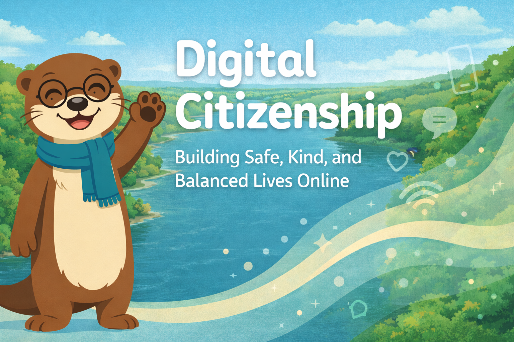

# Digital Citizenship

<figure markdown>
  { width="100%" }
</figure>

Welcome! This is an **interactive intelligent textbook** for Grade 5 students,
their teachers, and the families and school leaders who support them. It was
created for Minnesota **Independent School District (ISD) 197** — the West St. Paul–Mendota Heights–Eagan Area Schools
in Minnesota — on land near **Bdote**, the confluence of the Minnesota and Mississippi rivers.

The book's central habit is simple enough for a student to remember and
important enough to last a lifetime: **pause, think, act**.

## What You'll Find Here

- **17 [chapters](./chapters/index.md)** of short, story-driven reading written directly to students
- **Interactive [MicroSims](./sims/index.md)** — small browser-based simulations that let
  students try each chapter's idea out for themselves
- **Mini graphic novel [stories](./stories/index.md)** that put a chapter's big idea into a relatable moment
- A friendly **river otter mascot named Maka** who models the *pause, think,
  act* habit at key points
- A complete **[learning graph](./learning-graph/index.md)**, **[glossary](./glossary.md)**, **[FAQ](./faq.md)**, **quizzes** and **annotated references** for every chapter

## Who This Book Is For

- **Students (Grades 5-8).** Read the chapters in warm, plain language with
  short sentences, named scenarios, and Maka the River Otter.
- **Teachers.** Find practical, classroom-ready material — pacing notes,
  discussion prompts, and ideas for accommodations.
- **District administrators.** Review the formal course description, ISTE
  standards alignment, learning graph, taxonomy distribution, and quality
  metrics.

## Get Started

- [About This Book](about.md) — purpose, audience, design, and the team behind it
- [Course Description](course-description.md) — formal overview, standards alignment, and learning outcomes
- [Chapter 1: Welcome to the Digital World](chapters/01-welcome-to-digital-world/index.md) — start reading
- [Learning Graph](learning-graph/index.md) — explore the concepts and how they connect

## Standards Alignment

This curriculum is anchored in the **ISTE Student Standards**, specifically
**Standard 1.2 Digital Citizen**, and explicitly addresses indicators
**1.2.2a** (Digital Identity), **1.2.2b** (Safe & Ethical Behavior),
**1.2.2c** (Intellectual Property Rights), and **1.2.2d** (Personal Data
Privacy & Security). Learning outcomes are organized using the **revised
2001 Bloom's Taxonomy**.

## License

This work is released under the
[Creative Commons Attribution-NonCommercial-ShareAlike 4.0 International License (CC BY-NC-SA 4.0)](license.md).
You are free to share and adapt the material for non-commercial purposes as
long as you give appropriate credit and share your adaptations under the
same license.
