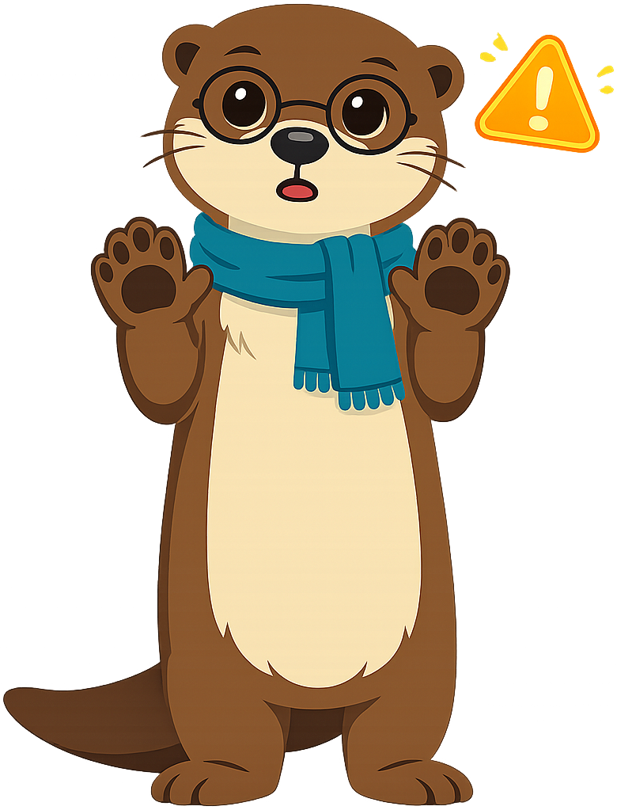

# Mascot Style Guide

This page shows all mascot admonition styles for **Maka the River Otter**, the
pedagogical mascot for the *Digital Citizenship for Grade 5* textbook.

Maka is inspired by the river otters that live at **Bdote** — the confluence of
the Minnesota and Mississippi rivers, near ISD 197 in Minnesota.

Use this page to verify that all seven admonition variants render correctly
after the mascot images have been generated and trimmed.

---

!!! mascot-neutral "A Note from Maka"
    
    This is the **neutral** style, used for general sidebars, side notes, or
    introductions that do not call for a specific emotional tone. Maka is
    standing calmly, ready to share a friendly observation.

!!! mascot-welcome "Welcome, Digital Citizens!"
    
    This is the **welcome** style, used at the start of every chapter.
    "Hi, friends! I'm Maka. In this chapter, we'll learn how to be safe,
    kind, and balanced when we use technology. Let's pause, think, and act
    together!"

!!! mascot-thinking "Key Insight"
    
    This is the **thinking** style, used for key concepts. Notice that every
    digital footprint we leave behind is permanent, searchable, and shareable.
    That's a big idea worth pausing on.

!!! mascot-tip "Maka's Tip"
    
    This is the **tip** style, used for hints and helpful advice. *Pause,
    think, act* — before you click, share, or post, take a slow breath and
    ask yourself: "Is this safe? Is this kind?"

!!! mascot-warning "Watch Out!"
    
    This is the **warning** style, used for common mistakes. Never share
    **private** information online — like your full name, address, school,
    birthday, or phone number — even if a website says it's "safe."

!!! mascot-encourage "You Can Do This!"
    
    This is the **encourage** style, used for difficult content. Spotting
    clickbait can feel tricky at first. That's totally normal! With a little
    practice, you'll start noticing the warning signs everywhere.

!!! mascot-celebration "Great Work!"
    
    This is the **celebration** style, used at the end of major sections. You
    just learned how to be an **upstander** — that's one of the most important
    things a digital citizen can do!

---

## Quick Reference

| Admonition Type | When to Use | Pose |
|---|---|---|
| `mascot-neutral` | General sidebars, side notes | Standing calmly |
| `mascot-welcome` | Chapter openings | Waving |
| `mascot-thinking` | Key concepts and big ideas | Hand on chin, lightbulb |
| `mascot-tip` | Hints and helpful advice | Pointing up |
| `mascot-warning` | Common mistakes, dangers | Hands up "stop" |
| `mascot-encourage` | Difficult content | Thumbs up |
| `mascot-celebration` | End of sections, achievements | Jumping with confetti |
