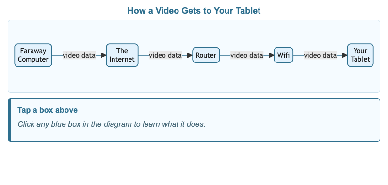
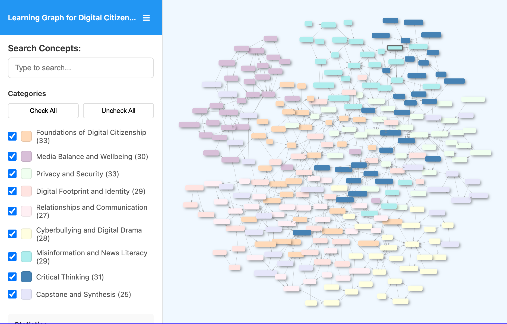

# List of MicroSims

-   **[Digital Devices Explorer](./digital-devices-explorer/index.md)**

    

    Interactive MicroSim for exploring which devices collect personal information about you.

-   **[How a Video Gets to Your Tablet](./internet-flow/index.md)**

    

    Interactive diagram showing the path a video takes from a faraway computer to your tablet.

-   **[Learning Graph Viewer](./graph-viewer/index.md)**

    

    Interactive viewer for exploring all 265 concepts and their connections in this course.

