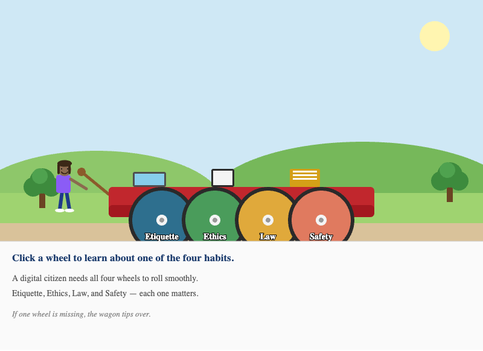
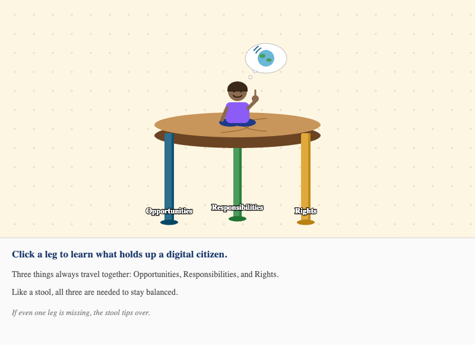

# List of MicroSims

## Completed MicroSims

-   **[Digital Devices Explorer](./digital-devices-explorer/index.md)**

    

    Interactive MicroSim for exploring which devices collect personal information about you.

-   **[How a Video Gets to Your Tablet](./internet-flow/index.md)**

    

    Interactive diagram showing the path a video takes from a faraway computer to your tablet.

-   **[Learning Graph Viewer](./graph-viewer/index.md)**

    

    Interactive viewer for exploring all 265 concepts and their connections in this course.

-   **[Skeptic or Cynic?](./skeptic-or-cynic/index.md)**

    An Explore-and-Quiz MicroSim that helps students tell the difference between healthy skeptical phrases and unhealthy cynical phrases.

-   **[The Four-Wheeled Wagon](./four-habits-wagon/index.md)**

    

    A visual metaphor showing the four habits of a digital citizen — Etiquette, Ethics, Law, and Safety — as four wheels on a wagon. Click each wheel to learn what that habit means.

-   **[The Three-Legged Stool](./three-legged-stool/index.md)**

    

    A visual metaphor showing the three things every digital citizen needs — Opportunities, Responsibilities, and Rights. Click each leg, then see what happens when one is missing.

## Scaffolded MicroSims (In Progress)

These MicroSims have been scaffolded from their specifications. Their interactive implementations have not been built yet.

-   **[Browser Window Tour](./browser-window-tour/index.md)**

    A guided tour of the parts of a browser window.

-   **[Standing at the Digital Threshold](./digital-threshold-doorway/index.md)**

    A visual metaphor for the moment of pausing before stepping into the online world.

