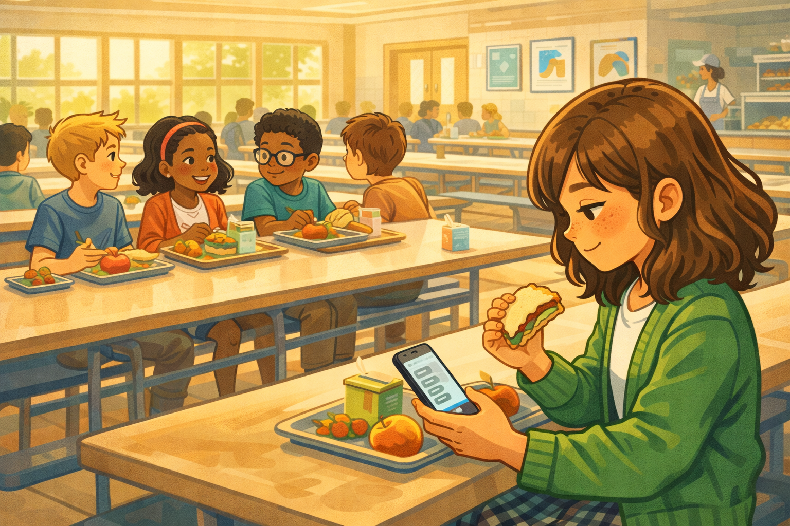
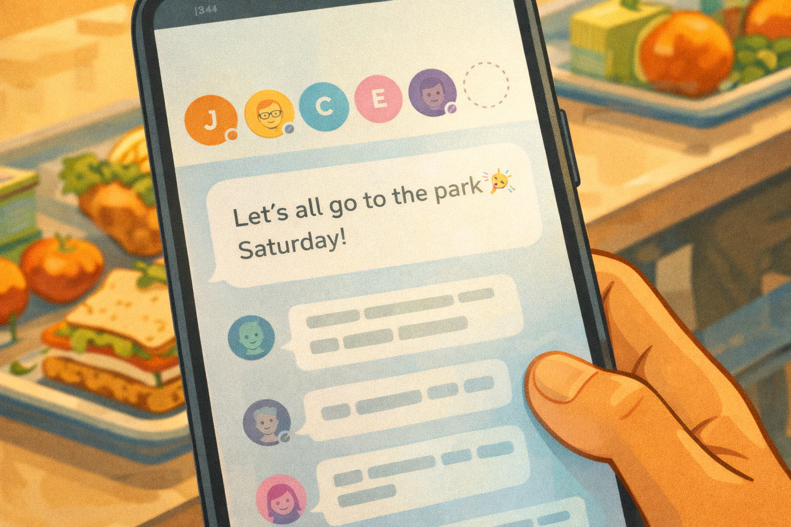
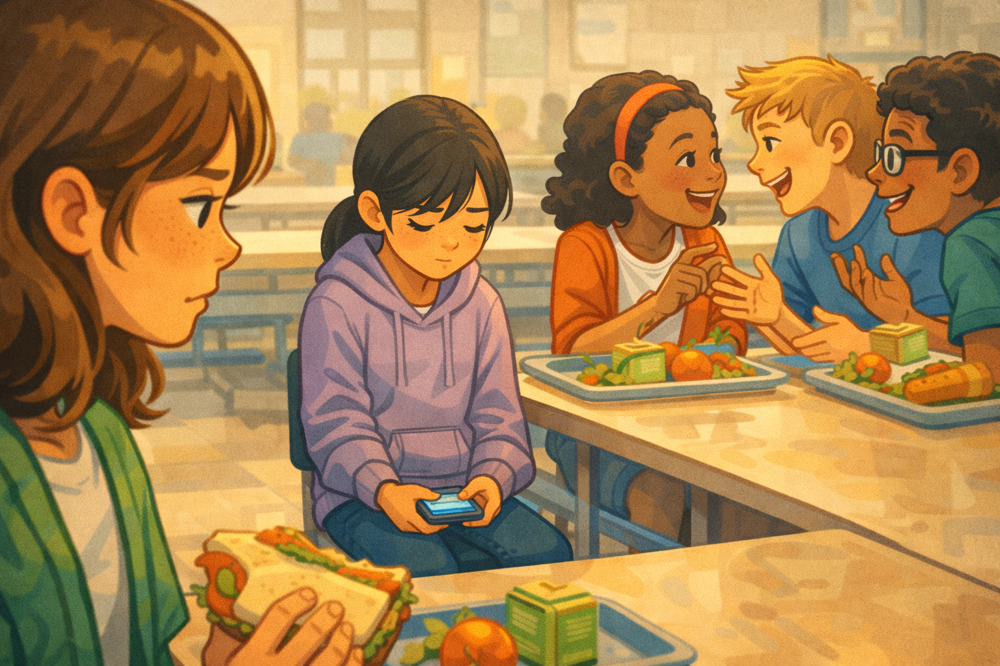
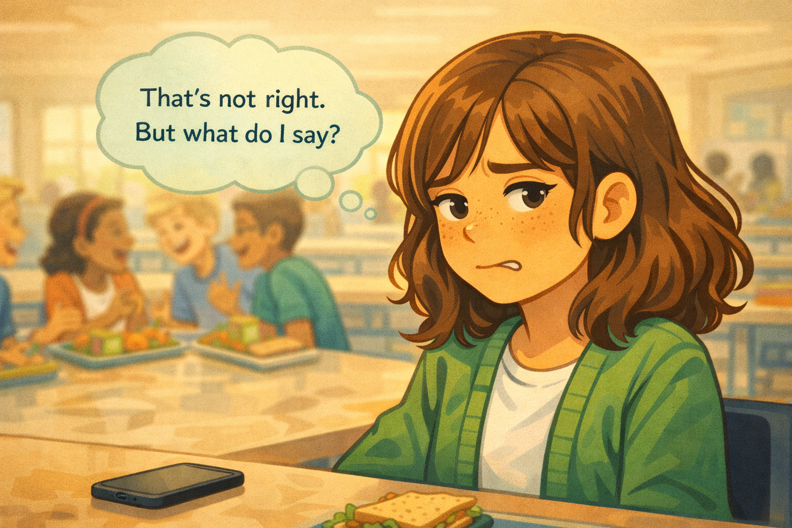
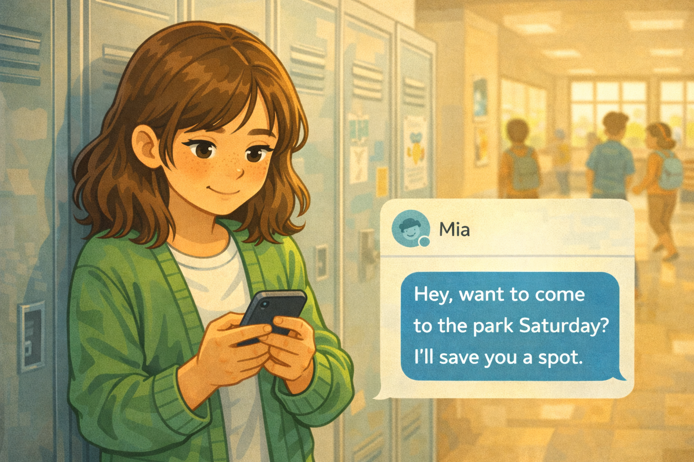
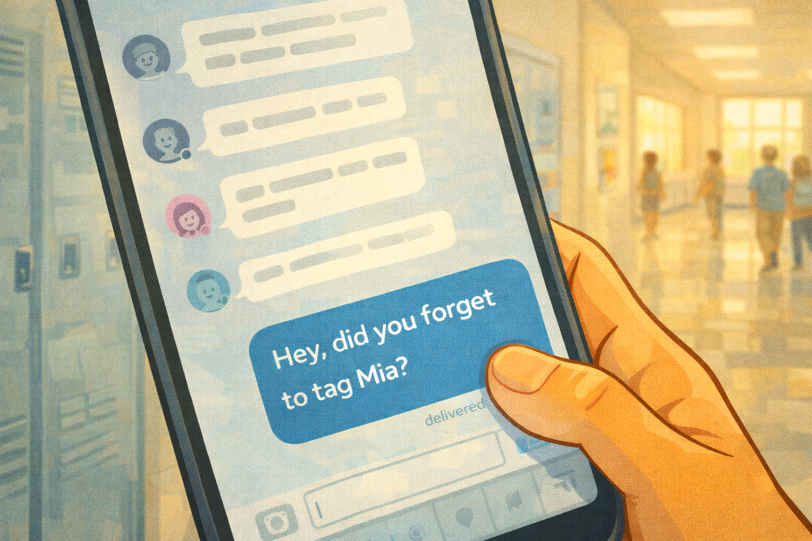
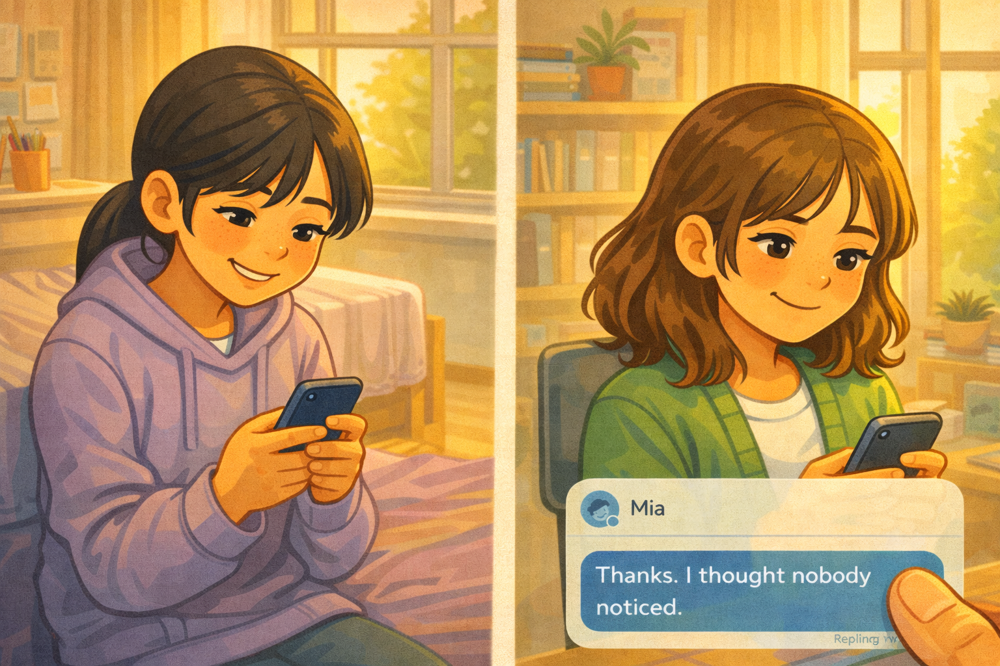

# Ava's Quiet Courage

*A Digital Citizenship mini graphic novel — companion to [Chapter 12: Standing Up Safely as an Upstander](../../chapters/12-standing-up-safely/index.md)*

Cover Image Prompt

Please generate a new wide-landscape image.
A warm, thoughtful composition. In the center of the frame, a fifth-grade girl sits on a wooden bench in a school courtyard, phone held loosely in both hands at her lap. She is Ava — light skin with a scattering of freckles across her nose and cheeks, wavy brown hair that falls just past her shoulders, wearing a green cardigan over a white t-shirt and a plaid skirt. Her expression is gentle and determined — soft brown eyes looking down at the phone screen with quiet resolve, lips pressed into a small thoughtful line.

The phone screen shows two abstract chat windows side by side — a group chat with several gray bubbles on the left, and a private message window with a single river-blue (#2e6f8e) bubble on the right. The blue bubble is the visual focal point, glowing softly.

Behind Ava, slightly out of focus, is a sunny school courtyard: a few wooden benches, a young oak tree with bright green spring leaves, a brick school building with tall windows, and a few students walking in pairs in the distance. Warm afternoon sunlight filters through the tree leaves, casting dappled shadows on the ground.

Across the top of the image, in friendly hand-lettered text the color of river-blue (#2e6f8e), the title: **Ava's Quiet Courage**. Below the title, slightly smaller, the subtitle: *A Digital Citizenship Mini Graphic Novel*.

**Style notes:**

- Modern flat cartoon vector illustration. Friendly, kid-readable lines. No heavy shading.
- Warm, slightly muted color palette with river-blue (#2e6f8e) accents in the title text and the private-message bubble glow.
- 16:9 horizontal landscape composition.
- Mood: gentle, warm, quietly brave. This is not a loud story — it is a kind one.
- No platform names, no real app interfaces, no logos.

Generate the image immediately without asking clarifying questions.

## A Story About Being Left Out

Being left out does not always look like someone saying "you can't sit with us." Sometimes it is quieter than that. Sometimes it is a group chat where everyone gets tagged except one person. Sometimes it is plans that everyone knows about — except the one kid who checks their phone and sees nothing.

Being left out quietly can hurt just as much as being left out loudly. Maybe more, because the person being excluded wonders: *Did anyone even notice?*

This is a story about Ava, and the small, quiet message that changed someone's weekend.

---

## Panel 1 — The Group Chat

Image Prompt

(This is Panel 01. Do not include the panel number in the image.)

Please generate a new wide-landscape image.
A wide establishing shot of a bright elementary school cafeteria during lunch. Long tables with attached benches fill the space. In the foreground, Ava — a fifth-grade girl with light skin, freckles, wavy brown hair past her shoulders, a green cardigan over a white t-shirt, and a plaid skirt — sits at the end of a lunch table, eating a sandwich with one hand and scrolling on her phone with the other. Her expression is relaxed, casually reading.

Around her at the table, five other students are eating lunch and chatting. They are a diverse group: a boy with short blond hair in a blue t-shirt, a girl with dark curly hair and a red headband, a boy with medium brown skin and glasses, and two other kids partially visible. The energy is normal and friendly — an ordinary lunch period.

On Ava's phone screen, visible from a slight over-the-shoulder angle, several abstract chat bubbles are stacked in a group conversation. The bubbles are gray and white, with no readable text. The conversation looks active and excited.

In the background, large cafeteria windows let in warm afternoon light. A lunch counter is visible at the far wall with a cafeteria worker. Posters on the wall show abstract school spirit artwork.

**Style notes:**

- Modern flat cartoon vector style, consistent with the cover.
- Warm, bright palette with river-blue (#2e6f8e) accents in clothing details and the phone screen glow.
- 16:9 horizontal landscape.
- Mood: ordinary, friendly, a normal school day.
- No text, no logos, no real app interfaces.

Generate the image immediately without asking clarifying questions.

It is lunchtime on a Thursday. Ava sits at the end of the table, eating her sandwich and scrolling through the group chat. Everyone is excited. The weekend is coming, and kids are making plans. Messages pop up fast — someone suggests the park on Saturday, someone else says they will bring a soccer ball, someone adds snacks to the list.

Ava smiles. It sounds fun.

---

## Panel 2 — The Missing Name

Image Prompt

(This is Panel 02. Do not include the panel number in the image.)

Please generate a new wide-landscape image.
A close-up of Ava's phone screen held in her hand, shown from her point of view. The screen displays an abstract group chat. At the top of a new message, a row of small circular profile avatars is visible — six small colorful circles representing tagged users. Each circle has a tiny abstract face or initial. One conspicuous gap exists in the row where a seventh avatar should be, marked by a subtle empty dotted-circle outline.

Below the avatar row, an abstract message bubble reads in simple text: **"Let's all go to the park Saturday!"** with a small party-popper emoji. Below that, several reply bubbles show excited abstract responses.

Ava's thumb is visible at the bottom of the frame, paused mid-scroll. In the background, slightly out of focus, the cafeteria table and Ava's sandwich are visible.

**Style notes:**

- Modern flat cartoon vector style.
- The missing avatar (the dotted-circle gap) should be noticeable but not cartoonishly obvious — Ava is observant, and the viewer should have to look where she looks.
- 16:9 horizontal landscape.
- Mood: something is slightly off. A small absence in a cheerful scene.
- No real app interfaces, no platform names, no logos.

Generate the image immediately without asking clarifying questions.

Then Ava notices something. The message says "Let's all go to the park Saturday!" and tags six names. But one name is missing. Mia — the girl who sits two seats down from Ava at lunch, right now, at this same table — is not tagged.

Ava looks up from her phone. Mia is eating quietly, looking at her own phone. She is in the group chat. She can see the plans. She can see the list of names. And her name is not on it.

---

## Panel 3 — Everyone Except Mia

Image Prompt

(This is Panel 03. Do not include the panel number in the image.)

Please generate a new wide-landscape image.
A medium shot of the lunch table from Ava's perspective. In the center of the frame, Mia sits two seats down — a fifth-grade girl with straight black hair in a low ponytail, warm tan skin, a lavender hoodie, and a quiet expression. She is looking down at her phone in her lap under the table, partially hidden. Her face is carefully neutral, but her shoulders are slightly hunched, and her sandwich sits untouched in front of her.

Around Mia, the other kids at the table are animated and excited — leaning toward each other, gesturing, mouths open in conversation. They are clearly talking about the Saturday plans. The contrast between their excitement and Mia's stillness is the emotional center of the panel.

Ava is visible at the far left edge of the frame, her face in three-quarter profile, watching Mia. Ava's expression has shifted from relaxed to troubled — her brow is slightly furrowed, her sandwich is set down, forgotten.

**Style notes:**

- Modern flat cartoon vector style.
- Warm palette but with a subtle visual isolation around Mia — slightly cooler tones in her immediate space, warmer tones around the animated group.
- 16:9 horizontal landscape.
- Mood: quiet exclusion. The hurt is not loud — it is the absence of inclusion.
- No text, no logos.

Generate the image immediately without asking clarifying questions.

Ava watches the table. The other kids are talking about Saturday — who is bringing what, what time to meet, whose parent is driving. They are excited and loud. Mia is right there, two seats away, and no one is talking to her about it.

Mia's sandwich sits untouched. Her shoulders are a little hunched. She is not crying. She is not making a scene. She is just quiet. And that quiet is the loudest thing at the table.

---

## Panel 4 — The Uncomfortable Feeling

Image Prompt

(This is Panel 04. Do not include the panel number in the image.)

Please generate a new wide-landscape image.
A close-up of Ava from chest up, sitting at the lunch table. Her wavy brown hair frames her freckled face. Her green cardigan collar is visible. Her expression is uncomfortable — brow creased, eyes glancing to the side toward where Mia sits (off-frame). She is biting her lower lip slightly. Her phone rests on the table in front of her, screen dark.

Above her head, a single thought bubble floats with the words: **"That's not right. But what do I say?"** The thought bubble is pale green with clean, kid-readable dark text.

The cafeteria background is softly blurred behind her. The other kids' laughter and conversation are implied by their blurred, animated silhouettes in the background.

**Style notes:**

- Modern flat cartoon vector style.
- Warm palette with the pale-green thought bubble providing gentle contrast.
- 16:9 horizontal landscape.
- Mood: the discomfort before action — she knows something is wrong but has not found her courage yet.
- The thought bubble text must be readable at small sizes.
- No logos.

Generate the image immediately without asking clarifying questions.

Ava feels a knot form in her stomach. She knows this is not right. Leaving someone out on purpose is not the same as forgetting. Everyone knows Mia is in the chat. Everyone can see she was not tagged.

But what is Ava supposed to say? She did not make the plans. She did not leave Mia out. It feels awkward to bring it up. She thinks: *That's not right. But what do I say?*

---

## Panel 5 — The Private Message

Image Prompt

(This is Panel 05. Do not include the panel number in the image.)

Please generate a new wide-landscape image.
A medium shot of Ava in the school hallway after lunch. She is leaning against a bank of lockers, phone held in both hands at chest level, thumbs poised over the screen. She is typing a private message. The hallway is bright, with warm light from tall windows and other students walking past in soft focus.

On the phone screen, a private message window is open. At the top, a small circular avatar and the name "Mia" (abstract, no real app interface). A single river-blue (#2e6f8e) message bubble is forming at the bottom with the words: **"Hey, want to come to the park Saturday? I'll save you a spot."**

Ava's face is visible above the phone. Her expression is warm and steady — a small, kind smile. Her freckles are visible. Her eyes are focused on the screen with gentle determination.

The lockers behind her are painted soft gray-blue. A few student-made posters are taped to the wall nearby. The hallway has a clean, bright, welcoming feel.

**Style notes:**

- Modern flat cartoon vector style.
- The river-blue message bubble is the visual centerpiece — warm, inviting, standing out against the neutral hallway tones.
- 16:9 horizontal landscape.
- Mood: kindness in action. This is a small gesture, but it matters enormously.
- The text in the blue bubble must be readable at small sizes.
- No logos, no real app interfaces beyond the abstract message window.

Generate the image immediately without asking clarifying questions.

After lunch, Ava leans against her locker and opens a private message to Mia. She does not overthink it. She types: *"Hey, want to come to the park Saturday? I'll save you a spot."*

She hits send. It is one sentence. It took ten seconds. But for Mia, those ten seconds will change her whole weekend.

---

## Panel 6 — The Group Message

Image Prompt

(This is Panel 06. Do not include the panel number in the image.)

Please generate a new wide-landscape image.
A close-up of Ava's phone screen, shown from her point of view. The screen now shows the group chat. At the bottom of the conversation, a new river-blue (#2e6f8e) message bubble from Ava reads: **"Hey, did you forget to tag Mia?"** Above it, the earlier gray and white message bubbles from the group conversation are stacked, showing the Saturday plans.

The message sits at the bottom of the chat, fresh and unanswered. A small "delivered" checkmark or timestamp sits beneath it. The screen has a subtle pause to it — no one has replied yet.

Ava's thumb is visible at the bottom of the frame, having just released the send button. In the soft-focus background, the school hallway continues — lockers, warm light, distant students.

**Style notes:**

- Modern flat cartoon vector style.
- The river-blue message bubble stands out clearly against the gray conversation above it.
- 16:9 horizontal landscape.
- Mood: a gentle nudge. Not accusatory, not dramatic — just a question that invites the group to do better.
- The text must be readable at small sizes.
- No logos, no real app interfaces beyond the abstract chat.

Generate the image immediately without asking clarifying questions.

Then Ava does something else. She goes back to the group chat and types: *"Hey, did you forget to tag Mia?"*

She does not accuse anyone. She does not start a fight. She just asks a question. It is a small question, but it gives the group a chance to fix things without anyone feeling attacked.

---

## Panel 7 — "Thanks. I Thought Nobody Noticed."

Image Prompt

(This is Panel 07. Do not include the panel number in the image.)

Please generate a new wide-landscape image.
A split composition showing two scenes side by side, separated by a soft vertical divider.

On the left side: Mia sitting on her bed at home, phone in hand, smiling for the first time in the story. She is the same girl from Panel 3 — straight black hair in a low ponytail, warm tan skin, lavender hoodie. Her room is cozy: a purple bedspread, a small desk with art supplies, a window showing late afternoon golden light. On her phone screen, a river-blue message bubble is visible — Ava's private message. A reply bubble from Mia reads: **"Thanks. I thought nobody noticed."**

On the right side: Ava sitting at her own desk at home, phone in hand, reading Mia's reply. Ava's expression is a warm, satisfied smile — not proud or boastful, just genuinely happy. Her green cardigan is draped over her chair. Her room has the same warm afternoon light, a bookshelf, and a small plant on the windowsill.

**Style notes:**

- Modern flat cartoon vector style, consistent with all previous panels.
- Warm, golden palette on both sides — the visual warmth mirrors the emotional warmth of the moment.
- 16:9 horizontal landscape.
- Mood: connection, relief, quiet joy. Two girls in separate rooms, linked by one kind message.
- The text in the message bubbles must be readable at small sizes.
- No logos, no real app interfaces beyond the abstract messages.

Generate the image immediately without asking clarifying questions.

That evening, Ava's phone buzzes. It is a message from Mia: *"Thanks. I thought nobody noticed."*

Ava reads it twice. Five words. But those five words tell her everything. Mia saw the plans. Mia saw her name was missing. Mia thought no one cared.

Ava smiles. She did not give a speech. She did not call anyone out in front of the whole class. She sent one private message and asked one simple question. Being an upstander does not always mean being loud. Sometimes it means being the person who notices — and then does something about it.

---

## What Ava Teaches Us

Ava is not a superhero. She did not stand on a table and demand justice. She noticed something small and quiet — a name missing from a list — and she acted on it in a way that felt right to her.

| Moment | What Ava did | What we can learn |
|---|---|---|
| The group chat | She noticed Mia was not tagged | Paying attention is the first step to kindness |
| The lunch table | She watched Mia's reaction | Empathy means seeing what someone else feels, even when they are quiet |
| The discomfort | She sat with the feeling instead of ignoring it | That uncomfortable feeling is your conscience talking — listen to it |
| The private message | She invited Mia directly | One kind message can change someone's whole day |
| The group question | She asked "Did you forget to tag Mia?" | A gentle question gives people a chance to do the right thing |

## You Can Do This Too

You do not need to be the boldest person in the room to be an upstander. Ava's two messages took less than a minute to type. She did not need special training. She did not need anyone's permission. She just needed to notice, to care, and to act.

Here are three things you can do when you see someone being left out:

- **Send a private message.** A simple "Hey, want to come?" can mean the world to someone who thinks nobody noticed.
- **Ask a gentle question in the group.** "Did you forget to tag [name]?" gives people a chance to fix it without feeling attacked.
- **Include them yourself.** You do not need the group's permission to be kind to someone.

If the situation feels bigger than a missing name — if someone is being excluded on purpose, over and over, and it is making them feel unsafe — tell a trusted adult. A parent, a guardian, a teacher, or a school counselor. You will not be in trouble for telling.

## Related Reading

- [Chapter 12: Standing Up Safely as an Upstander](../../chapters/12-standing-up-safely/index.md) — the chapter this story belongs to. Defines *upstander*, explains safe strategies for speaking up, and shows how small actions can make a big difference.
- [Chapter 11: When Conflict Becomes Cyberbullying](../../chapters/11-conflict-vs-cyberbullying/index.md) — the line between conflict and cyberbullying, and why repeated exclusion crosses that line.
