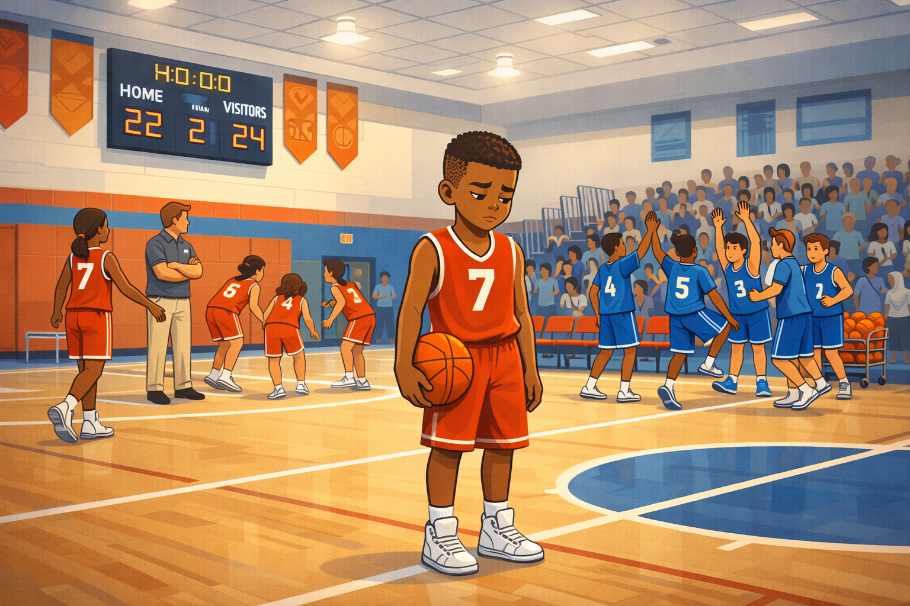
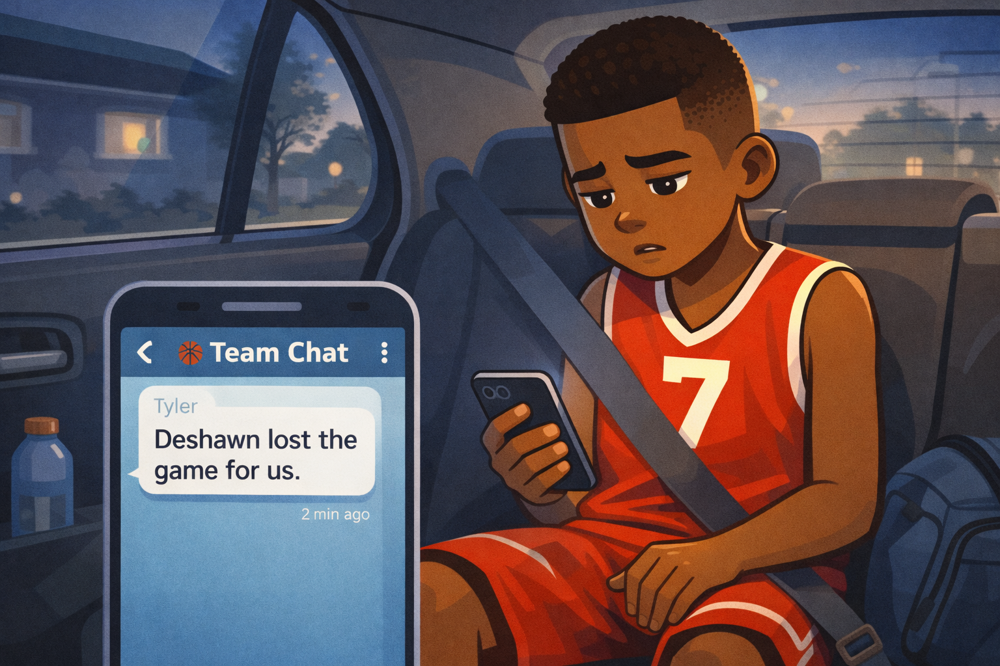
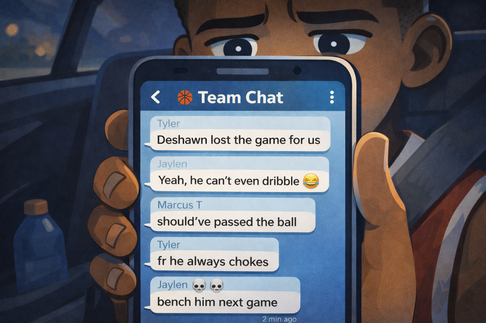
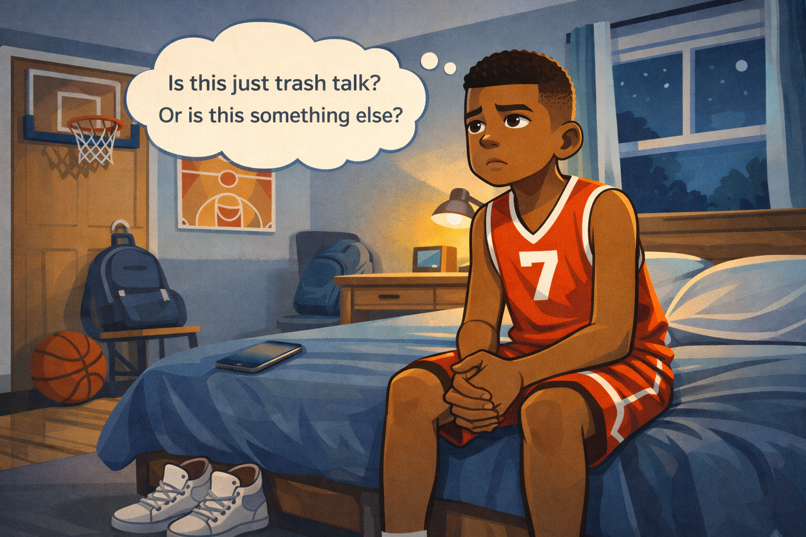
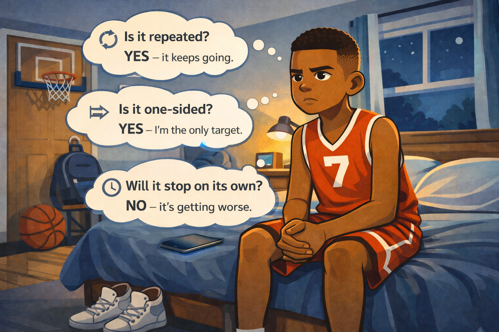
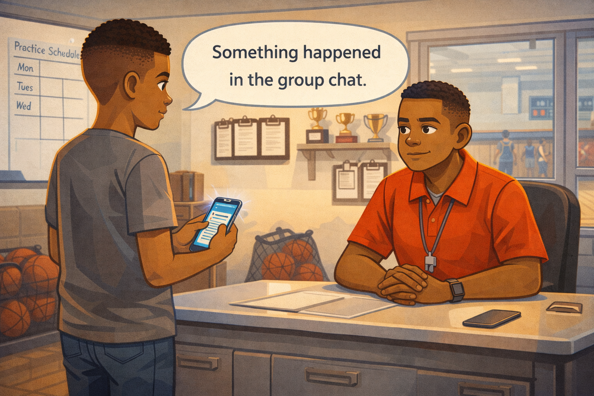
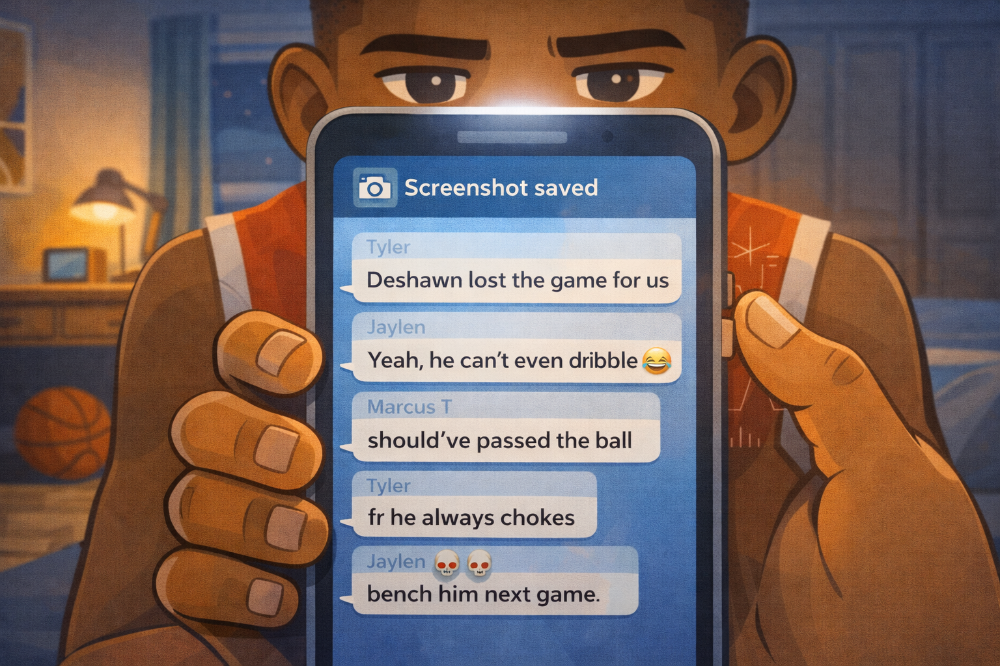

# Deshawn's Group Chat

*A Digital Citizenship mini graphic novel — companion to [Chapter 11: When Conflict Becomes Cyberbullying](../../chapters/11-conflict-vs-cyberbullying/index.md)*

Cover Image Prompt

Please generate a new wide-landscape image.
A dramatic composition centered on a fifth-grade boy named Deshawn. He has dark brown skin, a neat fade haircut, and wears a sleeveless red basketball jersey with a white number 7 on the chest and matching red basketball shorts. He sits on the edge of his bed, leaning forward with his elbows on his knees, holding a phone in both hands. His expression is serious and conflicted — brows slightly furrowed, mouth pressed into a straight line, eyes looking down at the phone screen. He is not crying, not angry — he is *thinking hard*.

On the phone screen, a generic group chat is visible with several text bubbles stacked up. The text is too small to read from this distance, but the volume of messages is clear — there are many of them, piling up fast. A small notification badge shows "14" unread messages.

Behind Deshawn, his bedroom tells his story: a basketball hoop mounted on the back of the door, a basketball resting in the corner, a poster of an abstract basketball court diagram on the wall, a pair of high-top sneakers by the bed, a school backpack on the desk chair, and a small trophy on the desk. The room is lit by a desk lamp and the blue-white glow of the phone screen. The window shows a dark evening sky.

On the bed next to Deshawn, a pillow is slightly punched or pushed aside — a subtle sign of his frustration. But his posture is controlled. He is upset, but he is not falling apart.

Across the top of the image, in friendly hand-lettered text the color of river-blue (#2e6f8e), the title: **Deshawn's Group Chat**. Below the title, slightly smaller, the subtitle: *A Digital Citizenship Mini Graphic Novel*.

**Style notes:**

- Modern flat cartoon vector illustration. Friendly, kid-readable lines. No heavy shading.
- Warm, slightly muted color palette with river-blue (#2e6f8e) accents in the title text and phone screen glow.
- 16:9 horizontal landscape composition.
- Mood: serious, reflective, quiet tension — not despair, but real difficulty.
- No platform names, no real app interfaces, no logos.

Generate the image immediately without asking clarifying questions.

## A Story About Knowing the Difference

Not every mean message is cyberbullying. Sometimes friends argue. Sometimes people say things they do not mean after a tough game or a hard day. That is conflict — and conflict is normal.

But sometimes the messages do not stop. They pile up. They come from more than one person. And they are all aimed at the same kid. That is not conflict anymore. That is something else.

The difference matters, because the difference tells you what to do next. This is a story about Deshawn, a student who learned to ask the right questions — and then found the courage to act on the answers.

---

## Panel 1 — The Buzzer

Image Prompt

(This is Panel 01. Do not include the panel number in the image.)

Please generate a new wide-landscape image.
A wide establishing shot of an elementary school gymnasium during an after-school basketball game. The gym is brightly lit with overhead fluorescent lights. A digital scoreboard on the wall shows a close score: Home 22, Visitors 24. The game clock shows 0:00 — the game just ended.

In the center of the court, Deshawn — a fifth-grade boy with dark brown skin, a neat fade haircut, wearing a red basketball jersey with white number 7 and red basketball shorts, with white high-top sneakers — stands near the free-throw line. His shoulders are slightly slumped. He holds a basketball loosely at his side. His expression is disappointed but not devastated — he missed the last shot, and he knows it.

Around him, the opposing team in blue jerseys celebrates in the background — high-fives, fist bumps, jumping. Deshawn's teammates in matching red jerseys are scattered around the court: some with hands on their knees, some walking to the bench, one patting Deshawn on the shoulder as she passes. A coach in a polo shirt and khakis stands near the bench, arms crossed, looking at the scoreboard.

In the bleachers, a small crowd of parents and students watches. The gym has typical details: banners on the walls, a stage at one end, painted court lines, a rolling cart of basketballs near the bench.

**Style notes:**

- Modern flat cartoon vector style.
- Warm palette with the red and blue jerseys as the color contrast.
- 16:9 horizontal landscape.
- Mood: the sting of losing, but normal and survivable — this is sports, not tragedy.
- No text, no logos.

Generate the image immediately without asking clarifying questions.

The buzzer sounds. Deshawn's team loses by two points. He missed the last free throw. It bounced off the rim and the other team grabbed the rebound. His teammates jog to the bench. A few of them pat him on the back. "Tough shot," one says. Deshawn nods. He feels bad, but he knows it happens. Everyone misses sometimes.

---

## Panel 2 — The First Message

Image Prompt

(This is Panel 02. Do not include the panel number in the image.)

Please generate a new wide-landscape image.
A medium shot of Deshawn sitting in the back seat of a car on the ride home from the game. He is still wearing his red basketball jersey (#7) and shorts. He holds a phone in one hand, looking down at the screen. His expression is neutral but tired — the post-game letdown.

On the phone screen, a generic group chat is visible. The chat is labeled "Team Chat" at the top with a small basketball icon. A message from a contact named "Tyler" reads: "Deshawn lost the game for us." The message sits alone at the bottom of the chat — no replies yet. A small timestamp shows it was sent two minutes ago.

Deshawn's eyes are focused on the message. His mouth is slightly open — a flicker of surprise and hurt. But he has not reacted yet. His other hand rests on his knee, fingers slightly curled.

The car interior shows the back seat: a seatbelt across his chest, a gym bag on the seat next to him, a water bottle in the door pocket. Through the car window, streetlights and the blurred shapes of passing houses are visible in the early evening.

**Style notes:**

- Modern flat cartoon vector style.
- The phone screen message must be clearly readable.
- 16:9 horizontal landscape.
- Mood: the first sting — surprise, not yet pain.
- Warm palette with cooler evening tones through the window.
- No logos, no real app interface.

Generate the image immediately without asking clarifying questions.

On the ride home, Deshawn checks the team group chat. There is one new message from Tyler: *Deshawn lost the game for us.* Deshawn stares at the words. His stomach tightens. It is a mean thing to say. But Tyler is probably just frustrated. People say stuff like that right after a loss. Maybe it will blow over.

---

## Panel 3 — The Pile-On

Image Prompt

(This is Panel 03. Do not include the panel number in the image.)

Please generate a new wide-landscape image.
A close-up of Deshawn's phone screen, held in his hand. The group chat now shows multiple messages stacked up rapidly:

- Tyler: "Deshawn lost the game for us"
- Jaylen: "Yeah, he can't even dribble 😂"
- Marcus T: "should've passed the ball"
- Tyler: "fr he always chokes"
- Jaylen: "💀💀💀"
- Marcus T: "bench him next game"

The messages are piling up — six visible, with a scroll indicator suggesting more above. Each message is in a simple chat bubble, alternating in soft colors. No platform branding, no logos — just a clean generic chat interface.

At the top of the frame, Deshawn's face is partially visible — just his forehead, eyes, and the bridge of his nose. His eyes are wide and fixed on the screen. His brows are pulled together. The phone screen glow reflects in his eyes, making them look glassy. He is frozen.

The background is dark and blurred — the car interior, evening light — putting all focus on the screen and Deshawn's eyes.

**Style notes:**

- Modern flat cartoon vector style.
- The volume and speed of the messages is the visual story — they are stacking up fast.
- 16:9 horizontal landscape.
- Mood: the pile-on — overwhelming, relentless, one-sided.
- The messages must be clearly readable.
- No logos, no real app interface.

Generate the image immediately without asking clarifying questions.

By the time Deshawn gets home, four more messages have appeared. Jaylen wrote: *Yeah, he can't even dribble.* Marcus T. wrote: *should've passed the ball.* Then Tyler again: *fr he always chokes.* Then laughing emoji. Then more. The messages keep coming. Deshawn watches them scroll past. He does not type anything back. He just watches.

---

## Panel 4 — "Is This Just Trash Talk?"

Image Prompt

(This is Panel 04. Do not include the panel number in the image.)

Please generate a new wide-landscape image.
A medium shot of Deshawn sitting on the edge of his bed in his bedroom. He has set his phone face-down on the bed beside him. His hands are clasped together between his knees. His expression is serious and thoughtful — not crying, not raging, but *working something out internally*. His eyes look slightly upward and to the left, as if searching for an answer.

A single clean thought bubble floats above his head with the text: **"Is this just trash talk? Or is this something else?"**

The bedroom is the same as the cover: basketball hoop on the door, basketball in the corner, poster on the wall, desk with a small trophy, backpack on the chair. The desk lamp is on, casting warm light. The phone on the bed is face-down but the screen edge glows faintly, suggesting notifications are still arriving.

Deshawn's basketball jersey (#7) is still on, slightly rumpled now. His sneakers are kicked off on the floor beside the bed.

**Style notes:**

- Modern flat cartoon vector style.
- The thought bubble question is the centerpiece — it is the critical-thinking moment.
- 16:9 horizontal landscape.
- Mood: serious reflection, not despair.
- Warm bedroom palette with the faintly glowing phone as a tension point.
- The thought bubble text must be clearly readable.
- No logos.

Generate the image immediately without asking clarifying questions.

Deshawn sets his phone face-down on the bed. He does not want to look at it anymore. But the words are still in his head. He thinks: *Is this just trash talk? The kind of stuff that happens after every game? Or is this something different?* He is not sure yet. So he decides to think it through.

---

## Panel 5 — The Three Questions

Image Prompt

(This is Panel 05. Do not include the panel number in the image.)

Please generate a new wide-landscape image.
A medium shot of Deshawn sitting on his bed, now sitting up straighter. His expression has shifted from confused to analytical — he is actively working through a problem. His eyes are focused and his jaw is set.

Three clean thought bubbles float around his head, arranged vertically from top to bottom, each containing a question and a short answer in clean, kid-readable text:

- Top bubble: a circular arrow icon (representing repetition) with the text **"Is it repeated? YES — it keeps going."**
- Middle bubble: a one-way arrow icon (representing one direction) with the text **"Is it one-sided? YES — I'm the only target."**
- Bottom bubble: a clock icon (representing time) with the text **"Will it stop on its own? NO — it's getting worse."**

Each answer word "YES" or "NO" is in bold and slightly larger than the rest of the text. The three bubbles form a clear diagnostic checklist.

Deshawn's posture is upright. His hands rest on his knees, palms down — a grounded, stable position. He is not spiraling. He is *assessing*.

The bedroom background is the same warm, lamp-lit room. The phone still sits face-down on the bed, screen-edge still faintly glowing.

**Style notes:**

- Modern flat cartoon vector style.
- The three-question checklist is the core teaching moment — it must be visually clear and readable.
- 16:9 horizontal landscape.
- Mood: clarity emerging from confusion.
- Warm palette.
- No logos.

Generate the image immediately without asking clarifying questions.

Deshawn asks himself three questions. *Is it repeated?* Yes — the messages keep coming, one after another. *Is it one-sided?* Yes — three people are piling on, and Deshawn is the only target. *Will it stop on its own?* He looks at his phone. More notifications are lighting up the edge of the screen. No. It is not stopping.

That is when Deshawn realizes: this is not trash talk. Trash talk goes both ways and fades after the game. This is one-sided, it is repeated, and it is not stopping. This is cyberbullying.

---

## Panel 6 — The Screenshot

Image Prompt

(This is Panel 06. Do not include the panel number in the image.)

Please generate a new wide-landscape image.
A close-up of Deshawn's hands holding his phone. He has picked it up again, but this time with purpose. His thumb is pressing the screenshot button combination on the phone — a deliberate, controlled action. On the phone screen, the group chat messages are visible, captured in the screenshot. A small camera-shutter animation or a brief white flash overlay appears on the screen, indicating the screenshot was just taken.

A small notification at the top of the screen reads: "Screenshot saved." Beneath it, the chat messages — Tyler's, Jaylen's, Marcus T.'s — are all visible and captured.

Deshawn's face is partially visible above the phone. His expression is calm and determined. His jaw is set. He is not scared — he is collecting evidence. He is doing something about it.

The bedroom background is warm and steady. The desk lamp glows. The basketball sits in the corner. Everything in the room is stable — and now Deshawn is too.

**Style notes:**

- Modern flat cartoon vector style.
- The screenshot action is the visual anchor — it is the first concrete step Deshawn takes.
- 16:9 horizontal landscape.
- Mood: quiet determination, taking control.
- Warm palette.
- The phone screen messages must be readable enough to see that they are the same messages from Panel 3.
- No logos, no real app interface.

Generate the image immediately without asking clarifying questions.

Deshawn picks up his phone. But this time, he is not reading the messages. He is saving them. He takes a screenshot of the chat. Then he scrolls up and takes another one. He saves every message. Then he closes the app and puts the phone in his desk drawer. He does not delete anything. He does not reply. He just keeps the proof.

---

## Panel 7 — Telling the Coach

Image Prompt

(This is Panel 07. Do not include the panel number in the image.)

Please generate a new wide-landscape image.
A warm shot of a school gymnasium office the next day. Deshawn stands in front of a metal desk where his basketball coach sits. The coach is a middle-aged man with medium brown skin, short black hair with a few gray streaks, wearing a red polo shirt with a small whistle hanging from a lanyard around his neck. He is leaning forward slightly in his chair, hands folded on the desk, giving Deshawn his full attention. His expression is serious but warm — he is listening carefully, not dismissing.

Deshawn stands on the other side of the desk. He is wearing regular school clothes now — a gray t-shirt and jeans. He holds his phone in one hand, screen facing the coach, showing the screenshots. His other hand is at his side. His expression is open and steady — a mix of nervousness and relief. A single clean word balloon from Deshawn reads: **"Something happened in the group chat."**

The coach's office has typical details: a whiteboard with a practice schedule drawn on it, a rack of clipboards on the wall, a small shelf with a few trophies, a mesh bag of basketballs in the corner, and a window looking out onto the gym floor where a few kids shoot around in the background.

**Style notes:**

- Modern flat cartoon vector style.
- The coach's body language must read as trustworthy and attentive — not alarmed, not dismissive.
- 16:9 horizontal landscape.
- Mood: courage, trust, the right thing happening.
- Warm palette with red polo and river-blue accents.
- Word balloon must be clearly readable.
- No logos.

Generate the image immediately without asking clarifying questions.

The next day, Deshawn finds his coach before practice. "Coach," he says, "something happened in the group chat after the game." He holds up his phone and shows the screenshots. The coach reads them. He does not laugh. He does not say "toughen up." He says, "Thank you for showing me this. This is not okay, and we are going to handle it."

Deshawn nods. His chest feels a little lighter already.

---

## Panel 8 — Lighter

Image Prompt

(This is Panel 08. Do not include the panel number in the image.)

Please generate a new wide-landscape image.
A wide, warm shot of the school gymnasium during basketball practice. Deshawn is back on the court in his red jersey (#7), mid-dribble, moving toward the basket. His expression is focused but lighter — a small smile at the corner of his mouth. His body language is fluid and confident, leaning into the dribble, eyes up, heading toward the hoop.

Behind him, a few teammates run drills in the background. The coach stands at the sideline with his clipboard, watching the team with an approving expression. The gym is brightly lit and active.

To the right of the frame, slightly separated from the main action, Tyler sits on the bench. He is not excluded or shamed — he is just sitting, watching, with a neutral expression that suggests he has been spoken to and is thinking about it. No one is glaring at him. The scene is not about punishment — it is about Deshawn getting back to what he loves.

The gym banners, painted court lines, and overhead lights are all visible. A few basketballs roll near the sideline. The mood is one of return — things are not perfect, but they are moving in the right direction.

A soft golden light fills the gym, warmer than the harsh fluorescent of Panel 1. This is the same gym, but it feels different now.

**Style notes:**

- Modern flat cartoon vector style.
- Deshawn's body language is the centerpiece — he is playing again, and it feels good.
- 16:9 horizontal landscape.
- Mood: relief, return, hope. Not "happily ever after" — just "better."
- Warm palette with golden gym light, red jerseys, river-blue accents.
- No text, no logos.

Generate the image immediately without asking clarifying questions.

At practice that afternoon, Deshawn is back on the court. The coach handled the group chat situation. It was not dramatic. There was no big announcement. The coach just talked to the kids who sent those messages — privately, seriously, and fairly.

Deshawn dribbles the ball down the court. He misses a layup. He picks up the ball and tries again. The gym feels normal. His chest feels lighter. He did the right thing — and the right thing worked.

---

## What Deshawn Teaches Us

Deshawn did not ignore the messages. He did not fight back. He did not pretend they did not hurt. Instead, he stopped and asked himself three honest questions. The answers told him what he was dealing with — and what to do next.

| Moment | What Deshawn did | What we can learn |
|---|---|---|
| The first message | He noticed it but waited to see what happened next | One mean message might be frustration — watch before you react |
| The pile-on | He stopped reading and set his phone down | You do not have to keep watching messages that hurt you |
| The questions | He asked: Is it repeated? Is it one-sided? Will it stop? | Three questions can tell you if it is conflict or cyberbullying |
| The screenshot | He saved the evidence before closing the app | Keep proof — screenshots protect you and show exactly what happened |
| The telling | He showed his coach the next day | A trusted adult can help in ways you cannot do alone |
| The return | He went back to practice and kept playing | Speaking up does not end things — it helps things get better |

## You Can Do This Too

Deshawn's story is not unusual. Group chats can turn mean fast, especially after a game, a test, or a bad day. The messages pile up before anyone stops to think about what they are doing.

If it happens to you, here is what Deshawn would tell you:

- **Do not reply when you are upset.** Set the phone down. Give yourself a minute.
- **Ask the three questions.** Is it repeated? Is it one-sided? Will it stop? If the answers are yes, yes, and no — it is cyberbullying, not just conflict.
- **Save the evidence.** Take screenshots before anything gets deleted.
- **Tell a trusted adult.** A coach, a teacher, a parent, a guardian, a school counselor. You will not be in trouble for telling. You are protecting yourself.
- **Go back to what you love.** Speaking up is not the end of the story. It is the beginning of things getting better.

## Related Reading

- [Chapter 11: When Conflict Becomes Cyberbullying](../../chapters/11-conflict-vs-cyberbullying/index.md) — the chapter this story belongs to. Teaches the difference between conflict and cyberbullying, and gives you the tools to recognize which one you are facing.
- [Chapter 12: Standing Up Safely](../../chapters/12-standing-up-safely/index.md) — what it means to be an upstander, and how to support someone who is being targeted — safely and wisely.
