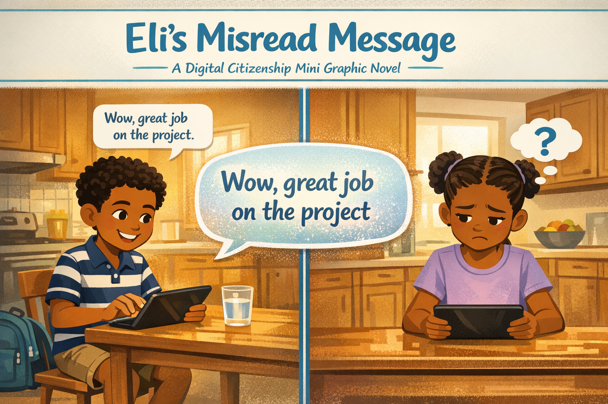
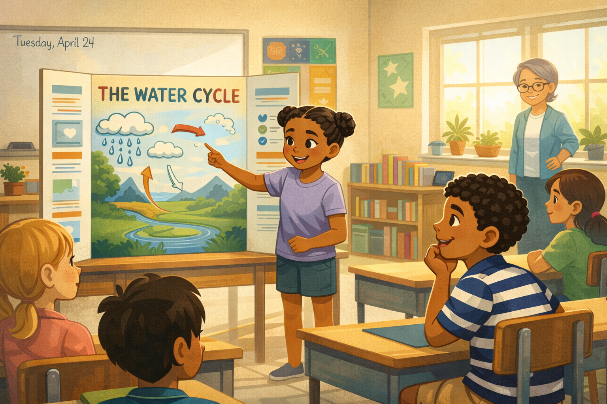
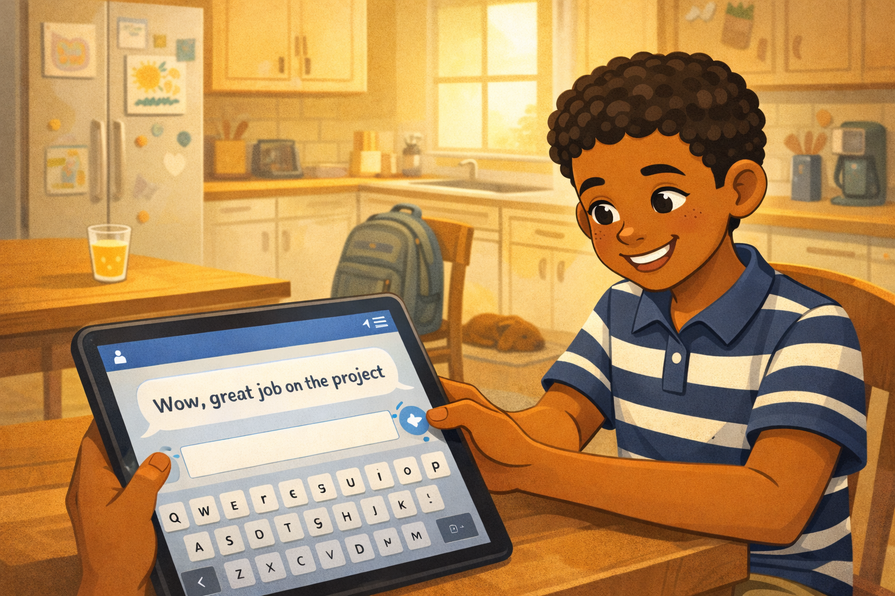
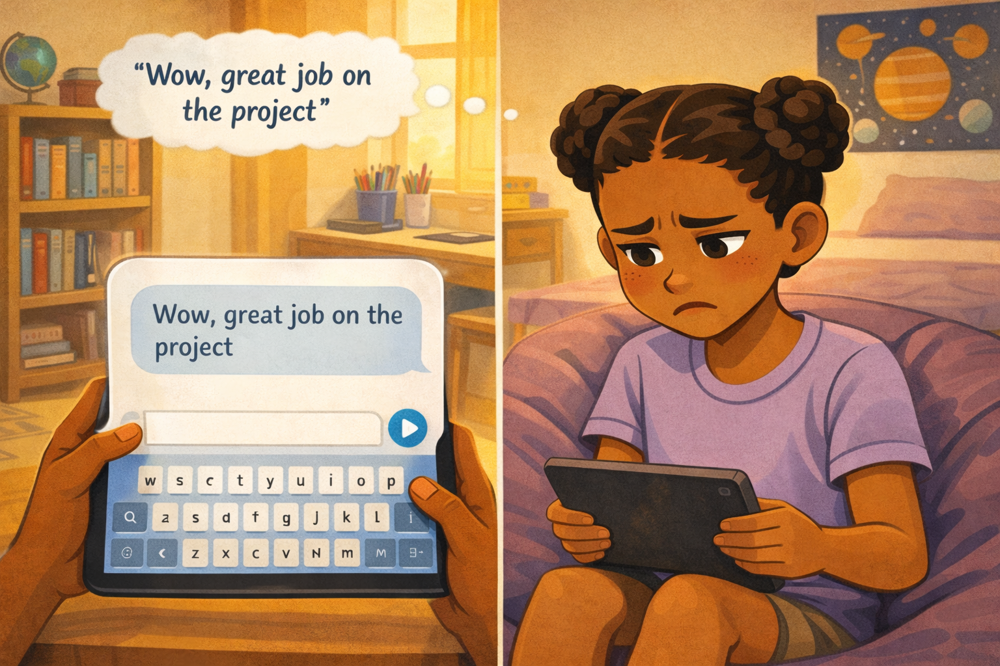
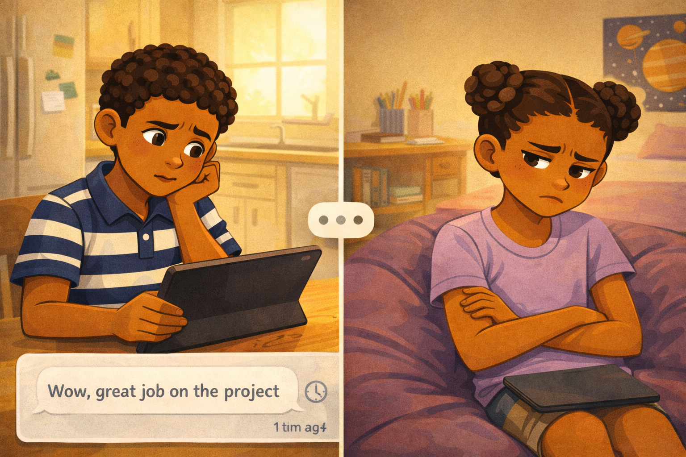
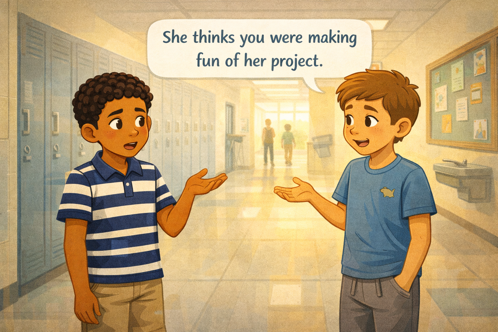
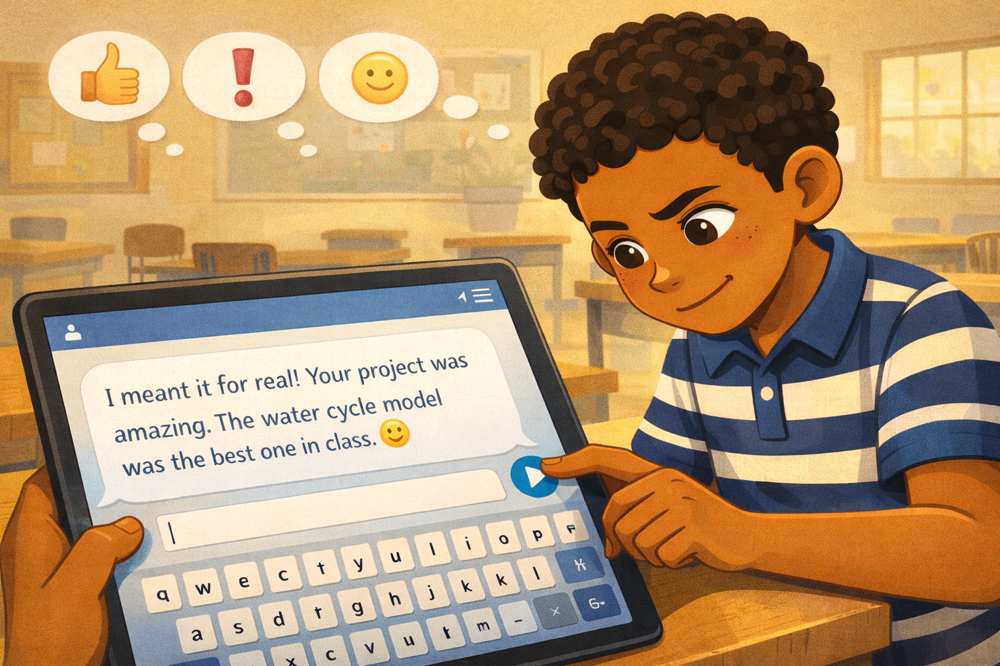
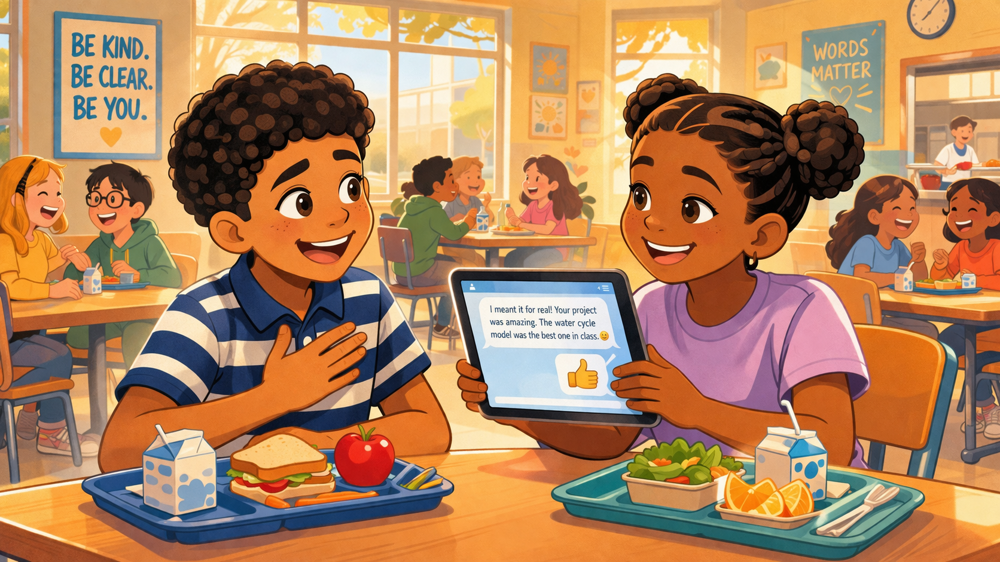

# Eli's Misread Message

*A Digital Citizenship mini graphic novel — companion to [Chapter 9: Online Friends and How We Talk](../../chapters/09-online-friends-and-talk/index.md)*

Cover Image Prompt

Please generate a new wide-landscape image.
A split-screen composition showing two sides of a digital conversation. On the left side of the frame, a fifth-grade boy named Eli — medium brown skin, tight black curls, wearing a navy-and-white striped polo shirt and khaki shorts — sits at a kitchen table typing on a tablet. He has a warm, genuine smile on his face. His fingers hover over a glowing screen. A small speech bubble above him shows a simple text message: "Wow, great job on the project" — plain text, no emoji, no exclamation mark.

On the right side of the frame, separated by a thin vertical divider line, a fifth-grade girl sits in a different kitchen, looking down at her own tablet. She has dark brown skin, her hair in two braided buns, wearing a lavender t-shirt. Her expression is hurt and confused — brows pulled together, mouth turned down slightly. A small thought bubble above her head shows a question mark.

Between the two halves of the image, a large speech bubble floats in the center with the same message — "Wow, great job on the project" — but the words shimmer and shift slightly, suggesting the message looks different depending on who reads it.

The background on both sides shows warm, cozy kitchen settings — wooden table, a glass of water, a backpack on the floor, soft afternoon light through a window. A few river-blue (#2e6f8e) accents appear in the divider line and the title text.

Across the top of the image, in friendly hand-lettered text the color of river-blue (#2e6f8e), the title: **Eli's Misread Message**. Below the title, slightly smaller, the subtitle: *A Digital Citizenship Mini Graphic Novel*.

**Style notes:**

- Modern flat cartoon vector illustration. Friendly, kid-readable lines. No heavy shading.
- Warm, slightly muted color palette with river-blue (#2e6f8e) accents.
- 16:9 horizontal landscape composition.
- Mood: two emotions at once — genuine warmth on the left, hurt confusion on the right.
- No platform names, no real app interfaces, no logos.

Generate the image immediately without asking clarifying questions.

## A Story About Words Without a Voice

Have you ever said something nice — and had someone think you were being mean? It happens all the time in person. But online, it happens even more. That is because text messages do not carry your tone of voice, your facial expression, or the sparkle in your eye when you are being sincere.

In this chapter, we call that the **tone gap** — the space between what you mean and what someone reads. The tone gap is invisible. You cannot see it. But it can hurt real feelings.

This is a story about Eli, a student who meant every word he typed — and a friend who heard something completely different.

---

## Panel 1 — The Amazing Project

Image Prompt

(This is Panel 01. Do not include the panel number in the image.)

Please generate a new wide-landscape image.
A wide establishing shot of a bright, sunny elementary school classroom. At the front of the room, a fifth-grade girl with dark brown skin, two braided buns, and a lavender t-shirt stands next to a tri-fold science project board. The board is colorful and well-organized, with hand-drawn diagrams of the water cycle — clouds, rain arrows, a river, and evaporation lines. She is pointing at the board with one hand, smiling proudly, mid-presentation.

In the second row of desks, Eli — a fifth-grade boy with medium brown skin, tight black curls, a navy-and-white striped polo shirt, and khaki shorts — sits watching. His eyes are wide with genuine admiration. His mouth is slightly open in a quiet "wow." One hand rests on his chin. His body language reads as truly impressed, not sarcastic.

Around the classroom, other students sit at desks watching the presentation. A teacher with short gray hair and glasses stands near the window, smiling approvingly. The classroom has typical details: a whiteboard with the date written on it, a bookshelf, potted plants on the windowsill, and colorful posters on the walls. Warm sunlight comes through the windows.

**Style notes:**

- Modern flat cartoon vector style, consistent with the cover.
- Warm, slightly muted palette with river-blue (#2e6f8e) accents in clothing and classroom details.
- 16:9 horizontal landscape.
- Mood: pride, admiration, a normal good day at school.
- No text, no logos.

Generate the image immediately without asking clarifying questions.

Eli sits in class and watches his friend Amara present her science project. She built a model of the water cycle — with clouds, rain, rivers, and everything. It is one of the best projects in the whole class. Eli thinks, *That is seriously amazing.*

When the class claps, Eli claps the loudest.

---

## Panel 2 — The Message

Image Prompt

(This is Panel 02. Do not include the panel number in the image.)

Please generate a new wide-landscape image.
A medium shot of Eli sitting at a kitchen table at home, after school. He is the same boy from Panel 1 — medium brown skin, tight black curls, striped polo shirt, khaki shorts. He holds a tablet in both hands, thumbs hovering over the on-screen keyboard. On the tablet screen, a simple group chat interface shows a text input field with the words: "Wow, great job on the project" — no emoji, no exclamation mark, just plain flat text. A small send-arrow button glows beside the text field.

Eli's face shows a warm, genuine smile. His eyes are soft and kind. He is clearly feeling good about sending this compliment. There is no hint of sarcasm in his expression.

The kitchen background is cozy and lived-in: a wooden table, a glass of orange juice, a backpack tossed on a nearby chair, a refrigerator with magnets and a child's drawing pinned to it, soft golden afternoon light from a window. A small dog sleeps on a rug in the corner.

**Style notes:**

- Modern flat cartoon vector style.
- Warm palette with soft golden kitchen light.
- 16:9 horizontal landscape.
- Eli's expression must clearly read as sincere and happy — this is the anchor for the misunderstanding.
- The tablet screen is simple and generic — no real app, no logos, no platform branding.
- No text outside the tablet screen.

Generate the image immediately without asking clarifying questions.

After school, Eli opens the group chat. He wants to tell Amara how great her project was. He types five words: *Wow, great job on the project.* He smiles and taps send. He meant every word.

---

## Panel 3 — The Other Side

Image Prompt

(This is Panel 03. Do not include the panel number in the image.)

Please generate a new wide-landscape image.
A medium shot of Amara sitting on a beanbag chair in her bedroom, looking down at her own tablet. She is the same girl from Panel 1 — dark brown skin, two braided buns, lavender t-shirt. On her tablet screen, the same message appears in a chat bubble: "Wow, great job on the project" — plain text, no emoji, no exclamation mark.

Amara's expression has shifted. Her brows are pulled together. Her mouth is turned down at the corners. Her eyes look hurt and uncertain. She is reading the same five words Eli typed — but she is hearing them differently. A small, faint thought bubble above her head contains the words in a slightly mocking, exaggerated font: *"Wow, great job on the project"* — suggesting she hears sarcasm.

Her bedroom background shows a bookshelf with chapter books and a small globe, a desk with colored pencils in a cup, a poster of the solar system on the wall, and a purple bedspread on a nearby bed. The light is warm but Amara's posture is closed — shoulders hunched slightly, knees pulled up.

**Style notes:**

- Modern flat cartoon vector style.
- Warm palette but Amara's body language creates emotional contrast.
- 16:9 horizontal landscape.
- The thought bubble font shift is subtle — slightly wavy or italicized to suggest a mocking read of the same words.
- Mood: confusion, hurt, misunderstanding.
- No logos, no real app interface.

Generate the image immediately without asking clarifying questions.

Amara reads the message on her tablet. But she does not hear Eli's warm voice. She does not see his wide, impressed eyes. She sees five flat words on a screen. And to her, those five words sound sarcastic. *Wow, great job on the project.* Her face falls. She thinks Eli is making fun of her.

---

## Panel 4 — The Silence

Image Prompt

(This is Panel 04. Do not include the panel number in the image.)

Please generate a new wide-landscape image.
A split-panel composition. On the left half, Eli sits at his kitchen table, tablet in front of him, staring at the screen with a confused expression. The group chat on his screen shows his message at the bottom — "Wow, great job on the project" — and above it, an empty space. No reply. A small clock icon or timestamp suggests time has passed. Eli's brow is furrowed, and his mouth is slightly open in puzzlement. His hand rests on his chin.

On the right half, Amara sits on her beanbag, tablet face-down on her lap. She is looking away from it, arms crossed, expression closed off and sad. Her braided buns and lavender t-shirt are consistent with previous panels. She has clearly decided not to respond.

A thin vertical line separates the two halves. Between them, floating in the divider space, three small dots (like a typing indicator) sit frozen — no one is typing. The dots are gray and still.

**Style notes:**

- Modern flat cartoon vector style.
- The frozen typing dots in the center are the emotional anchor — communication has stopped.
- 16:9 horizontal landscape.
- Mood: disconnection, confusion, silence.
- Warm palette but slightly muted compared to earlier panels.
- No logos, no text outside the screens.

Generate the image immediately without asking clarifying questions.

Amara stops replying to the group chat. One hour passes. Then two. Eli checks his tablet again and again. Nothing. He types, *Did I say something wrong?* Still nothing. Eli feels confused and a little worried. He does not understand what happened.

---

## Panel 5 — A Friend Explains

Image Prompt

(This is Panel 05. Do not include the panel number in the image.)

Please generate a new wide-landscape image.
A medium shot of Eli standing in a school hallway the next morning, talking to another fifth-grade student — a boy with light skin, sandy brown hair in a side part, wearing a blue t-shirt with a small dinosaur graphic and gray jogger pants. The friend has a sympathetic, slightly apologetic expression and is gesturing with one hand as he explains something.

Eli's face shows a flash of surprise and realization. His eyes are wide, his mouth slightly open, and one hand is raised palm-up in a "wait, what?" gesture. His striped polo shirt and khaki shorts are consistent with previous panels.

The school hallway background shows lockers painted in soft blue and gray tones, a bulletin board with student artwork pinned to it, a water fountain on the wall, and a few distant students walking in the background. Morning light comes from a window at the end of the hall.

A single clean word balloon from the friend reads: **"She thinks you were making fun of her project."**

**Style notes:**

- Modern flat cartoon vector style.
- The word balloon is the key information delivery — it must be readable at small sizes.
- 16:9 horizontal landscape.
- Mood: surprise, dawning understanding.
- Warm palette with river-blue locker accents.
- No logos.

Generate the image immediately without asking clarifying questions.

The next morning at school, Eli's friend Marcus pulls him aside. "Hey — Amara is upset," Marcus says. "She thinks you were making fun of her project." Eli's stomach drops. "What? I *loved* her project!" he says. Marcus shrugs. "That's not how she read it."

---

## Panel 6 — The Fix

Image Prompt

(This is Panel 06. Do not include the panel number in the image.)

Please generate a new wide-landscape image.
A close-up of Eli sitting at his desk in a classroom, hunched slightly over his tablet, typing carefully. His expression is focused and determined — brows slightly furrowed in concentration, a small hopeful smile forming at the corner of his mouth. His fingers hover over the on-screen keyboard.

On the tablet screen, a chat message is being composed. The text reads: "I meant it for real! Your project was amazing. The water cycle model was the best one in class." A small smiley-face emoji sits at the end of the message, glowing softly. The send button is highlighted, ready to tap.

Above Eli's head, three small thought bubbles float, each containing a simple icon: a thumbs-up symbol, an exclamation mark, and a smiley face — representing the extra signals he is now adding to make his tone clear.

The classroom background is soft and out of focus — other desks, a whiteboard, morning light. The visual focus stays on Eli and his screen.

**Style notes:**

- Modern flat cartoon vector style.
- The thought bubbles with tone-signal icons are the teaching moment — they show what was missing before.
- 16:9 horizontal landscape.
- Mood: determination, repair, hope.
- Warm palette.
- No logos, no real app interface.

Generate the image immediately without asking clarifying questions.

Eli grabs his tablet. This time, he thinks before he types. He writes: *I meant it for real! Your project was amazing. The water cycle model was the best one in class.* He adds a smiley face at the end. He reads it back to himself. *Does this sound like me? Can she hear my real voice in these words?* Yes. He taps send.

---

## Panel 7 — The Smile Returns

Image Prompt

(This is Panel 07. Do not include the panel number in the image.)

Please generate a new wide-landscape image.
A warm, wide shot of the school lunchroom. Eli and Amara sit across from each other at a lunch table. Both are smiling. Amara — dark brown skin, braided buns, lavender t-shirt — holds up her tablet, showing a chat screen with a thumbs-up emoji she just sent back. Her smile is wide and relieved. Eli — medium brown skin, tight curls, striped polo — is laughing gently, one hand over his heart in a "phew" gesture.

Between them on the table sit two lunch trays with typical school lunch items — a carton of milk, an apple, a sandwich. Other students are visible in the background at neighboring tables, creating a warm, bustling lunchroom atmosphere.

On Amara's tablet screen, the chat history is visible: Eli's follow-up message with the smiley face, and Amara's thumbs-up reply. The messages are simple and generic — no platform branding.

A soft warm glow surrounds the two friends, suggesting the relief and warmth of a misunderstanding resolved. The lunchroom has large windows with bright midday light, colorful motivational posters on the walls, and a lunch counter in the background.

**Style notes:**

- Modern flat cartoon vector style.
- The body language is the centerpiece — relief, laughter, reconnection.
- 16:9 horizontal landscape.
- Mood: warm resolution, friendship restored.
- Warm palette with river-blue accents in the posters and clothing.
- No logos, no real app branding.

Generate the image immediately without asking clarifying questions.

At lunch, Amara walks over to Eli's table. She is smiling. "I'm sorry I thought you were being mean," she says. "It just sounded so flat." Eli nods. "I *was* being nice! But I get it now. You couldn't hear my voice." Amara sends him a thumbs-up emoji. Eli sends a smiley face back. This time, they both know exactly what the other one means.

---

## What Eli Teaches Us

Eli was not mean. He was not careless. He just forgot one thing: text has no tone of voice. The same five words can sound kind or cruel depending on how someone reads them. That is the tone gap — and it is one of the biggest causes of hurt feelings online.

| Moment | What Eli did | What we can learn |
|---|---|---|
| The compliment | He typed a genuine compliment — but with no signals | Kind words still need tone signals in text |
| The silence | He noticed something was wrong and felt confused | Pay attention when someone stops responding |
| The explanation | He listened when a friend told him what happened | A good friend explains instead of guessing |
| The fix | He sent a follow-up with clear, warm language and an emoji | You can always send a second message to clarify |
| The resolution | He and Amara talked it out and laughed together | Misunderstandings end when people communicate |

## You Can Do This Too

Eli's misunderstanding took less than a day to fix. But some text misunderstandings go on for weeks — because nobody stops to ask, "Wait, what did you actually mean?"

Here are three things you can do right now:

- **Add tone signals.** Exclamation marks, emoji, and extra words like "seriously" or "for real" help your reader hear your voice.
- **Read it back.** Before you send a message, read it as if someone else wrote it to you. Does it sound the way you mean it?
- **Ask, don't assume.** If a message from a friend sounds weird, ask them what they meant before you decide to feel hurt.

Text will never carry your full voice. But you can close the tone gap — one message at a time.

## Related Reading

- [Chapter 9: Online Friends and How We Talk](../../chapters/09-online-friends-and-talk/index.md) — the chapter this story belongs to. Explores how digital communication changes the way we understand each other, and why tone gets lost in text.
- [Chapter 11: When Conflict Becomes Cyberbullying](../../chapters/11-conflict-vs-cyberbullying/index.md) — what happens when misunderstandings are not caught early and conflict grows into something more serious.
