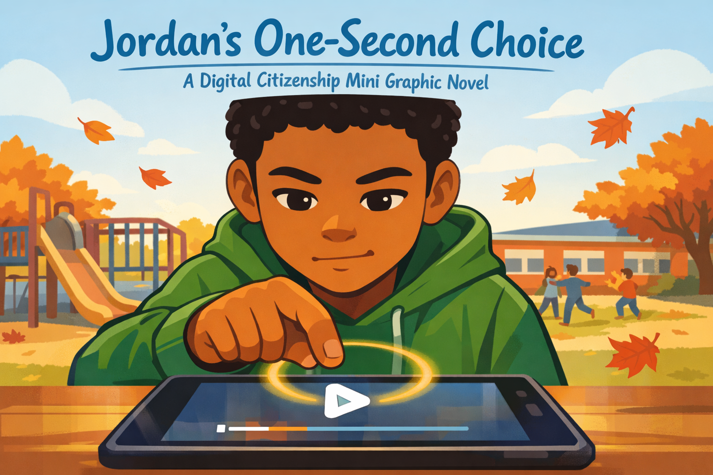
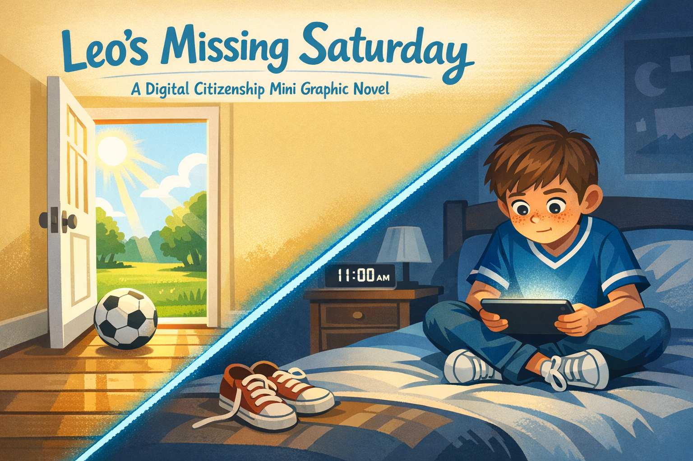
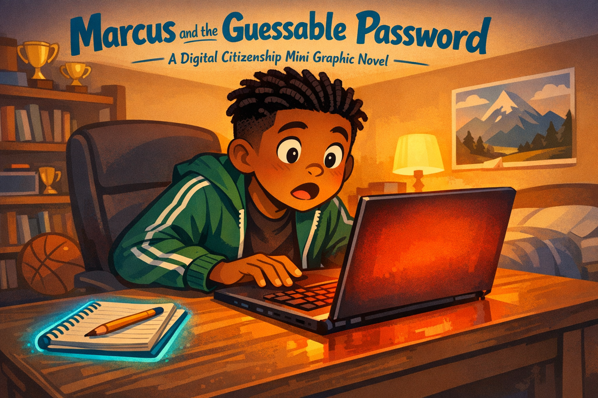
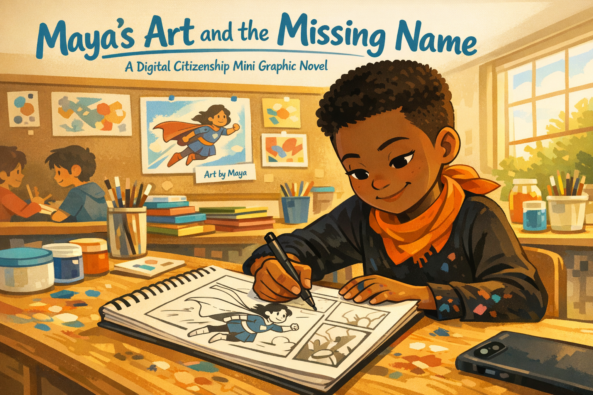
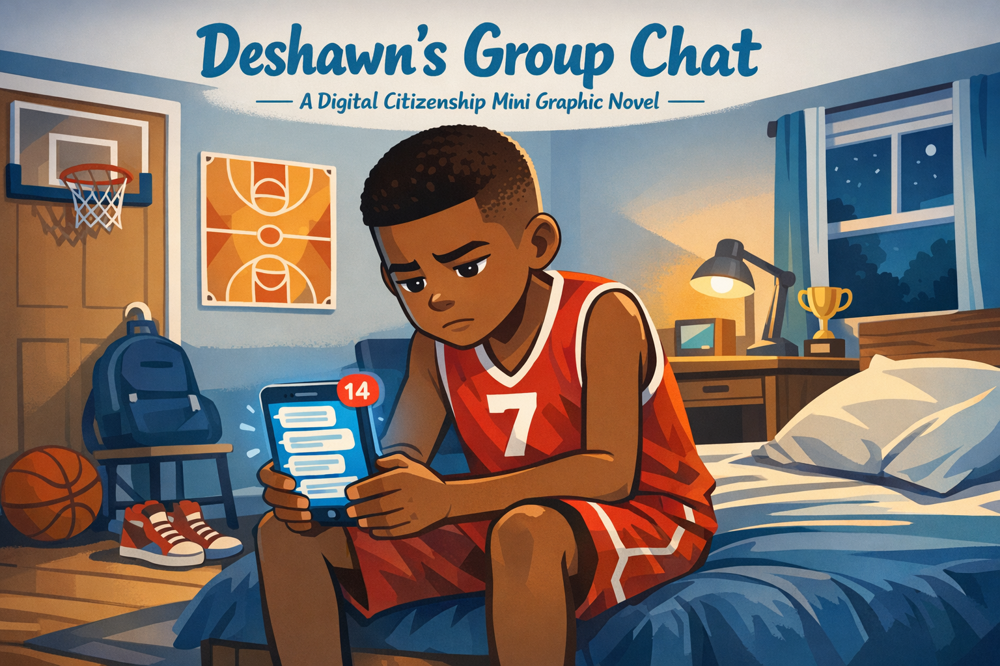
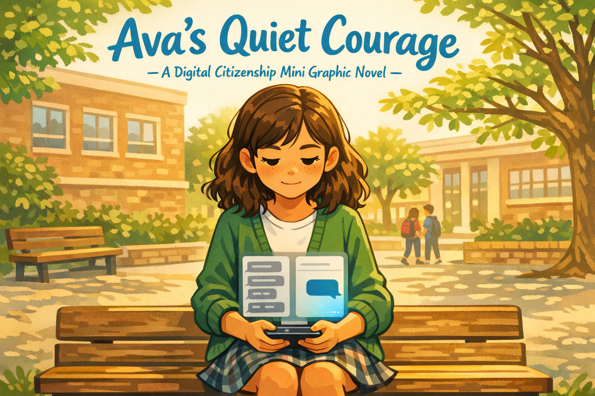

# Digital Citizenship Mini Graphic Novel Stories

These mini graphic novels are companion stories to the chapters in this textbook. Each one follows a fictional student through a single moment of decision — the kind of moment you might face any day.

Every story uses the same pattern: a kid faces an invitation, feels a conflict, pauses to think, and makes a choice. The stories are not about perfect kids. They are about real choices.

- **[Jordan's One-Second Choice](jordan-one-second-choice/index.md)**

    
    Whether to share an embarrassing video. Companion to [Chapter 2: What Is a Digital Citizen?](../chapters/02-what-is-a-digital-citizen/index.md)

- **[Leo's Missing Saturday](leos-missing-saturday/index.md)**

    
    Screen time vs. real life. Companion to [Chapter 3: Media Balance](../chapters/03-media-balance/index.md)

- **[Noah's Quiz Trap](noahs-quiz-trap/index.md)**

    
    Giving private info to a fun quiz. Companion to [Chapter 5: Private vs. Personal Info](../chapters/05-private-vs-personal-info/index.md)

- **[Zara's Too-Good Link](zaras-too-good-link/index.md)**

    
    Clicking a phishing link. Companion to [Chapter 6: Passwords and Online Safety](../chapters/06-passwords-and-online-safety/index.md)

- **[Marcus and the Guessable Password](marcus-and-the-guessable-password/index.md)**

    
    Using weak passwords for everything. Companion to [Chapter 6: Passwords and Online Safety](../chapters/06-passwords-and-online-safety/index.md)

- **[Kai's Disappearing Post](kais-disappearing-post/index.md)**

    
    Thinking a deleted post is gone. Companion to [Chapter 7: What Is a Digital Footprint?](../chapters/07-what-is-a-digital-footprint/index.md)

- **[Maya's Art and the Missing Name](mayas-art-and-the-missing-name/index.md)**

    
    Speaking up when credit is missing. Companion to [Chapter 8: Reputation and Credit](../chapters/08-reputation-and-credit/index.md)

- **[Eli's Misread Message](elis-misread-message/index.md)**

    
    A compliment read as sarcasm. Companion to [Chapter 9: Online Friends and Talk](../chapters/09-online-friends-and-talk/index.md)

- **[Suki's Uneasy Feeling](sukis-uneasy-feeling/index.md)**

    
    A stranger asking personal questions. Companion to [Chapter 10: Safe Talk and Boundaries](../chapters/10-safe-talk-and-boundaries/index.md)

- **[Deshawn's Group Chat](deshawns-group-chat/index.md)**

    
    Recognizing cyberbullying vs. conflict. Companion to [Chapter 11: Conflict vs. Cyberbullying](../chapters/11-conflict-vs-cyberbullying/index.md)

- **[Nia's Silent Screen](nias-silent-screen/index.md)**

    
    Staying silent as a bystander. Companion to [Chapter 11: Conflict vs. Cyberbullying](../chapters/11-conflict-vs-cyberbullying/index.md)

- **[Ava's Quiet Courage](avas-quiet-courage/index.md)**

    
    Including someone being left out. Companion to [Chapter 12: Standing Up Safely](../chapters/12-standing-up-safely/index.md)

- **[Tomás and the Shark Photo](tomas-and-the-shark-photo/index.md)**

    
    Sharing a fake photo before checking. Companion to [Chapter 13: What Is Misinformation?](../chapters/13-what-is-misinformation/index.md)

- **[Lucia's Science Fair Claim](lucias-science-fair-claim/index.md)**

    
    Trusting a claim without evidence. Companion to [Chapter 14: Becoming a Fact Checker](../chapters/14-becoming-a-fact-checker/index.md)

- **[Jaylen's Changed Mind](jaylens-changed-mind/index.md)**

    
    Changing his mind with better evidence. Companion to [Chapter 16: Healthy Doubt, Open Minds](../chapters/16-healthy-doubt-open-minds/index.md)

## Story Ideas

See the [Story Ideas](story-ideas.md) page for the full details behind each story, including character descriptions and panel-by-panel arcs.
