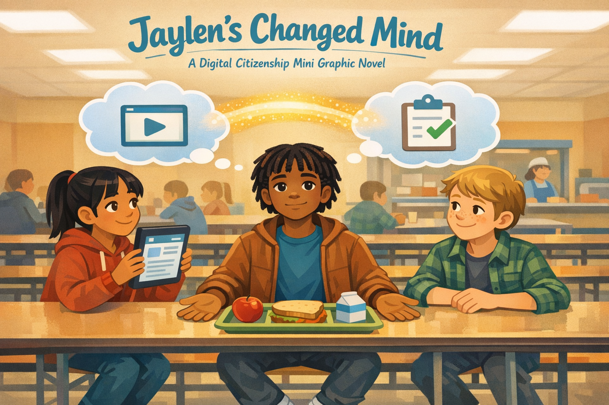
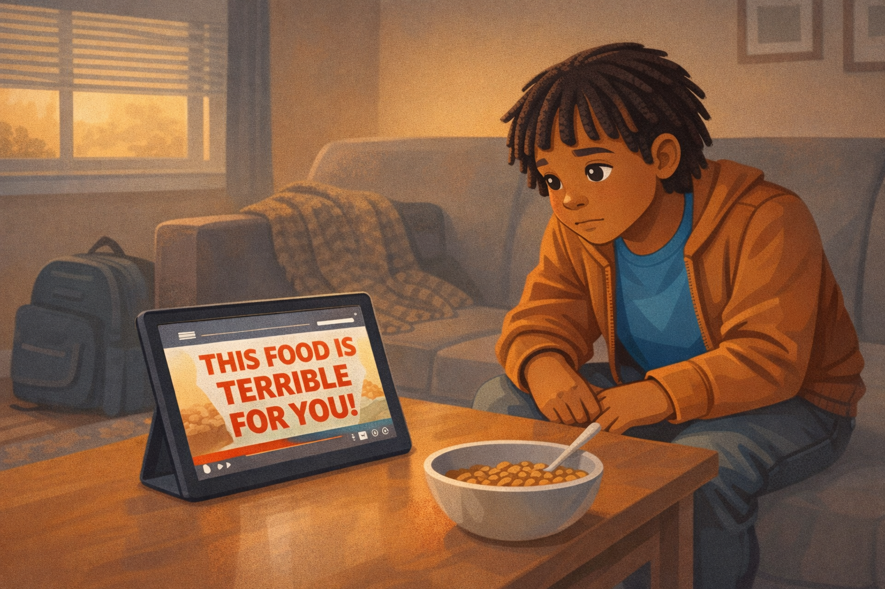
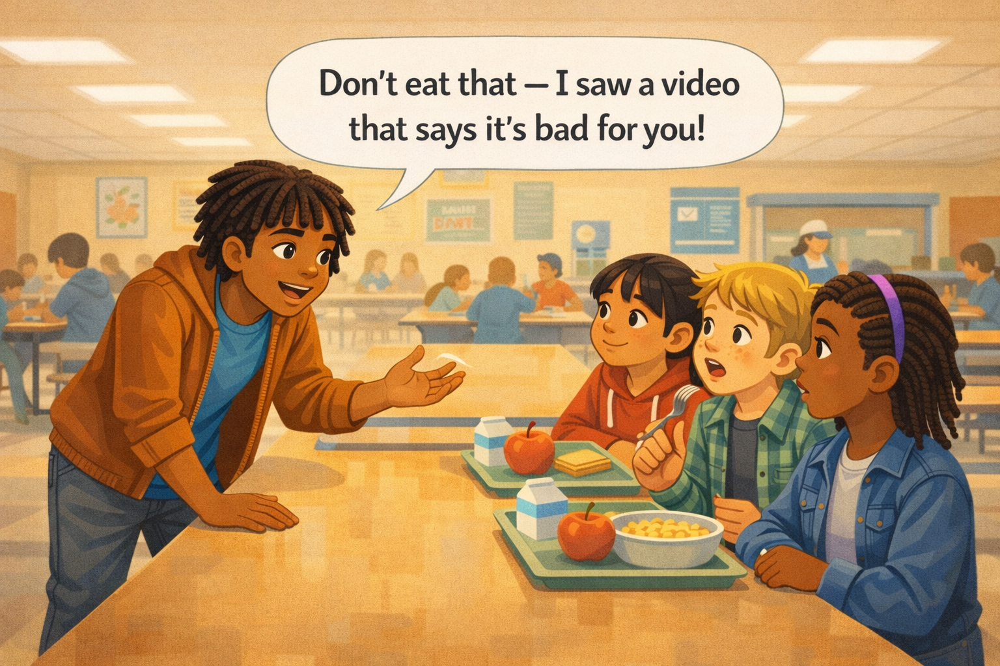
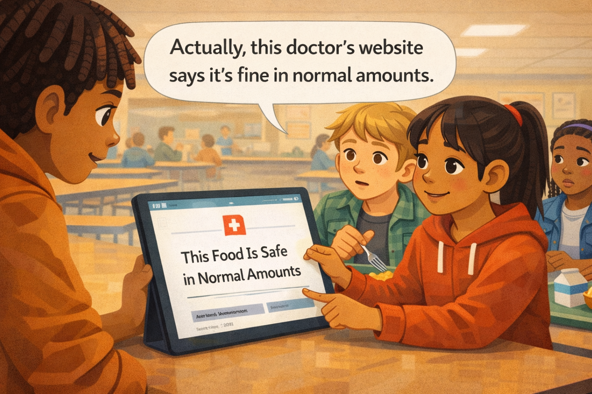
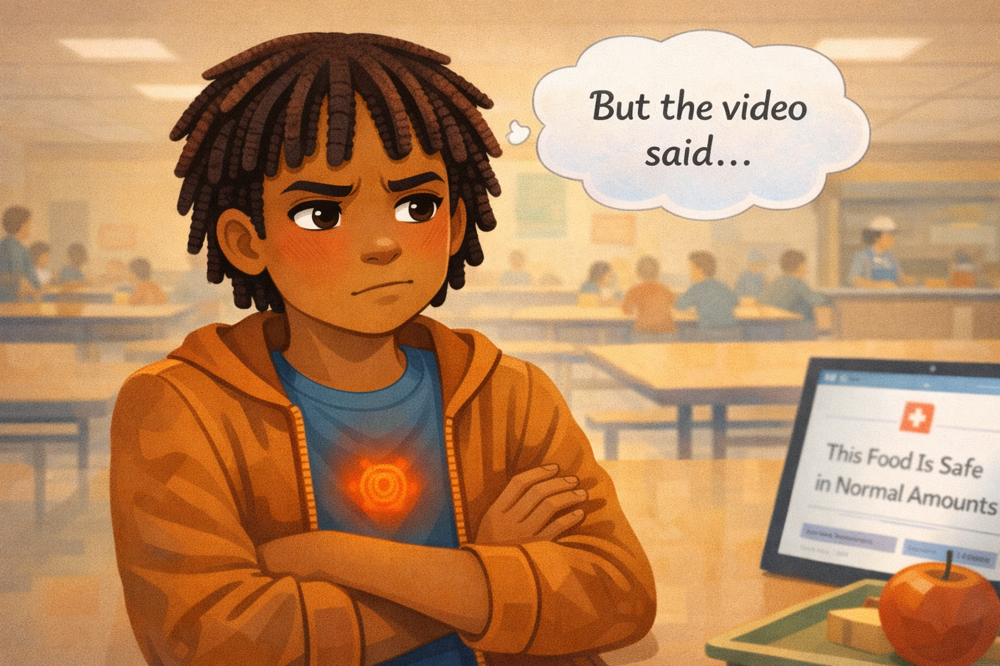
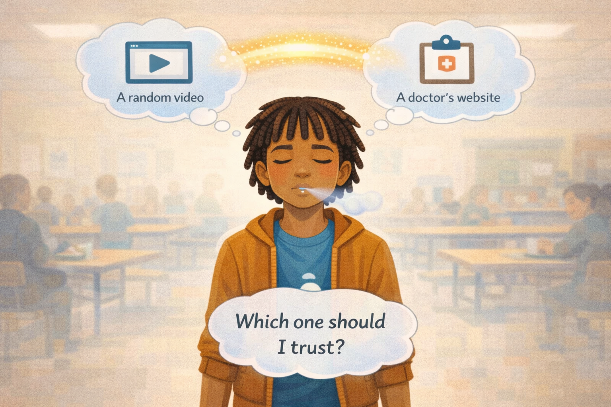
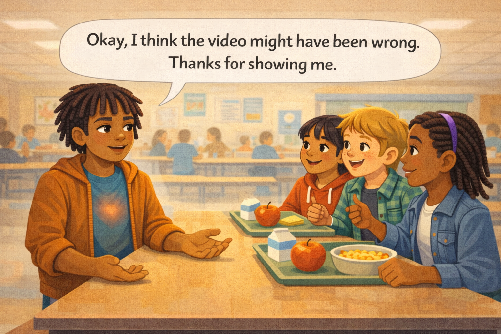
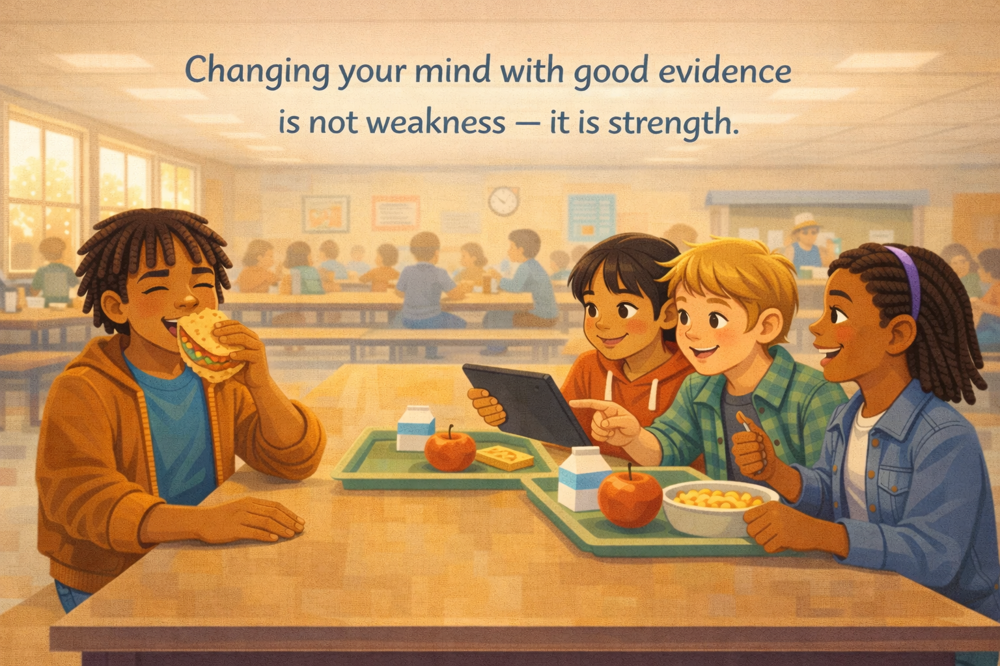

# Jaylen's Changed Mind

*A Digital Citizenship mini graphic novel — companion to [Chapter 16: Healthy Doubt and Open Minds](../../chapters/16-healthy-doubt-open-minds/index.md)*

Cover Image Prompt

Please generate a new wide-landscape image.
A thoughtful, warm composition centered on a fifth-grade boy at a school lunch table. The boy is Jaylen — dark brown skin, short locs that fall just above his ears, wearing a warm brown jacket over a river-blue (#2e6f8e) t-shirt, dark jeans, and white sneakers. He sits at the middle of a long cafeteria table, leaning back slightly in his seat with a calm, open expression — not defensive, not embarrassed, but genuinely thoughtful. His hands rest on the table, palms open.

On the table in front of him, a lunch tray holds a sandwich, an apple, and a carton of milk. To his left, a friend (a girl with light brown skin, straight black hair in a ponytail, wearing a red hoodie) holds up a tablet showing a clean, simple webpage. To his right, another friend (a white boy with sandy blond hair, freckles, wearing a green flannel shirt) watches with a supportive expression.

Above the scene, two translucent thought bubbles float symmetrically: on the left, a small screen icon with a play-button triangle (representing the video he watched); on the right, a small clipboard icon with a checkmark (representing the better source). Between the two bubbles, a soft glowing bridge of pale golden light connects them — symbolizing the mental journey from one belief to a better one.

The cafeteria background is warm and slightly out of focus: long tables, other students eating, overhead fluorescent lights, a serving counter with a lunch worker in the far background.

Across the top of the image, in friendly hand-lettered text the color of river-blue (#2e6f8e), the title: **Jaylen's Changed Mind**. Below the title, slightly smaller, the subtitle: *A Digital Citizenship Mini Graphic Novel*.

**Style notes:**

- Modern flat cartoon vector illustration. Friendly, kid-readable lines. No heavy shading.
- Warm, slightly muted color palette with river-blue (#2e6f8e) accents in the title text, Jaylen's t-shirt, and the golden bridge of light.
- 16:9 horizontal landscape composition.
- Mood: warm, open, brave. This is the moment after the hard part — the calm that follows a good decision.
- No platform names, no real app interfaces, no logos.

Generate the image immediately without asking clarifying questions.

## A Story About Changing Your Mind

Have you ever been so sure about something that you told everyone around you? And then found out you might have been wrong? That feeling is not fun. Your face gets warm. Your stomach tightens. You want to argue back, even if the other person has a point.

But here is something worth knowing: changing your mind when you see better evidence is one of the strongest things a person can do. Scientists do it. Doctors do it. The best thinkers in history did it. It is not weakness. It is **healthy doubt** — the habit of staying open to new information, even when it means admitting you were wrong.

This is a story about a student named Jaylen and the lunch period that changed the way he thinks about thinking.

---

## Panel 1 — The Video

Image Prompt

Please generate a new wide-landscape image.
An interior scene of a living room in the early morning before school. Jaylen — a fifth-grade boy with dark brown skin, short locs falling just above his ears, wearing a warm brown jacket over a river-blue t-shirt, dark jeans, and white sneakers — sits on a couch, leaning forward with his elbows on his knees, staring intently at a tablet propped up on the coffee table. His face is lit by the screen's glow, expression absorbed and trusting — he believes what he is watching.

The tablet screen shows a generic video player: a simple play-button triangle, a progress bar about halfway through, and a bold text overlay that reads "THIS FOOD IS TERRIBLE FOR YOU!" in alarming red block letters. No real app interface, no logo, no brand name visible. The video thumbnail area shows abstract blurred shapes suggesting a dramatic food-related image.

The living room is cozy: a soft gray couch, a knit blanket draped over the arm, a backpack on the floor ready for school, a window showing pale morning light through half-open blinds. A bowl of cereal sits on the coffee table beside the tablet, half-eaten.

**Style notes:**

- Modern flat cartoon vector style.
- Warm, cozy morning palette — soft grays, warm browns, river-blue accent in Jaylen's t-shirt.
- 16:9 horizontal landscape.
- Mood: absorbed, unsuspecting. Jaylen trusts what he is watching without questioning it.
- No real platform names, no real app interfaces, no logos.

Generate the image immediately without asking clarifying questions.

Before school, Jaylen watches a video on his tablet. A loud voice says, "This food is terrible for you! Never eat it again!" The video has dramatic music and flashing text. It feels important and urgent. Jaylen watches the whole thing. By the time he grabs his backpack, he is sure the video is right.

---

## Panel 2 — Lunchtime Expert

Image Prompt

Please generate a new wide-landscape image.
A bright, busy school cafeteria at lunchtime. Jaylen stands at the end of a long lunch table, leaning forward with both hands flat on the table, speaking with energy and confidence to three friends seated across from him. His expression is animated — eyebrows raised, mouth open mid-sentence, one hand lifting off the table to gesture emphatically. He looks like someone delivering important news.

His three friends are seated on the opposite side of the table: a girl with light brown skin and straight black hair in a ponytail wearing a red hoodie (this is Amara), a white boy with sandy blond hair and freckles in a green flannel shirt (this is Cole), and a Black girl with braids and a purple headband wearing a denim jacket. They all have lunch trays in front of them. The friend in the middle (Cole) has the specific food item on his tray and is about to take a bite, fork raised. All three friends look at Jaylen with a mix of surprise and concern.

A clean word balloon from Jaylen reads: **"Don't eat that — I saw a video that says it's bad for you!"**

The cafeteria background shows other tables of students eating, a lunch counter with a worker, motivational posters on the wall, and overhead lights.

**Style notes:**

- Modern flat cartoon vector style.
- Bright, warm cafeteria palette with river-blue accent in Jaylen's t-shirt visible under his open brown jacket.
- 16:9 horizontal landscape.
- Mood: confident energy — Jaylen genuinely believes he is helping his friends.
- The word balloon must be readable at small sizes.
- No logos, no brand names, no real food brand packaging.

Generate the image immediately without asking clarifying questions.

At lunch, Jaylen sees the food on his friend Cole's tray. "Don't eat that!" he says. "I saw a video that says it's really bad for you." He sounds confident. He wants to help. His friends look at their trays, then back at Jaylen. Cole puts his fork down.

---

## Panel 3 — "Actually..."

Image Prompt

Please generate a new wide-landscape image.
A medium shot focused on Amara — the girl with light brown skin, straight black hair in a ponytail, wearing a red hoodie. She is seated at the lunch table, holding up a tablet toward Jaylen (who is visible at the left edge of the frame, leaning in to look). Her expression is calm, friendly, and matter-of-fact — not confrontational, just sharing information. One finger points at the tablet screen.

The tablet screen shows a clean, credible-looking website: a simple white background, a small medical cross icon at the top (generic, no real organization), a calm headline that reads "This Food Is Safe in Normal Amounts," and below it a visible author name line and a date. The overall feel of the website is professional and calm — a clear visual contrast to the flashy video from Panel 1.

Cole and the girl with braids watch from behind Amara, expressions curious. Cole has picked his fork back up tentatively. Jaylen's expression at the left edge is the first flicker of surprise — eyebrows slightly raised, mouth slightly open.

A clean word balloon from Amara reads: **"Actually, this doctor's website says it's fine in normal amounts."**

**Style notes:**

- Modern flat cartoon vector style.
- The visual contrast between the flashy video (Panel 1) and the calm website (this panel) is the quiet teaching moment.
- 16:9 horizontal landscape.
- Mood: friendly, factual, peer-to-peer. Amara is not trying to embarrass Jaylen — she is just sharing what she found.
- The word balloon must be readable at small sizes.
- No real website names, no real doctor names, no logos.

Generate the image immediately without asking clarifying questions.

Amara pulls out her tablet. "Actually," she says, "this doctor's website says it's fine in normal amounts." She turns the screen so Jaylen can see. The website is calm and clean. It has a doctor's name, a date, and links to research. It does not have dramatic music or flashing text. It just has information.

---

## Panel 4 — The Defensive Feeling

Image Prompt

Please generate a new wide-landscape image.
A close-up of Jaylen from the chest up. His expression has shifted to defensive: jaw slightly tightened, eyes narrowed just a fraction, arms beginning to cross over his chest. His body language reads as someone who feels challenged. He is not angry — he is uncomfortable. A warm flush of soft red-orange color tints his cheeks subtly.

A clean thought bubble floats above his head containing the words: **"But the video said..."** in slightly shaky hand-lettered text, trailing off with an ellipsis.

In the center of his chest, a small tight knot of warm red-orange light glows faintly — the same "knot in the stomach" visual metaphor used in the Jordan story, representing the uncomfortable feeling of being wrong.

The background is softened and slightly blurred — the cafeteria fades out so the focus is entirely on Jaylen's internal moment. Amara's tablet is just barely visible at the edge of the frame, its screen still glowing with the calm website.

**Style notes:**

- Modern flat cartoon vector style.
- Warm palette with the red-orange flush and knot as emotional contrast to the river-blue accents.
- 16:9 horizontal landscape.
- Mood: internal conflict — the uncomfortable feeling of realizing you might be wrong.
- The thought bubble text must be readable at small sizes.
- No logos.

Generate the image immediately without asking clarifying questions.

Jaylen feels his shoulders tighten. A warm flush creeps up his neck. "But the video said..." he starts. The words trail off. He wants to argue back. He wants the video to be right because he already told everyone it was. Admitting he might be wrong feels hard.

---

## Panel 5 — The Pause

Image Prompt

Please generate a new wide-landscape image.
A medium shot of Jaylen standing at the lunch table, but his posture has shifted. His arms have uncrossed. His hands rest at his sides. His eyes are closed, and he is taking one slow breath — a small pale-blue puff of breath leaves his lips, just like the "pause" visual from the Jordan story. His expression is calm and focused, the defensiveness from Panel 4 melting away.

Above his head, two clean thought bubbles float side by side, connected by a soft golden bridge of light between them:

- Left bubble: a small screen icon with a play-button triangle and the label **"A random video"** in small text.
- Right bubble: a small clipboard icon with a medical cross and the label **"A doctor's website"** in small text.

Below the two bubbles, centered, a third smaller thought bubble reads: **"Which one should I trust?"**

The cafeteria background is softened to near-white, focusing attention on Jaylen's internal moment. His friends are barely visible as soft shapes at the edges.

**Style notes:**

- Modern flat cartoon vector style.
- Soft, warm palette with river-blue accents in the thought bubbles and golden light in the bridge.
- 16:9 horizontal landscape.
- Mood: stillness, honest self-reflection. The hardest kind of pause.
- All thought bubble text must be readable at small sizes.
- No logos.

Generate the image immediately without asking clarifying questions.

Jaylen closes his eyes for one second. He takes a slow breath. Then he asks himself a quiet question: "Which source should I trust more? A random video with dramatic music? Or a doctor's website with a name and a date and real research?" He already knows the answer. The hard part is saying it out loud.

---

## Panel 6 — "I Think the Video Was Wrong"

Image Prompt

Please generate a new wide-landscape image.
A medium shot of the lunch table. Jaylen has sat down on the bench across from his friends. His posture is open — shoulders relaxed, hands resting on the table, palms up in a small gesture of honesty. His expression is calm and genuine, with a small half-smile that reads as humble rather than defeated. His eyes are steady, looking directly at Amara.

A clean word balloon from Jaylen reads: **"Okay, I think the video might have been wrong. Thanks for showing me."**

Across the table, Amara smiles warmly, tablet now lowered to the table. Cole grins and picks up his fork again. The girl with braids gives a small thumbs-up. None of the friends look smug or superior — they look supportive, like friends who are glad the conversation went well.

The cafeteria background returns at full brightness and color: other students eating, the lunch counter, warm overhead lighting. The scene feels normal and good.

**Style notes:**

- Modern flat cartoon vector style.
- Warm, bright palette with river-blue accents in Jaylen's t-shirt.
- 16:9 horizontal landscape.
- Mood: relief, warmth, genuine connection. This is the brave moment.
- The word balloon must be readable at small sizes.
- No logos, no brand names.

Generate the image immediately without asking clarifying questions.

Jaylen opens his eyes and sits down. "Okay," he says. "I think the video might have been wrong. Thanks for showing me that." His voice is steady. He does not feel weak. He feels lighter. Amara smiles. Cole picks up his fork. Nobody laughs at Jaylen. Nobody calls him wrong. They just nod — because changing your mind with good evidence is something to respect.

---

## Panel 7 — Strength, Not Weakness

Image Prompt

Please generate a new wide-landscape image.
A wide, warm shot of the cafeteria lunch table a few minutes later. The mood has settled into comfortable, ordinary friendship. Jaylen sits at the table with his three friends, all of them eating lunch together. Jaylen is mid-bite of his sandwich, one hand holding the sandwich, the other resting on the table near his tray. His expression is relaxed and happy — the tension from earlier panels is completely gone.

Amara is showing something else on her tablet to Cole, who leans in with curiosity. The girl with braids is laughing at something off-screen. The scene is ordinary, warm, and good — just friends having lunch.

Above the scene, in clean hand-lettered text the color of river-blue (#2e6f8e), a single line reads: **"Changing your mind with good evidence is not weakness — it is strength."**

The cafeteria is full and bright around them. Sunlight streams through high windows on the left side, casting warm rectangles of light across the floor. Other students eat and talk at nearby tables. A clock on the wall shows lunchtime. Everything feels normal and peaceful.

**Style notes:**

- Modern flat cartoon vector style.
- Warm, bright, full-color palette — this is the resolution panel, so the colors should feel warmer and more vivid than any previous panel.
- 16:9 horizontal landscape.
- Mood: peaceful strength. The crisis is over, and it turned out to be no crisis at all.
- The hand-lettered text at the top must be readable and feel like a gentle takeaway, not a lecture.
- No logos, no brand names.

Generate the image immediately without asking clarifying questions.

A few minutes later, the moment has passed. Jaylen eats his lunch. His friends talk and laugh about other things. Nothing bad happened. In fact, something good happened: Jaylen learned something true, and his friends learned that Jaylen is the kind of person who listens.

Changing your mind does not mean you were stupid before. It means you are smarter now.

---

## What Jaylen Teaches Us

Jaylen was not wrong to watch the video. He was not wrong to care about what he eats. He was not even wrong to tell his friends. Where Jaylen grew was in the moment when better evidence arrived and he had a choice: dig in or open up.

| Moment | What Jaylen did | What we can learn |
|---|---|---|
| The video | He watched it and believed it without checking | It is easy to trust something that sounds urgent and confident |
| The lunchtime claim | He told his friends with certainty | When we feel sure, we spread information faster — so certainty needs checking |
| The better source | Amara showed him a credible website | Good friends share evidence, not just opinions |
| The defensive feeling | He noticed the knot in his stomach and the urge to argue | That uncomfortable feeling is a signal, not a stop sign |
| The pause | He asked himself which source was more trustworthy | Comparing sources is a skill anyone can use |
| The open mind | He said, "I think the video was wrong. Thanks." | Saying those words out loud takes real courage |
| The result | His friends respected him more, not less | People trust someone who can change their mind with evidence |

## You Can Do This Too

The next time someone shows you a better source than the one you believed, notice how your body feels. You might feel warm. Your stomach might tighten. You might want to argue back. That is normal. That feeling is not a sign that you are wrong to listen — it is a sign that your brain is working hard to update.

Take a breath. Ask yourself: which source is more trustworthy? A video with dramatic music? Or a website with a real name, a date, and evidence you can check?

Then do what Jaylen did. Say, "I think I might have been wrong. Thanks for showing me." Those twelve words are some of the most powerful words a person can say.

## Related Reading

- [Chapter 16: Healthy Doubt and Open Minds](../../chapters/16-healthy-doubt-open-minds/index.md) — the chapter this story belongs to. Teaches what healthy doubt means and why staying open to new evidence is a sign of strength.
- [Chapter 15: Four Critical Questions](../../chapters/15-four-critical-questions/index.md) — the four questions every digital citizen can ask before trusting a claim: Who said it? What is the evidence? What is missing? How do I feel?
