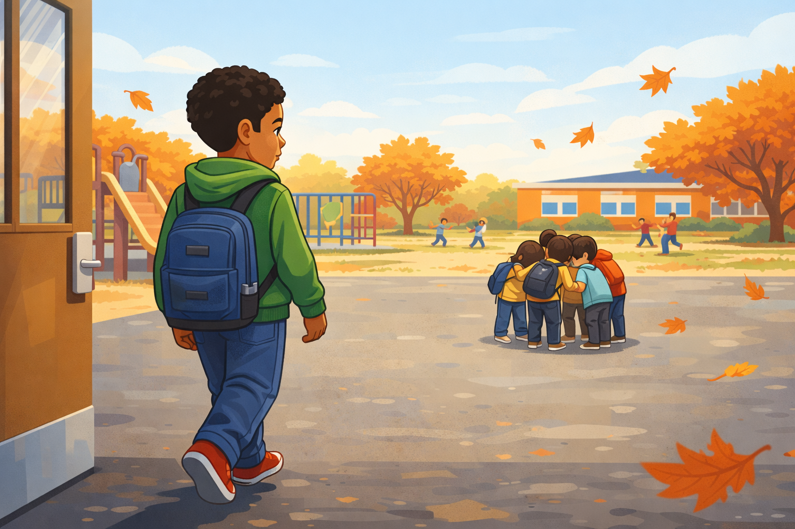
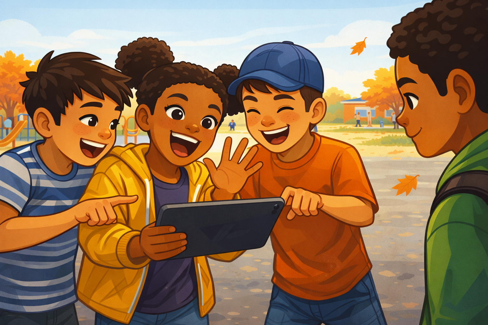
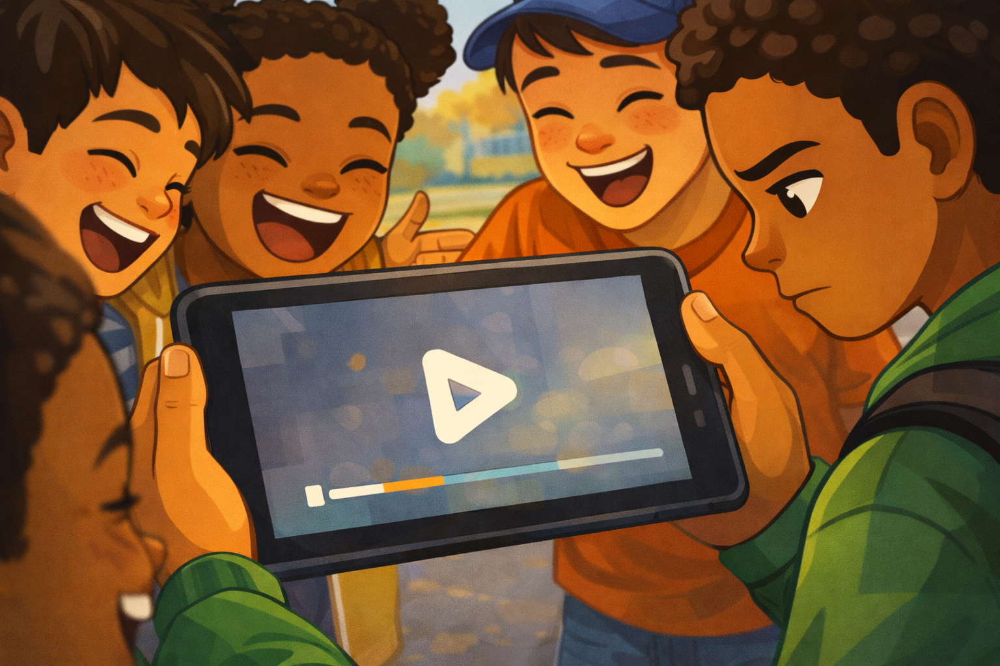
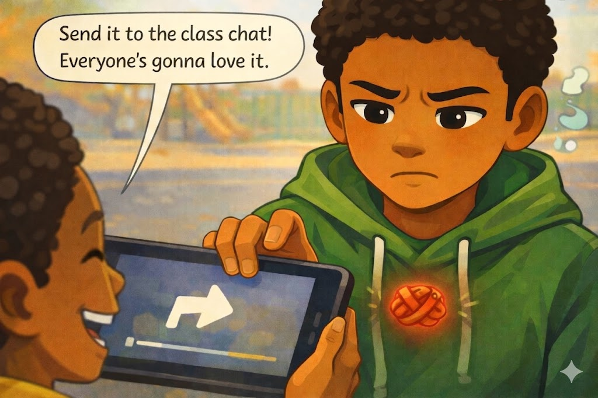
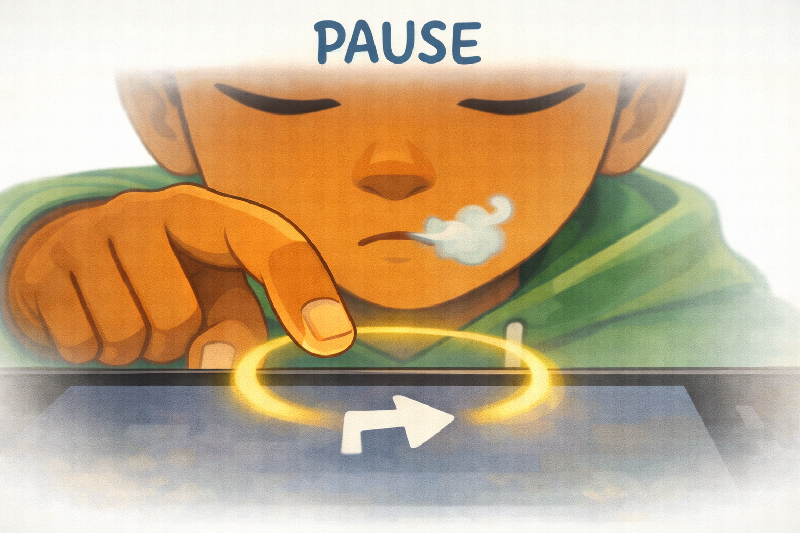
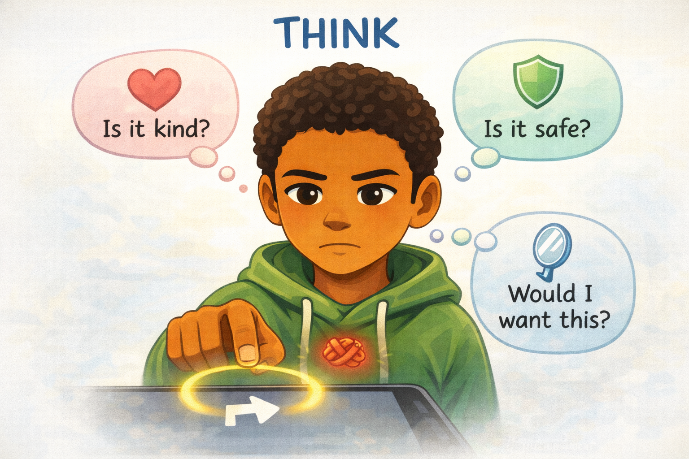
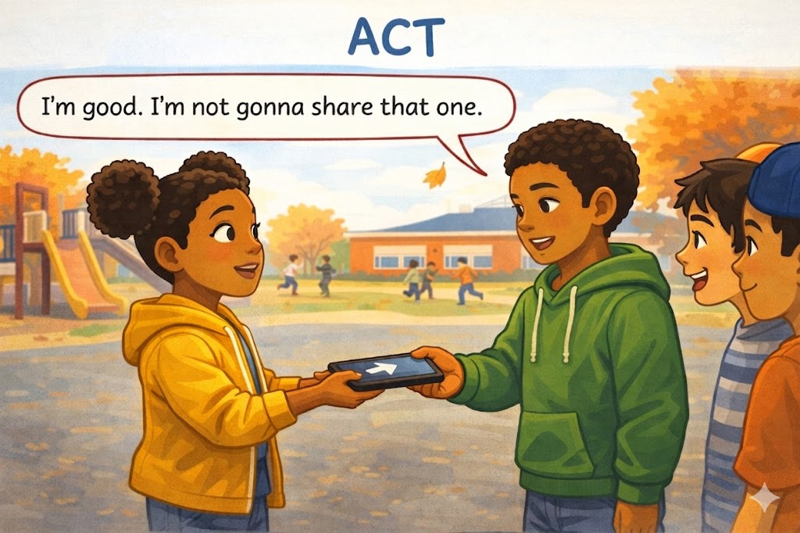
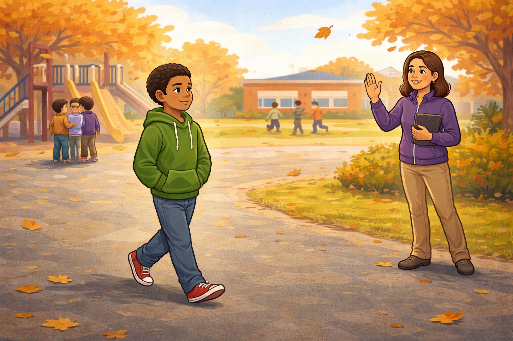

# Jordan's One-Second Choice

*A Digital Citizenship mini graphic novel — companion to [Chapter 2: What Is a Digital Citizen?](../../chapters/02-what-is-a-digital-citizen/index.md)*

Cover Image Prompt

A dramatic, calm close-up composition. In the center of the frame, a fifth-grade boy's hand hovers about an inch above a tablet screen. The boy is Jordan — warm brown skin, short curly black hair, wearing a green hoodie. We see him from chest up: his face fills the upper third of the frame, eyes focused down at the tablet, lips slightly pressed together, expression quietly thoughtful (not afraid, not angry — *thinking*). His index finger is stretched out toward the screen, frozen mid-air.

The tablet screen glows softly with an abstract paused video frame — a simple play-button triangle and a thin progress bar, no identifiable person, no logos, nothing mean visible. A soft, warm yellow ring of light surrounds the space between his finger and the screen, like a held breath.

Behind Jordan, slightly out of focus, is a sunny autumn elementary-school playground: a slide, monkey bars, distant kids playing tag, a few maple trees with orange and red leaves, a low brick school building, and a pale-blue sky. A few maple leaves drift through the air.

Across the top of the image, in friendly hand-lettered text the color of river-blue (#2e6f8e), the title: **Jordan's One-Second Choice**. Below the title, slightly smaller, the subtitle: *A Digital Citizenship Mini Graphic Novel*.

**Style notes:**

- Modern flat cartoon vector illustration. Friendly, kid-readable lines. No heavy shading.
- Warm, slightly muted color palette with river-blue (#2e6f8e) accents in the title text and the soft glow ring.
- 16:9 horizontal landscape composition.
- Mood: calm, focused, hopeful. This is the moment of decision, not the moment of action.
- No platform names, no real app interfaces, no logos.

Generate the image immediately without asking clarifying questions.

## A Story About One Second

Most of the time, the world feels like it moves fast. Click. Tap. Share. Send. But sometimes, in between two heartbeats, there is one tiny second when you can still choose.

That second is the most powerful spot in the whole digital world. The textbook calls it the **digital threshold** — the moment right before you tap, share, or post something online.

This is a story about a fifth-grade student named Jordan, and the one second that changed his recess.

---

## Panel 1 — Recess Begins

Image Prompt

A wide establishing shot of an elementary school playground on a sunny autumn afternoon. In the foreground, Jordan — a fifth-grade boy with warm brown skin, short curly black hair, a green hoodie, jeans, and red sneakers — walks out of a pair of school doors onto the blacktop. He is shown in a three-quarter back view, mid-stride. His backpack hangs from one shoulder. His face is in soft profile, relaxed and curious.

In the middle distance across the blacktop, a small group of four kids is huddled tightly together around something small and bright in the center of their huddle. We can't see what they're looking at yet — only that they are bent inward, bodies forming a tight ring.

In the background, a friendly playground: a slide, monkey bars, a few maple trees turning autumn orange and red, distant kids playing tag, and a low brick school building. A few maple leaves drift through the air. The sky is pale blue with soft clouds.

**Style notes:**

- Modern flat cartoon vector style, consistent with the cover.
- Warm, slightly muted palette with river-blue (#2e6f8e) accents in the sky and clothing.
- 16:9 horizontal landscape.
- Mood: open, curious, ordinary. A normal recess.
- No text, no logos.

Generate the image immediately without asking clarifying questions.

The bell rings. Jordan steps out onto the playground for recess. The autumn air is crisp, and a few maple leaves drift past his shoes. Across the blacktop, he sees a tight little huddle of kids. They are leaning in close, looking at something small and bright in the middle of the huddle. He starts walking over.

---

## Panel 2 — "Jordan! Watch This!"

Image Prompt

A medium shot of the group of four fifth-grade kids, tightly huddled around a tablet held by a Black girl with two pom-pom hair puffs. She is twisting her body toward the viewer (toward Jordan, who is just off-frame), one hand mid-wave, mouth wide open in a happy shout. Around her, three other kids lean in laughing: an Asian boy in a striped t-shirt, a white girl with red hair pointing at the screen, and a Latino boy in a baseball cap mid-laugh. Their energy is loud, excited, and contagious.

Jordan is visible at the right edge of the frame, just arrived, head tilted slightly in curiosity. His expression is open and friendly — he doesn't yet know what's on the screen.

The tablet is angled away from the viewer, so we cannot see the screen yet. The same playground background continues from Panel 1: blacktop, distant trees, soft autumn light.

**Style notes:**

- Modern flat cartoon vector style.
- Warm, friendly palette with river-blue accents.
- 16:9 horizontal landscape.
- The kids' faces should read as kind, even in their excitement — these are not bullies, they are kids in a moment of bad judgment.
- Mood: energetic, inviting.
- No text bubbles, no logos.

Generate the image immediately without asking clarifying questions.

"Jordan! Watch this!" the girl in the middle calls. She waves him over with a big smile. The whole group is laughing. Jordan's curiosity tugs him toward them. *What's so funny?* he wonders. He steps closer.

---

## Panel 3 — The Video

Image Prompt

An over-the-shoulder angle showing the tablet screen between the kids' shoulders. The screen displays only an abstract paused video frame — a generic play-button triangle, a simple timeline bar, and a few blurred soft shapes. Nothing identifiable. No real person visible on the screen. No app interface, no logos, no text.

Around the tablet, the four kids' faces are visible in close laughter — big open smiles, eyes squeezed up. Jordan now stands closer, looking down at the screen. His expression has begun to change: the curious smile from Panel 2 has faded. His eyebrows are pulling slightly together, and his mouth has gone flat. He doesn't look angry yet — he looks *uncomfortable*.

**Style notes:**

- Modern flat cartoon vector style.
- The tablet screen content is intentionally vague and abstract — the story is about Jordan's reaction, not about showing anything mean.
- 16:9 horizontal landscape.
- Mood: a small turn from happy to uneasy.
- No text, no logos.

Generate the image immediately without asking clarifying questions.

Jordan looks down at the tablet. The video shows a kid from another grade tripping and falling in the lunchroom. The kid in the video looks embarrassed. The other kids around the tablet are laughing anyway. Jordan's smile slips a little. Something inside him does not feel right.

---

## Panel 4 — The Knot in the Stomach

Image Prompt

Please generate an image for panel 4.
A close-up of Jordan from chest up, shown almost head-on. His face is the focus: brows pulled together, mouth pressed into a small uncertain line. His green hoodie fills the lower part of the frame.

The girl with the tablet is just visible at the left edge, holding the device out toward him. A small, clean word balloon floats from her direction with the words: **"Send it to the class chat! Everyone's gonna love it."**

Jordan's right hand is raised partway, his finger reaching toward the tablet. The fingertip is about an inch from a generic share-arrow icon on the screen — hovering, not touching.

In the center of his chest, just above his heart, a small soft red knotted-rope shape glows faintly — a visual symbol of the "knot in his stomach." It is not scary, just clearly visible. Around his head, a small pale-blue thought wisp suggests he is starting to think instead of just react.

**Style notes:**

- Modern flat cartoon vector style.
- Warm palette with the small red knot for emotional contrast.
- 16:9 horizontal landscape.
- Mood: the moment of conflict — pulled two ways at once.
- The word balloon should be the only text in the panel, and it must be readable at small sizes.
- No logos, no real app interface.

Generate the image immediately without asking clarifying questions.

"Send it to the class chat!" the girl says. "Everyone's gonna love it." Jordan feels two things at the same time. He wants to fit in with the group. But something else inside him feels a little tight, like a small knot in his stomach. His finger hovers over the screen.

---

## Panel 5 — Pause

Image Prompt

An extreme close-up of Jordan's finger and the tablet screen. His fingertip is frozen mid-air, about an inch above a generic share-arrow icon on the screen. A soft, glowing yellow ring of light surrounds the space between his finger and the screen — like a held breath made visible.

In the upper part of the frame, Jordan's face is partially visible. His eyes are closed for one slow breath, his expression calm and focused. A small puff of pale-blue breath leaves his lips.

Above the panel, in clean kid-readable lettering across the top of the frame, the single word: **PAUSE**.

The background is softened to near-white so the focus is entirely on the held moment. The world has gone still.

**Style notes:**

- Modern flat cartoon vector style.
- Soft, warm palette with the glowing yellow ring as the visual centerpiece.
- 16:9 horizontal landscape.
- Mood: stillness, peace, power.
- The word "PAUSE" should be in friendly hand-lettered style, the same color as the river-blue title text.
- No logos, no real app interface.

Generate the image immediately without asking clarifying questions.

Jordan stops his finger. He takes one slow breath. The world around him goes quiet for just a second. He can hear his own heartbeat. He remembers something his teacher said: *pause, think, act*.

---

## Panel 6 — Think

Image Prompt

A medium shot of Jordan from the chest up. His finger is still hovering above the tablet screen, but his eyes are now open and clearly focused. His expression has shifted from uncertain to thoughtful.

Three small, clean thought bubbles float in the air around his head, each containing a simple icon and one short question in clean, kid-readable text:

- Top-left bubble: a soft pink heart icon with the words **"Is it kind?"**
- Top-right bubble: a soft green shield icon with the words **"Is it safe?"**
- Lower bubble below his chin: a small mirror icon with the words **"Would I want this?"**

Above the panel, in the same friendly hand-lettered style as Panel 5, the single word: **THINK**.

The background remains softly faded so the focus stays on Jordan and his three questions.

**Style notes:**

- Modern flat cartoon vector style.
- Each thought bubble should be visually distinct but balanced — the three questions are equally important.
- 16:9 horizontal landscape.
- Mood: calm, focused decision-making.
- Text in the bubbles must be readable at small sizes.
- No logos.

Generate the image immediately without asking clarifying questions.

Now Jordan thinks. *Is this kind?* No — the kid in the video looks embarrassed. *Is this safe for the kid in the video?* Probably not. People might keep laughing all week. *Would I want my own bad moment shared with everyone?* No way.

---

## Panel 7 — Act

Image Prompt

A medium shot of Jordan handing the tablet back to the Black girl with the pom-pom hair puffs. Both kids are visible in three-quarter view. Jordan has a small calm smile and steady eyes. The girl looks slightly surprised — eyebrows raised — but not angry. The other kids in the group are quieter now, listening, watching what happens.

A single clean word balloon from Jordan's direction reads: **"I'm good. I'm not gonna share that one."**

Above the panel, in the same friendly hand-lettered style as the previous two panels, the single word: **ACT**.

The autumn playground background returns at full strength: blacktop, soft trees, distant kids, golden afternoon light.

**Style notes:**

- Modern flat cartoon vector style.
- The body language is the centerpiece: Jordan calm and steady, the girl surprised but not hostile.
- 16:9 horizontal landscape.
- Mood: quiet courage. Not boastful, not angry, just clear.
- The word balloon is the only text in the panel and must be readable.
- No logos.

Generate the image immediately without asking clarifying questions.

Then Jordan acts. He hands the tablet back to the girl. "I'm good," he says. "I'm not gonna share that one." His voice is calm. He is not angry at the group. He is just clear about what he wants to do — and what he doesn't.

---

## Panel 8 — Walking to a Trusted Adult

Image Prompt

A wide shot of the playground, a few moments later. In the left background, the group of four kids is now in soft focus — still huddled together but no longer the visual focus. In the center foreground, Jordan walks calmly across the blacktop. He is the same boy from every previous panel: warm brown skin, short curly black hair, green hoodie, jeans, red sneakers. His head is up, his shoulders are straight, and a small calm smile sits on his face. His hands are tucked into his hoodie pockets.

In the middle ground on the right side of the frame, a fifth-grade teacher stands near the playground edge wearing a teacher's quarter-zip pullover and holding a clipboard. The teacher has medium-length brown hair, light tan skin, and a warm welcoming expression. The teacher is smiling and waving toward Jordan, clearly inviting him over. Jordan's path of motion leads from the group on the left toward the teacher on the right.

A soft golden afternoon light fills the scene. Maple leaves drift through the air. The same low brick school building is visible in the background.

**Style notes:**

- Modern flat cartoon vector style, matching every previous panel.
- Jordan's body language reads as quietly confident, not boastful or smug.
- The teacher does not look stern, alarmed, or upset — this is a kid going to a kind grown-up, not a kid in trouble.
- 16:9 horizontal landscape.
- Mood: warm, hopeful, calm.
- No text, no speech bubbles, no logos.

Generate the image immediately without asking clarifying questions.

Jordan walks across the playground. He is going to find his teacher. The kid in the video should know what is happening, and a grown-up can help. Telling a trusted adult is part of being a digital citizen. Jordan is not in trouble for telling — he is doing his job.

---

## What Jordan Teaches Us

Jordan is not perfect. He felt the pull to share that video, just like anyone would. What made him a digital citizen was not that he never felt the pull. It was that he paused for one second and chose on purpose.

| Moment | What Jordan did | What we can learn |
|---|---|---|
| The invitation | He came over but did not jump in | You can be friendly and still wait to decide |
| The ask | He felt the knot in his stomach | Your body sends you signals — listen to them |
| The pause | He stopped his finger and took one slow breath | One second is enough to change a choice |
| The think | He asked: Is it kind? Is it safe? Would I want this? | Three small questions can guide a big decision |
| The act | He handed the tablet back and walked to his teacher | A real digital citizen acts on purpose |

## You Can Do This Too

Jordan's choice took less than a minute. He did not need a special app. He did not need permission. He just needed one second on the **digital threshold**, three quick questions, and the courage to act on what he already knew was right.

You have all of those things, right now, today. Every time your finger hovers over a screen, the threshold is yours. The choice is yours. Pause, think, act.

If you ever see something online that confuses you, scares you, or makes you feel weird — like Jordan did — tell a trusted adult. A parent, a guardian, a teacher, a school counselor, or a librarian. You will not be in trouble for telling. That is a rule for the rest of your life.

## Related Reading

- [Chapter 2: What Is a Digital Citizen?](../../chapters/02-what-is-a-digital-citizen/index.md) — the chapter this story belongs to. Defines *digital citizen*, *digital threshold*, *pause-think-act*, and the four habits Jordan is practicing.
- [Chapter 1: Welcome to the Digital World](../../chapters/01-welcome-to-digital-world/index.md) — the words you need before you read this story: *device*, *internet*, *app*.
