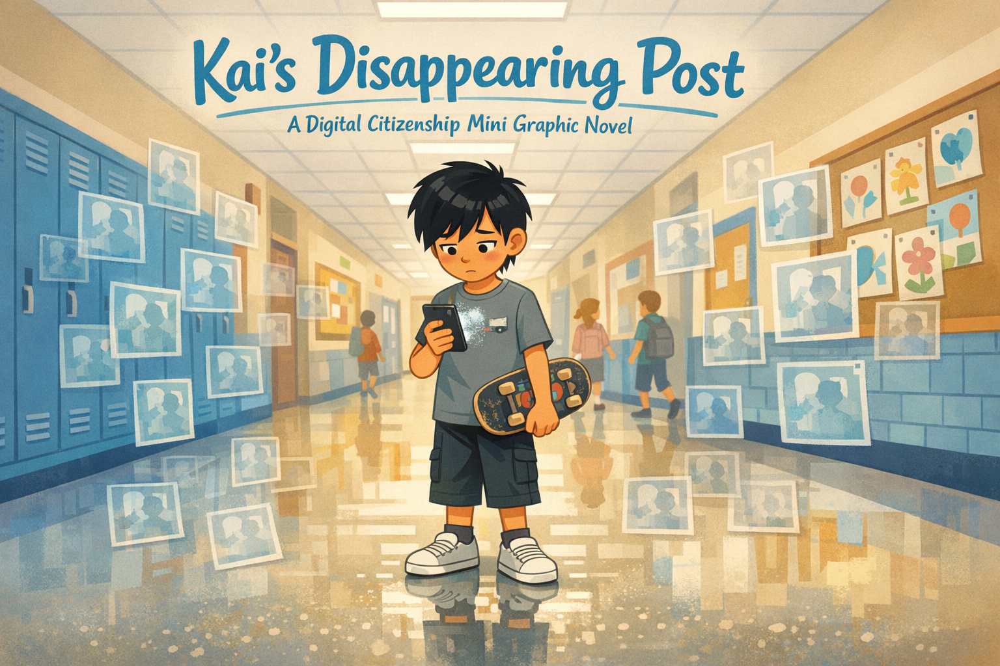
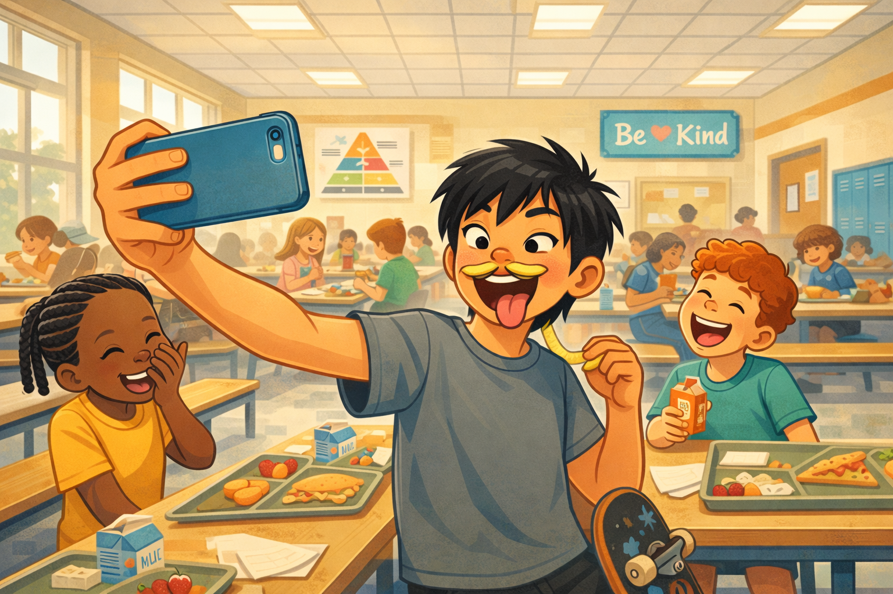
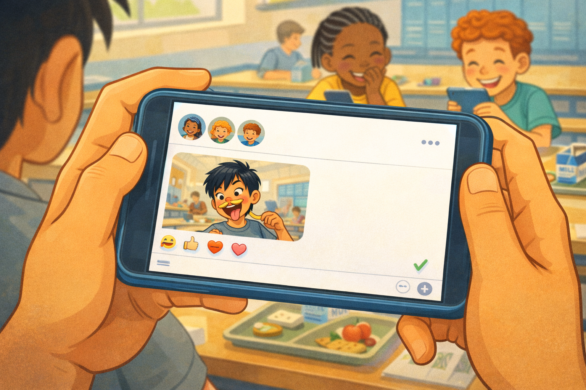
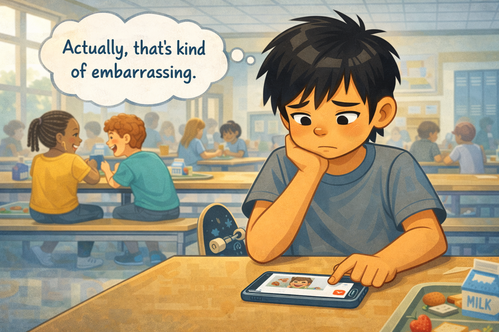
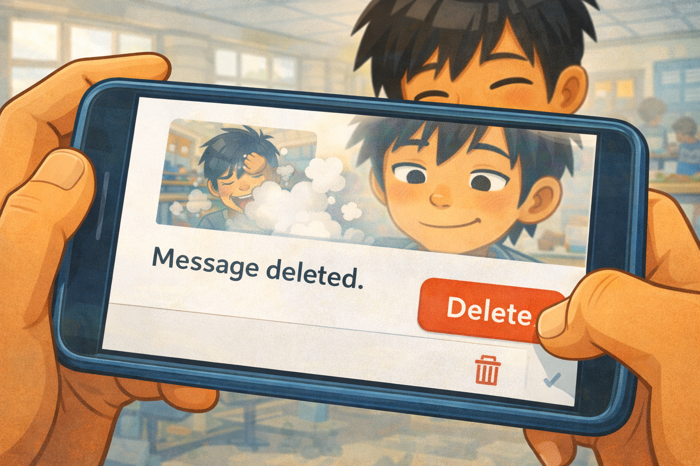
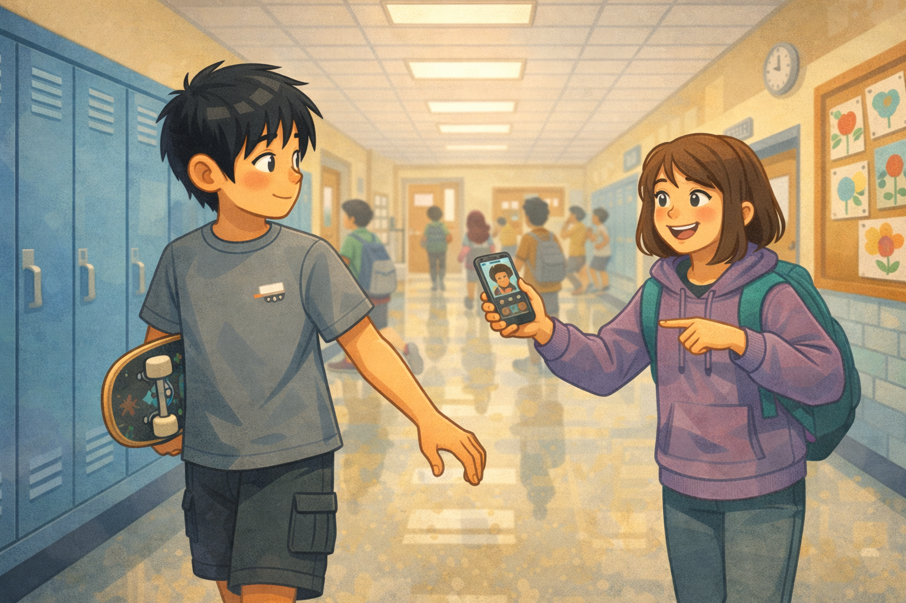
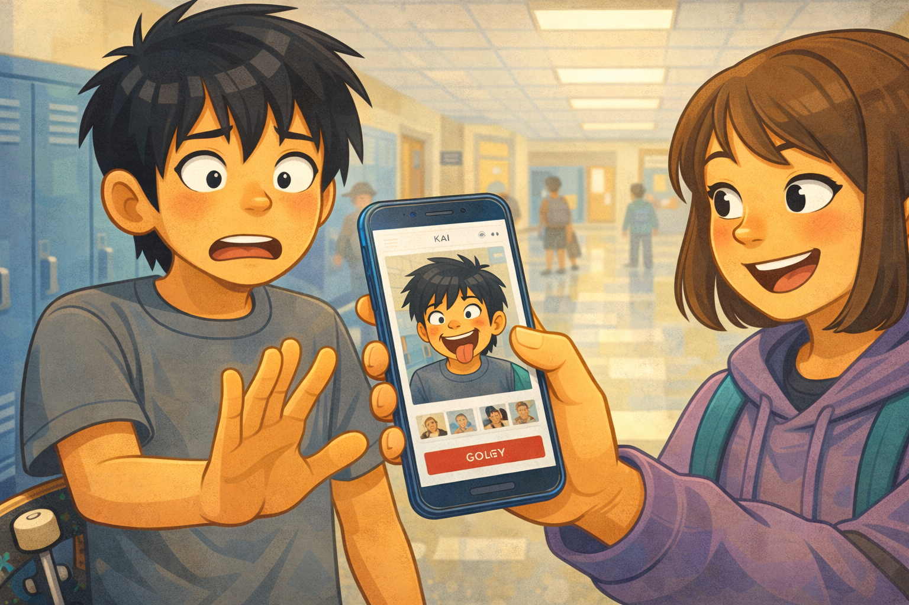
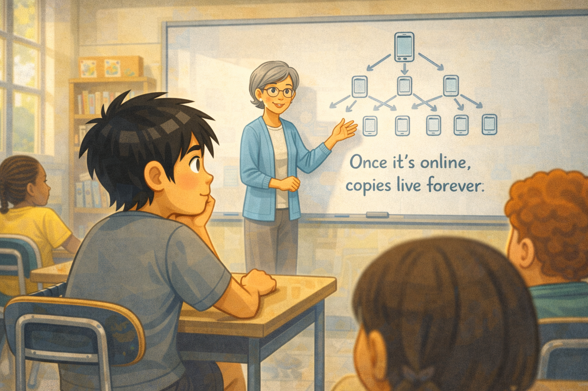
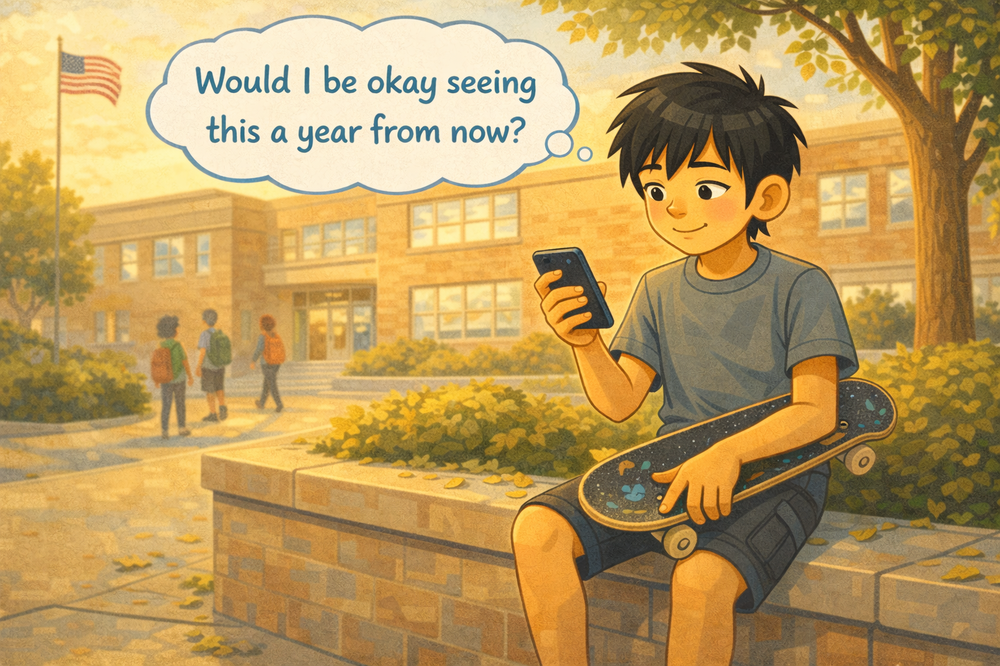

# Kai's Disappearing Post

*A Digital Citizenship mini graphic novel — companion to [Chapter 7: What Is a Digital Footprint?](../../chapters/07-what-is-a-digital-footprint/index.md)*

Cover Image Prompt

Please generate a new wide-landscape image.
A dramatic, thoughtful composition. In the center of the frame, a fifth-grade boy stands in a school hallway, looking down at his phone with a mix of surprise and regret. The boy is Kai — East Asian features, a messy mop of straight black hair falling across his forehead, wearing a gray t-shirt with a small skateboard graphic, dark shorts that fall just below the knee, and scuffed white sneakers. A well-worn skateboard is tucked under his left arm, its underside showing colorful grip-tape stickers. His right hand holds the phone, and on the screen a faint ghostly outline of a photo is visible — like a photo dissolving, half there and half gone.

Behind Kai, stretching down the hallway in both directions, faint translucent copies of the same photo float in the air like echoes — some attached to other phones, some drifting free, some stuck to the walls. The copies get more transparent the farther away they are, but they never fully disappear. This visual metaphor shows that deleting the original does not delete the copies.

The hallway is a bright, friendly elementary school corridor: blue lockers, a bulletin board with student art, fluorescent lights, a few distant students walking. The floor is polished and reflective, and Kai's reflection is visible beneath him.

Across the top of the image, in friendly hand-lettered text the color of river-blue (#2e6f8e), the title: **Kai's Disappearing Post**. Below the title, slightly smaller, the subtitle: *A Digital Citizenship Mini Graphic Novel*.

**Style notes:**

- Modern flat cartoon vector illustration. Friendly, kid-readable lines. No heavy shading.
- Warm, slightly muted color palette with river-blue (#2e6f8e) accents in the title text and the ghostly photo outlines.
- 16:9 horizontal landscape composition.
- Mood: reflective, slightly unsettled, but not scary. The copies are a gentle visual metaphor, not a horror image.
- No platform names, no real app interfaces, no logos.

Generate the image immediately without asking clarifying questions.

## A Story About Footprints

When you walk on a beach, you leave footprints in the sand. You can see exactly where you have been. You cannot erase them by wishing. The waves have to do that work for you — slowly, over time.

The internet does not have waves. Online, your footprints stay.

This is a story about Kai, and the post he thought he could delete.

---

## Panel 1 — The Goofy Selfie

Image Prompt

(This is Panel 01. Do not include the panel number in the image.)

Please generate a new wide-landscape image.
A wide, lively shot of a school cafeteria at lunchtime. Kai — a fifth-grade boy with East Asian features, a messy mop of straight black hair, a gray t-shirt, dark shorts, and a skateboard propped against the bench beside him — is holding his phone up at arm's length, taking a selfie. He is making an exaggerated goofy face: eyes crossed, tongue out to the side, one eyebrow raised. His free hand holds a french fry like a mustache under his nose.

Around him, the cafeteria is full of life: a long lunch table with trays of food, milk cartons, and napkins. Two friends sit across from him — a girl with braids in a yellow t-shirt laughing so hard she is covering her mouth, and a boy with curly red hair nearly spilling his juice from laughing. Other students are visible in the background at other tables, eating and talking. Posters on the cafeteria wall show a food pyramid and a "Be Kind" banner.

Warm overhead fluorescent light fills the scene, mixed with daylight from tall cafeteria windows on the left.

**Style notes:**

- Modern flat cartoon vector style.
- Warm, energetic palette with river-blue (#2e6f8e) accents in the poster text and Kai's phone case.
- 16:9 horizontal landscape.
- Mood: silly, spontaneous, joyful. This is a normal fun moment at lunch.
- No logos, no real app interfaces on the phone screen.

Generate the image immediately without asking clarifying questions.

It is lunchtime, and Kai is in a silly mood. He holds up a french fry like a mustache and crosses his eyes. His friends are laughing so hard that one of them almost spills her juice. Kai grabs his phone and snaps a selfie. The photo is ridiculous. He loves it.

---

## Panel 2 — Shared in a Flash

Image Prompt

(This is Panel 02. Do not include the panel number in the image.)

Please generate a new wide-landscape image.
A close-up of Kai's hands holding his phone horizontally. The phone screen shows a generic group chat interface — no real app name or logo, just a simple chat window with three small circular avatar icons at the top (representing his friends) and a single photo message in the chat: Kai's goofy selfie from Panel 1, small but recognizable — crossed eyes, french-fry mustache, tongue out. Below the photo, three small reaction icons appear: a laughing face, a thumbs up, and a heart — all from the three friends.

Kai's gray t-shirt sleeve and forearm are visible holding the phone. Over his shoulder, slightly out of focus, the cafeteria background continues — the two friends across the table are looking down at their own phones, grinning.

A small "sent" checkmark icon appears next to the photo in the chat, in soft green.

**Style notes:**

- Modern flat cartoon vector style.
- The chat interface must be completely generic — no brand colors, no real app layout. Simple white background, simple rounded message bubbles, simple icons.
- 16:9 horizontal landscape.
- Mood: instant, easy, fun. Sharing is effortless.
- No logos, no platform names.

Generate the image immediately without asking clarifying questions.

Kai taps the share button without a second thought. The photo flies into the group chat. Three friends see it right away. Laughing emojis pop up. Thumbs up. A heart. It takes about four seconds.

Sharing was easy. Sharing was instant. Sharing felt good.

---

## Panel 3 — Second Thoughts

Image Prompt

(This is Panel 03. Do not include the panel number in the image.)

Please generate a new wide-landscape image.
A medium shot of Kai sitting at the lunch table a few minutes later. The cafeteria is still busy around him, but his energy has shifted. He is looking down at his phone, held flat on the table in front of him. His goofy grin is gone, replaced by a slight frown — lips pressed together, eyebrows drawn slightly inward. One hand is on his chin, the other rests near the phone.

On the phone screen, the same goofy selfie is visible in the chat, but now Kai's thumb hovers over a small trash-can icon or a "delete" option — a simple red X or trash icon, completely generic.

Above his head, a single clean thought bubble reads: **"Actually, that's kind of embarrassing."**

The skateboard is still propped against the bench. His friends across the table have moved on to talking to each other, not looking at their phones anymore.

**Style notes:**

- Modern flat cartoon vector style.
- Warm palette with slightly cooler tones creeping in — the fun energy is fading.
- 16:9 horizontal landscape.
- Mood: the first prickle of regret. Not panic — just second thoughts.
- Thought bubble text must be readable.
- No logos, no real app names.

Generate the image immediately without asking clarifying questions.

A few minutes later, the laughter fades. Kai looks at the photo again. His crossed eyes. His tongue sticking out. The french fry.

It was funny in the moment. But now? He imagines his teacher seeing it. He imagines the kid he likes seeing it. His stomach does a tiny flip. *Actually, that's kind of embarrassing.*

---

## Panel 4 — Delete!

Image Prompt

(This is Panel 04. Do not include the panel number in the image.)

Please generate a new wide-landscape image.
A close-up of Kai's phone screen as his thumb presses down firmly on a red "Delete" button. The goofy selfie is visible above the button, and a simple confirmation message reads: **"Message deleted."** A small poof animation — like a tiny cloud of smoke — surrounds the photo as it fades, indicating it has been removed from the chat.

Kai's face is visible in the upper part of the frame, reflected slightly in the phone screen. His expression is one of relief — a small exhale, shoulders dropping, a faint smile returning. His messy black hair falls across his forehead.

The cafeteria background is softly blurred behind him.

**Style notes:**

- Modern flat cartoon vector style.
- The "poof" animation should feel light and satisfying — like erasing a whiteboard. This is what Kai believes is happening.
- 16:9 horizontal landscape.
- Mood: relief, confidence. Kai thinks the problem is solved.
- No logos, no real app interfaces beyond the generic delete action.

Generate the image immediately without asking clarifying questions.

Kai taps delete. A little confirmation pops up: *Message deleted.* The photo vanishes from the chat like it was never there. Poof.

Kai breathes out. Problem solved. Gone. No trace. He slides his phone into his pocket and picks up his skateboard. Lunch is over.

---

## Panel 5 — One Week Later

Image Prompt

(This is Panel 05. Do not include the panel number in the image.)

Please generate a new wide-landscape image.
A wide shot of a school hallway between classes. Kai is walking with his skateboard tucked under his arm, relaxed, heading toward his locker. A classmate — a girl with shoulder-length brown hair, a purple hoodie, and a backpack — is walking toward him from the opposite direction. She is holding her phone out toward Kai, screen facing him, with an amused grin on her face. Her other hand points at the screen.

Kai has not yet seen what is on the screen. His expression is calm and curious, head tilted slightly. He is mid-stride, one hand reaching toward his locker.

In the background, the hallway is full of students moving between classes: blue lockers line both walls, a classroom door is open, a clock on the wall shows 1:15 PM, and a bulletin board displays student artwork. The floor is shiny and reflective.

**Style notes:**

- Modern flat cartoon vector style.
- Warm palette with normal school-day lighting — fluorescent mixed with window light.
- 16:9 horizontal landscape.
- Mood: ordinary, unsuspecting. Kai has no idea what is coming.
- No logos, no platform names.

Generate the image immediately without asking clarifying questions.

A week goes by. Kai has forgotten about the photo completely. It is gone. He deleted it. He is walking down the hallway after lunch when a classmate stops him. She is holding up her phone with a grin.

"Kai, this is so funny," she says.

---

## Panel 6 — The Screenshot

Image Prompt

(This is Panel 06. Do not include the panel number in the image.)

Please generate a new wide-landscape image.
A close-up two-shot of Kai and the classmate. The classmate's phone is in the center of the frame, screen facing the viewer. On the screen is Kai's goofy selfie — crossed eyes, tongue out, french-fry mustache — clearly a screenshot, with the telltale signs of a saved image: slightly lower resolution, a cropped border, saved to a photo library grid.

Kai's face is the emotional center of the panel. His eyes are wide, mouth slightly open, skin paling with shock. His skateboard has slipped slightly under his arm. One hand is reaching out toward the phone in a reflexive "wait" gesture, fingers spread.

The classmate is still grinning, oblivious to Kai's reaction, one eyebrow raised in amusement. She does not realize this is a problem — she thinks she is sharing something funny.

The hallway background continues from Panel 5: lockers, students walking, normal school life carrying on around this private moment.

**Style notes:**

- Modern flat cartoon vector style.
- The screenshot on the phone must clearly be the same goofy selfie from Panels 1 and 2 — visual continuity is important.
- 16:9 horizontal landscape.
- Mood: the gut punch. The deleted photo is not gone.
- No logos, no real app interfaces.

Generate the image immediately without asking clarifying questions.

Kai looks at the screen. His stomach drops. It is the photo. The goofy selfie. Crossed eyes. French fry. Tongue out. The one he deleted a week ago.

"But I deleted it!" he says.

The classmate shrugs. "I screenshotted it before you did. It's hilarious."

Kai stares at the photo on someone else's phone. His photo. His face. In someone else's hands.

---

## Panel 7 — The Lesson

Image Prompt

(This is Panel 07. Do not include the panel number in the image.)

Please generate a new wide-landscape image.
A warm, thoughtful classroom scene. Kai sits at his desk in a classroom, listening attentively to a teacher who stands near a whiteboard. The teacher — a woman with short gray hair, glasses, a soft blue cardigan, and a kind expression — is gesturing toward a simple diagram drawn on the whiteboard.

The whiteboard diagram shows a simple visual: a single phone icon at the top with an arrow pointing down to three phone icons below it, and each of those has arrows pointing to three more — a branching tree showing how one share becomes many copies. Below the diagram, in clean handwriting, the words: **"Once it's online, copies live forever."**

Kai is leaning forward at his desk, chin resting on one hand, expression serious and thoughtful — not upset, but genuinely absorbing the lesson. His skateboard is tucked under his desk. Other students are visible at nearby desks, also paying attention.

The classroom has a window with sunlight streaming in, a bookshelf, a globe, and student work pinned to a cork board.

**Style notes:**

- Modern flat cartoon vector style.
- Warm, encouraging palette. River-blue (#2e6f8e) accents in the teacher's cardigan and the whiteboard diagram arrows.
- 16:9 horizontal landscape.
- Mood: learning, understanding. The lesson lands gently, not harshly.
- The whiteboard diagram must be clearly readable.
- No logos.

Generate the image immediately without asking clarifying questions.

Later that day, Kai's teacher explains it to the class. "When you share something online, it does not just go to one person. It goes to every person who can see it. And any one of them can save a copy. Once it is online, you do not control it anymore. Your digital footprint is permanent."

Kai nods slowly. He gets it now. Deleting the message only removed *his* copy. The screenshots, the saves, the forwards — those belong to other people. He cannot delete what lives on someone else's phone.

---

## Panel 8 — The New Rule

Image Prompt

(This is Panel 08. Do not include the panel number in the image.)

Please generate a new wide-landscape image.
A medium shot of Kai sitting on a low wall outside the school after the final bell. The afternoon sun is warm and golden. His skateboard rests across his lap. He is holding his phone in one hand, looking at it thoughtfully — not typing, not scrolling, just thinking. His expression is calm and a little wiser: a small closed-mouth smile, steady eyes, head slightly tilted.

Above his head, a single clean thought bubble reads: **"Would I be okay seeing this a year from now?"**

Behind him, the school building is visible — brick walls, a few windows, a flagpole with a flag catching a light breeze. A few students walk past in the background heading home, backpacks on, talking and laughing. A tree beside the wall has bright green leaves catching the sunlight. A few fallen leaves scatter the sidewalk.

Kai's skateboard has a new sticker on its underside — a small river-blue (#2e6f8e) footprint shape, barely visible but there. A subtle reminder.

**Style notes:**

- Modern flat cartoon vector style.
- Warm, golden end-of-day palette. River-blue (#2e6f8e) accent in the thought bubble border and the skateboard sticker.
- 16:9 horizontal landscape.
- Mood: peaceful, reflective, hopeful. Kai has learned something real, and he is carrying it forward.
- Thought bubble text must be readable.
- No logos.

Generate the image immediately without asking clarifying questions.

After school, Kai sits on the low wall outside, skateboard across his lap, phone in his hand. He is not posting anything. He is just thinking.

He makes himself a new rule. From now on, before he shares any photo, any message, any comment, he will ask one question: *Would I be okay seeing this a year from now?*

If the answer is no, the phone stays in his pocket.

It is a small rule. But it changes everything. Because a digital footprint is not like a pencil mark you can erase. It is more like a footprint in wet concrete. Once it sets, it is there for good.

---

## What Kai Teaches Us

Kai is not a reckless kid. He is funny and impulsive — the kind of person who makes everyone laugh at lunch. That is a gift. But he learned that the internet does not forget the way his friends do. A goofy moment at lunch fades from memory. A goofy photo online does not.

| Moment | What Kai did | What we can learn |
|---|---|---|
| The selfie | He took a goofy photo in a silly moment | Having fun is great — but a camera makes the moment permanent |
| The share | He posted it without thinking | Sharing takes one second, but the result can last forever |
| The regret | He felt embarrassed and wanted to undo it | Second thoughts are a signal — listen to them |
| The delete | He thought deleting solved the problem | Deleting your copy does not delete everyone else's copies |
| The screenshot | He discovered someone saved it | Once something is online, you lose control of it |
| The lesson | He listened to his teacher explain digital footprints | Understanding the *why* helps you change the *what* |
| The new rule | He created a one-question test before posting | A simple habit can prevent a lot of regret |

## You Can Do This Too

Kai's new rule is one question: *Would I be okay seeing this a year from now?*

That is a question you can ask yourself every time your thumb hovers over the share button. It takes three seconds. If the answer is yes, go ahead. If the answer is no — or even "I'm not sure" — put the phone down. You can always share later. You can never un-share.

Your **digital footprint** is everything you post, share, comment, and create online. It follows you. It is part of your reputation. And unlike footprints on a beach, the internet does not have waves to wash them away.

If someone shares a photo of you that you did not want shared, tell a trusted adult. A parent, a guardian, a teacher, or a school counselor can help. You are not in trouble for asking. You are protecting your footprint.

## Related Reading

- [Chapter 7: What Is a Digital Footprint?](../../chapters/07-what-is-a-digital-footprint/index.md) — the chapter this story belongs to. Defines *digital footprint*, explains why it is permanent, and teaches the habits that keep your footprint positive.
- [Chapter 8: Reputation and Credit](../../chapters/08-reputation-and-credit/index.md) — how your digital footprint shapes the way other people see you, and why giving credit matters when you share someone else's work.
