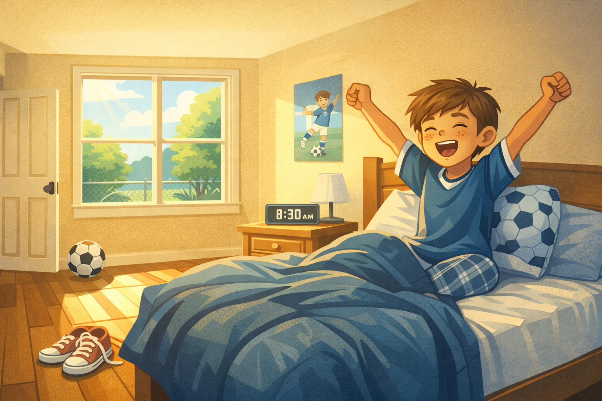
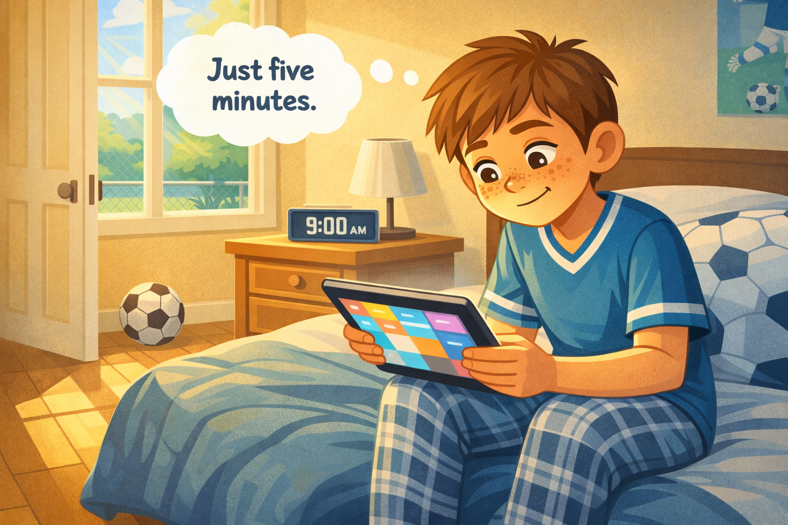
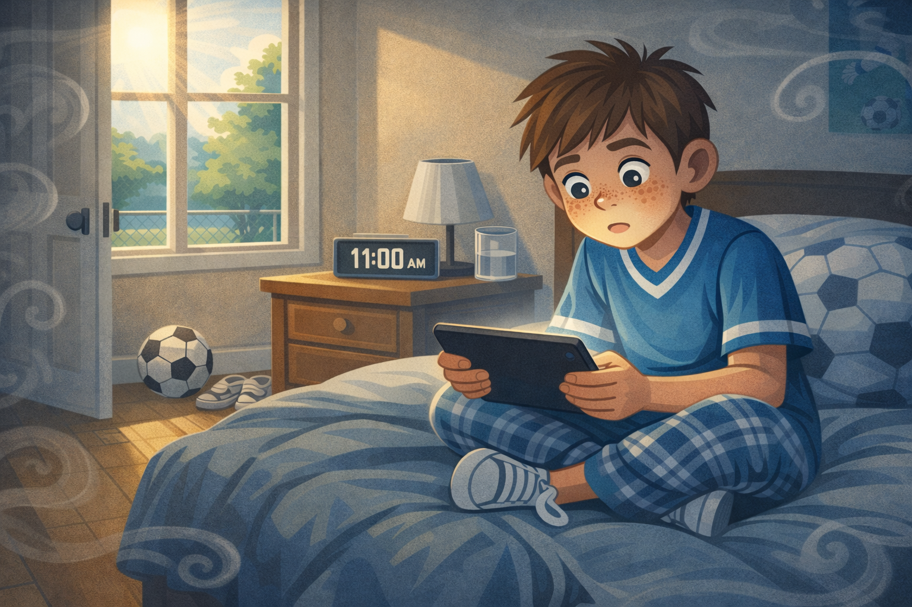
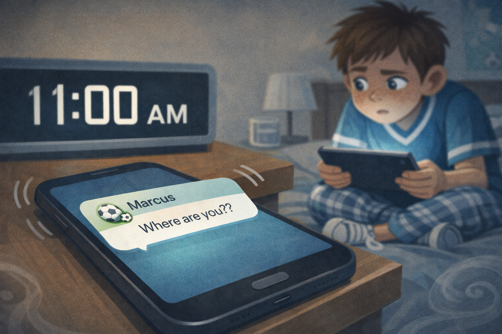
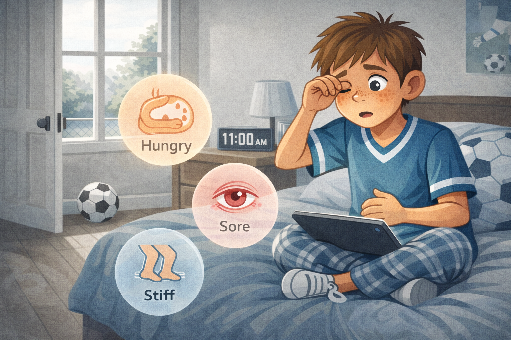
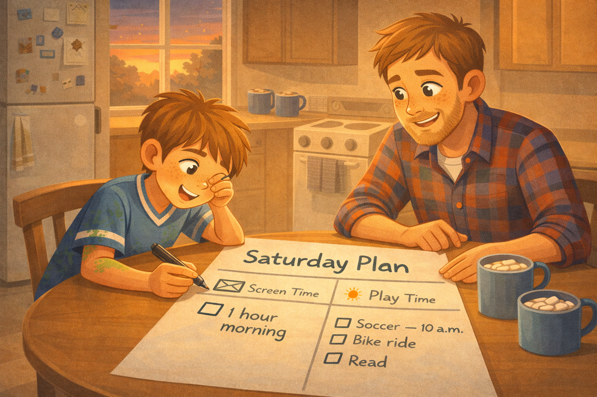

# Leo's Missing Saturday

*A Digital Citizenship mini graphic novel — companion to [Chapter 3: Media Balance and Spotting Imbalance](../../chapters/03-media-balance/index.md)*

Cover Image Prompt

Please generate a new wide-landscape image.
A split-composition image divided diagonally from upper-left to lower-right. On the left side, a bright Saturday morning scene: sunshine pouring through a bedroom window, a soccer ball resting by an open door, green grass visible outside, and a boy's empty sneakers waiting on the floor. On the right side, the same boy — Leo, a fifth-grade student with sandy brown hair, freckles across his nose and cheeks, wearing a blue soccer jersey with white trim, jeans, and white sneakers — sits cross-legged on his bed, hunched forward, face lit by a glowing tablet screen. His eyes are wide and locked on the screen. A clock on his nightstand shows 11:00 a.m.

The diagonal split creates a visual tension between the sunny outdoor world he is missing and the dim, screen-lit world he is stuck in. A faint river-blue (#2e6f8e) glow outlines the border between the two halves.

Across the top of the image, in friendly hand-lettered text the color of river-blue (#2e6f8e), the title: **Leo's Missing Saturday**. Below the title, slightly smaller, the subtitle: *A Digital Citizenship Mini Graphic Novel*.

**Style notes:**

- Modern flat cartoon vector illustration. Friendly, kid-readable lines. No heavy shading.
- Warm, slightly muted color palette with river-blue (#2e6f8e) accents in the title text and the diagonal border glow.
- 16:9 horizontal landscape composition.
- Mood: a gentle tension between two worlds — the one Leo is choosing and the one he is missing.
- No platform names, no real app interfaces, no logos.

Generate the image immediately without asking clarifying questions.

## A Story About Balance

Saturday is supposed to be the best day of the week. No homework. No alarm clock. Just sunshine and friends and whatever you want to do.

But sometimes a screen can swallow a Saturday whole. You sit down for five minutes, and when you look up, two hours are gone. Your body tried to warn you — your eyes stung, your stomach growled, your legs felt restless — but you did not notice.

This is a story about a student named Leo, and the Saturday morning that almost disappeared.

---

## Panel 1 — The Best Day of the Week

Image Prompt

(This is Panel 01. Do not include the panel number in the image.)

Please generate a new wide-landscape image.
A wide establishing shot of a cozy bedroom on a bright Saturday morning. Sunshine streams through a large window, casting warm golden rectangles on the hardwood floor. In the center of the frame, Leo — a fifth-grade boy with sandy brown hair, freckles across his nose and cheeks, wearing pajama pants and a faded blue soccer jersey — sits up in bed with a huge grin, arms stretched wide in a morning yawn. His bed has a rumpled blue comforter and a soccer-ball-patterned pillow.

By the bedroom door, a black-and-white soccer ball rests on the floor next to a pair of white sneakers. A small poster on the wall shows a cartoon soccer player mid-kick. On the nightstand, a digital clock reads 8:30 a.m. Through the window, a green backyard with a chain-link fence, a garden hose, and a neighbor's tree is visible under a clear blue sky.

**Style notes:**

- Modern flat cartoon vector style.
- Warm, sunny palette with river-blue (#2e6f8e) accents in the comforter and poster details.
- 16:9 horizontal landscape.
- Mood: excited, hopeful, full of possibility. The best day of the week is here.
- No text, no logos.

Generate the image immediately without asking clarifying questions.

Leo opens his eyes. Sunshine fills his room. It is Saturday morning — the best morning of the whole week. His soccer ball is by the door. His friends are meeting at the field at ten o'clock. He has plenty of time.

---

## Panel 2 — Just Five Minutes

Image Prompt

(This is Panel 02. Do not include the panel number in the image.)

Please generate a new wide-landscape image.
A medium shot of Leo sitting on the edge of his bed, still in his blue soccer jersey and pajama pants. He holds a tablet in both hands, tilted slightly toward the viewer. The screen shows a colorful, abstract grid of video thumbnails — no real logos, no real app, just bright rectangles suggesting content. Leo's expression is casual and relaxed, one corner of his mouth turned up in a half-smile. His body language says "this will only take a second."

On the nightstand beside him, the digital clock clearly reads 9:00 a.m. The soccer ball is still visible by the door. Sunshine still pours through the window. Everything looks fine — for now.

A small thought bubble floats above Leo's head with the words: **"Just five minutes."**

**Style notes:**

- Modern flat cartoon vector style.
- Warm palette, unchanged from Panel 1 — the world still feels bright and okay.
- 16:9 horizontal landscape.
- Mood: casual, no urgency. The danger is invisible.
- The thought bubble text must be readable at small sizes.
- No logos, no real app interfaces.

Generate the image immediately without asking clarifying questions.

Leo picks up his tablet from the nightstand. "Just five minutes," he thinks. He wants to watch one quick video before he gets dressed. The clock on the nightstand says 9:00 a.m. He has a whole hour before soccer. No rush.

---

## Panel 3 — The Vanishing Hours

Image Prompt

(This is Panel 03. Do not include the panel number in the image.)

Please generate a new wide-landscape image.
A medium-close shot of Leo in exactly the same position on the bed — cross-legged, hunched forward, tablet in both hands, face lit by the screen glow. But everything around him has changed. The sunshine through the window is now higher and harsher. The room feels slightly dimmer because Leo has not moved or turned on a light. His pajama pants are wrinkled. His hair is messy.

The critical detail: the digital clock on the nightstand now reads 11:00 a.m. Two hours have passed.

Leo's eyes are wide and slightly glazed, locked on the screen. His mouth hangs slightly open. His posture is slumped. A half-empty glass of water on the nightstand suggests he grabbed a drink at some point but never got up. The soccer ball by the door has not moved. The sneakers have not moved. Nothing has moved except the clock.

Around the edges of the frame, faint gray wisps curl inward like fog, symbolizing the lost time closing in.

**Style notes:**

- Modern flat cartoon vector style.
- The palette is slightly cooler and more muted than Panels 1 and 2 — the warm Saturday glow is fading.
- 16:9 horizontal landscape.
- Mood: quiet unease. Time is slipping away and Leo does not notice.
- No text, no logos.

Generate the image immediately without asking clarifying questions.

Leo has not moved. Not once. The clock says 11:00 a.m. Two whole hours have passed since he picked up the tablet. He watched one video, then another, then another. Each one ended with something new to tap. He never decided to keep watching. It just kept happening.

---

## Panel 4 — The Buzz

Image Prompt

(This is Panel 04. Do not include the panel number in the image.)

Please generate a new wide-landscape image.
A close-up shot focused on a phone lying on the nightstand next to the clock (which still reads 11:00 a.m.). The phone screen is lit up with a text message notification. The message preview shows a short text from a contact named "Marcus" that reads: **"Where are you??"** with two question marks. A small soccer-ball emoji appears next to the contact name.

In the background, slightly out of focus, Leo is still in the same hunched position on the bed with his tablet. But his head has turned slightly toward the buzzing phone. One eye is visible, glancing sideways at the notification. His expression is the very first flicker of awareness — a tiny crease between his eyebrows.

The phone vibrates visibly — small motion lines radiate from the device on the nightstand.

**Style notes:**

- Modern flat cartoon vector style.
- The phone and notification are the sharpest elements in the frame; Leo is softly blurred in the background.
- 16:9 horizontal landscape.
- Mood: the wake-up call. Reality is knocking.
- The text message must be clearly readable. No real phone brand, no real messaging app interface — just a simple, clean notification bubble.
- No logos.

Generate the image immediately without asking clarifying questions.

His phone buzzes on the nightstand. Leo glances over. A text from his friend Marcus: **"Where are you??"** Leo blinks. Soccer. The field. His friends. They have been waiting for him. His stomach drops.

---

## Panel 5 — The Wake-Up

Image Prompt

(This is Panel 05. Do not include the panel number in the image.)

Please generate a new wide-landscape image.
A medium shot of Leo sitting up straight on the bed, tablet lowered to his lap. His face is the focus — eyes wide with surprise and a little shame, mouth slightly open, one hand pressed against his stomach. His other hand rubs one eye. Around his eyes, faint pink circles suggest eye strain. His sandy brown hair is disheveled.

Three small body-signal icons float around him in soft, translucent bubbles, each with a simple label:

- Near his stomach: a small growling-stomach icon with the word **"Hungry"**
- Near his eyes: a small stinging-eye icon with the word **"Sore"**
- Near his legs: a small restless-legs icon with the word **"Stiff"**

The bedroom is the same, but the warm Saturday glow from Panel 1 is completely gone. The light through the window is flat and midday-neutral. The soccer ball by the door looks lonely.

**Style notes:**

- Modern flat cartoon vector style.
- The body-signal bubbles should be soft pastel colors — not alarming, just noticeable. They represent signals Leo missed.
- 16:9 horizontal landscape.
- Mood: the moment of realization. Not panic, not guilt — just honest surprise.
- Text in the bubbles must be readable at small sizes.
- No logos.

Generate the image immediately without asking clarifying questions.

Leo looks up from the screen. His eyes sting. His stomach is growling — he never ate breakfast. His legs are stiff from sitting so long. His body was sending him signals the whole time. He just was not listening.

"Two hours," he whispers. "I lost two hours."

---

## Panel 6 — Better Late Than Never

Image Prompt

(This is Panel 06. Do not include the panel number in the image.)

Please generate a new wide-landscape image.
A dynamic, energetic shot showing two quick actions. On the left side of the frame, Leo's hand slides the tablet into a dresser drawer — the drawer is half-open, and the tablet screen is going dark as it disappears inside. On the right side of the frame, Leo is in mid-motion pulling on his white sneakers by the front door. He is now fully dressed: blue soccer jersey, jeans, white sneakers being tied. His expression is determined — jaw set, small focused smile. His sandy brown hair is still messy but he does not care.

The soccer ball is tucked under his arm. The front door is half-open, and bright midday sunshine floods in from outside. Through the door, a sidewalk and green grass are visible.

Between the two action moments, a faint dotted arrow suggests the sequence: put the tablet away, then go.

**Style notes:**

- Modern flat cartoon vector style.
- The palette swings back toward warm — the sunshine is returning as Leo makes a choice.
- 16:9 horizontal landscape.
- Mood: energy, determination, hope. He is late, but he is going.
- No text, no logos.

Generate the image immediately without asking clarifying questions.

Leo puts the tablet in the dresser drawer. He does not just set it down on the bed — he puts it away, where he cannot see the screen. Then he pulls on his sneakers, grabs his soccer ball, and runs out the door. He is late. But he is going.

---

## Panel 7 — The Saturday Plan

Image Prompt

(This is Panel 07. Do not include the panel number in the image.)

Please generate a new wide-landscape image.
A warm evening scene at a kitchen table. Leo — sandy brown hair, freckles, blue soccer jersey now a little grass-stained — sits at a round wooden table across from his dad. His dad is a tall man with sandy brown hair like Leo's, a short beard, kind eyes, and a flannel shirt with rolled-up sleeves. Between them on the table is a sheet of paper and a marker.

The paper is visible to the viewer and shows a simple hand-drawn schedule titled **"Saturday Plan"** in kid handwriting. The schedule has two columns. The left column, labeled with a small tablet icon, says **"Screen Time"** and lists "1 hour morning." The right column, labeled with a small sun icon, says **"Play Time"** and lists "Soccer — 10 a.m." and "Bike ride" and "Read." Checkboxes appear next to each item.

Leo is leaning forward, marker in hand, adding an item to the list. His expression is engaged and happy — not punished. His dad is smiling, one hand resting on the table, body language open and supportive.

Behind them, a kitchen window shows a dusky purple-orange sunset. On the counter, two mugs of hot cocoa with marshmallows sit waiting. The kitchen is warm, lived-in, and cozy — magnets on the fridge, a dish towel draped over the oven handle.

**Style notes:**

- Modern flat cartoon vector style.
- Warm, golden-hour palette. River-blue (#2e6f8e) accents in the mug color and the "Saturday Plan" title.
- 16:9 horizontal landscape.
- Mood: warm, collaborative, hopeful. This is not a punishment — it is a plan they are building together.
- The "Saturday Plan" text must be readable at small sizes.
- No logos.

Generate the image immediately without asking clarifying questions.

That evening, Leo and his dad sit at the kitchen table. They make a plan together. Leo writes it on a piece of paper: **Saturday Plan**. One column says "Screen Time" — one hour in the morning. The other column says "Play Time" — soccer, bike rides, reading. He puts checkboxes next to each one.

"It is not about zero screens," his dad says. "It is about making room for everything."

Leo nods. He does not want to lose another Saturday.

---

## What Leo Teaches Us

Leo is not a screen addict. He is a regular kid who sat down for five minutes and lost two hours. It happens to everyone. What made Leo a digital citizen was noticing what happened, listening to his body, and making a plan so it would not happen again.

| Moment | What Leo did | What we can learn |
|---|---|---|
| The morning | He told himself "just five minutes" | Five minutes can become two hours if you do not set a limit |
| The vanishing hours | He did not decide to keep watching — it just happened | Autoplay and "next video" features are designed to keep you watching |
| The buzz | He saw his friend's text and realized what he missed | Real friends and real fun are waiting outside the screen |
| The wake-up | He noticed his body signals — sore eyes, growling stomach, stiff legs | Your body sends you warnings when screen time is out of balance |
| The tablet in the drawer | He put the device out of sight, not just out of hand | Moving the screen away from you is a real strategy that works |
| The Saturday plan | He and his dad built a schedule together | A plan is not a punishment — it is a tool you build for yourself |

## You Can Do This Too

Leo's Saturday did not have to be ruined. He caught it in time, and he made a plan. You can do the same thing.

Try this: next time you pick up a device, set a timer before you start. When the timer goes off, check in with your body. Are your eyes tired? Is your stomach empty? Do your legs want to move? Those are real signals, and they are worth listening to.

If screen time ever feels like it is pulling you away from the things you love — sports, friends, family, being outside — talk to a trusted adult. A parent, a guardian, or a teacher can help you build a plan that works for you. You are not in trouble for asking. You are being smart.

## Related Reading

- [Chapter 3: Media Balance and Spotting Imbalance](../../chapters/03-media-balance/index.md) — the chapter this story belongs to. Defines *media balance*, the Heart-Brain-Body framework, and how to spot when your tech use is out of balance.
- [Chapter 4: Building Healthy Tech Habits](../../chapters/04-healthy-tech-habits/index.md) — the next chapter, which teaches you how to build habits like Leo's Saturday Plan.
