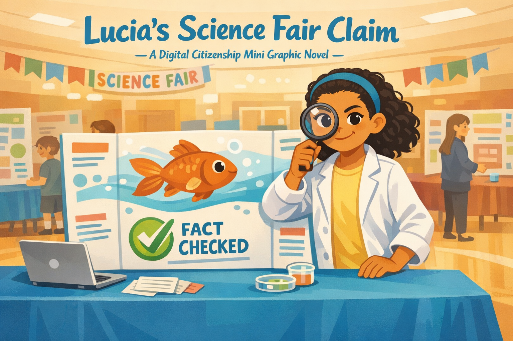
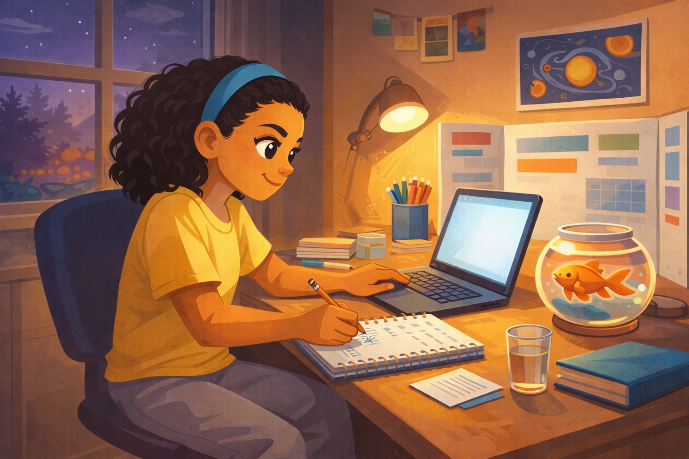
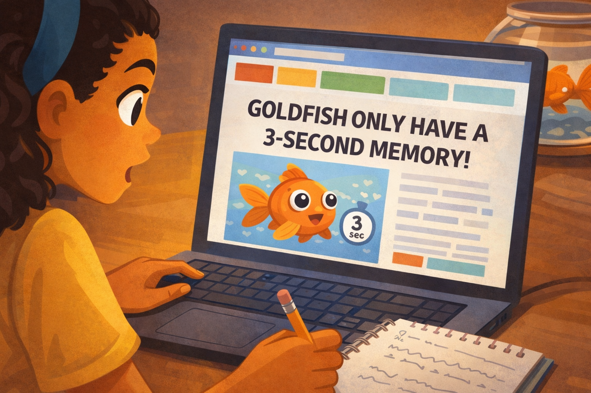
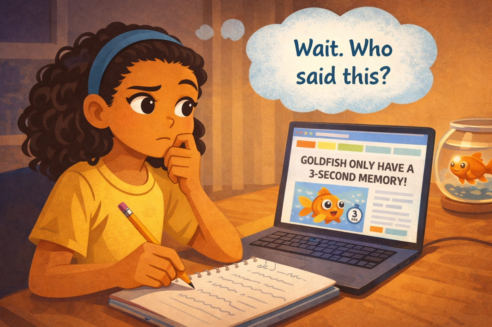
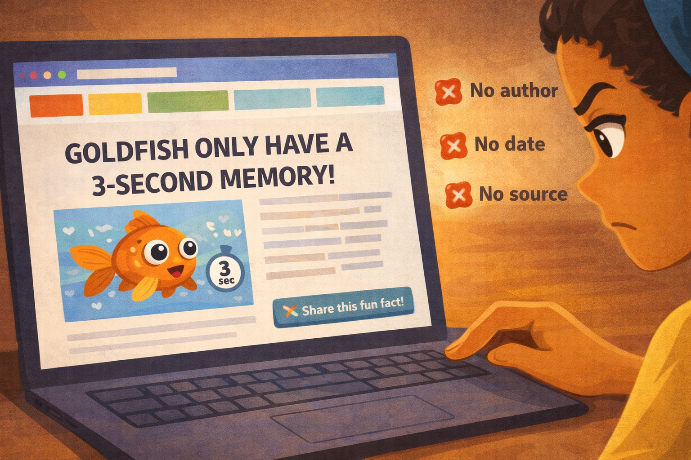
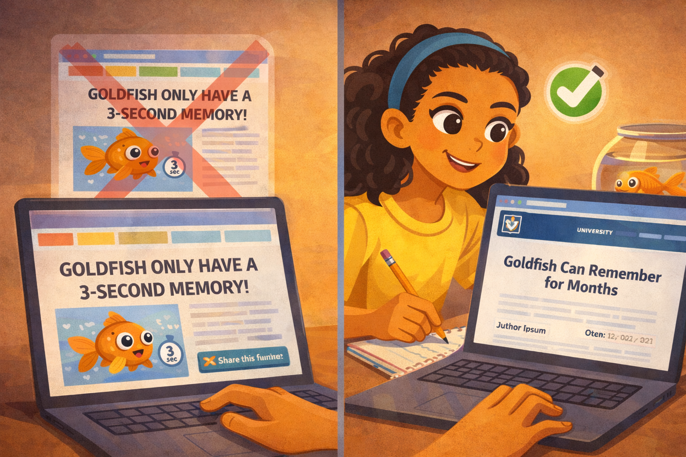
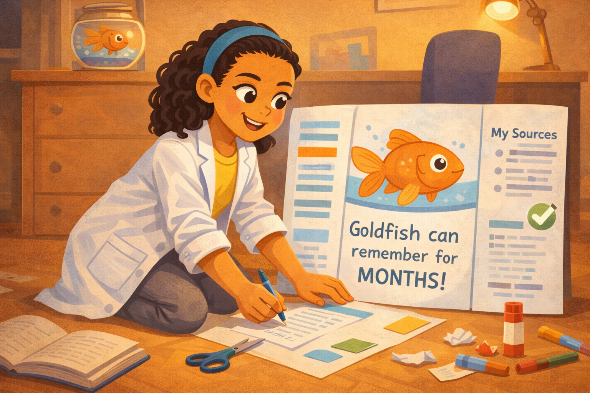
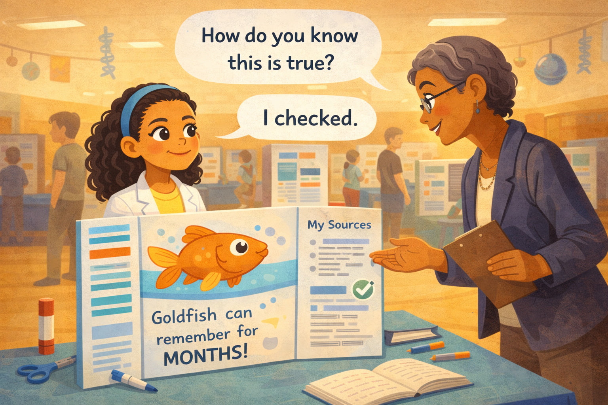

# Lucia's Science Fair Claim

*A Digital Citizenship mini graphic novel — companion to [Chapter 14: Becoming a Fact Checker](../../chapters/14-becoming-a-fact-checker/index.md)*

Cover Image Prompt

Please generate a new wide-landscape image.
A dynamic, kid-friendly composition centered on a fifth-grade girl standing behind a science fair poster board. The girl is Lucia — olive skin, dark curly hair pulled back with a river-blue (#2e6f8e) headband, wearing a white lab coat over a soft yellow t-shirt. She stands confidently with one hand resting on the poster and the other holding a magnifying glass up near her eye, peering through it with a determined, curious expression.

The poster board is tri-fold, standing on a table covered with a plain blue cloth. On the poster, a large cartoon goldfish swims across the center panel. Below the goldfish, a bold checkmark icon and the words "FACT CHECKED" are visible in clean hand-lettered text. A few index cards and a small laptop sit on the table beside the poster.

Behind Lucia, a school gymnasium is set up for a science fair: other poster boards on tables stretch into the background, colorful but slightly out of focus. A few students and a teacher browse the other displays. Overhead, a banner reads "SCIENCE FAIR" in bright block letters. Warm overhead lighting fills the scene.

Across the top of the image, in friendly hand-lettered text the color of river-blue (#2e6f8e), the title: **Lucia's Science Fair Claim**. Below the title, slightly smaller, the subtitle: *A Digital Citizenship Mini Graphic Novel*.

**Style notes:**

- Modern flat cartoon vector illustration. Friendly, kid-readable lines. No heavy shading.
- Warm, slightly muted color palette with river-blue (#2e6f8e) accents in the headband, title text, and poster details.
- 16:9 horizontal landscape composition.
- Mood: confident, curious, proud. This is the moment after the hard work paid off.
- No platform names, no real app interfaces, no logos.

Generate the image immediately without asking clarifying questions.

## A Story About Checking Before You Trust

Have you ever heard a fact that sounded so interesting you wanted to use it right away? Maybe someone told you dolphins sleep with one eye open. Or that humans only use ten percent of their brains. Fun facts like these are everywhere online. But here is the tricky part: not all of them are true.

A real **fact checker** does not just ask, "Is this interesting?" A fact checker asks, "Who said this? When did they say it? What is their evidence?" Those three questions can save you from spreading something false.

This is a story about a student named Lucia and the science fair claim she almost got wrong.

---

## Panel 1 — Research Night

Image Prompt

(This is Panel 01. Do not include the panel number in the image.)

Please generate a new wide-landscape image.
A warm interior scene of a bedroom desk at evening. Lucia — a fifth-grade girl with olive skin, dark curly hair pulled back with a river-blue (#2e6f8e) headband, wearing a soft yellow t-shirt and gray sweatpants — sits in a desk chair, leaning forward toward a laptop screen. Her face is lit by the screen's soft glow, expression focused and eager. One hand rests on the keyboard, the other holds a pencil hovering over an open spiral notebook filled with messy handwritten notes.

The desk is covered with science fair supplies: a half-finished tri-fold poster board leaning against the wall behind her, a stack of index cards, colored markers in a cup, a glass of water, and a small goldfish in a round fishbowl sitting at the corner of the desk. The fishbowl catches the light warmly. On the wall above the desk, a small poster of the solar system and a few photos pinned to a corkboard.

Through a window on the left, the sky is dusky purple-blue with a few early stars. A desk lamp with a warm yellow bulb provides additional light.

**Style notes:**

- Modern flat cartoon vector style.
- Warm, cozy palette — soft yellows, warm browns, river-blue accents in the headband and notebook cover.
- 16:9 horizontal landscape.
- Mood: focused, cozy, the quiet excitement of starting a project.
- No text on the laptop screen, no logos, no brand names.

Generate the image immediately without asking clarifying questions.

Lucia has been looking forward to science fair week all month. She loves experiments. Tonight, she is at her desk, researching animal memory for her project. Her goldfish, Boba, swims slow circles in his bowl beside her laptop. Lucia opens a new search and starts reading.

---

## Panel 2 — The Fun Fact

Image Prompt

(This is Panel 02. Do not include the panel number in the image.)

Please generate a new wide-landscape image.
A close-up over-the-shoulder shot showing Lucia's laptop screen. The screen displays a generic website with a simple layout: a large bold headline reads "GOLDFISH ONLY HAVE A 3-SECOND MEMORY!" in dark text on a white background. Below the headline, a cartoonish clipart goldfish with exaggerated wide eyes swims next to a small clock icon showing "3 sec." The website has a generic colored banner at the top (no real brand, no logo, no URL visible) and a sidebar with blurry placeholder text blocks.

Lucia's shoulder and the side of her face are visible in the left foreground. Her expression is excited — eyebrows raised, mouth forming a small surprised "oh!" shape. Her pencil is already moving toward her notebook, ready to write the fact down. The goldfish bowl with Boba is visible just past the laptop, slightly out of focus.

**Style notes:**

- Modern flat cartoon vector style.
- The website on screen should look generic and slightly flashy — bright colors, big text, clipart-style image. It should feel fun but not credible.
- 16:9 horizontal landscape.
- Mood: excited discovery — she thinks she found a great fact.
- No real website names, no real URLs, no logos.

Generate the image immediately without asking clarifying questions.

One website catches her eye. In big bold letters, it says: "Goldfish only have a 3-second memory!" There is a cartoon fish and a tiny clock. It looks official enough. Lucia's eyes light up. "That's perfect for my poster!" she thinks. She picks up her pencil.

---

## Panel 3 — Wait. Who Said This?

Image Prompt

(This is Panel 03. Do not include the panel number in the image.)

Please generate a new wide-landscape image.
A medium shot of Lucia at her desk, pencil frozen mid-air just above her open notebook. Her hand has stopped writing. Her expression has shifted from excited to uncertain — one eyebrow is raised, her lips are slightly pursed, and her head is tilted to the side in a classic "hmm" thinking pose. A small pale-blue thought wisp curls above her head.

Above her, a clean thought bubble contains the words: **"Wait. Who said this?"** in friendly hand-lettered text.

The laptop screen is still visible in the background, showing the same flashy website. The goldfish bowl glows warmly on the desk. The notebook page shows a half-written line that trails off — she stopped mid-word.

**Style notes:**

- Modern flat cartoon vector style.
- Warm palette with river-blue thought bubble accent.
- 16:9 horizontal landscape.
- Mood: the pause moment — curiosity replacing excitement.
- The thought bubble text must be readable at small sizes.
- No logos, no real website names.

Generate the image immediately without asking clarifying questions.

But then her pencil stops. Something her teacher said floats into her mind: "Before you use a fact, ask — who said it?" Lucia looks at the screen again. She tilts her head. "Wait," she thinks. "Who actually said this?"

---

## Panel 4 — No Author. No Date. No Study.

Image Prompt

(This is Panel 04. Do not include the panel number in the image.)

Please generate a new wide-landscape image.
A close-up of the laptop screen, now shown more fully. Lucia's fingers are visible on the trackpad, scrolling down the page. The website is revealed to be thin — the page ends quickly after the bold headline. Where an author name should be, there is nothing. Where a date should be, there is nothing. Where a linked source or study should be, there is only a generic "Share this fun fact!" button with a colorful arrow icon.

Three small red "X" marks float beside the screen in the air, each next to a short label in clean text: **No author**, **No date**, **No source**. The red X marks are simple and flat, not scary — more like checklist items that failed.

Lucia's face is partially visible at the edge of the frame, her expression now skeptical — eyes narrowed slightly, mouth flat.

**Style notes:**

- Modern flat cartoon vector style.
- The three red X marks should be visually clear and balanced — they are the teaching moment of the panel.
- 16:9 horizontal landscape.
- Mood: realization — the fun fact is starting to look less trustworthy.
- No real website names, no real URLs, no logos.

Generate the image immediately without asking clarifying questions.

Lucia scrolls down the page. There is no author name. There is no date. There is no link to a study or an experiment. The only thing at the bottom is a "Share this fun fact!" button. Three missing pieces: no author, no date, no source. That is not a good sign.

---

## Panel 5 — The Real Answer

Image Prompt

(This is Panel 05. Do not include the panel number in the image.)

Please generate a new wide-landscape image.
A split-screen composition. On the left half, the original flashy website is shown small and slightly faded, with the bold "3-SECOND MEMORY" headline and the cartoonish clipart fish. A translucent red "X" overlays it lightly.

On the right half, a new website is shown on the laptop screen — this one looks cleaner and more credible: a simple layout with a university crest at the top (generic, no real university name), a calm blue-and-white color scheme, a headline that reads "Goldfish Can Remember for Months," and below it a small paragraph of placeholder text with a visible author name line and a date line. A small green checkmark floats beside this screen.

Lucia is visible between the two halves, seated at her desk, leaning toward the right-side screen with wide eyes and a growing smile. Her pencil is poised over her notebook again, ready to write the corrected fact. Boba the goldfish swims in his bowl nearby, as if proving the point.

**Style notes:**

- Modern flat cartoon vector style.
- The visual contrast between the two websites is the teaching moment: flashy vs. credible.
- 16:9 horizontal landscape.
- Mood: discovery and relief — she found the real answer.
- No real university names, no real URLs, no logos.

Generate the image immediately without asking clarifying questions.

Lucia tries a different search. This time she finds a page from a university research lab. It has an author's name, a date, and a link to the actual experiment. The study found that goldfish can remember things for months — not three seconds. Lucia's eyes go wide. "Boba, you're smarter than the internet thinks!" she whispers to her fish.

---

## Panel 6 — The Updated Poster

Image Prompt

(This is Panel 06. Do not include the panel number in the image.)

Please generate a new wide-landscape image.
A warm, bright scene of Lucia kneeling on the floor of her bedroom, working on her tri-fold science fair poster board spread out in front of her. She is wearing her white lab coat over her yellow t-shirt now, sleeves rolled up, looking focused and happy. One hand holds a blue marker, the other smooths down a freshly glued index card on the poster.

The poster is visible in detail: the center panel shows a large, friendly illustration of a goldfish (hand-drawn by Lucia in marker). Below the fish, neat handwriting reads: "Goldfish can remember for MONTHS!" On the right panel, a section labeled "My Sources" lists two entries with small bullet points (text too small to read fully, but the structure is clear — author, title, date format). A green checkmark sticker is placed next to the sources section.

On the floor around her: scissors, glue stick, colored markers, crumpled paper scraps, and her open notebook. The fishbowl with Boba sits on the desk above her. The desk lamp casts warm light over the scene.

**Style notes:**

- Modern flat cartoon vector style.
- Warm, cozy palette with river-blue accents in the marker she holds and the poster details.
- 16:9 horizontal landscape.
- Mood: productive pride — she is building something she can stand behind.
- No logos, no real brand names.

Generate the image immediately without asking clarifying questions.

Lucia erases the old claim from her poster. In its place, she writes the real fact: "Goldfish can remember things for months!" Below it, she adds a new section she has never put on a poster before: "My Sources." She writes down the author's name, the title of the study, and the date. It feels good to know her fact is solid.

---

## Panel 7 — "How Do You Know?"

Image Prompt

(This is Panel 07. Do not include the panel number in the image.)

Please generate a new wide-landscape image.
A bright gymnasium scene during the science fair. Lucia stands behind her completed tri-fold poster board on a table, wearing her white lab coat, river-blue headband, and a calm, confident smile. Across the table from her, a female judge — a tall woman with short gray hair, dark brown skin, reading glasses on a chain around her neck, wearing a blazer and holding a clipboard — leans forward slightly, one hand gesturing toward the poster. The judge's expression is curious and impressed, eyebrows raised, a small smile forming.

A clean word balloon from the judge reads: **"How do you know this is true?"**

A second word balloon from Lucia reads: **"I checked."**

Behind them, the gymnasium buzzes with activity: other students stand at their own poster boards, parents and teachers walk between tables, and colorful displays stretch into the background. Overhead fluorescent lights and a few hanging science-themed decorations (paper planets, DNA helixes) fill the upper part of the frame.

**Style notes:**

- Modern flat cartoon vector style.
- Warm, bright palette with river-blue accents in Lucia's headband and poster details.
- 16:9 horizontal landscape.
- Mood: quiet triumph. Lucia is confident because she did the work.
- Both word balloons must be readable at small sizes.
- No logos, no real brand names.

Generate the image immediately without asking clarifying questions.

Science fair day arrives. Lucia stands behind her poster in the gymnasium. A judge walks up and studies the goldfish section. She looks at the sources list, then back at Lucia. "How do you know this is true?" the judge asks. Lucia does not hesitate. She smiles and says, "I checked."

---

## What Lucia Teaches Us

Lucia almost put a false claim on her science fair poster. The fact sounded fun and interesting. The website looked okay at first glance. But when she slowed down and asked three simple questions, the truth came out.

| Moment | What Lucia did | What we can learn |
|---|---|---|
| The exciting find | She found a fun-sounding fact and wanted to use it right away | Excitement can make us skip important steps |
| The pause | She stopped her pencil and asked, "Who said this?" | One question can change everything |
| The red flags | She noticed: no author, no date, no source | Missing information is a warning sign |
| The deeper search | She looked for a better source and found a real study | Good information is worth the extra effort |
| The updated poster | She wrote the real fact and cited her source | Citing sources makes your work stronger |
| The judge's question | She answered with confidence: "I checked" | Doing the work gives you real confidence |

## You Can Do This Too

You do not need to be a scientist to be a fact checker. Every time you read something online, you can ask the same three questions Lucia asked: Who said this? When did they say it? What is their evidence?

If the answers are missing, that does not mean the claim is definitely wrong. But it does mean you should keep looking before you trust it — and definitely before you share it with others.

The best fact checkers are not the people who know the most facts. They are the people who know how to check.

## Related Reading

- [Chapter 14: Becoming a Fact Checker](../../chapters/14-becoming-a-fact-checker/index.md) — the chapter this story belongs to. Teaches the fact-checker workflow: who said it, when, and what is the evidence.
- [Chapter 13: What Is Misinformation?](../../chapters/13-what-is-misinformation/index.md) — explains why false claims spread so easily and how to spot them before they fool you.
