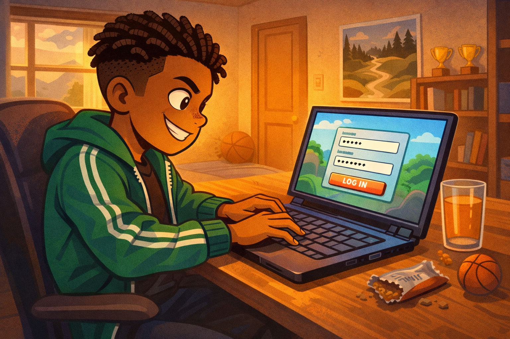
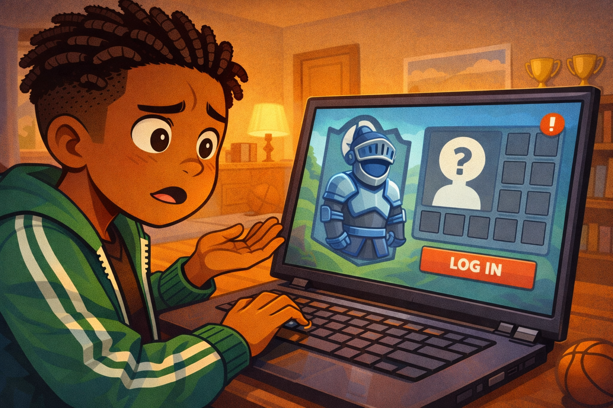
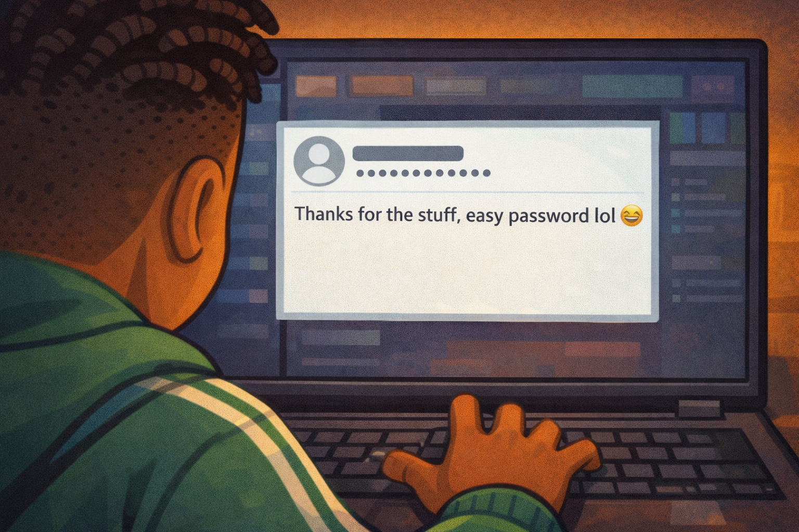
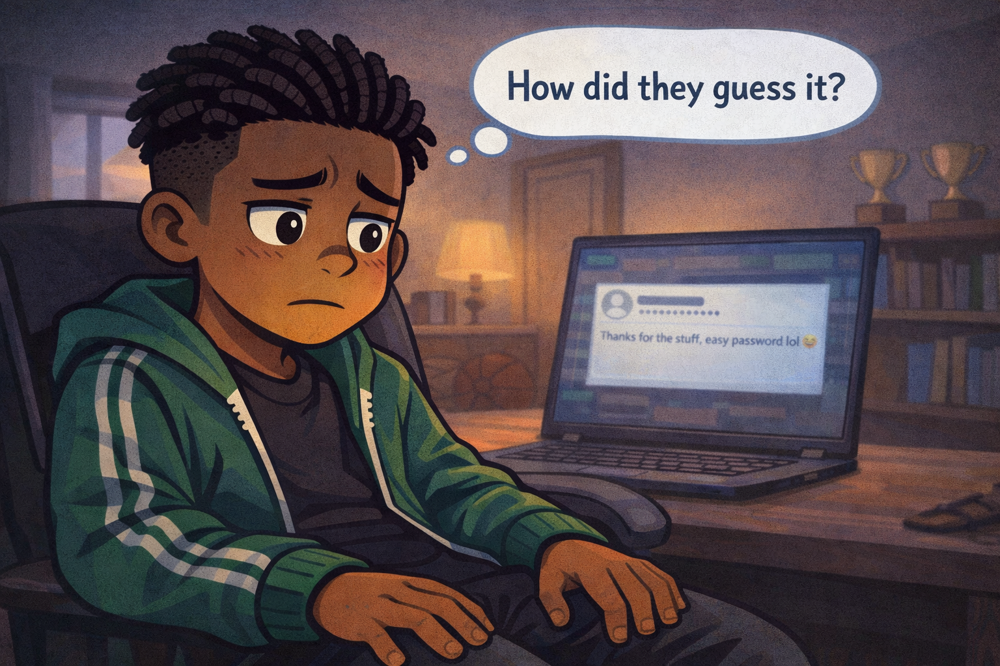
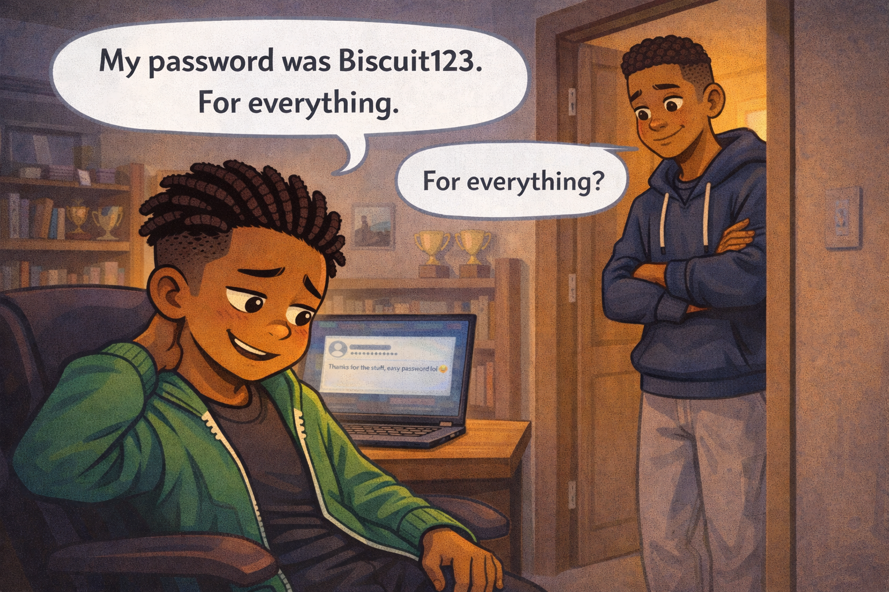
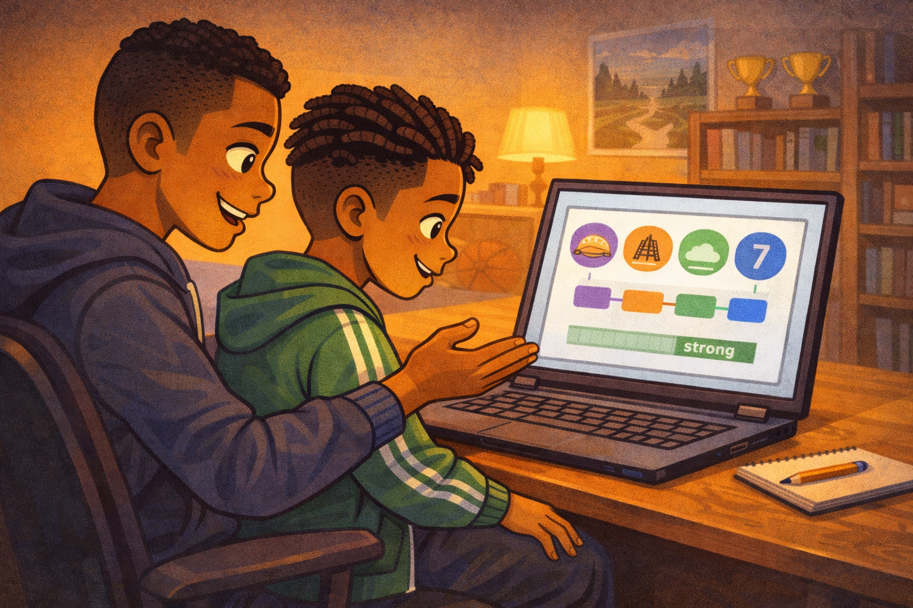
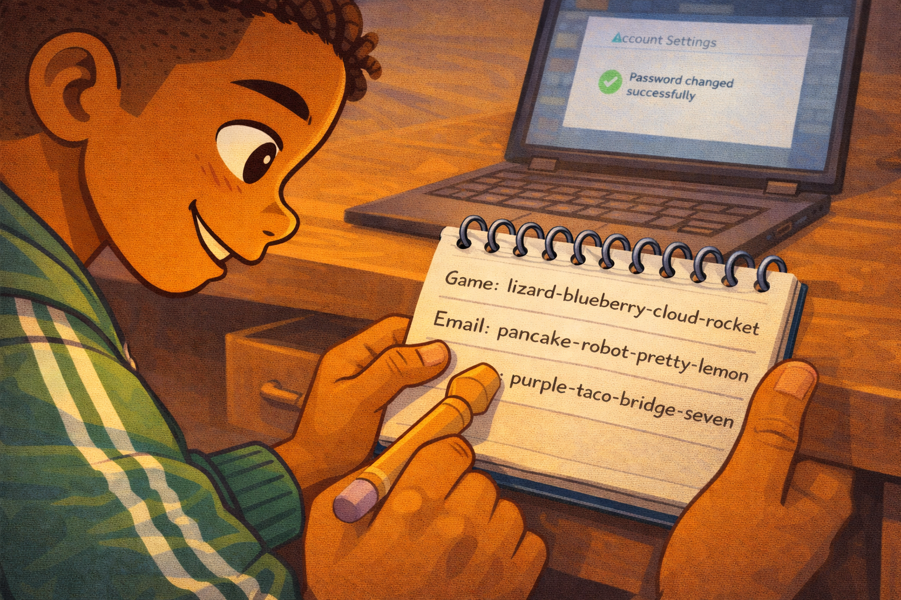

# Marcus and the Guessable Password

*A Digital Citizenship mini graphic novel — companion to [Chapter 6: Passwords, Clickbait, and Online Safety](../../chapters/06-passwords-and-online-safety/index.md)*

Cover Image Prompt

Please generate a new wide-landscape image.
A dramatic, warm close-up composition. In the center of the frame, a fifth-grade boy sits at a desk, leaning forward toward a laptop screen with a stunned expression. The boy is Marcus — medium brown skin, short twists in his hair, wearing a green track jacket with white stripes over a dark t-shirt, dark joggers, and white sneakers. His mouth is slightly open, eyebrows raised, eyes wide at the screen. One hand rests on the keyboard, frozen mid-type.

The laptop screen glows with a soft orange-red warning color — no specific text or interface visible, just the feeling of something wrong. Behind Marcus, his bedroom is cozy and lived-in: a bookshelf with a few trophies, a basketball on the floor, a poster of a mountain landscape on the wall, and warm lamplight casting golden shadows.

On the desk beside the laptop, a small spiral notebook lies open with a pencil resting on it — a hint of the solution that comes later. A soft river-blue (#2e6f8e) glow outlines the notebook, drawing the eye.

Across the top of the image, in friendly hand-lettered text the color of river-blue (#2e6f8e), the title: **Marcus and the Guessable Password**. Below the title, slightly smaller, the subtitle: *A Digital Citizenship Mini Graphic Novel*.

**Style notes:**

- Modern flat cartoon vector illustration. Friendly, kid-readable lines. No heavy shading.
- Warm, slightly muted color palette with river-blue (#2e6f8e) accents in the title text and notebook glow.
- 16:9 horizontal landscape composition.
- Mood: the moment of discovery — something has gone wrong, but the story is hopeful.
- No platform names, no real app interfaces, no logos.

Generate the image immediately without asking clarifying questions.

## A Story About Locked Doors

Think about the front door of your home. You lock it when you leave. You lock it when you go to bed. You would never tape the key to the outside of the door with a sign that says "HERE IS MY KEY."

But that is exactly what a weak password is. It is a key taped to the door. And someone will try it.

This is a story about Marcus, and the day he learned that his favorite password was no password at all.

---

## Panel 1 — Fast Fingers

Image Prompt

(This is Panel 01. Do not include the panel number in the image.)

Please generate a new wide-landscape image.
A medium shot of Marcus sitting at a desk in his bedroom, typing rapidly on a laptop keyboard with a confident, competitive grin. Marcus has medium brown skin, short twists in his hair, and wears a green track jacket with white stripes and dark joggers. His fingers blur slightly over the keys to show speed. The laptop screen shows a colorful but generic game login screen — a simple username field and password field with dots, a large "LOG IN" button, no real game logos or names.

On the desk beside him: a glass of juice, a crumpled granola bar wrapper, and a small basketball stress ball. Behind him, his bedroom wall has a poster of a mountain trail, a bookshelf with three small trophies, and a basketball sitting on the floor near the door. Warm late-afternoon light comes through a window on the left, casting golden tones across the scene.

**Style notes:**

- Modern flat cartoon vector style.
- Warm, slightly muted palette with river-blue (#2e6f8e) accents in the laptop screen border and jacket details.
- 16:9 horizontal landscape.
- Mood: confident, fast, routine. Marcus has done this a thousand times.
- No text bubbles, no logos, no real game interfaces.

Generate the image immediately without asking clarifying questions.

Marcus drops his backpack and opens his laptop. He types his password without even looking at the keys. He has typed it so many times his fingers just know. *B-i-s-c-u-i-t-1-2-3.* Named after his dog. Easy to remember. Easy to type.

Too easy.

---

## Panel 2 — Something Is Wrong

Image Prompt

(This is Panel 02. Do not include the panel number in the image.)

Please generate a new wide-landscape image.
A close-up shot of Marcus staring at the laptop screen, his confident grin now replaced by confusion. His eyebrows are pulling together, his head is tilted slightly to one side, and his mouth is partly open. One hand is still on the keyboard, the other is raised slightly in a "what?" gesture.

The laptop screen shows a generic game character select screen. Where Marcus's avatar used to be — a tall knight in blue armor — there is now a default gray silhouette with a question mark. Beside the avatar, where an inventory panel would be, the slots are empty — small gray squares in a grid, all blank. A small red exclamation icon sits in the corner of the screen.

Marcus's bedroom background continues from Panel 1: bookshelf, trophies, warm lamplight, basketball on the floor.

**Style notes:**

- Modern flat cartoon vector style.
- The screen should clearly communicate "something is missing" without any real game interface or text beyond simple icons.
- 16:9 horizontal landscape.
- Mood: confusion, the first hint that something is wrong.
- No logos, no platform names.

Generate the image immediately without asking clarifying questions.

The game loads, but something looks different. Marcus blinks. His avatar — the knight he spent weeks building — is wearing the default gray outfit. His inventory is empty. Every item he earned, every upgrade he unlocked, every rare piece of gear — gone.

His stomach tightens. "What happened?"

---

## Panel 3 — The Message

Image Prompt

(This is Panel 03. Do not include the panel number in the image.)

Please generate a new wide-landscape image.
An over-the-shoulder close-up showing the laptop screen between Marcus's shoulders. Marcus's short twists and green track jacket are visible in silhouette at the bottom and sides of the frame. His shoulders are tense, pulled slightly upward.

The laptop screen shows a generic in-game message inbox — a simple white rectangle with a single message displayed. The message is from a blank default avatar (gray circle icon) with a generic username shown as a string of random characters. The message text reads: **"Thanks for the stuff, easy password lol"** in a simple chat font. A small laughing-face emoji sits at the end of the message — a simple yellow circle with squinted eyes.

The rest of the screen is dark with soft generic game UI elements — no real game logos, no brand names, just abstract colored bars and icons.

**Style notes:**

- Modern flat cartoon vector style.
- The message text must be clearly readable at small sizes.
- 16:9 horizontal landscape.
- Mood: a gut punch. The moment Marcus realizes this was not a glitch — someone did this on purpose.
- No real game names, no logos, no real app interfaces.

Generate the image immediately without asking clarifying questions.

A message sits in his inbox. It is from a username he does not recognize. The message says: "Thanks for the stuff, easy password lol."

Marcus reads it twice. Someone got into his account. Someone took everything. And they are laughing about it.

---

## Panel 4 — The Sinking Feeling

Image Prompt

(This is Panel 04. Do not include the panel number in the image.)

Please generate a new wide-landscape image.
A close-up of Marcus from chest up, leaning back in his desk chair. His hands are off the keyboard now, resting on his thighs. His green track jacket is unzipped. His face is the focus: eyes wide, mouth pressed into a tight line, expression showing that slow sinking feeling when you realize something bad is your own fault. His gaze is directed slightly downward and to the side — not at the screen anymore, but inward.

Above his head, a single clean thought bubble contains the words: **"How did they guess it?"** in simple, kid-readable text.

The laptop screen behind him is slightly out of focus, still showing the cruel message. The warm bedroom light now feels a little dimmer — the lamplight has shifted to a cooler tone to match the emotional shift. The basketball on the floor and the trophies on the shelf are still visible, grounding the scene in Marcus's world.

**Style notes:**

- Modern flat cartoon vector style.
- Warm palette cooling slightly — the golden tones from Panel 1 are muted now.
- 16:9 horizontal landscape.
- Mood: the pit in the stomach. Not panic, but the slow realization that this was avoidable.
- The thought bubble text must be readable.
- No logos.

Generate the image immediately without asking clarifying questions.

Marcus leans back in his chair. He is not angry yet. He is just stunned. His brain keeps asking one question: *How did they guess it?*

Then a worse thought arrives. He used the same password for everything. His game. His email. His school account. If someone guessed it once, they could get into all of them.

---

## Panel 5 — Big Brother

Image Prompt

(This is Panel 05. Do not include the panel number in the image.)

Please generate a new wide-landscape image.
A medium two-shot of Marcus and his older brother in Marcus's bedroom doorway. Marcus is seated at the desk, turned around in his chair to face the door. His expression is embarrassed — eyes looking down, one hand rubbing the back of his neck, a sheepish half-smile. His older brother stands in the doorway leaning against the frame — a teenager, taller, same medium brown skin, short fade haircut, wearing a navy blue hoodie and gray sweatpants, arms loosely crossed, expression calm and a little amused but not mean.

A clean word balloon from Marcus reads: **"My password was Biscuit123. For everything."**

A smaller word balloon from the brother reads: **"For everything?"** with slightly raised eyebrows.

The bedroom is visible behind Marcus: laptop on the desk with the screen still glowing, bookshelf, basketball, trophies. The hallway is visible behind the brother, with warm house lighting.

**Style notes:**

- Modern flat cartoon vector style.
- Warm palette returning slightly — the brother's arrival brings a sense of safety.
- 16:9 horizontal landscape.
- Mood: embarrassment mixed with relief. Marcus is admitting the mistake, and the brother is safe to tell.
- Word balloons must be readable at small sizes.
- No logos.

Generate the image immediately without asking clarifying questions.

Marcus's older brother hears him groan and pokes his head in the door. "What happened?"

Marcus tells him the whole thing. The missing gear. The mocking message. And then the hardest part to say out loud: "My password was Biscuit123. For everything."

His brother's eyebrows go up. "For *everything*?"

Marcus nods. He already knows.

---

## Panel 6 — Building a Better Key

Image Prompt

(This is Panel 06. Do not include the panel number in the image.)

Please generate a new wide-landscape image.
A warm, instructional medium shot of Marcus and his brother sitting side by side at the desk. The brother has pulled up a folding chair and is gesturing toward the laptop screen with one hand, explaining something. Marcus is leaning forward, engaged, his embarrassment replaced by focus and interest.

The laptop screen shows a simple, clean diagram — not a real website, just an illustrated concept. Four colorful word blocks are arranged in a row, connected by hyphens: a purple block, an orange block, a green block, and a blue block. Each block has a simple icon above it: a taco, a bridge, a cloud, and a number seven. Below the word blocks, a simple green strength meter bar is filled almost to the end, indicating "strong."

On the desk beside the laptop, the small spiral notebook from the cover is now open, with a pencil beside it. Marcus's hand rests near the notebook, ready to write.

**Style notes:**

- Modern flat cartoon vector style.
- Warm, encouraging palette — golden tones return fully. River-blue (#2e6f8e) accents in the strength meter and word blocks.
- 16:9 horizontal landscape.
- Mood: learning, hope, rebuilding. The brother is a patient teacher, Marcus is an eager learner.
- The diagram on the screen should be simple and readable, like a textbook illustration, not a real app.
- No logos, no real website interfaces.

Generate the image immediately without asking clarifying questions.

His brother sits down and pulls up the chair. "Here's the trick," he says. "Don't use a password. Use a *passphrase*. Pick four random words that have nothing to do with each other. String them together. Make it long, make it weird, and make it different for every account."

Marcus watches as his brother types an example on the screen. Four silly words in a row, separated by hyphens. The password strength meter climbs all the way to green.

"That's it?" Marcus says.

"That's it. Length beats tricks. And nobody can guess four random words."

---

## Panel 7 — The Notebook

Image Prompt

(This is Panel 07. Do not include the panel number in the image.)

Please generate a new wide-landscape image.
A close-up shot of Marcus writing in the small spiral notebook at his desk. His hand holds a pencil, and we can see him writing neatly in the notebook. The visible text on the page shows a short list: three lines, each with a label on the left (like "Game:" and "Email:") followed by a string of four random words separated by hyphens. The words are whimsical and clearly unrelated — the bottom entry reads: **"purple-taco-bridge-seven"**.

Marcus's face is visible in the upper portion of the frame. He has a small, proud grin — his competitive spirit has returned, but now it is directed at building something strong instead of rushing through it. His green track jacket sleeve is pushed up to his elbow as he writes.

The desk drawer beside him is pulled open, ready to receive the notebook. The laptop screen in the background is slightly out of focus, showing a generic account settings page with a green checkmark — the password has been changed successfully.

**Style notes:**

- Modern flat cartoon vector style.
- Warm, golden palette. River-blue (#2e6f8e) accent on the notebook's spiral binding and the green checkmark on screen.
- 16:9 horizontal landscape.
- Mood: satisfaction, control, rebuilding. Marcus is taking ownership of his digital safety.
- The notebook text must be clearly readable — this is the visual payoff of the story.
- No logos, no real app interfaces.

Generate the image immediately without asking clarifying questions.

Marcus picks up his pencil and opens the notebook. He writes down each account and its new passphrase — four random words, different for every one. His game gets one. His email gets another. His school account gets a third. None of them have anything to do with his dog.

He looks at the last one he wrote and grins. "Nobody's guessing *purple-taco-bridge-seven*."

He slides the notebook into his desk drawer and closes it. His passwords are long, random, and written down somewhere safe — not on a screen, not in his head, and definitely not taped to the front door.

---

## What Marcus Teaches Us

Marcus is not careless. He is a kid who did what millions of people do every day: he picked a password that was easy to remember and used it everywhere. That is the most common password mistake in the world. What made Marcus a stronger digital citizen was what he did *after* the mistake.

| Moment | What Marcus did | What we can learn |
|---|---|---|
| The login | He typed his password without thinking | Habits feel safe, but habits can be the problem |
| The discovery | He noticed something was wrong right away | Pay attention to changes in your accounts |
| The message | He realized someone guessed his password | If a password is easy for you, it is easy for a stranger |
| The admission | He told his brother the truth | Telling someone you trust is always the right first step |
| The rebuild | He learned the passphrase method | Four random words are stronger than one clever word |
| The notebook | He wrote his passwords down in a safe place | A written record in a drawer beats a password in your head |
| The new rule | He made every password different | One key should never open every door |

## You Can Do This Too

Marcus fixed his password problem in one evening. He did not need a fancy app. He did not need to be a computer expert. He needed four random words, a pencil, a notebook, and a desk drawer.

Here is the rule Marcus learned: **a weak password is an unlocked door.** If your password is a pet's name, a birthday, a jersey number, or any single word followed by "123," it can be guessed. A passphrase — four or more random words strung together — is the lock that holds.

And one more thing: never use the same password for two accounts. If someone guesses one, they should not get them all.

If you think someone has gotten into one of your accounts, tell a trusted adult right away. A parent, a guardian, a teacher, or a school counselor can help you change your passwords and check for damage. You are not in trouble for telling. You are protecting yourself.

## Related Reading

- [Chapter 6: Passwords, Clickbait, and Online Safety](../../chapters/06-passwords-and-online-safety/index.md) — the chapter this story belongs to. Covers password strength, clickbait traps, and the habits that keep you safe online.
- [Chapter 5: Private vs. Personal Information](../../chapters/05-private-vs-personal-info/index.md) — why some information (like passwords) must stay private, and how to tell the difference between personal and private.
