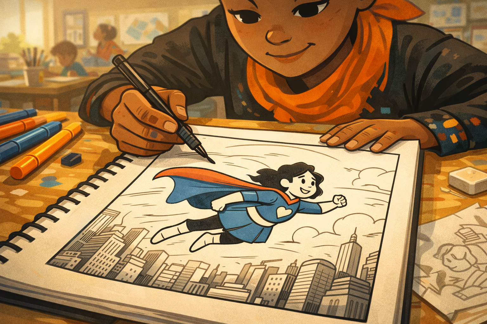
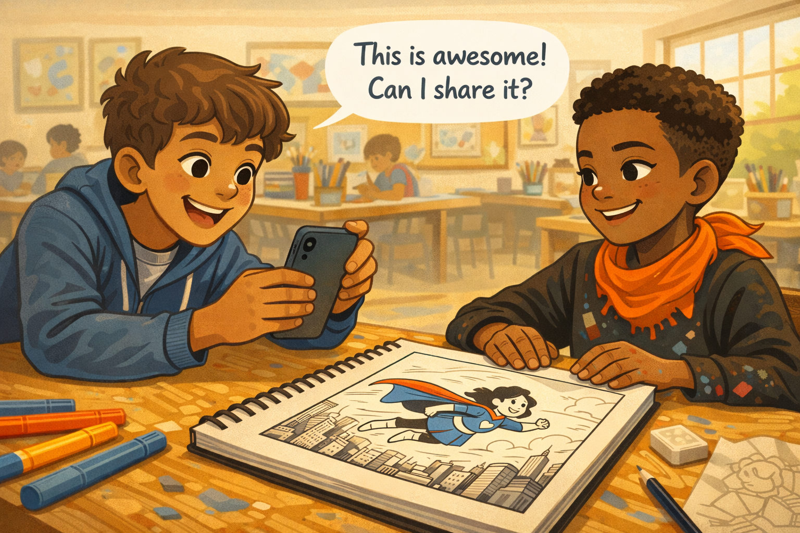
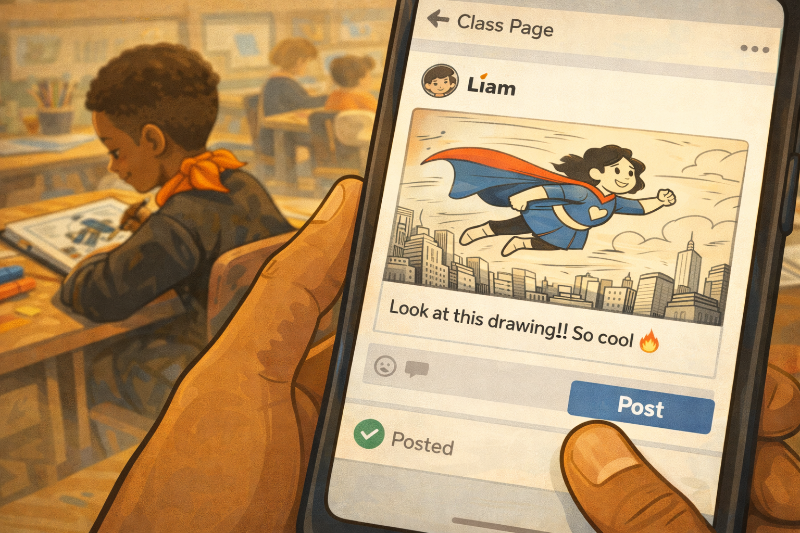
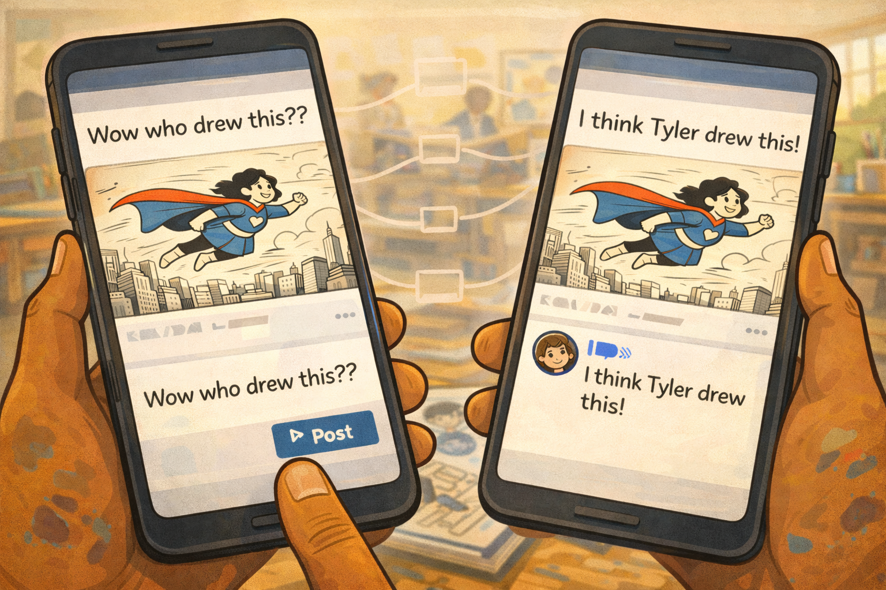
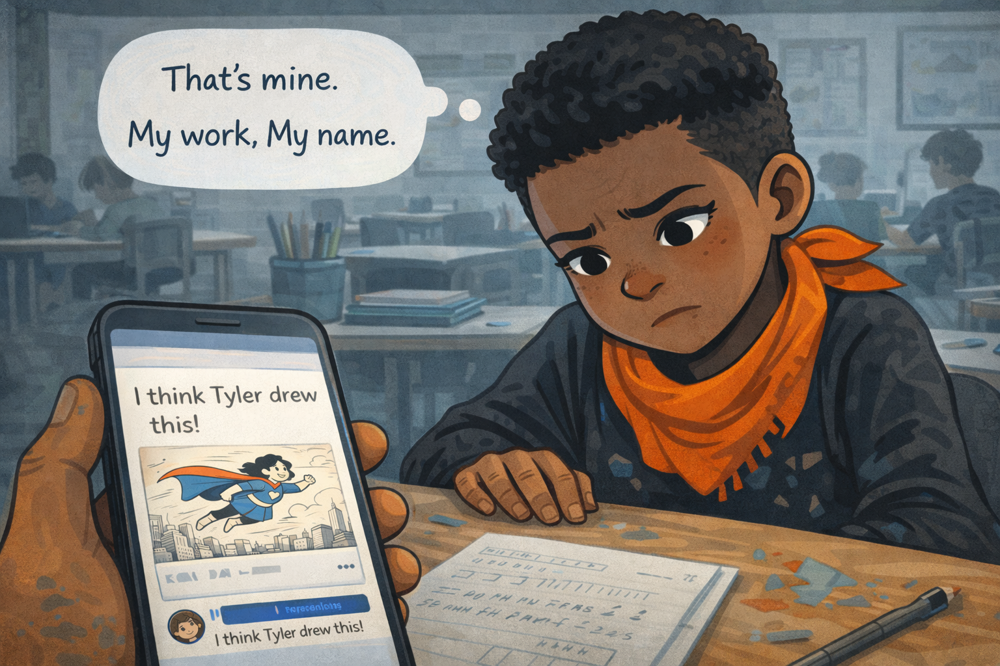
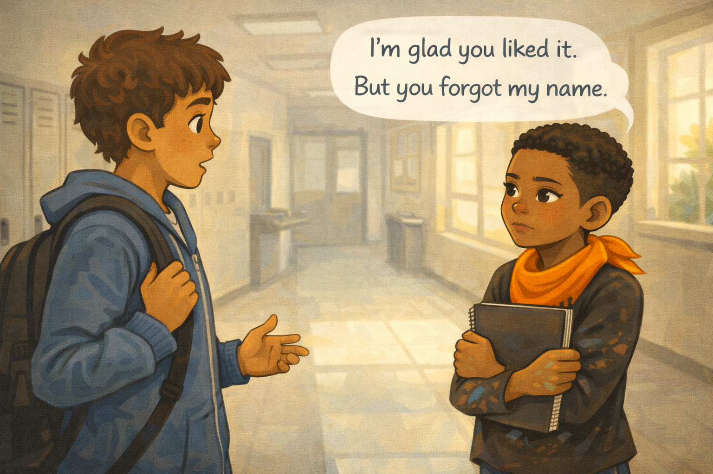
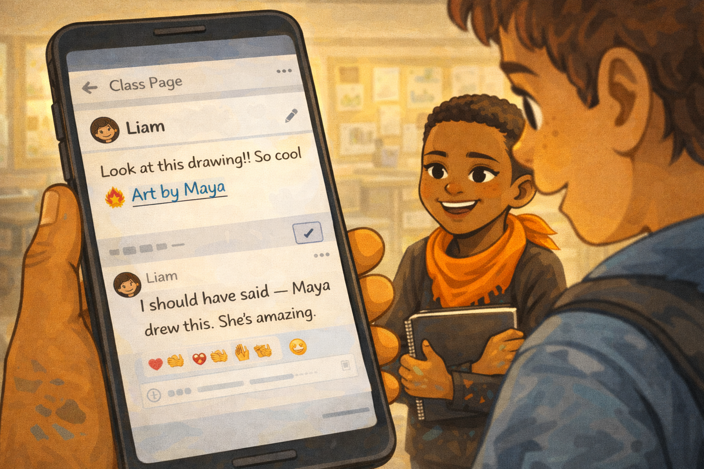

# Maya's Art and the Missing Name

*A Digital Citizenship mini graphic novel — companion to [Chapter 8: Reputation and Credit](../../chapters/08-reputation-and-credit/index.md)*

Cover Image Prompt

Please generate a new wide-landscape image.
A warm, emotionally charged composition. In the center of the frame, a fifth-grade girl sits at a classroom art table, drawing in a sketchbook. The girl is Maya — dark brown skin, short natural hair cropped close in a tapered style, wearing a bright orange scarf tied loosely around her neck, a black long-sleeve shirt with paint stains on the cuffs and forearms, dark jeans, and canvas sneakers. Her fingers have small smudges of ink and paint on them. She is mid-stroke, drawing a comic panel with a fine-tip pen, her expression deeply focused and content — a small satisfied smile, eyes locked on the page.

The sketchbook is angled so the viewer can see part of her drawing: a dynamic comic panel showing a girl superhero in mid-flight, cape streaming behind her, drawn in clean black ink lines. The drawing is clearly skilled for her age — confident linework, good proportions, visible energy.

Behind Maya, a classroom art room stretches into soft focus: other students at tables working on projects, jars of paintbrushes, stacks of colored paper, student artwork pinned to a long cork board, and windows letting in bright morning light. On the cork board behind her, one piece of artwork has a small label beneath it that reads "Art by Maya" — foreshadowing the theme of credit.

In the lower right corner of the frame, a phone is visible at the edge of the table — not Maya's, but someone else's — with its camera lens pointing loosely toward Maya's sketchbook. A subtle hint of what is coming.

Across the top of the image, in friendly hand-lettered text the color of river-blue (#2e6f8e), the title: **Maya's Art and the Missing Name**. Below the title, slightly smaller, the subtitle: *A Digital Citizenship Mini Graphic Novel*.

**Style notes:**

- Modern flat cartoon vector illustration. Friendly, kid-readable lines. No heavy shading.
- Warm, slightly muted color palette with river-blue (#2e6f8e) accents in the title text and the "Art by Maya" label on the cork board.
- 16:9 horizontal landscape composition.
- Mood: creative joy, pride in craft. Maya loves what she does.
- No platform names, no real app interfaces, no logos.

Generate the image immediately without asking clarifying questions.

## A Story About Whose Name Goes On It

When you make something — a drawing, a poem, a song, a story — it carries a piece of you inside it. Your ideas. Your time. Your skill. Your name belongs on it. That is not bragging. That is fairness.

But what happens when your work travels the internet without your name? What happens when someone else gets the credit for what you made?

This is a story about Maya, and the drawing that lost her name.

---

## Panel 1 — The Drawing

Image Prompt

(This is Panel 01. Do not include the panel number in the image.)

Please generate a new wide-landscape image.
A close-up shot looking down at Maya's sketchbook on a classroom table. Maya's hands are visible — dark brown skin, slender fingers with small ink and paint stains, one hand holding a fine-tip black pen mid-stroke. She is drawing a comic panel that fills most of the sketchbook page: a girl superhero with a flowing cape soaring above a city skyline, arms outstretched, hair streaming behind her. The drawing is impressive — clean ink lines, dynamic motion, visible energy and skill.

Around the sketchbook on the table: a set of colored markers with caps off, a small eraser, a pencil with a chewed end, and a crumpled sketch that was an earlier draft. The orange scarf Maya wears is visible draping over her shoulder at the top edge of the frame.

In the upper portion of the frame, Maya's face is partially visible, looking down at her work. Her expression is one of deep creative focus — slightly parted lips, steady eyes, the look of someone completely absorbed in what they are making.

The classroom art room is softly blurred in the background: other students at tables, jars of brushes, bright morning light through windows.

**Style notes:**

- Modern flat cartoon vector style.
- Warm palette with golden morning light. River-blue (#2e6f8e) accents in the superhero's cape in the drawing and the marker caps.
- 16:9 horizontal landscape.
- Mood: creative joy, craftsmanship, pride. This drawing matters to Maya.
- The drawing-within-the-drawing should look genuinely good — not a scribble, but real kid-artist talent.
- No logos.

Generate the image immediately without asking clarifying questions.

Maya has been working on this comic panel for three days. A girl superhero soaring over a city, cape streaming behind her, arms stretched wide. Maya draws every line by hand with a fine-tip pen. No tracing. No copying. Every line is hers.

She holds the sketchbook up and tilts it in the light. The ink shines. She smiles. This is the best thing she has ever drawn.

---

## Panel 2 — "Can I Share It?"

Image Prompt

(This is Panel 02. Do not include the panel number in the image.)

Please generate a new wide-landscape image.
A medium two-shot of Maya and her friend at the art table. Her friend — a boy with light brown skin, short wavy brown hair, a blue zip-up hoodie, and a friendly eager expression — is leaning across the table toward Maya's sketchbook, eyes wide with genuine admiration. One hand is flat on the table, the other is holding his phone up, already angled toward the drawing as if preparing to take a photo.

Maya is sitting back slightly, smiling at his enthusiasm. Her orange scarf is bright against her black shirt. Her paint-stained fingers rest on the edge of the sketchbook protectively but not defensively — she is pleased by the compliment.

A clean word balloon from the friend reads: **"This is awesome! Can I share it?"**

Maya's sketchbook is visible between them on the table, the superhero drawing facing upward. The art room continues in the background: other students, supplies, morning light.

**Style notes:**

- Modern flat cartoon vector style.
- Warm, friendly palette. The friend's enthusiasm should read as genuine, not pushy.
- 16:9 horizontal landscape.
- Mood: compliment, excitement, connection. This is a good moment — the friend genuinely loves the art.
- Word balloon text must be readable.
- No logos.

Generate the image immediately without asking clarifying questions.

Her friend Liam leans over from the next seat. His eyes go wide. "Maya. That is *awesome*." He grabs his phone. "Can I share it?"

Maya nods. She feels a warm glow in her chest. Someone noticed. Someone thinks her art is good enough to share. "Sure," she says. "Go ahead."

Liam snaps a photo of the drawing and grins.

---

## Panel 3 — Posted Without a Name

Image Prompt

(This is Panel 03. Do not include the panel number in the image.)

Please generate a new wide-landscape image.
A close-up of Liam's phone screen as he finishes posting. The screen shows a generic class page or group feed — a simple social-media-style layout with no real platform name, just a white background, rounded corners, and a post box. The post contains the photo of Maya's superhero drawing, looking crisp and impressive. Below the photo, Liam has typed a short caption: **"Look at this drawing!! So cool 🔥"** — but there is no artist name, no credit, no mention of Maya.

Liam's thumb is visible at the bottom of the screen, having just tapped a blue "Post" button. A small green checkmark appears next to the post, indicating it was published.

In the background, slightly out of focus, Maya is visible turning back to her sketchbook, already working on the next panel of her comic. She has not seen the post. She does not know her name is missing.

**Style notes:**

- Modern flat cartoon vector style.
- The absence of Maya's name on the post should be noticeable but not highlighted with red circles or arrows — let the reader notice it naturally.
- 16:9 horizontal landscape.
- Mood: innocent mistake. Liam is excited, not malicious. He simply forgot.
- No real platform names, no real app interfaces beyond a generic post layout.

Generate the image immediately without asking clarifying questions.

Liam posts the photo to the class page. He types a caption: "Look at this drawing!! So cool." He hits post. He is excited. He wants everyone to see it.

But he forgets one thing. He does not type Maya's name. He does not say who drew it. The drawing goes out into the world with no artist attached.

---

## Panel 4 — Someone Else's Name

Image Prompt

(This is Panel 04. Do not include the panel number in the image.)

Please generate a new wide-landscape image.
A split-composition panel showing two phone screens side by side, representing the drawing spreading. On the left phone, one student has shared the drawing with the comment: **"Wow who drew this??"** On the right phone, another student has replied beneath it: **"I think Tyler drew this."** A small avatar next to the reply shows a boy who is clearly not Maya.

Between and behind the two phones, faint ghostly lines connect them — showing the drawing traveling from person to person, like a chain of shares. Each share takes the drawing further from Maya.

At the bottom of the frame, barely visible and mostly out of focus, Maya's paint-stained hand rests on her sketchbook at the art table, still drawing, unaware. The contrast between her quiet creative focus and the conversation happening without her is the emotional core of the panel.

**Style notes:**

- Modern flat cartoon vector style.
- The two phone screens should be clearly readable, with simple generic social-media-style comment threads.
- 16:9 horizontal landscape.
- Mood: the slow drift away. Maya's work is being claimed by someone else through inaction, not malice.
- No real platform names, no logos.

Generate the image immediately without asking clarifying questions.

The post spreads. Kids share it. Kids comment on it. Someone writes, "Wow, who drew this??" And then, under the post, another comment: "I think Tyler drew this."

Tyler did not draw it. Tyler has never drawn anything like this. But Tyler is the kid people *expect* to draw things, because Tyler draws a lot in class. So the wrong name sticks.

Maya's drawing is traveling through the school. And Maya's name is not on it.

---

## Panel 5 — The Knot

Image Prompt

(This is Panel 05. Do not include the panel number in the image.)

Please generate a new wide-landscape image.
A close-up of Maya, sitting at a desk in a different classroom (a regular classroom, not the art room). She is looking down at a phone — perhaps borrowed from a friend or her own — and her expression tells the whole story. Her eyes are wide and hurt, her lips pressed tightly together, her brow furrowed. One hand grips the edge of the desk. The orange scarf around her neck seems to droop.

On the phone screen, visible to the viewer, is the post with her drawing and the comment thread. The comment **"I think Tyler drew this"** is highlighted or at the top of the visible thread.

Above Maya's head, a single clean thought bubble shows two short lines:
**"That's mine."**
**"My work. My name."**

The classroom around her is in soft focus: a math worksheet on her desk, a pencil cup, other students working quietly. The mood has shifted from the warmth of the art room to the coolness of this realization.

**Style notes:**

- Modern flat cartoon vector style.
- Cooler palette than previous panels — the warmth has drained slightly to match Maya's feelings.
- 16:9 horizontal landscape.
- Mood: the knot in the chest. Not anger — hurt. The feeling of being erased from your own work.
- Thought bubble text must be readable.
- No logos.

Generate the image immediately without asking clarifying questions.

Maya finds out during math class. A friend shows her the post on their phone. Maya sees her drawing — the superhero she spent three days on, every line drawn by hand. She sees the comments. She sees Tyler's name where hers should be.

A knot forms in her chest. It is not anger, exactly. It is something worse. It is the feeling of being invisible next to your own work. *That is mine. My work. My name.*

---

## Panel 6 — The Conversation

Image Prompt

(This is Panel 06. Do not include the panel number in the image.)

Please generate a new wide-landscape image.
A medium two-shot of Maya and Liam talking in a quiet hallway between classes. 
Maya is standing on the RIGHT with her sketchbook hugged against her chest, her orange scarf bright, her paint-stained fingers visible gripping the sketchbook edge. Her expression is serious but not hostile — she is being brave, not mean. She is looking directly at Liam.

A clean word balloon from Maya on the right side reads: **"I'm glad you liked it. But you forgot my name."**

Liam is facing her on the LEFT side, his blue hoodie slightly rumpled, his backpack over one shoulder. His expression shifts from confused to apologetic — eyebrows rising, mouth opening in an "oh" shape, one hand coming up in a small gesture of realization. He is not defensive. He genuinely did not think about it, and now he sees why it matters.

The hallway is quiet — a few lockers, a drinking fountain, a window letting in afternoon light. No other students are visible, giving the conversation privacy.

**Style notes:**

- Modern flat cartoon vector style.
- Warm but muted palette — the orange scarf is the brightest color, drawing focus to Maya.
- 16:9 horizontal landscape.
- Mood: honest, brave, respectful. Maya is standing up for herself without tearing Liam down. Liam is listening without getting defensive.
- Word balloon text must be readable.
- No logos.

Generate the image immediately without asking clarifying questions.

Maya finds Liam in the hallway after class. Her heart is beating fast, but she keeps her voice steady.

"Hey," she says. "I'm glad you liked my drawing. But you forgot to put my name on it."

Liam blinks. "Oh." His face changes. He was not trying to hurt her. He just did not think about it. But now that she says it, he can see it. He can feel how it would feel to work on something for three days and have someone else get the credit.

"I'm sorry," he says. "I didn't think."

"I know," Maya says. "But it matters."

---

## Panel 7 — The Fix

Image Prompt

(This is Panel 07. Do not include the panel number in the image.)

Please generate a new wide-landscape image.
A warm, satisfying close-up of Liam's phone screen as he edits the post. The screen shows the same generic class page from Panel 3, but now the caption has been updated. The new caption reads: **"Look at this drawing!! So cool 🔥 Art by Maya"** — with "Art by Maya" clearly visible at the end. A small pencil-edit icon indicates the post was just modified.

In the comment thread below, a new comment from Liam reads: **"I should have said — Maya drew this. She's amazing."** Several heart and clap reaction emojis appear beneath the correction from other students.

Liam's hand holds the phone on the left side of the frame. On the right side, Maya is visible looking at the screen over Liam's shoulder. Her expression has changed completely from Panel 5: a wide, genuine smile, eyes bright, the knot in her chest visibly released. Her orange scarf seems to glow again. Her paint-stained fingers are relaxed at her sides.

The hallway behind them is warmed by afternoon golden light.

**Style notes:**

- Modern flat cartoon vector style.
- Warm, golden palette fully restored — the emotional resolution matches the color temperature.
- River-blue (#2e6f8e) accents in the reaction emojis and the "Art by Maya" text.
- 16:9 horizontal landscape.
- Mood: repair, respect, warmth. The fix is simple, and it changes everything.
- The edited post text and the comment must be clearly readable.
- No real platform names, no logos.

Generate the image immediately without asking clarifying questions.

Liam pulls out his phone right there in the hallway. He edits the post. He adds three words to the caption: **Art by Maya.** Then he writes a comment: "I should have said — Maya drew this. She's amazing."

Maya watches the edit go live. She sees her name appear next to her drawing. The knot in her chest loosens. Something that was wrong is now right. Her work has her name on it again.

It was a small fix. Three words. But those three words meant everything.

---

## What Maya Teaches Us

Maya did not lose her drawing. She lost something harder to see: the credit for making it. When your work travels the internet without your name, other people get the praise, the recognition, and the reputation that belong to you. Giving credit is not just polite. It is fair.

| Moment | What happened | What we can learn |
|---|---|---|
| The drawing | Maya spent three days creating something she was proud of | Creative work takes real time and skill — it deserves respect |
| The compliment | Liam genuinely loved the art and wanted to share it | Liking someone's work is great — but sharing it right matters too |
| The post | Liam shared it without Maya's name | Forgetting to give credit can happen without bad intentions |
| The wrong name | Other kids guessed a different artist | Without a name on it, people will fill in the blank — and get it wrong |
| The knot | Maya felt invisible next to her own work | Losing credit for your work hurts, even when nobody meant to hurt you |
| The conversation | Maya spoke up calmly and clearly | Standing up for yourself does not have to mean tearing someone else down |
| The fix | Liam added Maya's name and apologized | Giving credit is easy to do — and easy to forget. A quick correction can fix a big mistake |

## You Can Do This Too

Every time you share someone else's work — a drawing, a photo, a video, a piece of writing, a meme — you have a choice. You can share it without a name, and let the credit float away. Or you can take five seconds and add the creator's name.

**"Art by Maya." "Photo by Kai." "Written by Jordan."** Three words. Five seconds. That is all it takes to treat someone's work with respect.

Here is the rule: **if you did not make it, name who did.** If you do not know who made it, say so. "I don't know who made this, but it's great" is honest. Letting someone else get credit for work they did not do is not.

And if someone shares *your* work without your name, you have the right to speak up — just like Maya did. You can be kind and still be clear. "I'm glad you liked it, but that's mine. Please add my name."

If someone takes credit for your work and will not fix it, tell a trusted adult. A parent, a guardian, a teacher, or a school counselor can help. You are not making a big deal out of nothing. Your name on your work is your right.

## Related Reading

- [Chapter 8: Reputation and Credit](../../chapters/08-reputation-and-credit/index.md) — the chapter this story belongs to. Explores how your online reputation is built, why giving credit to creators matters, and what to do when someone takes credit for your work.
- [Chapter 7: What Is a Digital Footprint?](../../chapters/07-what-is-a-digital-footprint/index.md) — how everything you post becomes part of your permanent digital trail, and why Maya's drawing — once shared — could not be un-shared.
