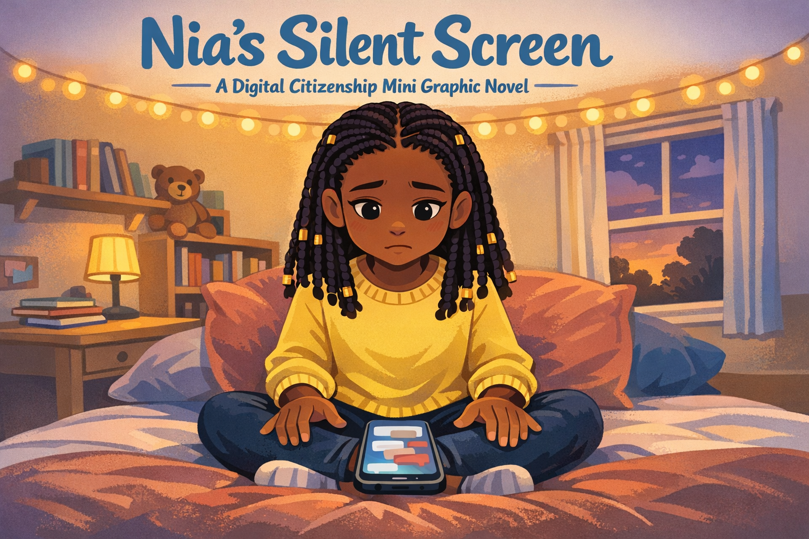
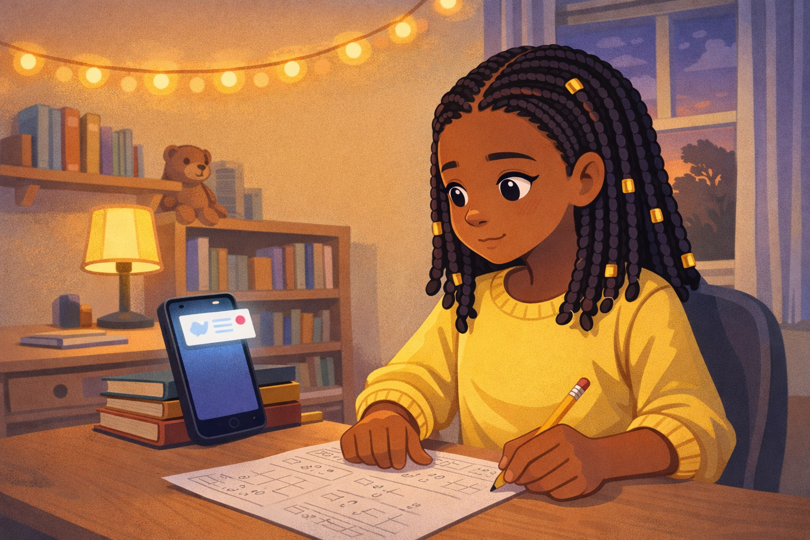
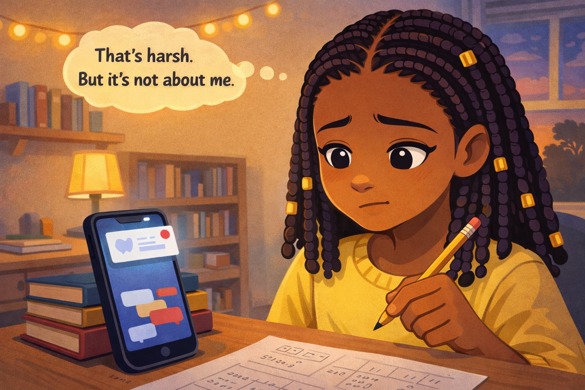
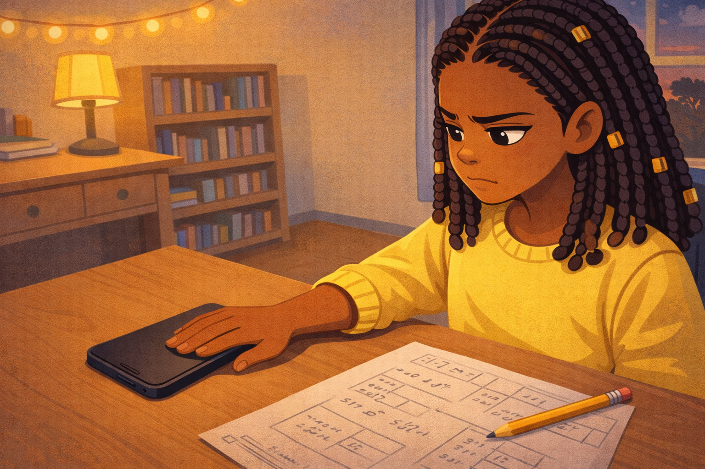
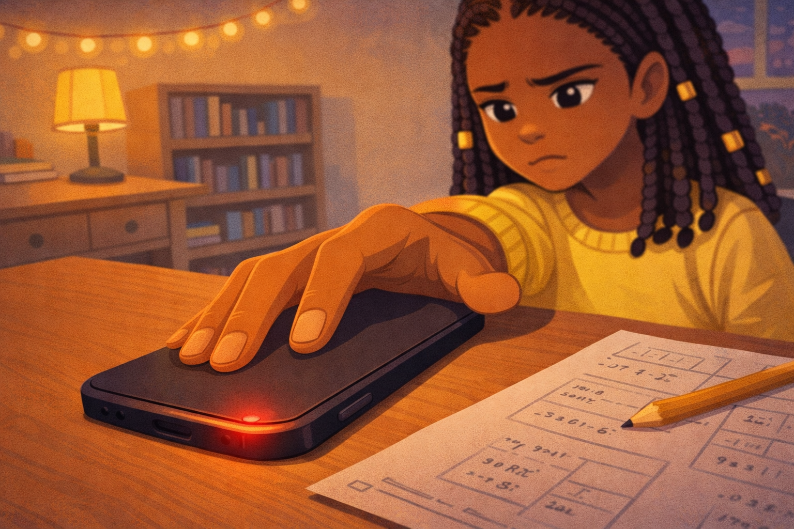
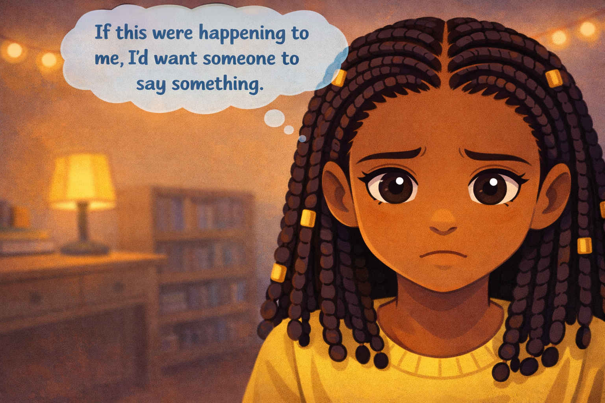
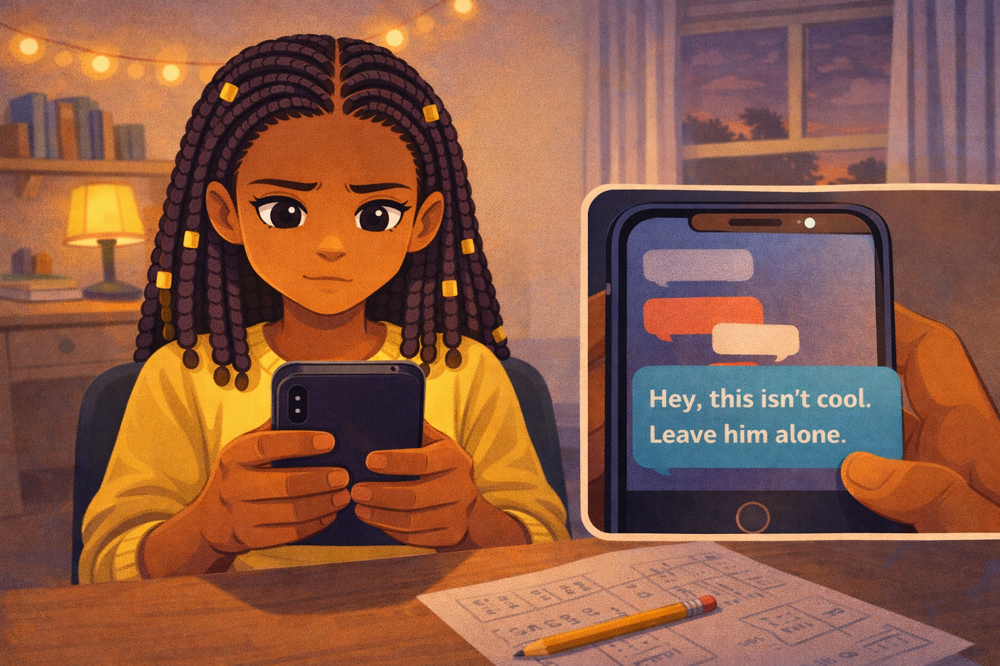
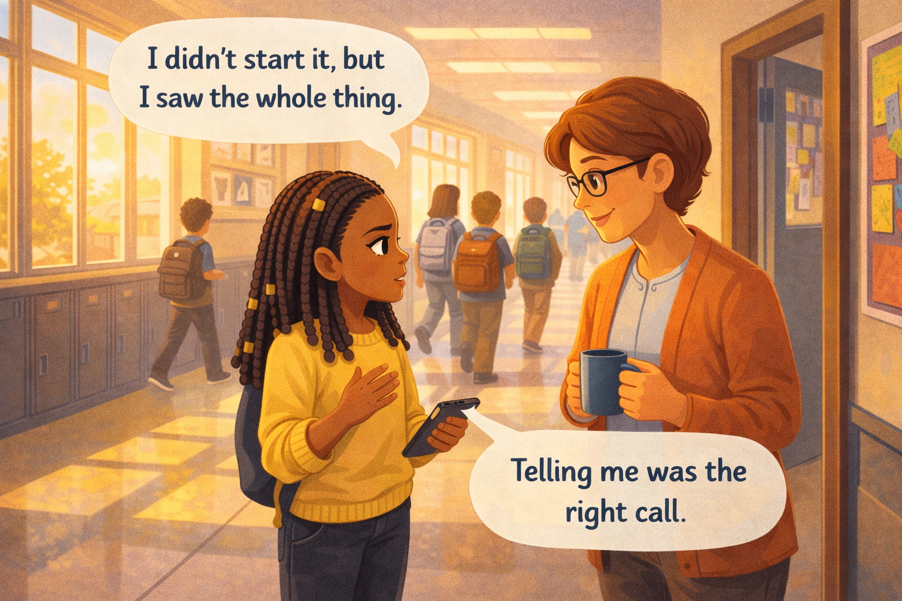

# Nia's Silent Screen

*A Digital Citizenship mini graphic novel — companion to [Chapter 11: When Conflict Becomes Cyberbullying](../../chapters/11-conflict-vs-cyberbullying/index.md)*

Cover Image Prompt

Please generate a new wide-landscape image.
A striking, emotionally layered composition. In the center of the frame, a fifth-grade girl sits cross-legged on a bed with a phone resting face-up on her lap. She is Nia — dark brown skin, box braids with small gold cuffs at the ends, wearing a soft yellow sweater and dark jeans. Her hands rest on either side of the phone, palms open, not touching it. Her face fills the upper third of the frame: large expressive dark eyes looking down at the phone with a conflicted expression — not scared, not angry, but deeply uncomfortable, like she is deciding something important.

The phone screen glows with a soft blue-white light. On the screen, several abstract chat bubbles are stacked — some gray, some pale red — but no readable text is visible. The bubbles give the impression of a conversation growing heated.

Behind Nia, slightly out of focus, is a cozy bedroom: a desk with a small lamp, a bookshelf with paperbacks and a stuffed animal, a window showing a dusky evening sky in soft purples and oranges. A string of warm fairy lights runs along the top of the wall. A few school notebooks are stacked on the desk.

Across the top of the image, in friendly hand-lettered text the color of river-blue (#2e6f8e), the title: **Nia's Silent Screen**. Below the title, slightly smaller, the subtitle: *A Digital Citizenship Mini Graphic Novel*.

**Style notes:**

- Modern flat cartoon vector illustration. Friendly, kid-readable lines. No heavy shading.
- Warm, slightly muted color palette with river-blue (#2e6f8e) accents in the title text and Nia's phone glow.
- 16:9 horizontal landscape composition.
- Mood: quiet tension, a girl on the edge of a choice.
- No platform names, no real app interfaces, no logos.

Generate the image immediately without asking clarifying questions.

## A Story About Silence

Have you ever seen something happen and said nothing? Not because you were mean. Not because you didn't care. But because you didn't know what to say — or you were afraid of what might happen if you did.

Silence is tricky. Sometimes silence means peace. But sometimes, in a group chat, silence can feel like agreement. When no one speaks up, the person being hurt feels alone.

This is a story about Nia, and the night she learned what her silence was really saying.

---

## Panel 1 — The First Message

Image Prompt

Please generate a new wide-landscape image.
A medium shot of Nia sitting at a desk in her bedroom, doing homework. She is a fifth-grade girl with dark brown skin, box braids with small gold cuffs, a soft yellow sweater, and dark jeans. A math worksheet and a pencil sit in front of her. Her phone is propped against a stack of books on the desk, screen facing her.

A notification banner has just appeared at the top of the phone screen — a small abstract chat bubble with a red dot, no readable text. Nia's eyes have drifted from her worksheet to the phone. Her expression is casual, mildly curious — a normal interruption during homework.

The bedroom is warm and cozy: a small desk lamp casts golden light, a bookshelf with paperback novels and a small stuffed otter sits behind her, and a window shows a dusky purple-orange sky. A string of warm fairy lights runs along the wall above the desk.

**Style notes:**

- Modern flat cartoon vector style, consistent with the cover.
- Warm, slightly muted palette with river-blue (#2e6f8e) accents in the phone glow and fairy lights.
- 16:9 horizontal landscape.
- Mood: ordinary, quiet, a normal evening at home.
- No text, no logos, no real app interfaces.

Generate the image immediately without asking clarifying questions.

Nia is sitting at her desk, working through a math worksheet, when her phone buzzes. She glances at it. A message has popped up in the group chat. It is about a kid in their class named Marcus. The message is not kind. Someone wrote something mean about the way he answered a question in class today.

Nia reads it. Her stomach dips a little. But she goes back to her math.

---

## Panel 2 — "It's Not About Me"

Image Prompt

Please generate a new wide-landscape image.
A close-up of Nia from chest up at her desk. Her eyes are looking down at the phone screen, which shows several abstract chat bubbles stacked — some gray, one pale red — no readable text. Her expression is uneasy but guarded: lips pressed together slightly, one eyebrow raised. She is holding her pencil loosely in one hand, tapping it against the worksheet.

Above her head, a single small thought bubble floats with the words: **"That's harsh. But it's not about me."** The thought bubble is pale yellow with clean, kid-readable dark text.

The warm bedroom background continues from Panel 1: desk lamp glow, fairy lights, the dusky window. The math worksheet is half-finished in front of her.

**Style notes:**

- Modern flat cartoon vector style.
- Warm palette with the thought bubble in pale yellow for gentle contrast.
- 16:9 horizontal landscape.
- Mood: mild discomfort, rationalization — she is telling herself it is not her problem.
- The thought bubble text must be readable at small sizes.
- No logos, no real app interfaces.

Generate the image immediately without asking clarifying questions.

More messages come in. Other kids are adding on, making jokes. Nia reads them. She thinks: *That's harsh. But it's not about me.* She puts her pencil down, scrolls through the messages, and goes back to her homework. It is easier not to get involved.

---

## Panel 3 — Phone Face-Down

Image Prompt

Please generate a new wide-landscape image.
A medium shot from a slightly elevated angle looking down at Nia's desk. Nia has placed her phone face-down on the desk, screen hidden, next to her math worksheet. Her hand is still resting on the back of the phone, fingers spread, as if she just set it down firmly. Her face is visible in three-quarter view, turned slightly away from the phone. Her expression has shifted: jaw tightened, eyes narrowed, mouth pressed into a flat line. She looks bothered.

The math worksheet has a few more problems filled in since Panel 1, but Nia's pencil is lying flat on the desk — she is not working anymore. The desk lamp casts warm light across the scene. The fairy lights continue along the wall.

**Style notes:**

- Modern flat cartoon vector style.
- Warm palette with muted tones — the mood has shifted from casual to tense.
- 16:9 horizontal landscape.
- Mood: avoidance, discomfort. She is trying to ignore what she saw.
- No text, no logos, no real app interfaces.

Generate the image immediately without asking clarifying questions.

The messages keep buzzing. Nia's face tightens. She flips her phone face-down on the desk. She does not want to read any more. She tries to focus on her homework, but the numbers on the worksheet blur. Her brain keeps going back to the chat.

---

## Panel 4 — Picking It Back Up

Image Prompt

Please generate a new wide-landscape image.
A close-up of Nia's hand reaching back toward the face-down phone on the desk. Her fingers are curling around the edge of the phone, about to flip it over. In the background, slightly out of focus, Nia's face is visible — she looks conflicted, brow furrowed, lips slightly parted. The phone's edge catches the warm glow of the desk lamp.

On the visible back of the phone, a small notification light blinks soft red, indicating many unread messages. The math worksheet is pushed aside, pencil rolled to the edge of the desk.

The bedroom background is dimmer now — the window shows a deeper purple sky, and the fairy lights are the primary light source along with the desk lamp.

**Style notes:**

- Modern flat cartoon vector style.
- Warm but increasingly tense palette — the room feels a little darker than earlier panels.
- 16:9 horizontal landscape.
- Mood: she cannot look away. The pull of the chat is stronger than her wish to ignore it.
- No text, no logos.

Generate the image immediately without asking clarifying questions.

She picks the phone back up. She cannot help it. The messages are worse now. More kids have joined in. Someone posted a meme making fun of Marcus. Nobody — not a single person — has said anything kind. The chat is full of laughing emojis and mean jokes.

Nia scrolls through it all. No one is pushing back.

---

## Panel 5 — The Turning Point

Image Prompt

Please generate a new wide-landscape image.
A close-up of Nia's face, shown almost head-on. Her box braids with gold cuffs frame her face. Her large dark eyes are glistening — not crying, but emotional. Her expression is serious, determined, like something has clicked inside her. Her yellow sweater collar is visible at the bottom of the frame.

Above her head, a single thought bubble floats with the words: **"If this were happening to me, I'd want someone to say something."** The thought bubble is pale blue with clean, kid-readable dark text, slightly larger than the thought bubble in Panel 2 — this thought matters more.

The background is softened to a warm blur — the fairy lights are soft bokeh dots, the desk lamp is a warm glow. The focus is entirely on Nia's face and her realization.

**Style notes:**

- Modern flat cartoon vector style.
- Warm palette with the pale-blue thought bubble as a visual turning point — the first river-blue (#2e6f8e) accent in a thought bubble.
- 16:9 horizontal landscape.
- Mood: quiet resolve. This is the moment she stops being a bystander.
- The thought bubble text must be readable at small sizes.
- No logos.

Generate the image immediately without asking clarifying questions.

Nia stares at the screen. She imagines herself in Marcus's place. What if everyone in the chat was saying these things about her? What if she opened her phone and saw all of this — and not one person said "stop"?

She thinks: *If this were happening to me, I'd want someone to say something.*

That one thought changes everything.

---

## Panel 6 — Speaking Up

Image Prompt

Please generate a new wide-landscape image.
A medium shot of Nia sitting at her desk, phone held in both hands at chest level, thumbs poised over the screen. She is typing a message. On the phone screen, a single chat bubble is forming at the bottom of the conversation — a bright, clean river-blue (#2e6f8e) bubble that stands out from the gray and red bubbles above it. No readable text on the other bubbles, but the blue bubble contains the words: **"Hey, this isn't cool. Leave him alone."**

Nia's face is visible above the phone. Her expression is calm and steady — not angry, not scared, just clear. Her jaw is set. Her eyes are focused on the screen.

In a second composition layer, a small inset in the lower-right corner of the panel shows Nia's thumb pressing a screenshot button — a simple camera-shutter icon on the phone's edge. This shows she is also saving the evidence.

The bedroom background is softly lit by fairy lights and the desk lamp. The mood has shifted from tense to purposeful.

**Style notes:**

- Modern flat cartoon vector style.
- The river-blue chat bubble is the visual centerpiece — it should pop against the muted grays and reds.
- 16:9 horizontal landscape.
- Mood: quiet courage. She is not yelling. She is being clear.
- The text in the blue bubble must be readable at small sizes.
- No logos, no real app interfaces beyond the abstract chat bubbles.

Generate the image immediately without asking clarifying questions.

Nia takes a slow breath. Then she types: *"Hey, this isn't cool. Leave him alone."* Her thumb hovers for just a second. Then she hits send.

The blue bubble appears in the chat. It sits there, alone, surrounded by all the mean messages. It looks small. But it is there.

Then Nia does one more thing. She takes a screenshot of the whole thread. She saves it to her photos. She has a feeling she is going to need it.

---

## Panel 7 — Telling a Trusted Adult

Image Prompt

Please generate a new wide-landscape image.
A wide shot of a bright elementary school hallway the next morning. Warm morning light streams through tall windows on the left side. Nia — dark brown skin, box braids with gold cuffs, yellow sweater, dark jeans — stands near an open classroom door, talking to a female teacher. The teacher is a middle-aged woman with short auburn hair, light skin, glasses, and a warm cardigan, holding a coffee mug. She is leaning slightly toward Nia, listening carefully with a kind, attentive expression.

Nia's posture is upright but slightly nervous — one hand holds her phone at her side, the other is gesturing as she explains. Her face is earnest and serious. A clean word balloon from Nia reads: **"I didn't start it, but I saw the whole thing."** A second clean word balloon from the teacher reads: **"Telling me was the right call."**

Other students are visible in soft focus walking past in the hallway, backpacks on, heading to class. Lockers line the far wall. A bulletin board with colorful student artwork is visible near the classroom door.

**Style notes:**

- Modern flat cartoon vector style, consistent with all previous panels.
- Warm, bright morning palette — a strong contrast with the dim evening tones of the earlier bedroom panels. The shift from night to morning is visual storytelling.
- 16:9 horizontal landscape.
- Mood: relief, trust, warmth. Nia did the hard thing, and a safe adult is listening.
- The word balloons must be readable at small sizes.
- The teacher does not look alarmed or angry — she looks grateful and kind.
- No logos.

Generate the image immediately without asking clarifying questions.

The next morning, Nia walks into school early. She finds her teacher before class starts. "I didn't start it," Nia says, "but I saw the whole thing." She shows the teacher the screenshot.

The teacher looks at the screen, then looks at Nia. "Telling me was the right call," she says. "You're not in trouble. You did the right thing."

Nia feels something loosen in her chest. She did not start the mean messages. She did not type a single cruel word. But she also did not stay silent forever. She spoke up in the chat, and then she told an adult who could help.

That is what an upstander does.

---

## What Nia Teaches Us

Nia was not the one typing mean messages. She was not the target. She was something in between — a **bystander**. For a while, her silence felt safe. But silence in a group chat can feel like agreement to the person being hurt.

| Moment | What Nia did | What we can learn |
|---|---|---|
| The first message | She read it and went back to homework | Noticing is the first step — but noticing alone is not enough |
| The pile-on | She put the phone face-down | Avoiding the problem does not make it stop |
| The turning point | She imagined herself in Marcus's place | Empathy is the bridge from bystander to upstander |
| Speaking up | She typed "This isn't cool" and took a screenshot | One voice can break the silence — and saving evidence helps |
| Telling an adult | She showed the screenshot to her teacher | A trusted adult can do things a student cannot — and telling is never tattling |

## You Can Do This Too

Nia's story is not about being perfect. She hesitated. She put her phone down. She almost stayed quiet. Most people would. But she came back to one question: *What would I want someone to do if this were about me?*

You do not have to be the loudest person in the chat. You do not have to argue with everyone. Sometimes being an upstander is as simple as typing one sentence: "This isn't cool." Sometimes it means taking a screenshot and showing a trusted adult the next day.

If you see something in a group chat that makes your stomach tighten, that feeling is your signal. Do not ignore it. You can speak up in the chat, you can message the person being targeted privately, or you can tell a trusted adult. Any of those choices moves you from bystander to **upstander**.

You will not be in trouble for telling. That is a rule for the rest of your life.

## Related Reading

- [Chapter 11: When Conflict Becomes Cyberbullying](../../chapters/11-conflict-vs-cyberbullying/index.md) — the chapter this story belongs to. Defines *conflict*, *cyberbullying*, *bystander*, *upstander*, and the line between a disagreement and something that crosses the line.
- [Chapter 12: Standing Up Safely as an Upstander](../../chapters/12-standing-up-safely/index.md) — how to be an upstander without putting yourself at risk: safe strategies, trusted adults, and the power of one voice.
