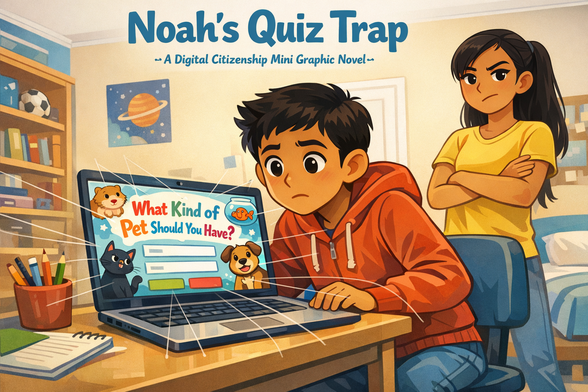
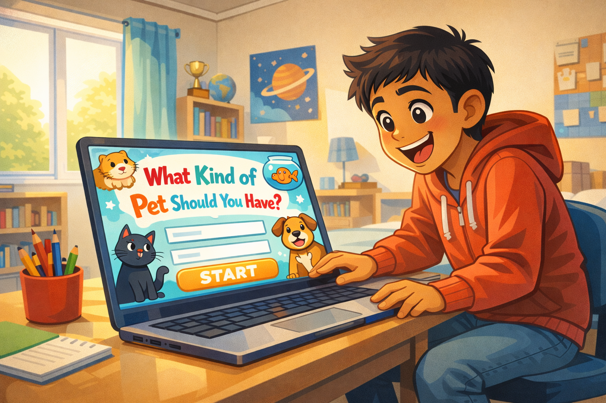
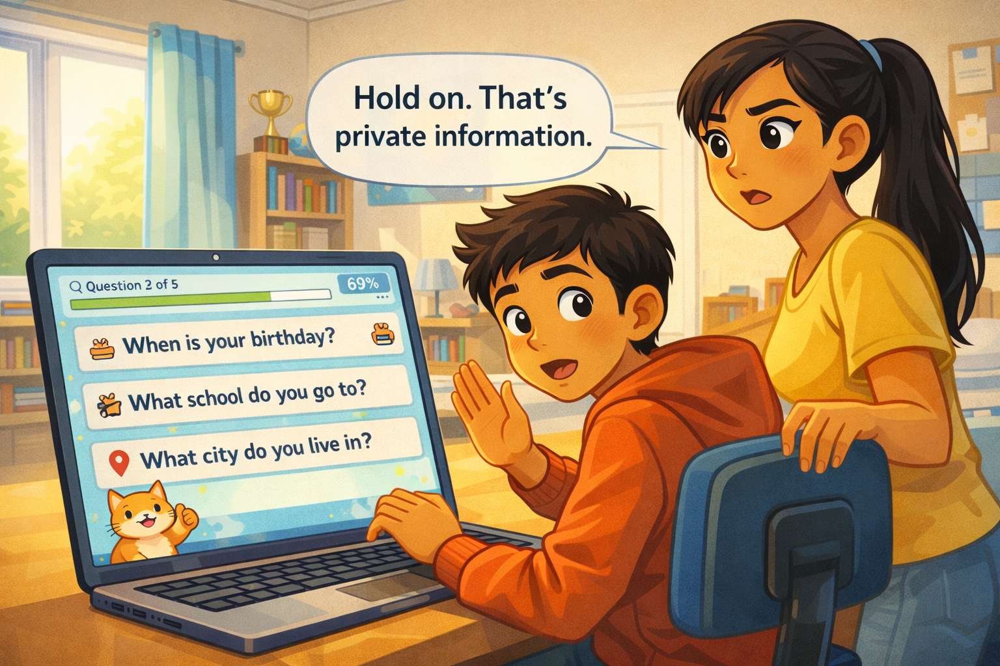
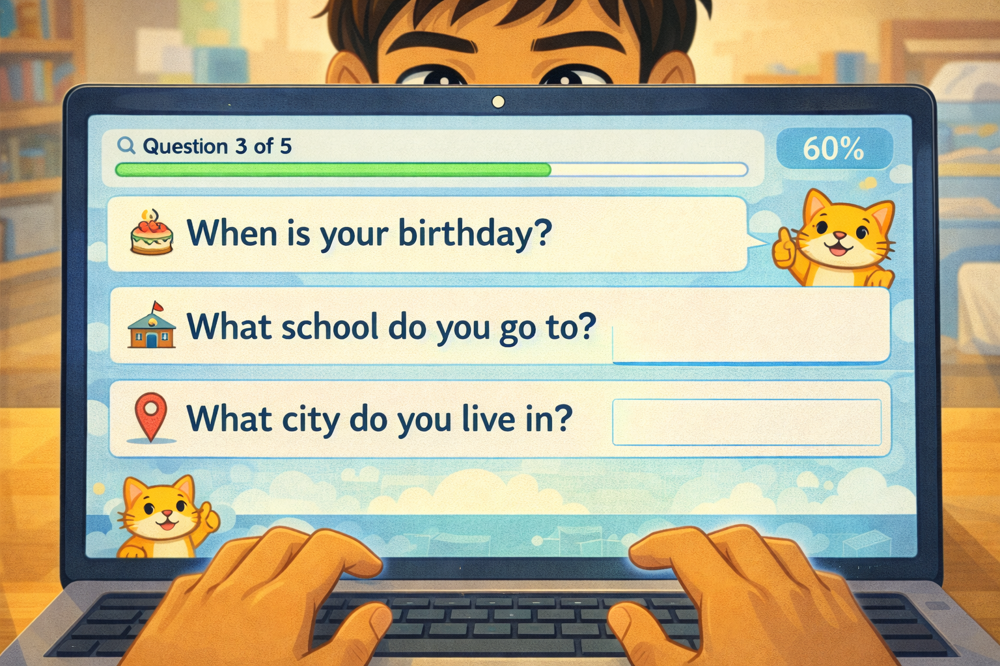
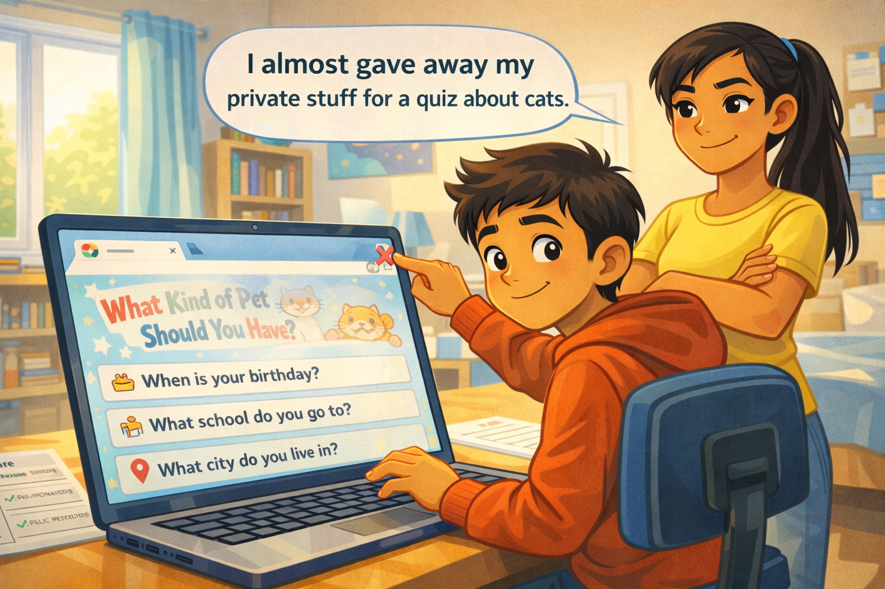
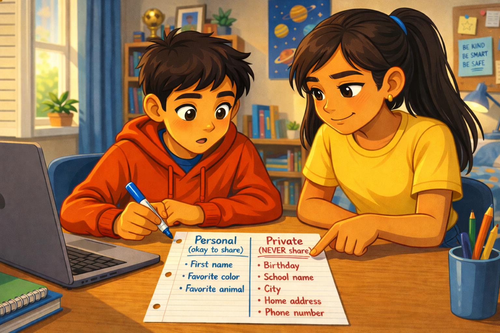
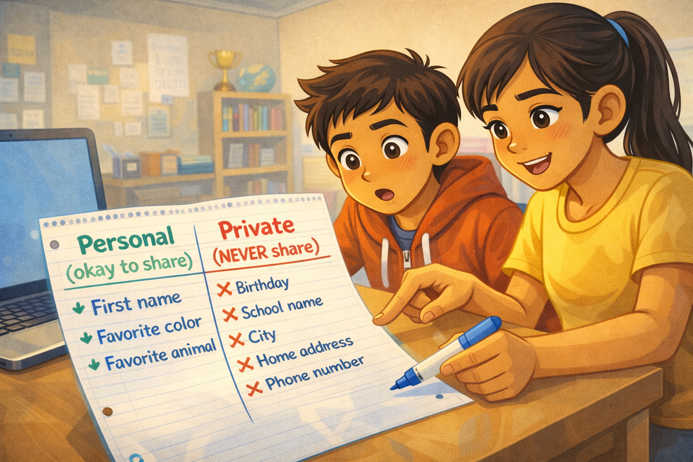
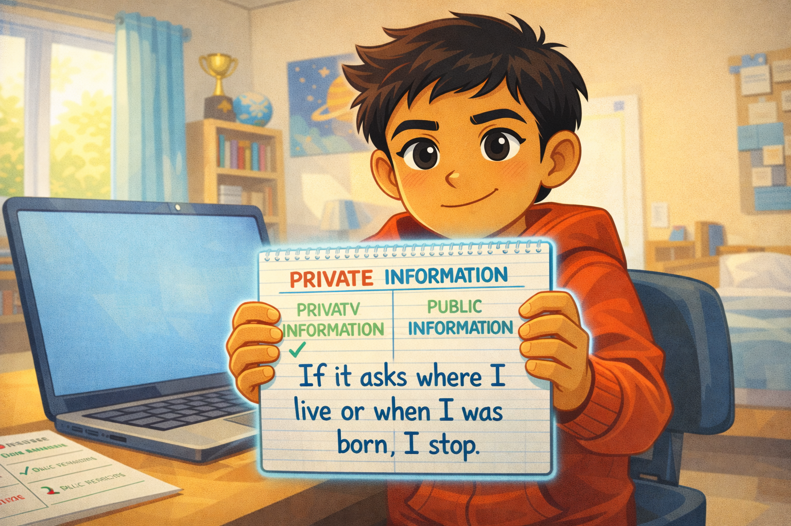

# Noah's Quiz Trap

*A Digital Citizenship mini graphic novel — companion to [Chapter 5: Private vs. Personal Information](../../chapters/05-private-vs-personal-info/index.md)*

Cover Image Prompt

Please generate a new wide-landscape image.
A dramatic, kid-friendly composition. In the center of the frame, a fifth-grade boy — Noah, with light brown skin, short dark hair, wearing a red hoodie with the hood down, jeans, and a curious, slightly uncertain expression — sits at a desk in a bright bedroom. He leans forward toward a laptop screen. The screen displays a colorful, cartoonish quiz interface with the title "What Kind of Pet Should You Have?" in playful bubble letters. Cute cartoon animal silhouettes (a cat, a dog, a hamster, a goldfish) decorate the edges of the quiz.

But under the cheerful quiz surface, a subtle visual metaphor: thin, translucent fishing lines extend from the quiz form fields on the screen outward toward Noah, as if the quiz is "fishing" for his information. The lines are faint enough to miss at first glance — a visual representation of a data trap.

Standing behind Noah's left shoulder, slightly out of focus but clearly present, is his older sister — a teenage girl with light brown skin, long dark hair in a ponytail, wearing a yellow t-shirt, arms crossed, one eyebrow raised in a protective, skeptical expression.

Across the top of the image, in friendly hand-lettered text the color of river-blue (#2e6f8e), the title: **Noah's Quiz Trap**. Below the title, slightly smaller, the subtitle: *A Digital Citizenship Mini Graphic Novel*.

**Style notes:**

- Modern flat cartoon vector illustration. Friendly, kid-readable lines. No heavy shading.
- Warm, slightly muted color palette with river-blue (#2e6f8e) accents in the title text and subtle details.
- 16:9 horizontal landscape composition.
- Mood: curious but cautious. Something colorful is not what it seems.
- No real platform names, no real app interfaces, no logos.

Generate the image immediately without asking clarifying questions.

## A Story About What You Share

Not everything that asks for your information deserves to get it. Some websites dress up data collection to look like a game. A fun quiz. A personality test. A "find out which animal you are" challenge. They feel harmless. But behind the colorful buttons, some of those quizzes are collecting information you should never give away.

The tricky part is knowing which information is okay to share and which is not. This is a story about a student named Noah, who almost handed over his private information — for a quiz about cats.

---

## Panel 1 — The Coolest Quiz Ever

Image Prompt

(This is Panel 01. Do not include the panel number in the image.)

Please generate a new wide-landscape image.
A wide shot of a bright, cozy bedroom. Noah — a fifth-grade boy with light brown skin, short dark hair, wearing a red hoodie, jeans, and gray socks — sits at a wooden desk in front of a laptop. His backpack is on the floor beside the chair. The room has a bookshelf with chapter books and a small globe, a soccer trophy on a shelf, a window with afternoon light streaming in, and a poster of cartoon planets on the wall.

On the laptop screen (angled toward the viewer), a colorful quiz page fills the display. The quiz has a big cheerful title in playful bubble letters: "What Kind of Pet Should You Have?" Cartoon animal icons — a fluffy cat, a golden retriever, a hamster in a wheel, a goldfish in a bowl — surround the title. A big bright "START" button glows at the bottom of the screen. The design is intentionally eye-catching and kid-friendly.

Noah's face is lit up with excitement. His eyes are wide, his mouth is open in a big grin, and he is leaning forward eagerly. One hand rests on the laptop touchpad, ready to click.

**Style notes:**

- Modern flat cartoon vector style.
- Warm, bright palette. The quiz screen is deliberately oversaturated and eye-catching — it is designed to look irresistible.
- 16:9 horizontal landscape.
- Mood: pure excitement. Noah sees something fun and wants to dive in.
- No real platform names, no real website branding, no logos.

Generate the image immediately without asking clarifying questions.

Noah finds a quiz online. The page is covered in bright colors and cute cartoon animals. "What Kind of Pet Should You Have?" it says in big playful letters. Noah grins. He loves animals. He clicks "Start."

---

## Panel 2 — The Easy Questions

Image Prompt

(This is Panel 02. Do not include the panel number in the image.)

Please generate a new wide-landscape image.
A medium shot focused on the laptop screen, with Noah visible from the chest up behind it. The screen shows the quiz's first question page. The question reads: "What is your first name?" with a text input field below it. Noah has already typed "Noah" into the field. A cheerful cartoon cat mascot sits in the corner of the quiz page, giving a thumbs-up.

Noah's expression is relaxed and happy. He is typing casually with one hand, chin propped on the other. His posture is comfortable and unsuspecting. The bedroom background is warm and bright.

A small progress bar at the top of the quiz screen shows "Question 1 of 5" with a green fill at 20%.

**Style notes:**

- Modern flat cartoon vector style.
- Warm palette. The quiz interface remains bright and inviting.
- 16:9 horizontal landscape.
- Mood: casual, easy. This question feels harmless — because it is.
- The typed name "Noah" and the question text must be clearly readable.
- No real platform names, no logos.

Generate the image immediately without asking clarifying questions.

The first question is easy. "What is your first name?" Noah types his name. No big deal. Your first name is **personal information** — it is something about you, and sharing just your first name is usually okay. A cartoon cat on the screen gives him a thumbs-up.

---

## Panel 3 — The Questions Get Heavier

Image Prompt

(This is Panel 03. Do not include the panel number in the image.)

Please generate a new wide-landscape image.
A close-up of the laptop screen filling most of the frame. The quiz page now shows three new questions stacked vertically, each with an empty text field:

- "When is your birthday?" (with a small cake icon)
- "What school do you go to?" (with a small school-building icon)
- "What city do you live in?" (with a small map-pin icon)

The progress bar now shows "Question 3 of 5" at 60%. The cartoon cat mascot is still in the corner, still smiling. The cheerful design has not changed at all — the quiz looks exactly as fun and harmless as before.

Noah's hands are visible at the bottom of the frame, fingers poised over the keyboard, about to start typing. His face is partially visible above the screen — his expression is focused and engaged, not yet concerned. He is about to type without thinking.

**Style notes:**

- Modern flat cartoon vector style.
- The quiz interface is still bright and cheerful — the danger is hidden in plain sight.
- 16:9 horizontal landscape.
- Mood: the trap is set. The questions have shifted from harmless to dangerous, but nothing looks different.
- All question text must be clearly readable.
- No real platform names, no logos.

Generate the image immediately without asking clarifying questions.

The next screen asks three more questions. "When is your birthday?" "What school do you go to?" "What city do you live in?" Noah starts typing. The quiz still looks fun. The cartoon cat is still smiling. Nothing looks wrong.

But something is different about these questions.

---

## Panel 4 — "Hold On"

Image Prompt

(This is Panel 04. Do not include the panel number in the image.)

Please generate a new wide-landscape image.
A medium shot from a side angle. Noah sits at the desk, hands on the keyboard, turning his head to look over his right shoulder. Behind him, his older sister stands with one hand on the back of his chair. She is a teenage girl with light brown skin, long dark hair pulled back in a ponytail, wearing a yellow t-shirt and jeans. Her expression is alert and protective — one eyebrow raised, mouth set in a firm but kind line. She is looking past Noah at the laptop screen.

Her left hand is raised in a gentle "stop" gesture, palm facing the screen. A clean word balloon from her direction reads: **"Hold on. That's private information."**

Noah's face shows surprise — eyebrows up, mouth slightly open. He has paused mid-type. The laptop screen is visible at an angle, still showing the quiz questions from Panel 3.

**Style notes:**

- Modern flat cartoon vector style.
- Warm palette with river-blue (#2e6f8e) accents in the sister's chair grip and background details.
- 16:9 horizontal landscape.
- Mood: a protective interruption. Not angry, not scary — just a big sister doing her job.
- The word balloon text must be readable at small sizes.
- No logos.

Generate the image immediately without asking clarifying questions.

"Hold on." Noah's older sister is standing behind him. She read the screen over his shoulder. "That is private information," she says. Her voice is calm, but serious. Noah lifts his hands off the keyboard. "What do you mean?" he asks.

---

## Panel 5 — Sorting It Out

Image Prompt

(This is Panel 05. Do not include the panel number in the image.)

Please generate a new wide-landscape image.
A medium shot of Noah and his sister side by side at the desk. The laptop is pushed slightly to the side. Between them, on the desk, is a sheet of notebook paper. Noah holds a blue marker. His sister points at the paper with one finger, explaining.

The paper is visible to the viewer and shows a simple hand-drawn T-chart. The left column is labeled **"Personal (okay to share)"** and lists: "First name," "Favorite color," "Favorite animal." The right column is labeled **"Private (NEVER share)"** and lists: "Birthday," "School name," "City," "Home address," "Phone number." The "Private" column header is underlined twice for emphasis.

Noah's expression has shifted from confused to understanding — his eyes are focused on the paper, mouth slightly open in an "oh, I get it" moment. His sister has a small encouraging smile. Their body language is collaborative — two people solving a problem together.

**Style notes:**

- Modern flat cartoon vector style.
- Warm palette. The T-chart is the visual anchor of the panel.
- 16:9 horizontal landscape.
- Mood: learning, understanding, teamwork. The "aha" moment.
- All text on the paper must be clearly readable at small sizes.
- No logos.

Generate the image immediately without asking clarifying questions.

Noah and his sister sit together. She grabs a piece of paper and draws a line down the middle. On one side she writes **"Personal — okay to share."** On the other side she writes **"Private — NEVER share."**

Personal information is stuff like your favorite color or your first name. It does not help anyone find you. **Private information** is different. Your birthday, your school, your city — if someone puts those together, they can figure out who you are and where you are.

"A quiz about pets does not need to know where you go to school," his sister says. Noah stares at the paper. She is right.

---

## Panel 6 — Closing the Trap

Image Prompt

(This is Panel 06. Do not include the panel number in the image.)

Please generate a new wide-landscape image.
A medium shot of Noah at the desk, now in control. He is clicking the laptop's browser close button (a small X in the corner of the screen). The quiz page is mid-disappear — the colorful pet quiz is fading as the browser tab closes. The cartoon cat mascot on the quiz is still smiling, oblivious.

Noah's expression is confident and a little amused — one corner of his mouth is turned up in a wry half-smile. A clean word balloon from his direction reads: **"I almost gave away my private stuff for a quiz about cats."**

His sister stands behind him with her arms crossed, a proud grin on her face. She is nodding approvingly.

On the desk beside the laptop, the T-chart paper from Panel 5 is still visible, a reminder of what he learned.

**Style notes:**

- Modern flat cartoon vector style.
- Warm palette. The mood is lighter now — the crisis is over.
- 16:9 horizontal landscape.
- Mood: relief, humor, empowerment. Noah caught the trap before it caught him.
- The word balloon text must be readable at small sizes.
- No logos.

Generate the image immediately without asking clarifying questions.

Noah clicks the X and closes the quiz. The colorful page disappears. The cartoon cat vanishes. Noah shakes his head and laughs a little. "I almost gave away my private stuff for a quiz about cats," he says. His sister grins. "Now you know what to look for."

---

## Panel 7 — The Rule

Image Prompt

(This is Panel 07. Do not include the panel number in the image.)

Please generate a new wide-landscape image.
A warm, confident close-up of Noah at his desk. The laptop is open but pushed to the side — no quiz on the screen, just a plain desktop background. Noah faces the viewer almost directly, holding up the notebook paper from Panel 5 — but now it has a new addition. Below the T-chart, in Noah's handwriting, a simple rule is written in large blue marker letters: **"If it asks where I live or when I was born, I stop."**

Noah's expression is calm, proud, and determined. He holds the paper up like a small shield. His red hoodie is bright. His dark eyes are focused. Behind him, the bedroom is warm and sunlit. His sister is no longer in the frame — this rule is his now.

A small river-blue (#2e6f8e) glow outlines the paper, giving it visual importance.

**Style notes:**

- Modern flat cartoon vector style.
- Warm palette with river-blue (#2e6f8e) accents on the paper glow and hoodie details.
- 16:9 horizontal landscape.
- Mood: empowered, clear-headed, ready. Noah owns this knowledge now.
- The rule text on the paper must be clearly readable at small sizes.
- No logos.

Generate the image immediately without asking clarifying questions.

Noah picks up the marker and writes one more line at the bottom of the paper: **"If it asks where I live or when I was born, I stop."**

That is his rule now. Simple. Clear. Easy to remember. He does not need to figure out every quiz or every website. He just needs to know the difference between personal and private — and stop when a question crosses the line.

---

## What Noah Teaches Us

Noah is not careless. He is a smart, curious kid who saw something fun and jumped in. The quiz was designed to feel harmless. That is what made it tricky. What made Noah a digital citizen was pausing when his sister spoke up, learning the difference, and making a rule he can use forever.

| Moment | What Noah did | What we can learn |
|---|---|---|
| The quiz | He started typing without thinking | Fun-looking websites can still ask for too much |
| The easy question | He shared his first name — personal, not private | Not all information is equally risky — learn the difference |
| The heavy questions | He almost typed his birthday, school, and city | Private information can be hidden inside "fun" questions |
| The interruption | He paused when his sister spoke up | Listening to someone who sees the danger is a strength, not a weakness |
| The T-chart | He sorted personal from private with his sister | A simple chart can make a confusing idea clear |
| The closed tab | He shut down the quiz before it got his data | You can always close a page — you are in control |
| The rule | He wrote a rule he can use every time | One clear rule is worth more than a hundred warnings |

## You Can Do This Too

Next time you see a quiz, a survey, or a sign-up form online, try Noah's test. Look at each question and ask: "Is this personal, or is it private?" If the site asks for your birthday, your school, your address, your phone number, or your full name — stop. A quiz about pets does not need that information. A personality test does not need it either. If it asks, that is a clue that the site wants more than it should.

If you are ever unsure whether something is safe to share, ask a trusted adult. A parent, a guardian, a teacher, or a librarian can help you decide. You are not in trouble for asking. You are being careful — and careful is smart.

## Related Reading

- [Chapter 5: Private vs. Personal Information](../../chapters/05-private-vs-personal-info/index.md) — the chapter this story belongs to. Defines *personal information*, *private information*, and teaches you how to tell the difference.
- [Chapter 6: Passwords, Clickbait, and Staying Safe Online](../../chapters/06-passwords-and-online-safety/index.md) — the next chapter, which covers more online traps including clickbait, scams, and phishing.
