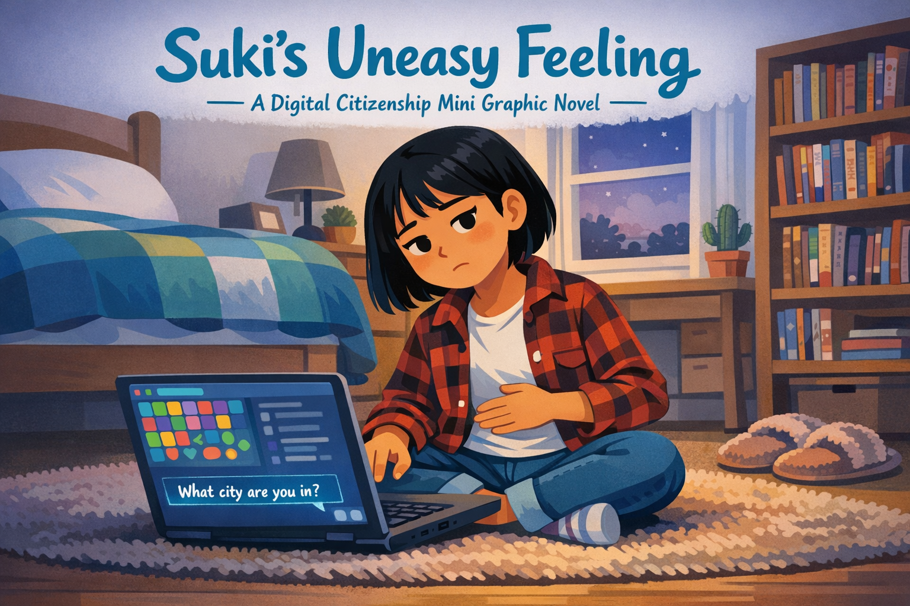
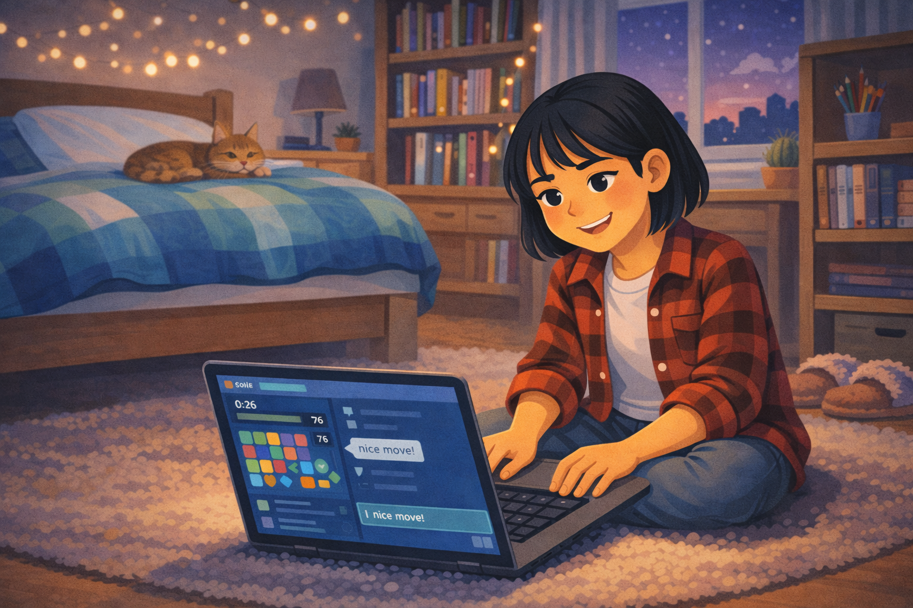
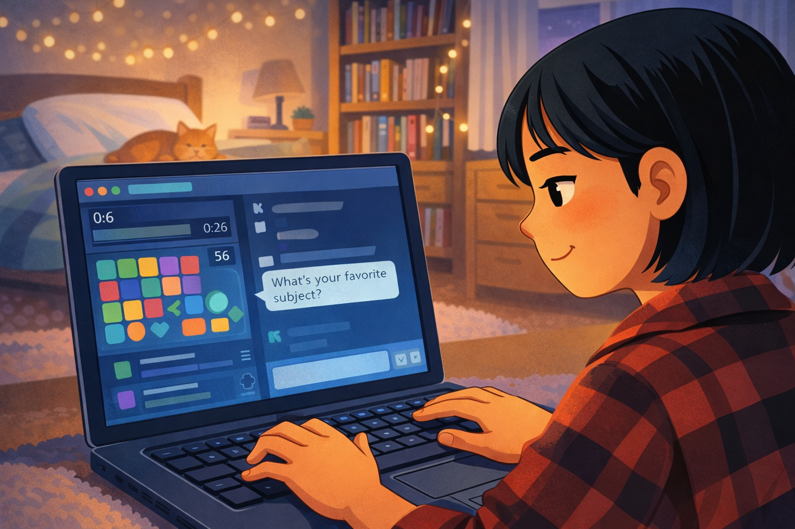
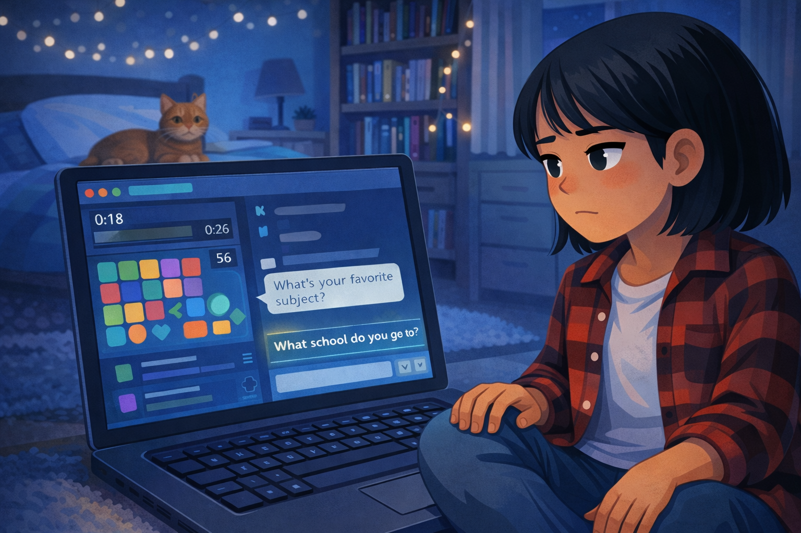
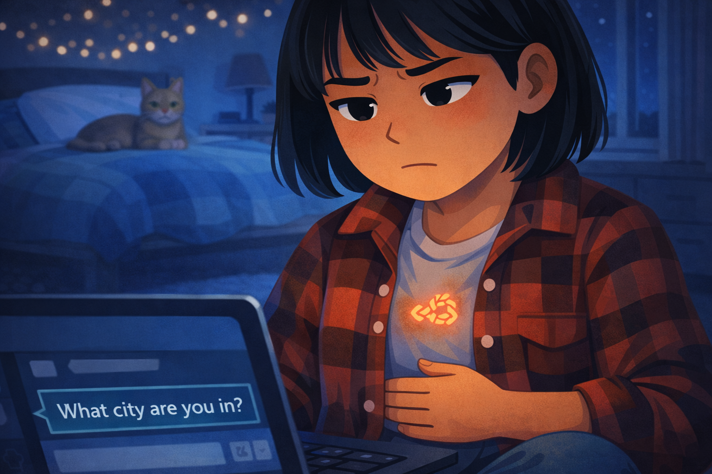
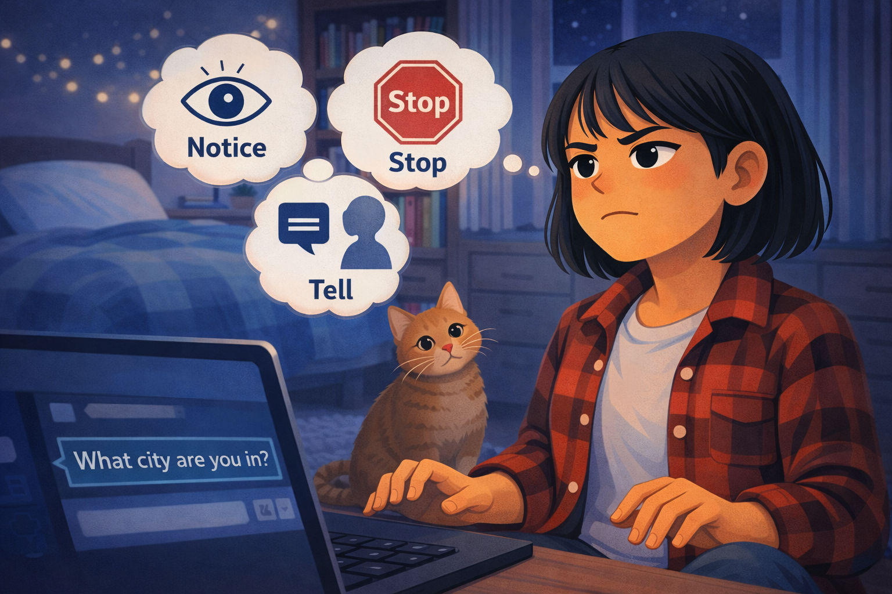
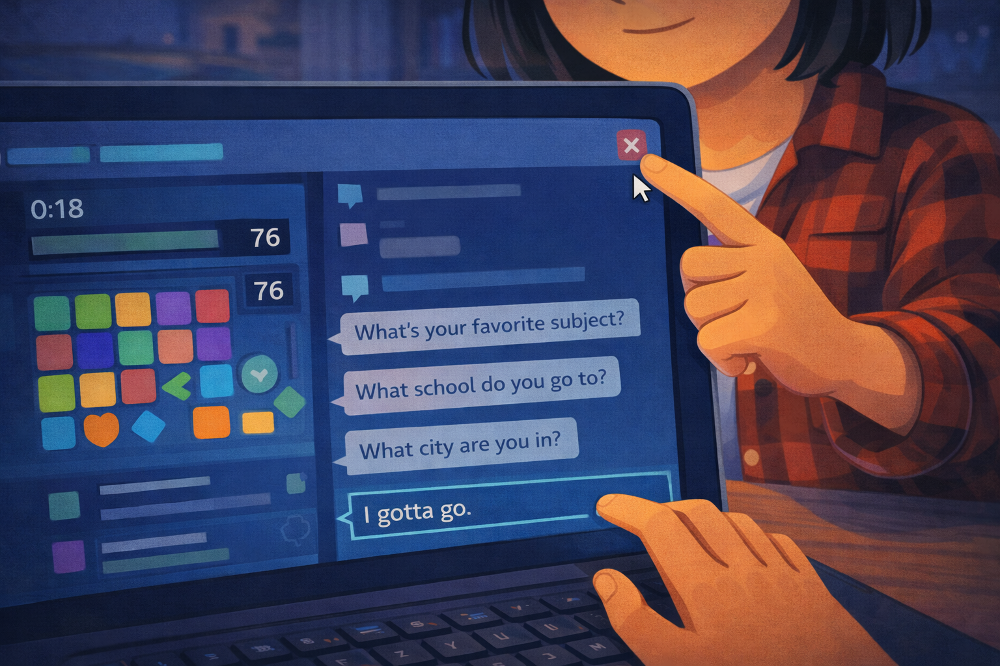
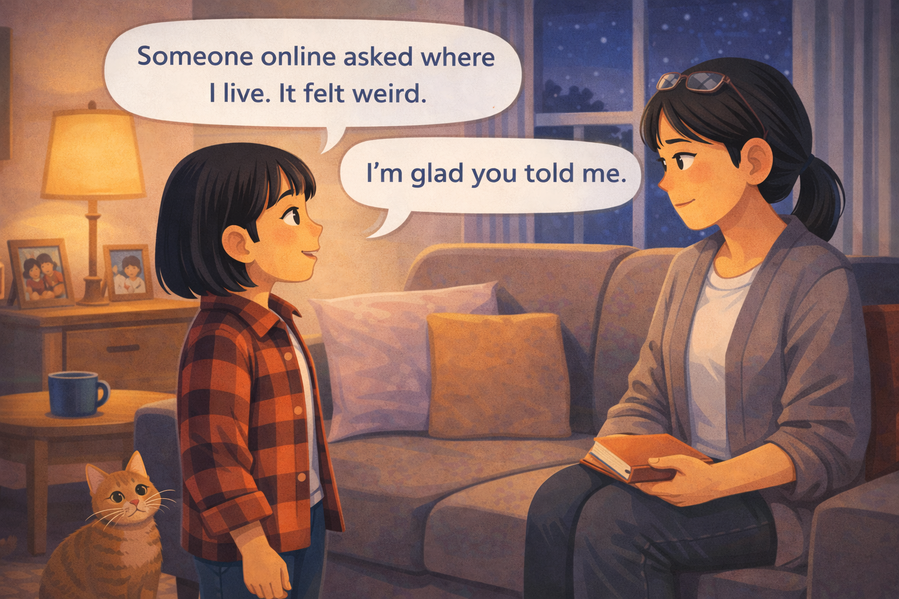

# Suki's Uneasy Feeling

*A Digital Citizenship mini graphic novel — companion to [Chapter 10: Safe Talk and Setting Boundaries](../../chapters/10-safe-talk-and-boundaries/index.md)*

Cover Image Prompt

Please generate a new wide-landscape image.
A dramatic composition focused on a fifth-grade girl named Suki. She has straight black hair cut in a neat bob just below her ears, light skin, and is wearing a cozy red-and-black flannel shirt over a white t-shirt, with blue jeans. She sits cross-legged on a carpeted bedroom floor, a laptop open in front of her, the screen casting a soft blue-white glow on her face.

Suki's expression is the key: her eyes are slightly narrowed, her head tilted a few degrees to the right, and one hand rests flat on her stomach — a subtle gesture suggesting the "knot" she feels inside. Her other hand rests on the laptop keyboard but has lifted off the keys, hovering. She is not typing. She is *listening to her gut*.

On the laptop screen, a simple generic game interface is visible — a colorful grid-based game board with abstract shapes, a chat sidebar with a few blurred message lines, and at the bottom of the chat, one clear line of text: "What city are you in?" The text glows slightly brighter than the rest of the chat, drawing the eye.

Behind Suki, her bedroom is cozy and detailed: a twin bed with a blue-and-green patchwork quilt, a bookshelf stuffed with chapter books and a few manga volumes, a desk lamp turned off, a small cactus on the windowsill, and a window showing early evening light — purple-blue sky, a few stars beginning to appear. A pair of fuzzy slippers sits on the floor next to her.

Across the top of the image, in friendly hand-lettered text the color of river-blue (#2e6f8e), the title: **Suki's Uneasy Feeling**. Below the title, slightly smaller, the subtitle: *A Digital Citizenship Mini Graphic Novel*.

**Style notes:**

- Modern flat cartoon vector illustration. Friendly, kid-readable lines. No heavy shading.
- Warm, slightly muted color palette with river-blue (#2e6f8e) accents in the title text and the laptop screen glow.
- 16:9 horizontal landscape composition.
- Mood: quiet tension, the moment between comfort and unease.
- No platform names, no real app interfaces, no logos.

Generate the image immediately without asking clarifying questions.

## A Story About Trusting Your Gut

Sometimes your body knows something is wrong before your brain figures it out. Your stomach gets tight. Your shoulders pull up. A little voice in the back of your head says, *Something about this feels off.*

That feeling is not silly. It is not overreacting. It is your body's way of keeping you safe. The hard part is listening to it — especially when nothing has gone wrong *yet*.

This is a story about Suki, a student who noticed a feeling, trusted it, and did exactly the right thing.

---

## Panel 1 — Game Night

Image Prompt

Please generate a new wide-landscape image.
A wide establishing shot of Suki's cozy bedroom in the early evening. Suki — a fifth-grade girl with straight black hair in a bob, light skin, red-and-black flannel shirt, jeans — sits cross-legged on the carpeted floor, laptop open in front of her. Her face is lit by the soft glow of the screen, and she is smiling happily, fully relaxed. Her posture is open and comfortable — leaning forward slightly, both hands on the keyboard, engaged in the game.

On the laptop screen, a colorful grid-based puzzle game is visible — abstract shapes in bright colors, a score counter, and a small chat sidebar on the right with a few friendly message bubbles. The topmost chat message reads: "nice move!" in simple text.

The bedroom is warm and detailed: a twin bed with a blue-and-green patchwork quilt in the background, a bookshelf with chapter books and manga, a desk with a cup of colored pencils, a small cactus on the windowsill, fuzzy slippers on the floor, and a string of fairy lights draped along the headboard of the bed, glowing softly. The window shows early evening — a dusky purple-blue sky with the first stars appearing.

A tabby cat is curled up on the bed behind Suki, sleeping peacefully.

**Style notes:**

- Modern flat cartoon vector style.
- Warm, cozy palette — this is a safe, comfortable moment.
- 16:9 horizontal landscape.
- Mood: happy, relaxed, safe. Everything is fine.
- No logos, no real app interface, no platform branding.

Generate the image immediately without asking clarifying questions.

Suki loves puzzle games. On Tuesday evening, she opens her favorite game and starts playing. A new player joins her round. They are good at the game. They type fast and make smart moves. Suki types back: "Nice combo!" The new player sends a smiley face. It feels like a normal, fun game night.

---

## Panel 2 — A Normal Question

Image Prompt

Please generate a new wide-landscape image.
A medium close-up of Suki at her laptop, still smiling. The camera angle is slightly over her shoulder so we can see the laptop screen clearly. In the chat sidebar of the game, a new message has appeared from the other player: "What's your favorite subject?" Suki's expression is relaxed and happy — she sees nothing wrong with this question. Her fingers rest comfortably on the keys, ready to type a reply.

The game board in the main area of the screen shows an active round in progress — colorful shapes arranged in a grid, a timer counting down, score numbers. The chat sidebar is simple and clean — no platform branding, no logos, just plain text bubbles in alternating colors.

The cozy bedroom details from Panel 1 are visible in the soft-focus background: the fairy lights, the sleeping cat, the bookshelf. The warm evening light continues.

**Style notes:**

- Modern flat cartoon vector style.
- Warm, comfortable palette — still safe, still normal.
- 16:9 horizontal landscape.
- Mood: friendly, easy, nothing to worry about.
- The chat message must be clearly readable.
- No logos, no real app interface.

Generate the image immediately without asking clarifying questions.

A few rounds in, the player types: "What's your favorite subject?" Suki types back: "Science. I love experiments." The player says: "Same! I like building stuff." Suki smiles. This is the kind of chat she has with friends all the time. A normal question. A normal answer.

---

## Panel 3 — The First Shift

Image Prompt

Please generate a new wide-landscape image.
A medium shot of Suki at her laptop. Her posture has changed subtly from Panel 2. She is still sitting cross-legged, but her shoulders have risen slightly. Her smile has faded to a neutral expression — not upset yet, but no longer carefree. One hand has paused on the keyboard. The other hand rests on her knee.

On the laptop screen, the chat sidebar shows a new message from the other player: "What school do you go to?" The message stands out — it is the newest and brightest line in the chat. Above it, the earlier friendly messages are still visible.

Suki's head is tilted slightly, and her eyes have narrowed just a fraction — the beginning of attention, not yet alarm. The tabby cat on the bed behind her has lifted its head, ears perked, as if it sensed something too.

The bedroom remains the same, but the light from the window has dimmed slightly — the sky is a deeper blue now, fewer warm tones. The fairy lights glow a little brighter by contrast.

**Style notes:**

- Modern flat cartoon vector style.
- The palette shifts slightly cooler — less golden warmth, more blue tones — to mirror Suki's mood shift.
- 16:9 horizontal landscape.
- Mood: the first flicker of uncertainty. Subtle, not dramatic.
- The chat message must be clearly readable.
- No logos, no real app interface.

Generate the image immediately without asking clarifying questions.

Then the player types a new question: "What school do you go to?" Suki's fingers pause above the keys. She is not sure why, but the question feels different from the last one. Favorite subject is about *what you like*. School name is about *where you are*. She has not answered yet.

---

## Panel 4 — The Knot

Image Prompt

Please generate a new wide-landscape image.
A close-up of Suki from the chest up, almost head-on. Her expression has clearly shifted: brows pulled slightly together, lips pressed into a thin line, eyes focused on the screen with a wary, uncomfortable look. Her flannel shirt collar is pulled up slightly as if she has hunched her shoulders. One hand has moved from the keyboard to rest flat against her stomach — a visible gesture of the "knot" she feels inside.

On the laptop screen, partially visible at the bottom of the frame, the chat sidebar shows a new message: "What city are you in?" The text is plain but feels heavier now in context.

In the center of Suki's chest, just above where her hand presses against her stomach, a small soft orange-red knotted-rope shape glows faintly — a visual symbol of the uneasy feeling, matching the visual language from the Jordan story. It is not scary or painful-looking, just clearly present.

The bedroom background has dimmed further. The window shows a dark evening sky. The fairy lights and the laptop screen are now the main light sources, casting cool blue and warm amber in competing pools. The cat on the bed is sitting up now, watching Suki with alert eyes.

**Style notes:**

- Modern flat cartoon vector style.
- The knotted-rope symbol is subtle but important — it is the visual anchor for "trust your gut."
- 16:9 horizontal landscape.
- Mood: unease, the body sending a signal.
- Cooler palette than earlier panels.
- No logos, no real app interface.

Generate the image immediately without asking clarifying questions.

Before Suki can decide, another message appears: "What city are you in?" Now the knot in her stomach tightens. She does not know this person. She has never met them. And they are asking questions that point toward finding her in real life. Her hand moves from the keyboard to her stomach. Something feels wrong.

---

## Panel 5 — Notice, Stop, Tell

Image Prompt

Please generate a new wide-landscape image.
A medium shot of Suki sitting up straighter at her laptop. Her expression has shifted from uneasy to determined — her jaw is set, her eyes are clear and focused, her chin is slightly raised. She looks like someone who has made a decision.

Three clean thought bubbles float in the air around her head, arranged in a clear sequence from left to right, each containing a simple icon and a short phrase in clean, kid-readable text:

- Left bubble: a small eye icon with the word **"Notice"** — she is recognizing the feeling.
- Center bubble: a red octagonal stop-sign icon with the word **"Stop"** — she is deciding to end the conversation.
- Right bubble: a speech-bubble icon pointing toward an adult silhouette with the word **"Tell"** — she is planning to find a trusted adult.

The laptop screen is still visible, but Suki's hands have lifted completely off the keyboard. Her fingers are spread slightly, hovering above the keys — she is choosing *not* to type.

The bedroom is the same, but Suki's posture and expression create a feeling of quiet strength. The cat has jumped down from the bed and is now sitting next to Suki on the floor, looking up at her.

**Style notes:**

- Modern flat cartoon vector style.
- The three thought bubbles with Notice-Stop-Tell are the teaching moment — they must be clearly readable and visually sequential.
- 16:9 horizontal landscape.
- Mood: clarity, resolve, inner strength.
- Slightly warmer palette returning — the decision brings back some warmth.
- No logos.

Generate the image immediately without asking clarifying questions.

Suki remembers what she learned in class. When a conversation online makes you feel uneasy, there are three steps: **Notice** the feeling. **Stop** the conversation. **Tell** a trusted adult. She does not need to explain herself to this stranger. She does not owe them an answer. She just needs to listen to the knot in her stomach and act on it.

---

## Panel 6 — Closing the Chat

Image Prompt

Please generate a new wide-landscape image.
A close-up of Suki's hands and the laptop screen. Her left hand is on the keyboard, having just typed a short message in the chat: "I gotta go." Her right hand is moving toward the top-right corner of the screen, finger reaching for a simple X button to close the chat window. The cursor on the screen hovers near the close button.

On the chat sidebar, the conversation history is visible: the earlier friendly messages, then "What school do you go to?", then "What city are you in?", and at the bottom, Suki's reply: "I gotta go." The stranger's messages are in one color, Suki's in another — simple and generic, no platform branding.

Suki's face is partially visible at the top of the frame — just her chin and the bottom of a small, calm, relieved expression. She is not panicking. She is handling it.

The laptop screen dominates the frame. The game board is still visible behind the chat sidebar, but the game no longer matters.

**Style notes:**

- Modern flat cartoon vector style.
- The close-button X and Suki's cursor are the visual anchor — she is ending this on her own terms.
- 16:9 horizontal landscape.
- Mood: calm action, quiet control.
- No logos, no real app interface, no platform names.

Generate the image immediately without asking clarifying questions.

Suki types two words: "I gotta go." She does not explain why. She does not apologize. She clicks the X and closes the chat. The screen goes quiet. The game board sits there, still and colorful, but Suki is already standing up.

---

## Panel 7 — Telling a Trusted Adult

Image Prompt

Please generate a new wide-landscape image.
A warm, wide shot of a living room. Suki stands next to a couch where her mom is sitting. Her mom is a woman with straight black hair pulled back in a low ponytail, light skin, wearing a comfortable gray cardigan and reading glasses pushed up on her forehead. She has set down a book she was reading and is turned fully toward Suki, giving her complete attention. Her expression is warm, calm, and attentive — not alarmed, not angry, just *listening*.

Suki stands facing her mom, hands at her sides, looking up at her. Her expression is open and honest — a mix of relief and slight nervousness. Her mouth is slightly open as if she is mid-sentence. A single clean word balloon from Suki reads: **"Someone online asked where I live. It felt weird."**

A second word balloon from her mom reads: **"I'm glad you told me."**

The living room is cozy: a soft gray couch with throw pillows, a floor lamp casting warm light, a coffee table with a mug on it, family photos in frames on a side table, and a window showing the dark evening sky outside. The tabby cat from earlier panels has followed Suki into the room and sits near her feet.

The overall mood is warm, safe, and resolved. The living room feels like a place where it is safe to talk about hard things.

**Style notes:**

- Modern flat cartoon vector style.
- The body language between Suki and her mom is the centerpiece — a child trusting an adult, an adult earning that trust.
- 16:9 horizontal landscape.
- Mood: relief, safety, warmth.
- Warm palette fully restored — golden lamp light, soft colors.
- Word balloons must be clearly readable at small sizes.
- No logos.

Generate the image immediately without asking clarifying questions.

Suki finds her mom in the living room. "Mom," she says, "someone online asked where I live. It felt weird." Her mom puts down her book and looks at Suki. "I'm glad you told me," she says. She does not look angry. She does not say Suki did anything wrong. She just listens, asks a few questions, and says, "You handled that exactly right."

Suki feels the knot in her stomach loosen. She did the right thing.

---

## What Suki Teaches Us

Suki did not wait for something bad to happen. She noticed a feeling, trusted it, and acted before the situation got worse. That is the whole point of the Notice, Stop, Tell rule — you do not need proof that something is dangerous. You just need to listen when your body says, *This does not feel right.*

| Moment | What Suki did | What we can learn |
|---|---|---|
| The normal question | She answered a safe question about her favorite subject | Not every question is dangerous — some are just friendly |
| The shift | She noticed the questions changed from interests to location | Pay attention when questions move toward where you are |
| The knot | She felt the uneasy feeling in her stomach | Your body sends signals before your brain catches up |
| The decision | She remembered Notice, Stop, Tell | A simple plan works better than freezing |
| The exit | She typed "I gotta go" and closed the chat | You never owe a stranger an explanation |
| The telling | She found her mom and said what happened | Telling a trusted adult is not tattling — it is safety |

## You Can Do This Too

Suki did not need to be brave in a big, dramatic way. She just needed to trust a small, quiet feeling and follow three steps.

You will have moments like this. Maybe in a game. Maybe in a chat. Maybe in a comment section. When the questions start to feel different — when they move from *what you like* to *where you are* — that is your signal.

Notice the feeling. Stop the conversation. Tell a trusted adult. You do not need to be sure something is wrong. You just need to feel it. That is enough.

Tell a parent, a guardian, a teacher, a school counselor, or a librarian. You will not be in trouble for telling. You will never be in trouble for telling.

## Related Reading

- [Chapter 10: Safe Talk and Setting Boundaries](../../chapters/10-safe-talk-and-boundaries/index.md) — the chapter this story belongs to. Teaches the Notice, Stop, Tell rule and explains the difference between safe questions and boundary-crossing questions.
- [Chapter 5: Private vs. Personal Information](../../chapters/05-private-vs-personal-info/index.md) — defines what counts as private information and why your school name, city, and address should never be shared with strangers online.
