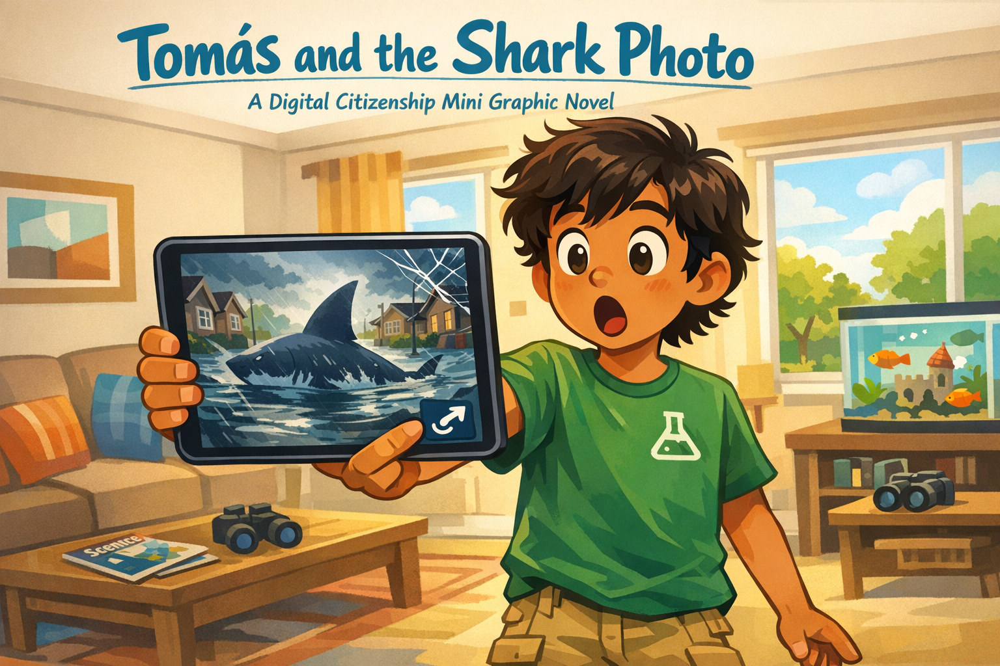
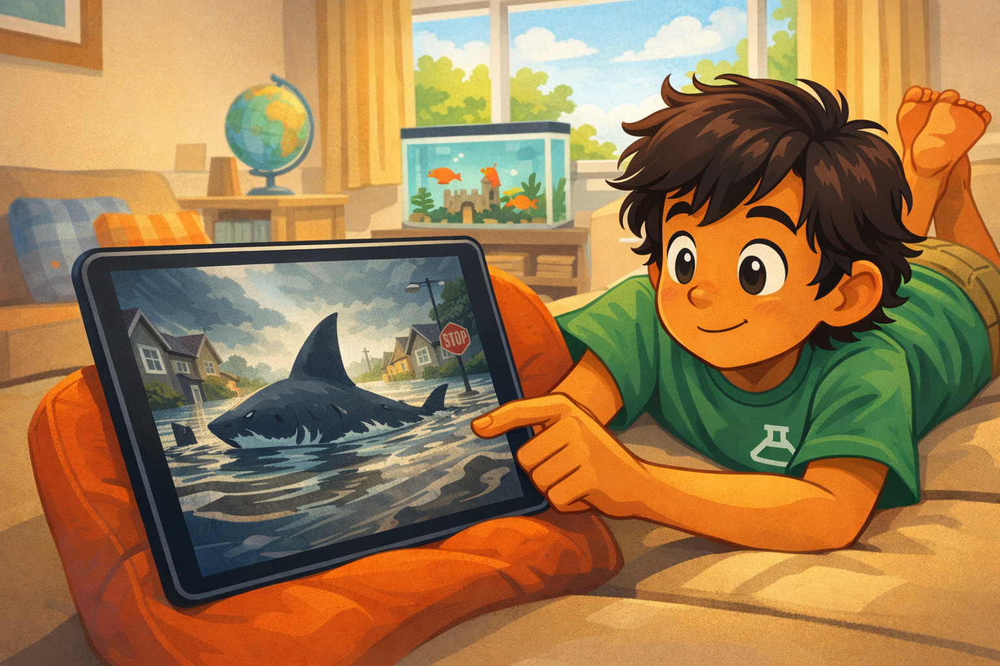
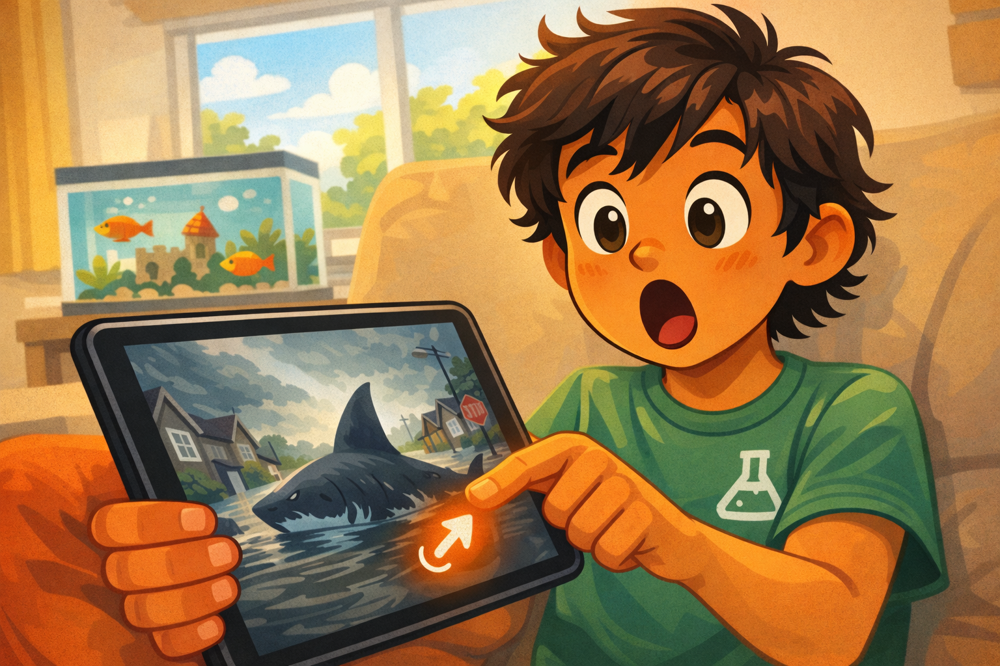
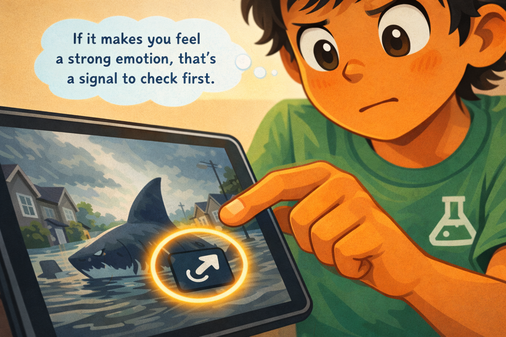
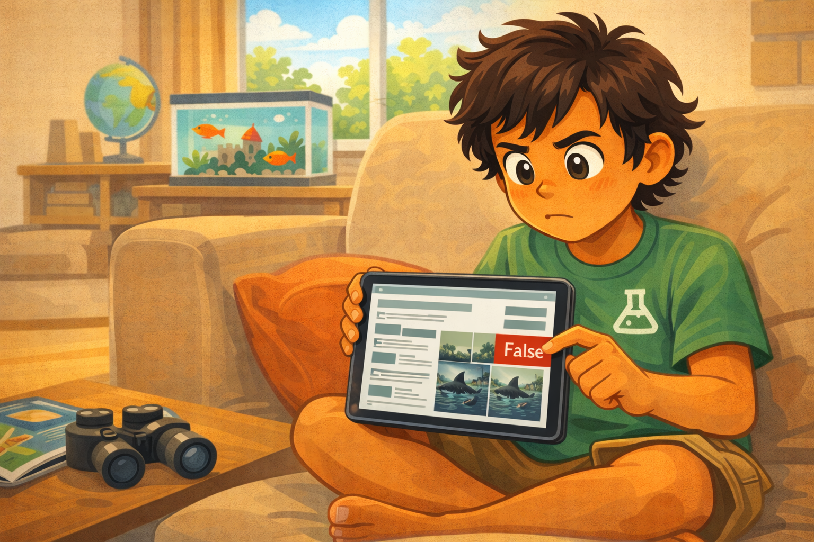
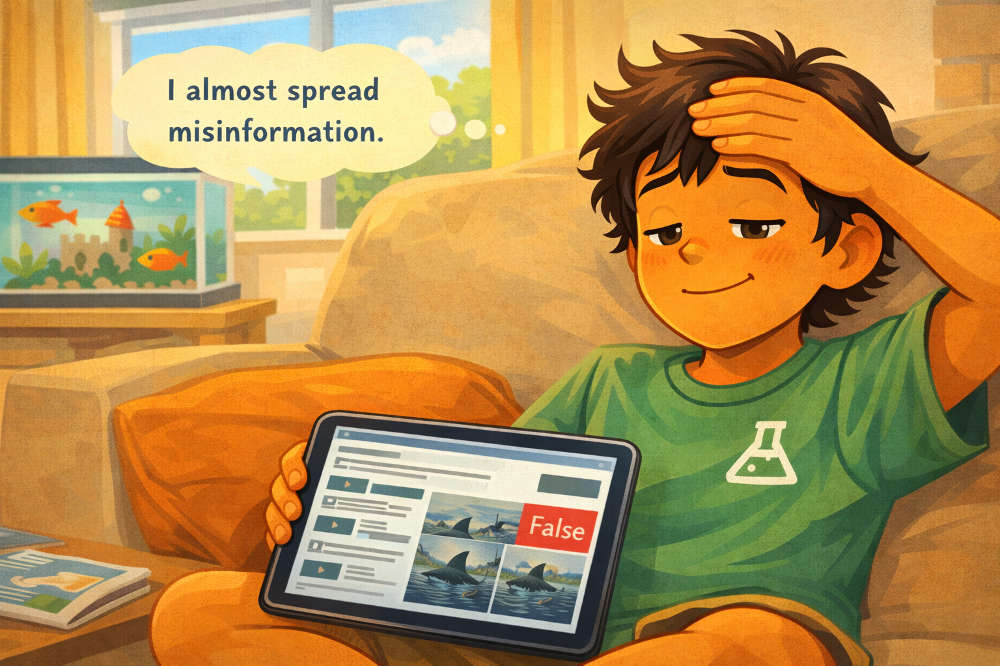
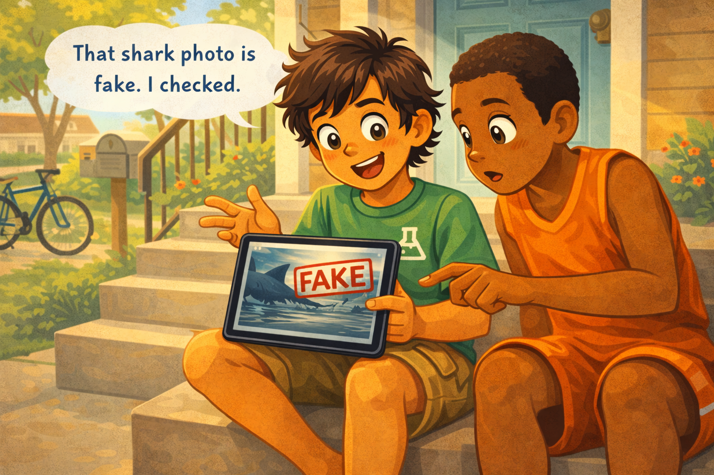
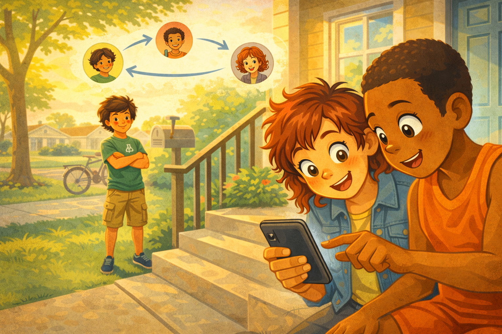

# Tomás and the Shark Photo

*A Digital Citizenship mini graphic novel — companion to [Chapter 13: What Is Misinformation?](../../chapters/13-what-is-misinformation/index.md)*

Cover Image Prompt

Please generate a new wide-landscape image.
A dramatic, eye-catching composition. In the center of the frame, a fifth-grade boy holds a tablet at arm's length, staring at the screen with wide, amazed eyes. He is Tomás — tan skin, wavy dark hair that falls across his forehead, wearing a green science-camp t-shirt with a small white beaker logo on the chest and khaki cargo shorts. His mouth is slightly open in a "Whoa!" expression. His right thumb hovers near the bottom of the tablet screen, close to an abstract share-arrow icon.

The tablet screen shows a dramatic image: a large gray shark silhouette swimming through a flooded suburban street. The image is deliberately over-the-top — vivid, cinematic, designed to trigger an emotional reaction. But the tablet screen has a subtle cracked-glass overlay effect in one corner, hinting that what is on the screen may not be what it seems.

Behind Tomás, slightly out of focus, is a bright living room: a couch with throw pillows, a coffee table with a science magazine and a pair of binoculars, a window showing a sunny afternoon with green trees and a blue sky (clearly no hurricane, no flood — a visual contradiction with the photo on the screen). A small fish tank with colorful fish sits on a shelf.

Across the top of the image, in friendly hand-lettered text the color of river-blue (#2e6f8e), the title: **Tomás and the Shark Photo**. Below the title, slightly smaller, the subtitle: *A Digital Citizenship Mini Graphic Novel*.

**Style notes:**

- Modern flat cartoon vector illustration. Friendly, kid-readable lines. No heavy shading.
- Warm, slightly muted color palette with river-blue (#2e6f8e) accents in the title text and the tablet screen border.
- 16:9 horizontal landscape composition.
- Mood: dramatic curiosity about to meet careful thinking. The tension between "Wow!" and "Wait..."
- No platform names, no real app interfaces, no logos (except the fictional beaker logo on his shirt).

Generate the image immediately without asking clarifying questions.

## A Story About Strong Feelings and Fast Fingers

Have you ever seen something online that made your eyes go wide? A photo so wild, a headline so shocking, that your finger moved toward the share button before your brain even finished thinking?

That feeling — the rush to share something amazing — is exactly what **misinformation** counts on. Misinformation is false or misleading information that spreads because people share it before they check it. And the fastest way to make someone share without checking is to make them feel a strong emotion first.

This is a story about Tomás, a boy who loves science, loves facts, and almost shared something that was not real.

---

## Panel 1 — The Shark in the Street

Image Prompt

Please generate a new wide-landscape image.
A medium shot of Tomás lying on his stomach on a living room couch, tablet propped on a pillow in front of him. He is a fifth-grade boy with tan skin, wavy dark hair falling across his forehead, wearing a green science-camp t-shirt with a small white beaker logo and khaki cargo shorts. His bare feet are kicked up behind him. He is scrolling casually, relaxed and comfortable.

On the tablet screen, a dramatic photo has just appeared: an abstract image of a large gray shark silhouette swimming through murky brown floodwater on a residential street. The street has partially submerged cars, a mailbox, and a stop sign. The image is vivid and cinematic — designed to look shocking. No real text is visible on the screen, just the dramatic image.

The living room is bright and cozy: a coffee table with a science magazine, a globe, and a pair of binoculars. A fish tank with colorful tropical fish sits on a shelf behind the couch. A window shows a sunny afternoon — green trees, blue sky, no storm at all. The contrast between the calm, sunny room and the dramatic shark photo is part of the story.

**Style notes:**

- Modern flat cartoon vector style, consistent with the cover.
- Warm, bright palette with the tablet screen showing cooler, more dramatic tones — the photo has a different visual temperature than the cozy room.
- 16:9 horizontal landscape.
- Mood: casual comfort suddenly interrupted by something dramatic.
- No text, no logos (except the beaker on Tomás's shirt), no real app interfaces.

Generate the image immediately without asking clarifying questions.

Tomás is lying on the couch after school, scrolling through his tablet. He loves animals — sharks, octopuses, anything that swims. So when a photo pops up on his feed showing a huge shark swimming down a flooded street, he stops cold.

The photo is wild. A great white shark, right there in the middle of a neighborhood, gliding past parked cars and a stop sign. The water is brown and choppy. It looks completely real.

---

## Panel 2 — "Whoa! This Is Real?!"

Image Prompt

Please generate a new wide-landscape image.
A close-up of Tomás from chest up, sitting upright on the couch now. He has pushed himself up from his lying position, tablet held in both hands at chest level. His eyes are wide open, eyebrows raised high, mouth open in a big "Whoa!" expression. His wavy dark hair is slightly messy from lying on the couch.

His right thumb is hovering near the bottom of the tablet screen, moving toward an abstract share-arrow icon. The share icon glows with a subtle warm orange pulse, like it is calling to him. The shark photo is still visible on the screen above his thumb.

Behind him, the fish tank on the shelf shows small colorful tropical fish swimming peacefully — a quiet visual contrast to the dramatic shark on the screen. The sunny window and living room are visible in soft focus.

**Style notes:**

- Modern flat cartoon vector style.
- Warm palette with the orange-pulsing share icon as a visual symbol of the urge to share.
- 16:9 horizontal landscape.
- Mood: pure excitement, impulse. His brain has not caught up to his thumb yet.
- No text bubbles, no logos beyond the beaker.

Generate the image immediately without asking clarifying questions.

Tomás sits straight up. "Whoa!" he says out loud to nobody. "This is real?!" His heart is beating fast. He has to share this with everyone. His thumb slides toward the share button. This is the coolest thing he has ever seen.

He is one tap away from sending it.

---

## Panel 3 — The Pause

Image Prompt

Please generate a new wide-landscape image.
A close-up of Tomás's hand and the tablet screen. His thumb is frozen mid-air, about half an inch above the abstract share-arrow icon. A soft, glowing yellow ring of light surrounds the space between his thumb and the share button — the same "held breath" visual from the Jordan story, connecting the two stories thematically.

In the upper part of the frame, Tomás's face is partially visible. His excited expression from Panel 2 has shifted: his wide eyes have narrowed slightly, his open mouth has closed. He looks like someone who just remembered something important.

A small thought bubble floats near his head with the words: **"If it makes you feel a strong emotion, that's a signal to check first."** The thought bubble is pale blue with clean dark text.

The tablet screen shows the shark photo, but now the share icon has stopped pulsing — the urgency is fading as Tomás's thinking brain catches up.

**Style notes:**

- Modern flat cartoon vector style.
- Warm palette with the glowing yellow ring as the visual centerpiece of the pause.
- 16:9 horizontal landscape.
- Mood: the critical moment — impulse giving way to thought.
- The thought bubble text must be readable at small sizes.
- No logos beyond the beaker.

Generate the image immediately without asking clarifying questions.

Then Tomás stops. His thumb freezes. He remembers what his teacher said in class last week: *"If something online makes you feel a strong emotion — excitement, anger, fear — that feeling is a signal. It means: check first."*

Tomás looks at the shark photo again. He felt excitement. A lot of it. His heart is still pounding. That is the signal.

---

## Panel 4 — Checking the Facts

Image Prompt

Please generate a new wide-landscape image.
A medium shot of Tomás sitting cross-legged on the couch, tablet flat on his lap. He is now in research mode. On the tablet screen, the view has changed: instead of the dramatic shark photo, the screen shows an abstract search-results page. Several search result cards are stacked — small thumbnail images and lines of abstract text. One result card near the top has a small red "X" or "False" badge on it, and a thumbnail showing a comparison of the shark photo side-by-side with the original un-edited photo.

Tomás's expression is focused and serious — brow slightly furrowed, eyes scanning the screen, mouth in a small concentrated line. He looks like a scientist studying data. One hand supports the tablet; the other hand's index finger scrolls through results.

The coffee table in front of the couch shows the science magazine open to a page about ocean life, and the binoculars — reinforcing that Tomás is a kid who loves observing and investigating. The sunny window and fish tank are visible in the background.

**Style notes:**

- Modern flat cartoon vector style.
- Warm palette with the red "False" badge as a small but clear visual signal.
- 16:9 horizontal landscape.
- Mood: focused investigation. The excitement has been replaced by curiosity — a healthier kind.
- The search results should be abstract (no real search engine, no readable URLs), but the "False" badge should be clearly visible.
- No logos beyond the beaker, no real app or search engine interfaces.

Generate the image immediately without asking clarifying questions.

Tomás opens a new tab. He searches for "shark in flooded street photo." The results come up fast. And what he finds surprises him.

The photo is fake. It has been shared online every hurricane season for years. Someone took a real photo of a flooded street and added a shark using photo-editing software. Fact-checking websites have debunked it over and over. It goes viral every time anyway — because it triggers such a strong reaction.

---

## Panel 5 — The Relief

Image Prompt

Please generate a new wide-landscape image.
A close-up of Tomás from chest up, leaning back against the couch cushions. His tablet rests on his lap, screen showing the fact-check results. His expression has completely changed from the excited "Whoa!" of Panel 2: he is now showing visible relief. His eyes are half-closed, his shoulders have dropped from their tense position, and a small, slightly embarrassed smile sits on his face. One hand rests on his forehead in a classic "phew" gesture.

Above his head, a thought bubble floats with the words: **"I almost spread misinformation."** The thought bubble is pale yellow with clean dark text.

The warm living room surrounds him. The fish tank fish swim peacefully. Afternoon sunlight slants through the window. The mood is calm — the crisis has passed.

**Style notes:**

- Modern flat cartoon vector style.
- Warm, relaxed palette — the visual tension from earlier panels has dissolved.
- 16:9 horizontal landscape.
- Mood: relief, self-awareness, a lesson learned in real time.
- The thought bubble text must be readable at small sizes.
- No logos beyond the beaker.

Generate the image immediately without asking clarifying questions.

Tomás leans back against the couch. He lets out a long breath. He feels two things at once. First, relief. He almost shared something fake with everyone he knows. He almost became part of the misinformation chain.

Second, he feels a little embarrassed. He — the kid who loves science, who checks facts about animals for fun — almost fell for a fake photo. But then he thinks: *That's the whole point. Misinformation is designed to trick smart people. It works because it targets your feelings, not your brain.*

He did not share it. That is what matters.

---

## Panel 6 — Telling a Friend

Image Prompt

Please generate a new wide-landscape image.
A medium shot of two boys sitting on the front steps of a house. Tomás is on the left — tan skin, wavy dark hair, green science-camp t-shirt with the beaker logo, cargo shorts. Next to him sits his friend — a boy with dark brown skin, short-cropped hair, a bright orange basketball jersey, and basketball shorts. Tomás is holding his tablet out to show his friend the screen.

On the tablet screen, the shark photo is visible again, but now with a large abstract red "FAKE" stamp overlaid on it. Tomás's expression is animated and confident — he is explaining what he found, gesturing with one hand. A clean word balloon from Tomás reads: **"That shark photo is fake. I checked."**

His friend's expression shows surprise and interest — eyebrows raised, leaning in to look at the screen, one hand reaching toward the tablet to see more closely.

The setting is a residential front porch: concrete steps, a green lawn, a mailbox, a tree with green leaves, afternoon sunlight. A bicycle is leaned against the railing. The mood is friendly and casual — two friends hanging out.

**Style notes:**

- Modern flat cartoon vector style.
- Warm, bright outdoor palette with river-blue (#2e6f8e) accents.
- 16:9 horizontal landscape.
- Mood: confidence, friendship, knowledge-sharing. Tomás is not bragging — he is helping his friend avoid the same mistake.
- The word balloon text must be readable at small sizes.
- No logos beyond the beaker.

Generate the image immediately without asking clarifying questions.

The next day, Tomás is hanging out with his friend Darius on the front steps. Darius pulls out his phone. "Did you see that shark photo? A shark in someone's neighborhood! I'm about to share it."

Tomás grins. "That shark photo is fake," he says. "I checked. Someone made it with photo-editing software. It goes around every year." He shows Darius the fact-check results on his tablet.

Darius looks at the screen, then back at Tomás. "For real? It looked so real."

"That's the whole trick," Tomás says. "It's supposed to look real. That's how misinformation works."

---

## Panel 7 — The Fact-Checker Chain

Image Prompt

Please generate a new wide-landscape image.
A wide, uplifting shot showing a chain reaction of fact-checking. In the foreground, Darius — dark brown skin, short-cropped hair, orange basketball jersey — is now showing his own phone to a third kid, a girl with curly red hair and a denim jacket, who is leaning in with interested surprise. In the middle ground, Tomás stands a few steps away, watching with a proud, quiet smile, arms crossed, leaning against the porch railing.

Above the scene, a simple visual diagram floats like a thought illustration: three small circles connected by arrows — the first circle contains a tiny version of Tomás, the second contains Darius, the third contains the red-haired girl — showing how the fact-check is spreading from person to person, the same way misinformation spreads, but this time carrying the truth.

The setting continues on the front porch and lawn. Warm golden late-afternoon light bathes the scene. The tree casts long, gentle shadows across the grass. The bicycle is still leaned against the railing.

**Style notes:**

- Modern flat cartoon vector style, consistent with all previous panels.
- Warm, golden palette — the warmest and most hopeful panel in the story.
- 16:9 horizontal landscape.
- Mood: hopeful, empowering. The truth spreads the same way misinformation does — from person to person. But this time, the chain is a good one.
- The visual diagram should be simple, clean, and not distracting — a gentle visual metaphor above the main scene.
- No logos beyond the beaker.

Generate the image immediately without asking clarifying questions.

Darius does not share the shark photo. Instead, he tells the next person who mentions it: "That one's fake. Tomás checked."

And that person tells someone else.

The fact-check spreads just like misinformation does — from person to person. But this time, the chain is carrying the truth. And it started because one kid paused for ten seconds before hitting share.

---

## What Tomás Teaches Us

Tomás is not a fact-checking expert. He is a kid who likes sharks and science. But he remembered one rule: *strong feelings are a signal to check first.* That one rule saved him from spreading a fake photo to everyone he knows.

| Moment | What Tomás did | What we can learn |
|---|---|---|
| The photo | He felt a huge rush of excitement | Strong emotions — excitement, shock, anger, fear — are misinformation's favorite tool |
| The impulse | His thumb moved toward the share button | The urge to share is fastest when the feeling is strongest — that is by design |
| The pause | He remembered his teacher's rule and stopped | "If it makes you feel a strong emotion, check first" is a rule you can use forever |
| The check | He searched for the photo and found fact-check results | Checking takes less than a minute — sharing something fake lasts much longer |
| The chain | He told his friend, who told someone else | When you share the truth, you start a fact-checking chain — the opposite of a misinformation chain |

## You Can Do This Too

The next time you see something online that makes your eyes go wide — a wild photo, a shocking headline, an unbelievable claim — try this:

1. **Notice the feeling.** Are you excited? Scared? Angry? Amazed? That feeling is your signal.
2. **Pause before you share.** Take your thumb off the button. You can always share later. You can never un-share.
3. **Check.** Search for the claim. Look for fact-checking websites. Ask a trusted adult. If you cannot find proof that it is true, do not share it.
4. **Tell someone.** If you find out something is fake, tell the people around you. You become a link in the fact-checking chain instead of the misinformation chain.

Misinformation does not spread because people are foolish. It spreads because people are human. We feel things first and think second. Tomás felt it too — the rush, the excitement, the urge to share. The difference is that he gave himself ten seconds to check. You can do the same thing, starting today.

## Related Reading

- [Chapter 13: What Is Misinformation?](../../chapters/13-what-is-misinformation/index.md) — the chapter this story belongs to. Defines *misinformation*, *disinformation*, and *viral content*, and explains why false information spreads so fast.
- [Chapter 14: Becoming a Fact Checker](../../chapters/14-becoming-a-fact-checker/index.md) — practical tools and steps for checking whether something online is true, including reverse image search and fact-checking websites.
