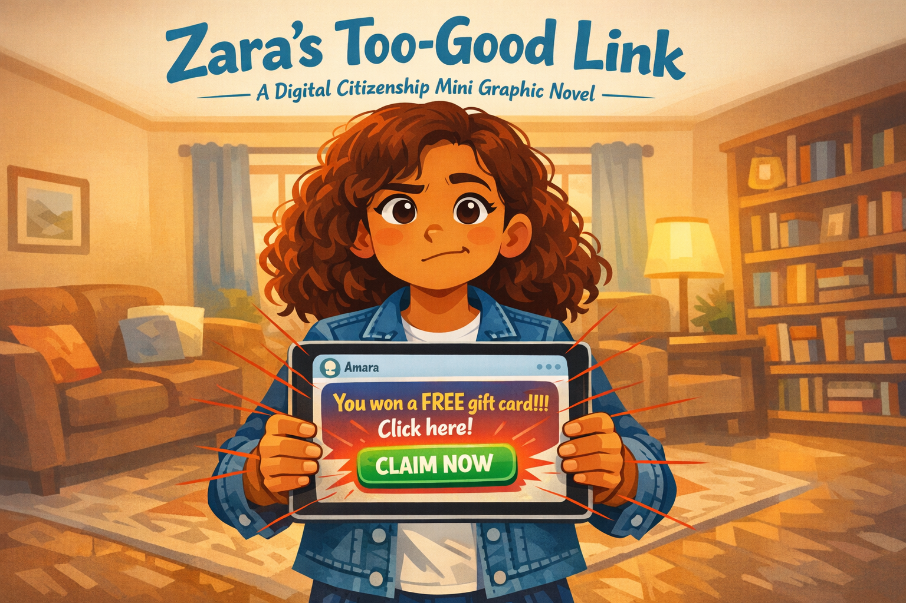
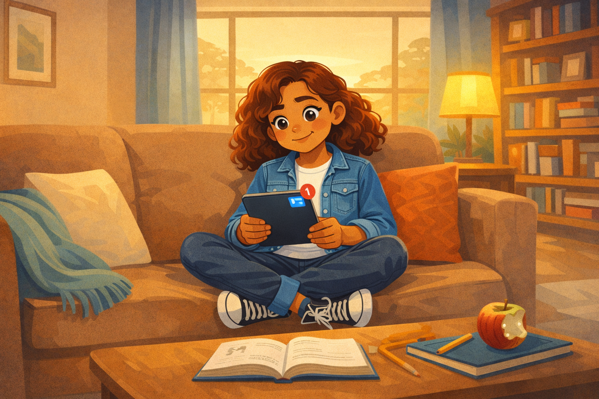
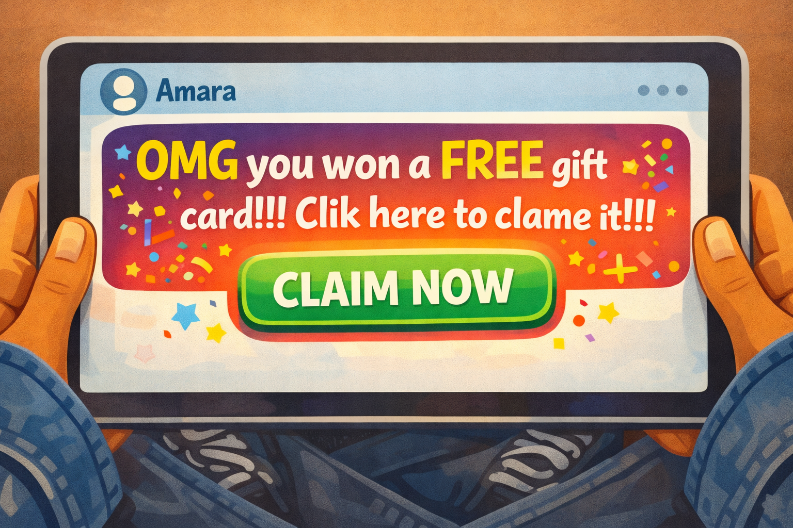
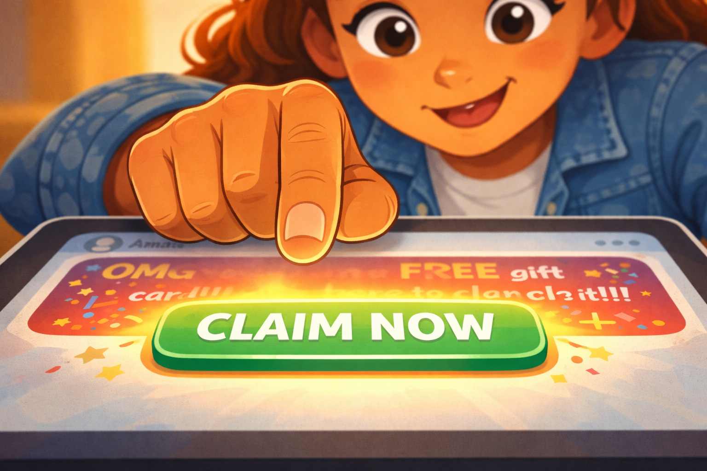
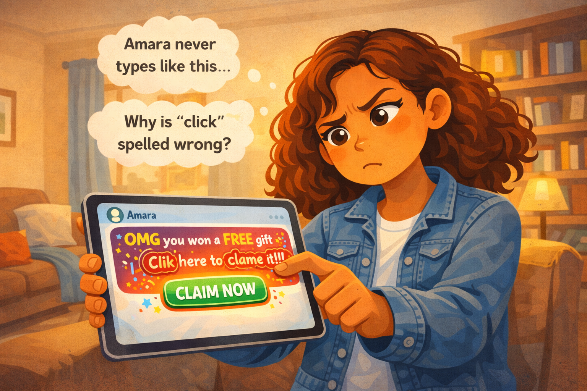
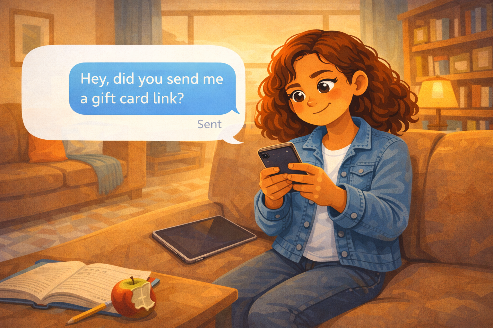
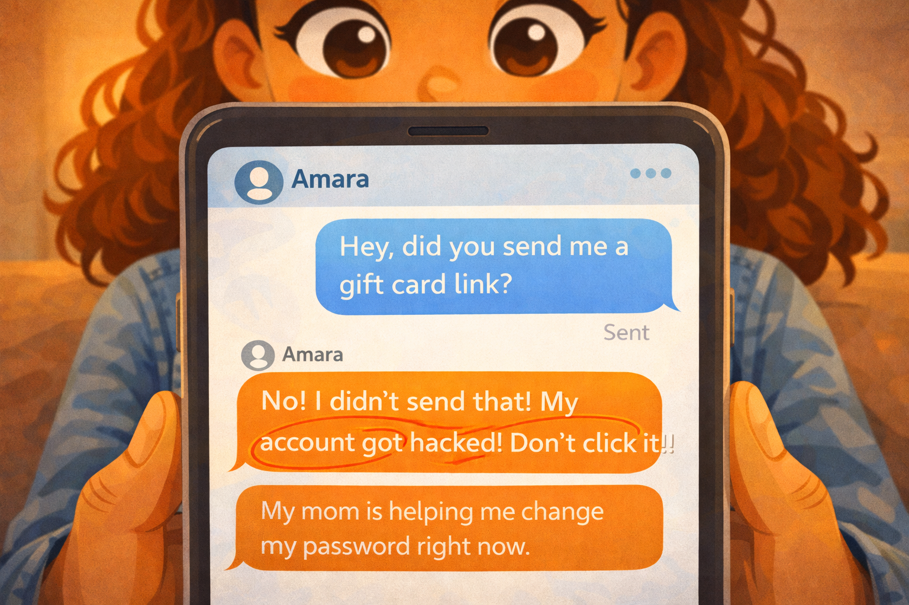
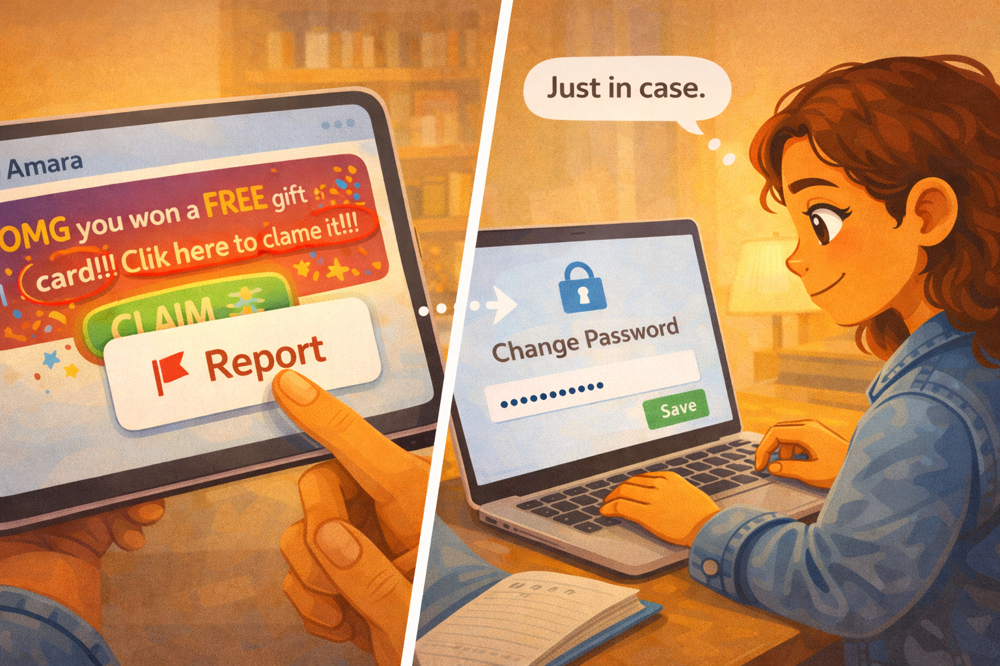

# Zara's Too-Good Link

*A Digital Citizenship mini graphic novel — companion to [Chapter 6: Passwords, Clickbait, and Staying Safe Online](../../chapters/06-passwords-and-online-safety/index.md)*

Cover Image Prompt

Please generate a new wide-landscape image.
A dramatic, kid-friendly composition. In the center of the frame, a fifth-grade girl — Zara, with curly auburn hair that falls just past her shoulders, warm tan skin, dark brown eyes, wearing a denim jacket over a white t-shirt and high-top sneakers — holds a tablet in both hands. Her face fills the upper third of the frame, expression caught between excitement and doubt. One eyebrow is slightly raised. Her lips are pressed together as if she is thinking.

The tablet screen faces the viewer and shows a message bubble in a generic chat interface (no real app, no logos). The message reads: "You won a FREE gift card!!! Click here!" in bright, oversized text with excessive exclamation marks. Below the message, a big glowing green button says "CLAIM NOW." The message bubble has a small contact name at the top: "Amara."

Around the tablet, thin translucent red warning lines radiate outward from the screen — like cracks in glass or alarm signals — suggesting that something about this message is wrong. The lines are subtle enough that a kid might not notice them immediately, mirroring how phishing works.

Behind Zara, a cozy living room is slightly out of focus: a couch with throw pillows, a bookshelf, warm lamp light, and a window showing late afternoon.

Across the top of the image, in friendly hand-lettered text the color of river-blue (#2e6f8e), the title: **Zara's Too-Good Link**. Below the title, slightly smaller, the subtitle: *A Digital Citizenship Mini Graphic Novel*.

**Style notes:**

- Modern flat cartoon vector illustration. Friendly, kid-readable lines. No heavy shading.
- Warm, slightly muted color palette with river-blue (#2e6f8e) accents in the title text and Zara's denim jacket details.
- 16:9 horizontal landscape composition.
- Mood: suspenseful but not scary. Something feels off, and Zara is starting to notice.
- No real platform names, no real app interfaces, no logos.

Generate the image immediately without asking clarifying questions.

## A Story About Too-Good-to-Be-True

Some messages want you to click before you think. They use big words like "FREE" and "WINNER" and lots of exclamation marks. They make your heart beat a little faster. They make your finger move toward the screen before your brain catches up.

That is exactly what they are designed to do. The textbook calls it **clickbait** — and when clickbait tries to steal your information, it becomes **phishing**. Phishing messages look like they come from someone you trust. But they do not.

This is a story about a student named Zara, and the link that almost fooled her.

---

## Panel 1 — The Ping

Image Prompt

(This is Panel 01. Do not include the panel number in the image.)

Please generate a new wide-landscape image.
A wide establishing shot of a cozy living room on a quiet afternoon. Zara — a fifth-grade girl with curly auburn hair, warm tan skin, wearing a denim jacket over a white t-shirt, dark jeans, and high-top sneakers — sits cross-legged on a big soft couch. A throw blanket is draped over the arm of the couch. A tabletop lamp casts warm light. Behind her, a bookshelf filled with colorful chapter books and a small potted plant. Through a window, late-afternoon golden light filters in.

Zara holds a tablet in her lap. The screen has just lit up with a new notification — a small red circle with a "1" badge appears at the top of a generic messaging interface. Zara glances down at the tablet, her expression curious and open — a relaxed half-smile, eyebrows slightly raised.

On the coffee table in front of the couch, a math textbook lies open next to a pencil and a half-eaten apple — she was doing homework.

**Style notes:**

- Modern flat cartoon vector style.
- Warm, cozy palette with river-blue (#2e6f8e) accents in the throw blanket and book spines.
- 16:9 horizontal landscape.
- Mood: ordinary, comfortable, relaxed. A normal afternoon about to get interesting.
- No text bubbles, no logos.

Generate the image immediately without asking clarifying questions.

Zara is sitting on the couch doing homework when her tablet pings. A new message. She picks it up and checks the screen. The message is from her friend Amara's account. Zara smiles. She and Amara message each other all the time.

---

## Panel 2 — "You Won!"

Image Prompt

(This is Panel 02. Do not include the panel number in the image.)

Please generate a new wide-landscape image.
A close-up of the tablet screen, held in Zara's hands (her fingers and denim jacket sleeves visible at the edges). The screen shows a generic chat interface — no real app, no logo, no brand. At the top, the contact name reads "Amara" with a small generic avatar circle.

The message bubble from "Amara" is large and eye-catching. It reads: **"OMG you won a FREE gift card!!! Clik here to clame it!!!"** The text is in bright, oversized letters. A glowing green link button below the text reads "CLAIM NOW." Confetti emojis and star emojis surround the message. Everything about the design screams urgency and excitement.

Two subtle visual clues are embedded for attentive readers: the word "Clik" is misspelled (missing a 'c'), and "clame" is misspelled (should be "claim"). These are small but visible.

**Style notes:**

- Modern flat cartoon vector style.
- The message bubble is deliberately oversaturated and loud — it is designed to bypass thinking.
- 16:9 horizontal landscape.
- Mood: exciting, urgent, almost too exciting. The message wants you to act before you think.
- All text in the message must be clearly readable, including the misspellings.
- No real platform names, no real branding, no logos.

Generate the image immediately without asking clarifying questions.

The message says: **"OMG you won a FREE gift card!!! Clik here to clame it!!!"** A big green button says "CLAIM NOW." Confetti emojis fill the screen. Zara's eyes go wide. A free gift card? From Amara? Her heart beats a little faster.

---

## Panel 3 — The Reach

Image Prompt

(This is Panel 03. Do not include the panel number in the image.)

Please generate a new wide-landscape image.
An extreme close-up of Zara's right hand and the tablet screen. Her index finger is extended toward the glowing green "CLAIM NOW" button, hovering about half an inch above it. The finger is caught mid-reach — moving toward the screen but not yet touching.

In the upper portion of the frame, Zara's face is partially visible. Her expression is eager and excited — wide eyes, small open-mouth smile. She is leaning forward, body language fully engaged with the message.

A soft warm glow radiates from the green button, pulling the eye (and Zara's finger) toward it. The rest of the screen — the misspelled message, the excessive exclamation marks — is slightly blurred as if Zara's attention has narrowed to just the button.

**Style notes:**

- Modern flat cartoon vector style.
- Warm palette with the green button glow as the brightest element in the frame.
- 16:9 horizontal landscape.
- Mood: the moment before the click. Excitement is overriding caution. Her finger is almost there.
- No text, no logos.

Generate the image immediately without asking clarifying questions.

Zara's finger moves toward the green button. She feels excited. A gift card! For free! Her brain is already thinking about what she would buy. She is half a second from tapping the link.

---

## Panel 4 — Something Feels Off

Image Prompt

(This is Panel 04. Do not include the panel number in the image.)

Please generate a new wide-landscape image.
A medium shot of Zara pulling her hand back from the tablet. She holds the tablet at arm's length now, tilting her head to one side. Her expression has shifted from excitement to suspicion — eyes narrowed slightly, one eyebrow raised, lips pursed. She is studying the message more carefully.

On the tablet screen (still visible to the viewer), the misspelled words "Clik" and "clame" are now circled in faint red — a visual representation of Zara noticing the errors. The excessive exclamation marks ("!!!") are also subtly highlighted.

Above Zara's head, two small thought bubbles float:

- One contains the text: **"Amara never types like this..."**
- The other contains the text: **"Why is 'click' spelled wrong?"**

The living room background is the same warm, cozy scene — nothing external has changed. The change is inside Zara's head.

**Style notes:**

- Modern flat cartoon vector style.
- Warm palette. The red circles on the screen are subtle but noticeable.
- 16:9 horizontal landscape.
- Mood: the pause. Suspicion is kicking in. Something does not add up.
- Thought bubble text must be readable at small sizes.
- No logos.

Generate the image immediately without asking clarifying questions.

Then Zara stops. Something feels off. She looks at the message again. "Clik" is spelled wrong. "Clame" is spelled wrong. And Amara never uses that many exclamation marks. Amara's messages are short and chill. This message is loud and pushy.

Zara pulls her hand back from the screen.

---

## Panel 5 — The Check

Image Prompt

(This is Panel 05. Do not include the panel number in the image.)

Please generate a new wide-landscape image.
A medium shot of Zara sitting on the couch, now holding two devices. The tablet with the suspicious message rests face-down on the couch cushion beside her — she has set it aside. In her hands, she holds a phone. The phone screen shows a simple text conversation. Zara has typed a message that reads: **"Hey, did you send me a gift card link?"** The message shows as "sent" with a small checkmark.

Zara's expression is calm and focused — not scared, not panicked, just thoughtfully checking. She sits upright, shoulders straight. One leg is tucked under her on the couch. The warm living room surrounds her.

On the coffee table, the homework and half-eaten apple from Panel 1 are still visible — a grounding detail that this is still a normal afternoon.

**Style notes:**

- Modern flat cartoon vector style.
- Warm palette. The mood has shifted from suspenseful to methodical — Zara is solving a problem.
- 16:9 horizontal landscape.
- Mood: calm, smart, in control. Zara is verifying before she acts.
- The text message must be clearly readable.
- No real phone brand, no real messaging app, no logos.

Generate the image immediately without asking clarifying questions.

Zara does not click the link. Instead, she picks up her phone and texts Amara directly — not through the suspicious message, but through a separate, normal text. "Hey, did you send me a gift card link?" she writes.

She waits. This is the smart move. If Amara really sent it, she will say yes. If she did not, Zara will know the truth.

---

## Panel 6 — "That Wasn't Me!"

Image Prompt

(This is Panel 06. Do not include the panel number in the image.)

Please generate a new wide-landscape image.
A close-up of Zara's phone screen. A new reply from Amara has appeared in the text conversation. Amara's reply reads: **"No! I didn't send that! My account got hacked! Don't click it!!"** The message is in a contrasting bubble color from Zara's sent message.

Below Amara's reply, a second message from Amara reads: **"My mom is helping me change my password right now."**

Zara's thumbs are visible at the bottom of the phone, and her face is partially visible above — her eyes are wide, her mouth is a small "O" of surprise. But the surprise is mixed with relief. She almost clicked. But she did not.

**Style notes:**

- Modern flat cartoon vector style.
- Warm palette. The phone screen is clean and simple.
- 16:9 horizontal landscape.
- Mood: the reveal. The trap is exposed. Zara's instinct was right.
- All text messages must be clearly readable at small sizes.
- No real phone brand, no real messaging app, no logos.

Generate the image immediately without asking clarifying questions.

The reply comes fast. **"No! I didn't send that! My account got hacked! Don't click it!!"** Then a second message: **"My mom is helping me change my password right now."**

Zara stares at the screen. The gift card was fake. The message was not from Amara at all. Someone got into Amara's account and sent that link to everyone on her contact list. It was a **phishing** message — designed to look real so people would click without thinking.

Zara almost fell for it. But she paused. She checked. And that made all the difference.

---

## Panel 7 — Locking the Door

Image Prompt

(This is Panel 07. Do not include the panel number in the image.)

Please generate a new wide-landscape image.
A split-action panel showing Zara taking two protective steps. On the left side of the frame, Zara holds the tablet and taps a "Report" button on the suspicious message — a small red flag icon with the word "Report" next to it. The fake gift card message is still visible on the screen behind the report overlay. Zara's expression is focused and determined.

On the right side of the frame, Zara is at the same desk from a slightly different angle, now on the laptop. The laptop screen shows a generic "Change Password" form with a new-password field filled with dots (hidden characters) and a green "Save" button. A small lock icon appears on the screen beside the form.

Zara's expression on the right side is calm and confident — she is in control now. A small word balloon reads: **"Just in case."**

Between the two scenes, a faint dotted arrow suggests the sequence: report the message, then change your own password.

**Style notes:**

- Modern flat cartoon vector style.
- Warm palette with river-blue (#2e6f8e) accents in the lock icon and report button.
- 16:9 horizontal landscape.
- Mood: empowered, proactive. Zara is not just avoiding the trap — she is fighting back and protecting herself.
- The word balloon and on-screen text must be readable at small sizes.
- No real platform names, no real app branding, no logos.

Generate the image immediately without asking clarifying questions.

Zara does two things. First, she reports the fake message. A "Report" button lets her flag it so no one else gets tricked. Second, she changes her own password — just in case. If the hacker got into Amara's account, maybe they tried other accounts too. Zara is not taking chances.

"Just in case," she says to herself as she types a new, stronger password.

---

## What Zara Teaches Us

Zara did not need special training or a fancy security tool. She just needed to pause for one second and notice that something felt wrong. The misspellings, the exclamation marks, the too-good offer — those were all clues. And when she was not sure, she did the smartest thing anyone can do: she checked with the real person before she clicked.

| Moment | What Zara did | What we can learn |
|---|---|---|
| The message | She felt excited and almost clicked right away | Phishing messages are designed to make you act before you think |
| The reach | Her finger moved toward the button | Excitement can override caution — that is normal, not a failure |
| The pause | She noticed misspellings and a strange tone | Small clues — bad spelling, weird urgency — are warning signs |
| The check | She texted Amara directly to verify | Always verify through a different channel before clicking a suspicious link |
| The reveal | She learned the account was hacked | Messages from friends' accounts are not always from your friend |
| The report | She flagged the fake message | Reporting protects other people, not just you |
| The password change | She changed her own password just in case | After a phishing attempt, update your passwords as a precaution |

## You Can Do This Too

If you ever get a message that says you won something, that offers something free, or that feels urgent and exciting — pause. Ask yourself three questions:

1. **Does this sound like my friend?** Check the tone, the spelling, and the way they usually write.
2. **Is it too good to be true?** Free gift cards from a random message are almost always fake.
3. **Can I check another way?** Text the person directly, call them, or ask them in person.

If a message feels wrong — even a little — do not click the link. Close it. Report it if you can. And if you are worried that your own account might be at risk, change your password right away.

If you ever click something you should not have, or if you are not sure what happened, tell a trusted adult. A parent, a guardian, a teacher, or a school counselor can help you figure out what to do next. You will not be in trouble for telling. You will be in trouble for hiding it.

## Related Reading

- [Chapter 6: Passwords, Clickbait, and Staying Safe Online](../../chapters/06-passwords-and-online-safety/index.md) — the chapter this story belongs to. Defines *clickbait*, *phishing*, *strong passwords*, and teaches you how to spot online traps.
- [Chapter 5: Private vs. Personal Information](../../chapters/05-private-vs-personal-info/index.md) — the previous chapter, which teaches the difference between information that is safe to share and information you should protect.
